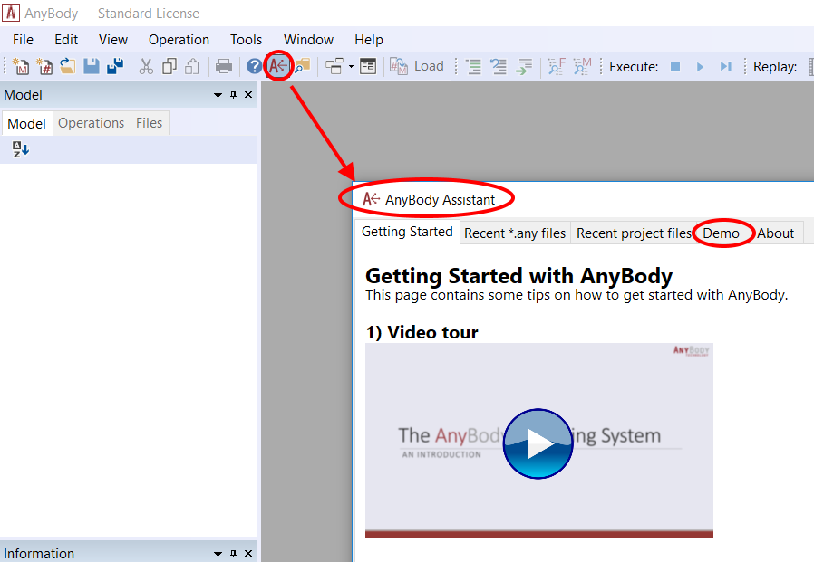

Getting Started Tutorial
============================

The AnyBody Modeling System caters to a wide range of users with very
different modeling needs. Some may simply want to load and run an
existing model, some may need to modify an existing or build their own
model bottom-up. These tutorials serve as a common starting point for
all such new users.

.. rubric:: The AnyBody Managed Model Repository (AMMR)

The AnyBody software comes along with an inbuilt model repository. This
is the AMMR, a collection of human body models that are based on the
latest research studies.

**Most importantly, it comes with a set of demo models** (eg: MoCap
based walking model, cycling etc.) that can serve as a useful learning
tool, or even as the foundations for own modeling studies. 

Building models from the bottom-up is described further in ":doc:`Getting Started AnyScript Programming </A_Getting_started_anyscript/intro>`".

Modifying the postures and motion of an existing model is introduced in ":doc:`Getting Started:
Modeling <../A_Getting_started_modeling/intro>`" and the ":doc:`Making
Things Move <../Making_things_move/intro>`" tutorials.

.. rubric:: Goals for this tutorial

This tutorial takes the top-down approach and aims to accomplish the following:

1. Create a new standing model using the Human Standing template model

2. Learn how to load & change the posture of the human model, and use the Model View window

3. Run the inverse dynamics analysis of the model and review the
   analysis results.

This entire tutorial relies heavily on using the AMMR described above.

.. rubric:: Setup the AMMR

Before you continue you must unpack the entire repository and save it on
your hard disk. To get a copy of the AMMR press the Demo tab in the
AnyBody assistant dialog box.

|AnyBody assistent|

The Demo tab will install a copy of the AMMR in your documents folder by
default. It is good practice to create a second local copy of the AMMR
so that you do not overwrite the existing AMMR folder by accident.

.. rubric:: AMMR structure

Open a file manager and navigate to the directory where you unpacked the
repository. You should see a folder structure that includes the
following subfolders:

-   **Application** includes simulations of biomechanical situations, such as cycling, lifting
    a box or propelling a wheelchair. 
-   **Body** contains models of body parts and collections of body parts which are used by the applications, 
    such as the lumbar spine model, leg models etc.

A closer inspection of the Application branch reveals that it has three subfolders:

-   The **Beta** folder contains models that are unfinished, but they may
    still be useful. 
-   The **Examples** folder contains many models doing different activities of daily living, and it is very likely that you
    will be able to find a model doing something similar to what you want.
-   The **Validation** folder contains models that have been used for validation purposes, typically by comparison of the model predictions
    with experimental measurements.

.. rst-class:: without-title

.. seealso::
    With that knowledge, you are all set to go, and you can proceed with
    :doc:`Lesson 1: Creating the standing model <lesson1>` using
    template.

