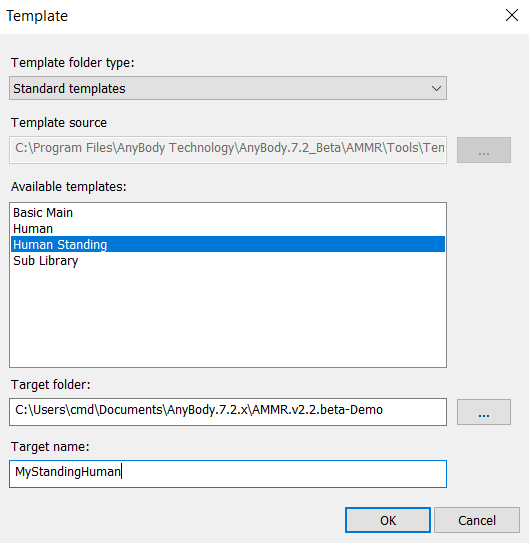

Lesson 1: Creating a Standing Model
==================================================

The standing model can be found in the AMMR folder under
Applications/Examples. The main file is called StandingModel.Main.any.

**While this file can be opened with the "File->Open" menu in AnyBody, do not do this! This tutorial will teach you an easier way
to use the Standing Model as a starting template.**

Key (modifiable) features of the standing model are:

-  Both feet are always connected to the ground.

-  The posture is defined by the joint angles for all major joints except the ankles. 

-  The model automatically balances itself by maintaining its center of mass vertically above the ankle joints. 
   E.g., if the arms move forward, the entire body moves backwards to maintain the balance.

-  External forces can be applied to predefined nodes on the model. Muscle forces may change, to resist these forces and maintain balance.
   
.. _model-templates:

Model templates
---------------

To create a new standing model using the template model in the AMMR, click the "Create New from template" button |Model
button| in the toolbar:

|ModelLoadButton|

The Template dialogue opens and displays a list of pre-defined templates
supported in the AMMR. 

**Choose the "Human Standing" template and select the
folder you want to save your new Human Standing model in.** To demonstrate, let us
save the model in the 'AnyBody.\ |AMS_VERSION_X|\ /AMMR.v\ |AMMR_VERSION|\ -Demo' directory 
which we extracted in the :doc:`introduction <intro>` of this tutorial.

Give the model a name, for example :file:`MyStandingHuman`, and press OK to save. 

|TemplateDialog|

Your new ‘MyStandingHuman.main.any’ file opens in the script Editor. The
location of the file is shown in the title bar:

|MyStandingHuman.main.any|

.. warning:: If you saved your model in an other location be 
          sure to modify the :file:`../libdef.any` file so it points 
          to AMMR repository you want to use. 

.. _loading-a-model:

Loading a model
---------------

To see the 3D graphical representation of the model you need to load.

**Load/reload is a frequent operation and has been assigned to function
key F7. You may also load your model by clicking** |Load| **in the toolbar.**

This action will load whatever file is chosen in the text editor. If a file is already loaded, the
above action will simply reload the file until you give another file loading priority by right-clicking its tab and select “Load Model”.

|Load model right click menu|

The model view
--------------------

When loading is completed, the Model View window opens and shows the
standing model: (You can open it manually from View -> Model Views).

|Model View|

The icons in the toolbar at the top of the Model View window allow you
to modify the image: zoom, pan, rotate, etc. They should be mostly
self-explanatory. Now is a good time to play a bit around with them and
to familiarize yourself with the options.

In practical use it is often necessary to change quickly between these
functions, so keyboard shortcuts have been provided:

-  The *Ctrl* button activates the Pan function.

-  The *Shift* button activates the Zoom function.

-  The *Ctrl-Shift* combination activates the rotation function.

-  If you have a scrolling wheel on your mouse, this will zoom the model
   in and out.

.. rst-class:: without-title

.. seealso::
    You can now proceed to :doc:`lesson2`.

.. |Model button| image:: _static/lesson1/image_1.png
   
.. |ModelLoadButton| image:: _static/lesson1/image_2.png
   

   
.. |MyStandingHuman.main.any| image:: _static/lesson1/image_4.png
   
.. |Model View| image:: _static/lesson1/image_5.png
   
.. |Load| image:: _static/lesson1/image_6.png

.. |Load model right click menu| image:: _static/lesson1/image_7.png
