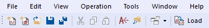
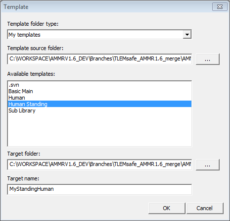
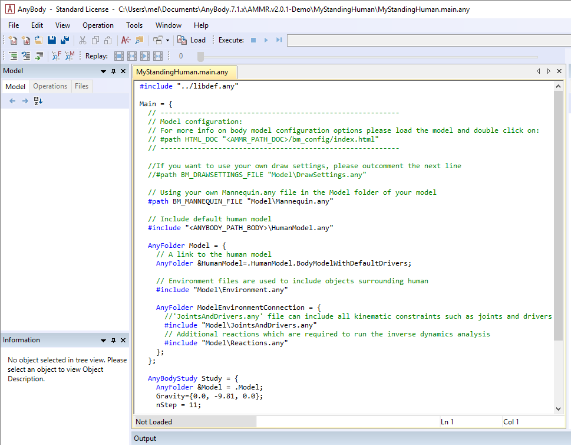
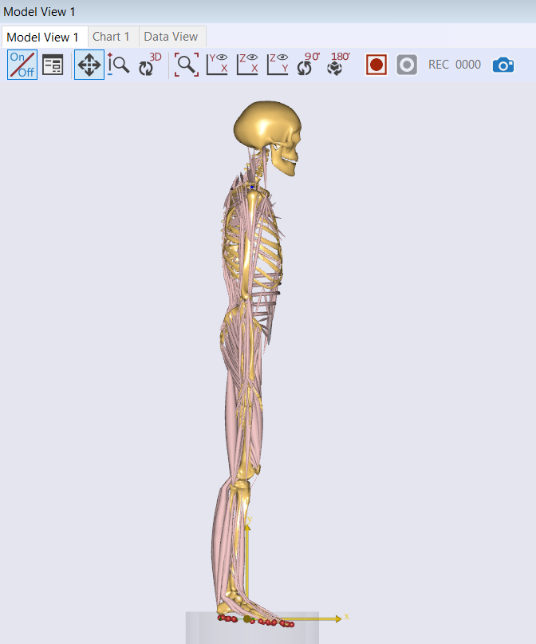
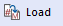

Lesson 1: Creating a Standing Model
==================================================

The standing model can be found in the AMMR folder under
Applications/Examples. The main file is called StandingModel.Main.any and
this is the one you must load to see the model.

While you can open the file with the File->Open menu in AnyBody, **this tutorial will teach you how to
create your own model by using StandingModel as a starting template.**

Key (modifiable) features of the standing model are:

-  Both feet are always connected to the ground.

-  The **posture** is controlled via anatomical angles for all
   major joints except the ankles. 

-  The model **automatically balances** by keeping its center of mass vertically
   above the ankle joints. Eg., If the arms extend forward, the body will move move slightly backward to maintain the balance.

-  **Three-dimensional external forces** can be applied to predefined points on the model. Muscle forces may change, to resist these forces and maintain balance.
   

Open model template
-------------------

To create a new standing model using the template model in the AMMR, click the Create Model button |Model
button| in the toolbar:

|ModelLoadButton|

The Template dialogue opens and displays a list of pre-defined templates
supported in the AMMR. Choose the ‘Human Standing’ template and select the folder you want to save your
new Human Standing model in. To demonstrate, let us create a ‘MyModels’
folder in the ‘AMMR\\Application\\’ folder and set it as the target
folder. Save the model as ‘MyStandingHuman’. Press the OK button on
completion.

|TemplateDialog|

Your new ‘MyStandingHuman.main.any’ file opens in the script Editor. The
location of the file is shown in the title bar:

|MyStandingHumanModel.main.any|

Load model
----------

To see the **3D graphical representation of the model**, you need to load.
Load/reload is a frequent operation and has been assigned to function
key **F7**. You may also load your model by clicking |Load| in the toolbar.

Display the model
-----------------

When loading is completed, the Model View window opens and shows the
standing model: (You can open it manually from View -> Model Views).

|Model View|

The icons in the toolbar at the top of the Model View window allow you
to modify the image: zoom, pan, rotate, etc. They should be mostly
self-explanatory. Now is a good time to play a bit around with them and
to familiarize yourself with the options.

In practical use it is often necessary to change quickly between these
functions, so keyboard shortcuts have been provided:

-  The Ctrl button activates the Pan function.

-  The Shift button activates the Zoom function.

-  The Ctrl-Shift combination activates the rotation function.

-  If you have a scrolling wheel on your mouse, this will zoom the model
   in and out.

.. rst-class:: without-title

.. seealso::
    You can now proceed to :doc:`lesson2`.

.. |Model button| image:: _static/lesson1/image_1.png
   

   

   

   

   
