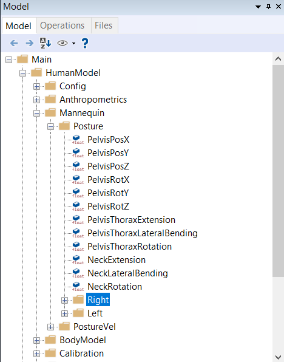
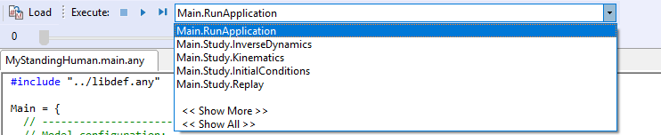

Lesson 2: Controlling the Posture
=================================

The Standing Model has been set up to have its posture defined by the
specification of anatomical angles in the joints. These specifications
have been collected in one of the model files, **Mannequin.any**. Scroll
down your model file until you come to the point where the Mannequin.any
file is included. Here is a step by step description:

Mannequin file structure
------------------------

.. code-block:: AnyScriptDoc

    ...

    // Using your own Mannequin.any file in the Model folder of your model
    #path BM_MANNEQUIN_FILE "Model\Mannequin.any"

    ...

This line means that your model will use this Mannequin.any file which
is located in the Model folder of your model folder.

If you double-click the above line in the editor window **after loading
your model**, the mannequin file opens up in a new tab. Then you see the
following structure. (In the interest of legibility we have removed many
of the lines):

.. code-block:: AnyScriptDoc

     AnyFolder Mannequin = {
       AnyFolder Posture = {
         AnyFolder Right = {     
         };
         AnyFolder Left = {
         };
       };
      
     AnyFolder PostureVel= { 
        AnyFolder Right = {     
         };
         AnyFolder Left = {
         };
       };
    
       AnyFolder Load = {
         AnyFolder Right = {
         };
         AnyFolder Left = {
         };
       };  // Loads
     };

This file is typical for the AnyScript language in the sense that it is
organized in so-called folders, which is a hierarchy formed by the
braces. Each pair of braces delimits an independent part of the model
with its variables and other definitions and can be seen in the model
tree as a folder.

Everything in this file is contained in the Mannequin folder. It
contains specifications of joint angles, movements, and externally
applied loads on the body (optional). Each of these specifications is
again subdivided into parts for the right and left-hand sides of the
body respectively. The first folder, Posture, contains joint angle
specifications. You can set any of the joint angles to a reasonable
value (in degrees), and when you reload the model, it will change its
posture accordingly. Please make sure that the values are as follows:

.. code-block:: AnyScriptDoc
    
    ...
    AnyFolder Right = {
    
        //Arm
        AnyVar SternoClavicularProtraction=-23; //This value is not used for initial position
        AnyVar SternoClavicularElevation=11.5; //This value is not used for initial position
        AnyVar SternoClavicularAxialRotation=-20; //This value is not used for initial position
        AnyVar GlenohumeralFlexion =-0;
        AnyVar GlenohumeralAbduction = 10;
        AnyVar GlenohumeralExternalRotation = 0;
        AnyVar ElbowFlexion = 0.01;
        AnyVar ElbowPronation = -20.0;
        AnyVar WristFlexion =0;
        AnyVar WristAbduction =0;
        
        //Leg
        AnyVar HipFlexion = 0.0;
        AnyVar HipAbduction = 5.0;
        AnyVar HipExternalRotation = 0.0;
        AnyVar KneeFlexion = 0.0;
        AnyVar AnklePlantarFlexion =0.0;
        AnyVar SubTalarEversion =0.0;
        
    ...

When these parameters are set for the right-hand side, the left-hand
side automatically follows along and creates a symmetric posture. This
happens because each of the corresponding settings in the Left folder
just refers to the settings in the right folder. The ability to do this
is an important part of the AnyScript language: Anywhere a number is
expected, you can write a reference to a variable instead, or even a
mathematical expression, if necessary.

If at any time you want a non-symmetric posture, simply replace some of
the variable references in the Left folder by numbers of your choice.

Further down in the Mannequin.any file you will find the folder
PostureVel. This is organized exactly like Posture, but the numbers you
specify here are joint angular velocities in degrees per second. For
now, please leave all the values in this folder as zero.

Now it is time to perform an analysis.

Running an analysis
-------------------

On the left-hand side of the screen, you find a tall, narrow window with
tabs on its left edge. Please select the Operations tab and find the
following:

|RunApplication|

What you see are different operations, i.e. analysis types, the system
can perform on the model. Select the “RunApplication” and click the
“Run” button on the toolbar (image below):

|Run toolbar|

You will see the model move slightly into position and you are finally
awarded the following message:

1.0) Inverse dynamic analysis...

1.10) ...Inverse dynamic analysis completed

You have just completed your first analysis of an AnyBody model. In the
next lesson, we shall briefly examine the results and also see what
happens if we change the posture: :doc:`Lesson 3: Reviewing analysis
results <lesson3>`.

   

   