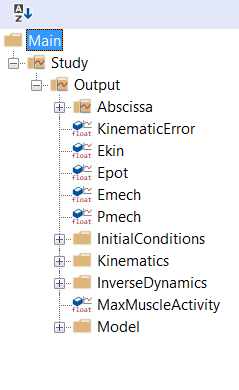
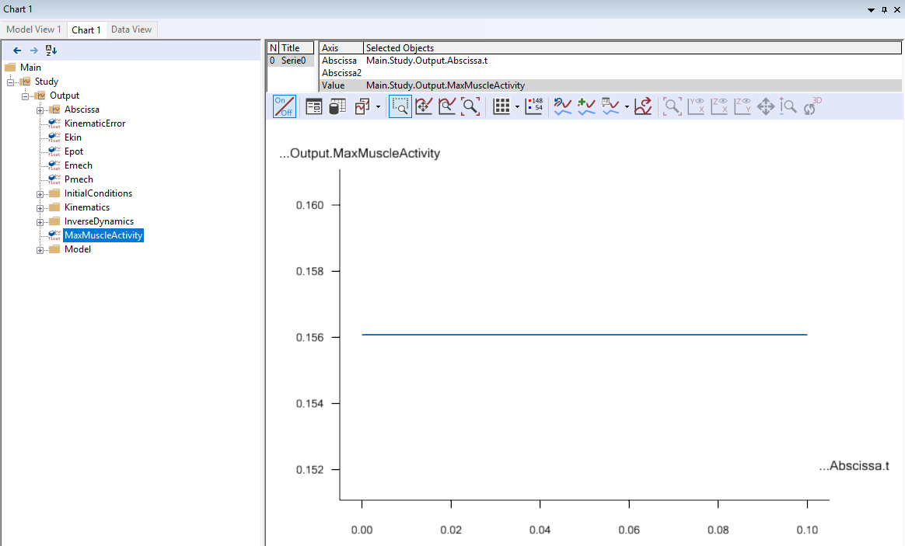
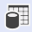
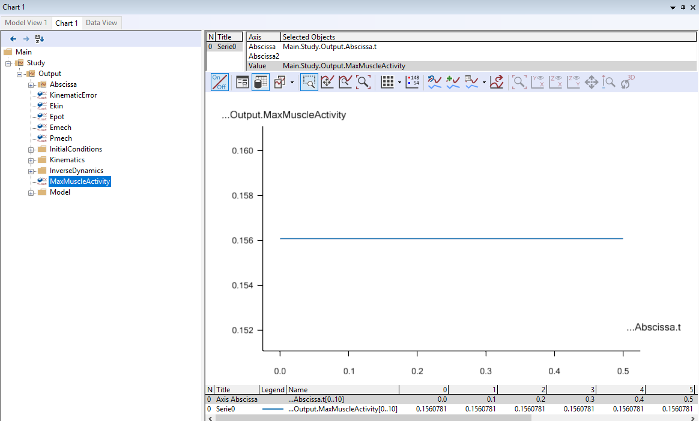
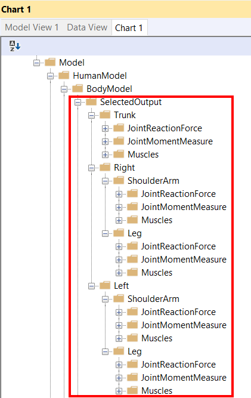
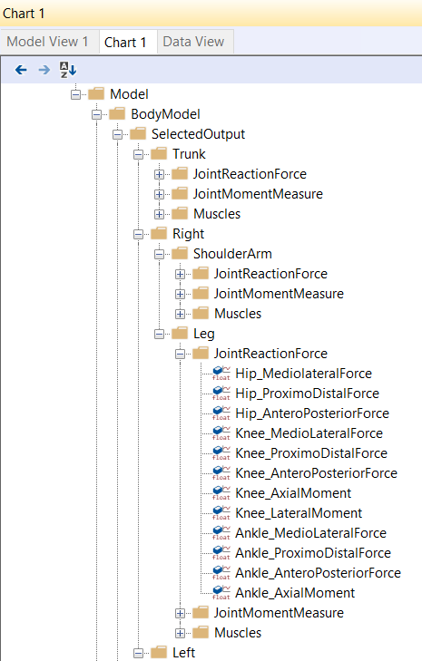
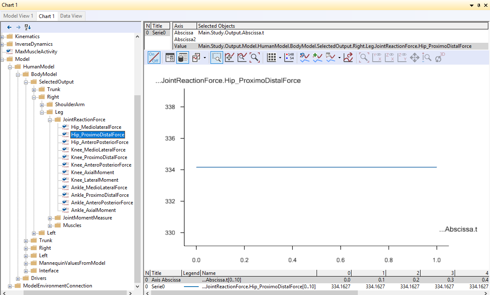
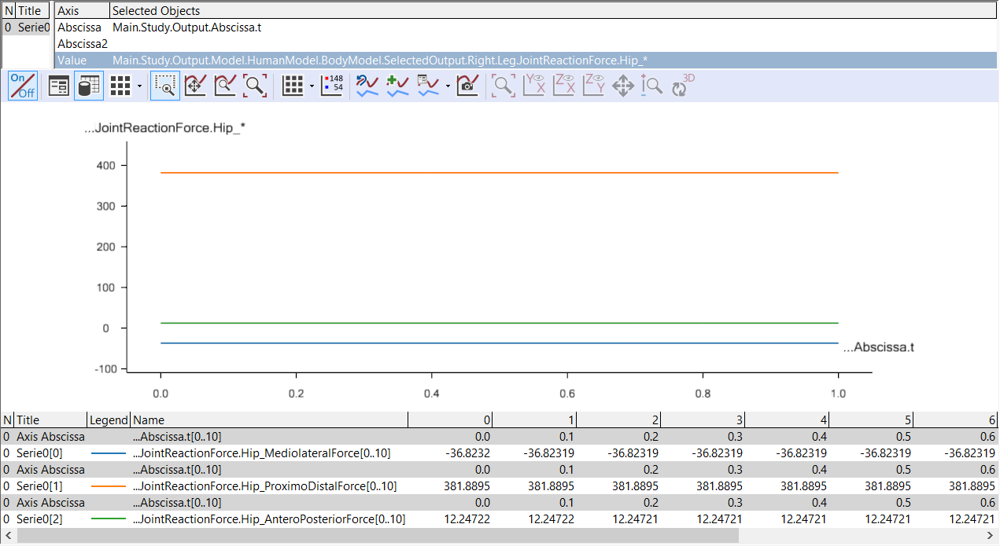
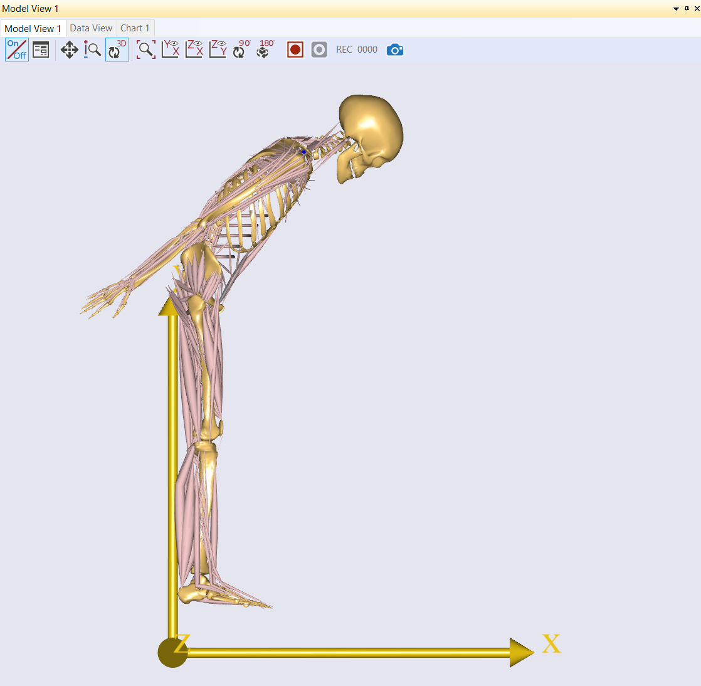
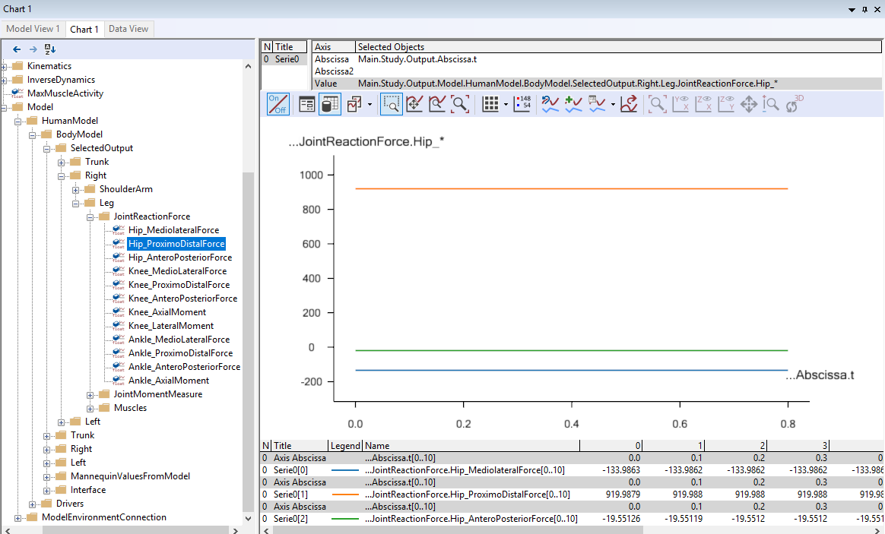

Lesson 3: Reviewing Analysis Results
====================================

.. _chart-view:

Introducing chart view
----------------------

You can plot simulation results as graphs by using the Chart View, which can be opened by clicking the “Chart 1” tab in the Model View window. To
open Chart views manually go to View -> Charts.

**Not all variables in your model tree are necessarily simulation outputs. The chart view therefore presents a 
filtered down version of the model tree, which only contains simulation outputs that can be plotted.**

One of the first nodes you encounter in this tree is the MaxMuscleActivity variable:

|Chart view tree|

Selecting MaxMuscleActivity plots this variable vs time. The plot is a flat line 
due to the static posture of the model. 

|Chart view|

If you want to see details of the actual values being plotted, click this
button |getting started 8|. It adds a table with values below the chart:

|Chart view Data button|

**This chart shows you that when standing upright, the most active muscle in model is using about 15%
of that particular muscle's maximum strength.** 

Hip forces – Standing posture
-----------------------------

Many biomechanical researchers want to see joint reactions forces, joint
moments (generated by muscles) and muscle activations. For your convenience, the
so-called SelectedOutput folder contains all those representative
values. You will find the folder in the tree here:

|Chartview Selected output tree|

**Navigate to the "Right.Leg.JointReactionForce" folder
by expanding the tree view like this**:

|Chartview JointReactionForce tree|

If you select the ‘Hip\_ProximoDistalForce’, you will see its value vs time in
the Chart View. 

|Chartview ProximoDistalForce|

From this chart, we can see that there is about 334N force at the
right hip joint in the proximodistal direction. 

**It is possible to select and plot several outputs simultaneously
by using the asterisk character** (:literal:`*`). **If you double-click
the "Value" property towards the top of your Chart View, it becomes editable. Let us
edit the last "Hip_ProximoDistalForce" term to "Hip_*". This
plots all variables in the "JointReactionForce" folder that beging with "Hip_".**

|Chart view asterix selection|

Now you will see the ‘Hip_MediolateralForce’, ‘Hip_ProximoDistalForce’
and ‘Hip_AnteroPosteriorForce’ in the same Chart View.

Hip forces - Bent posture
-------------------------

The final step of this chapter is to change the posture of the human
model to see what happens to the hip joint reaction force.

To adjust the posture of the human model, open your Mannequin.any
file and change the PelvisThoraxExtension value from 0 to -60.

.. code-block:: AnyScriptDoc
    
    AnyFolder Mannequin = {
    
        AnyFolder Posture = {
        
            ...
            
            §AnyVar PelvisThoraxExtension=-60; §

            AnyVar PelvisThoraxLateralBending=0;
            AnyVar PelvisThoraxRotation=0;
            
            ...
    

Press the F7 button to reload the model and run the "RunApplication"
operation again. This will show the modified posture of the
human model in the Model View.

|Model view Human bowing|

Next, we will check the changes in the right hip joint reaction forces.

|Chart view: bowing hip reaction forces|

In the above Chart View, the largest hip joint reaction
force component is the "ProximoDistalForce" at about 919N.
So compared to the normal standing posture model, the value has more than
doubled. The forces of the "Mediolateral" and "AnteroPosterior" directions have also
increased.

Congratulations! You have just completed your first biomechanical
analysis with the AnyBody Modeling System. Try changing the posture in the "Mannequin.any" file and investigate the new
results.

You may also want to check our `*library of previous
webcasts* <https://www.anybodytech.com/anybody.html?fwd=webcasts>`__  
for topics of particular interest to you.

   

  

   

   

   

   

   

   

   
