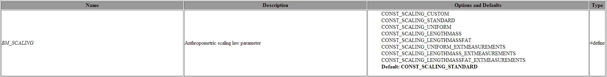

Body Model Options
==================

This lesson will consider flags and parameters used to configure the
full body human model, i.e., the AAUHuman.

A good entry point to develop a new application, which uses the human
body, is to decide which body parts, muscle types, scaling methods and
other options will be employed. One can easily start building a custom
model from the standard templates with the default configuration
options. This default template model will correspond to a generic person
with all body parts and muscles switched on. However, in some cases of
application development, it may be convenient or necessary to step away
from the default values, e.g. to gain simplicity, speed, or improved
accuracy. This can be done by changing configuration parameters that
cover most of the possible modeling scenarios. All these parameters
carry the "BM\_" prefix, indicating Body Model, and therefore we shall
occasionally refer to them as BM parameters. And sometimes we will refer
to them as BM statements/definitions since they are typically entered
into the model as pre-processor definitions (i.e. #define BM\_SOMETHING
<value>)

A list of possible parameters and corresponding constants are available
in the following tables. Please notice that most predefined constant
especially related to these BM-options are equipped with the prefix
"CONST\_" to make them distinguishable for changeable parameters.

`Parameter table <BodyModel.defs.parameters.html>`__: This table
describes a list of all available configuration parameters, possible
values, and defaults. For example, let us look at the image below, which
represents the BM\_SCALING parameter that defines which anthropometric
scaling law will be used by the model. The first column specifies the
name of the parameter. The second gives a short description, the third
one shows all possible options in case there are more than two (normal)
and the default value (bold). And finally, the last column shows what
kind of pre-processor command was used/is needed to define this
parameter (#define or #path).

|image0|

`Constant table <%20BodyModel.defs.constants.html>`__: This table
describes what predefined constants are available in the AMMR and they
should be used in conjunction with BM parameters. All these constants
will appear as preprocessor definitions (#define) in the model files.

Some examples of how these parameters and constants could be used are
provided in several lessons of the :doc:`"Getting Started:
Modeling" <../A_Getting_started_modeling/intro>` and
:doc:`"Scaling" <../chap10_Scaling/intro>` tutorials.

