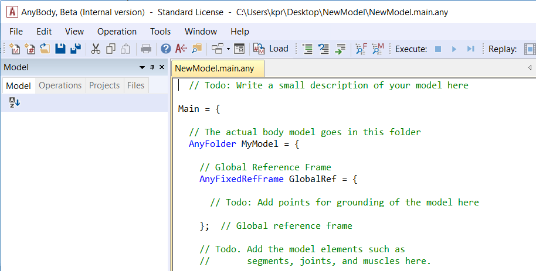
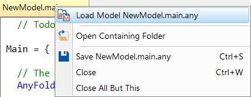
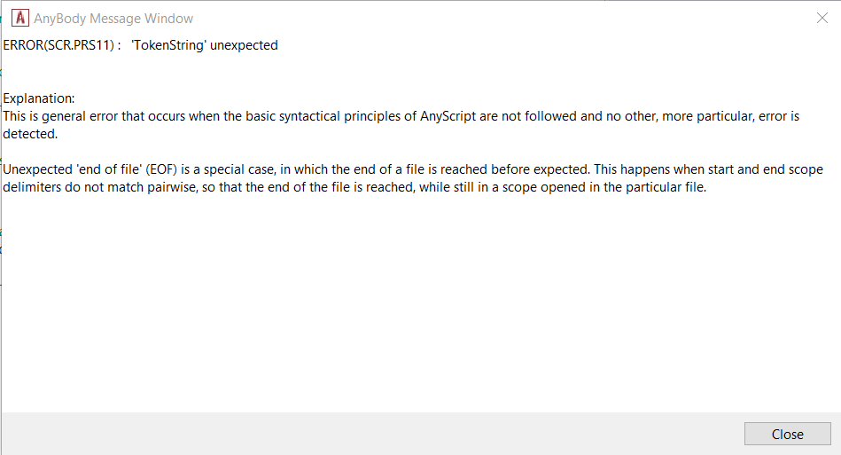

Lesson 1: Basic Concepts
========================

.. note:: **To follow this tutorial it is recommended to first to watch the
    introductory video found in this link** ":doc:`Tutorial Overview <../index>`".

To create an AnyScript model from scratch, go to "File menu -> New from template…" this will bring up a new window in
which you choose "Basic Main" and provide a "Target Name" (e.g.,
*NewModel*) and click OK. This is similar to :ref:`this step <model-templates>` from the previous tutorial.

|Editor NewModel.main.any|

The new file that opens up in the text editor contains a basic skeleton
for your model, based on a built-in template.

What are Classes?
-------------------

Let's have a look at what the system has generated for you. If you ignore most of the text and comments (green lines beginning with :literal:`//`), 
the overall structure of the model looks like this:

.. code-block:: AnyScriptDoc
    
    Main = {
    
       AnyFolder MyModel = {
       }; // MyModel
    
       AnyBodyStudy MyStudy = {
       };
    
    }; // Main
    

What you see is a hierarchy of braces - the outermost pair of braces is named "Main".
Everything else in the model goes between these braces. 

**When you load the model, the name
assigned to a pair of braces, and all the contents between the braces will show up as
folders and sub-folders in the Model Tree.**

**The code creates two objects - "MyModel" & "MyStudy" - which perform very
specific functions, which depend on the pre-prgrammed object templates** (``AnyFolder`` & ``AnyBodyStudy``) 
**used to create these objects. These inbuilt object templates are also known as CLASSES.**

"MyModel" (of type ``AnyFolder``) is simply an
organizational folder for containing the entire model you are going to
build. Let us change the folder name "MyModel" to "ArmModel".

The object named "MyStudy" (of type ``AnyBodyStudy``) is a collection of
simulation tasks that you want to perform with your model. The :doc:`Study of Studies <../A_study_of_studies/intro>` tutorial
contains much more information on simulation studies.

.. warning:: Rename "MyStudy" to "ArmModelStudy", and replace all occurences of "MyModel" with "ArmModel". 
    All changes to your model will be highlighted in red hereon.
    

What does this file contain so far?
-----------------------------------

.. code-block:: AnyScriptDoc

    
       // The actual body model goes in this folder
        AnyFolder §ArmModel§ = {
    
       // Global Reference Frame
        AnyFixedRefFrame GlobalRef = {
    
         // Todo: Add points for grounding
         // of the model here
    
      }; // Global reference frame
    
         // Todo. Add the model elements such as
         // segments, joints, and muscles here.
    
      }; // §ArmModel§
    

Within "ArmModel" is an object named "GlobalRef", created with the ``AnyFixedRefFrame`` class. This object is the global reference frame for your model.

You will notice "to do" comments inside the braces, to which we will return later.

.. note:: The model objects that you create henceforth must be placed within the "ArmModel" folder and should go between its
    pair of braces. 

Loading an AnyBody model
------------------------

You should be ready to load the model now. If cannot recollect how this is done,
refer to :ref:`this section <loading-a-model>`  from a previous tutorial.

You may get message similar to the one below, in the Output Window.

.. code-block:: none

    Loading Main : "C:\\...\\NewModel.main.any"
    Scanning...
    Parsing...
    Constructing model tree...
    Linking identifiers...
    Evaluating constants...
    Configuring model...
    Evaluating model...
    Loaded successfully.
    Elapsed Time : 0.063000

 

Basic troubleshooting
---------------------

If you mistype something, you will get an error message. A common
mistake is to forget a semicolon somewhere. Try removing a semicolon and re-load the model, which may give you an error message like this: 

.. code-block:: none

    ERROR(SCR.PRS11) : C:\\...\\NewModel.main.any(26) : 'EOF' unexpected Model loading skipped

**The message contains clickable links for both error code and the location of the error in your file. Upon clicking the file link, the text cursor
jumps to the exact problematic line in the file. Remember that an error can sometimes be caused by something you mistyped earlier
in the file.** 

Clicking the error code, e.g: ERROR(SCR.PRS11) opens a pop-up window with a complete explanation:

|Error popup dialog|

We now assume that you have removed the errors and have loaded the model
successfully.

.. rst-class:: without-title
.. seealso::
    **Next lesson:** If you are up to it, let's continue onward to :doc:`Lesson 2: Segments <lesson2>`.

.. |AnyBody Assistent| image:: _static/lesson1/image1.png
   

.. |Loadbutton image| image:: _static/lesson1/image3.png
   

