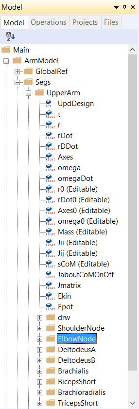

Lesson 3: Connecting Segments by Joints
=======================================

.. note:: Here's an AnyScript file to start on if you have not completed the
    previous lesson: :download:`demo.lesson3.any <Downloads/demo.lesson3.any>`.

Some quick theory
-----------------

You can think of joints in two different ways: 

-   **Providers of freedom**, when compared to a system of rigidly joined segments 

-   **Constraints on freedom**, when compared to a system of free-floating segments  

**In AnyBody, we consider joints as being constraints on freedom**. When you create
two independent segments in AnyBody, they will have 2 x 6 = 12 degrees of freedom
in total. 

Joints in AnyBody take away (or constrain) some of these degrees of freedom with the different joint types (eg. revolute, spherical etc.) 
differing only in the number and type of degrees of freedom they constrain.

The global reference frame
--------------------------

Every model needs a global reference frame to serve as a ground reference point for measuring positions & orientations from. 
It is already defined in the model template that you originally used, and is shown below:

.. code-block:: AnyScriptDoc

    
      AnyFixedRefFrame GlobalRef = {
    
         // Todo: Add points for grounding
         // of the model here
    
      }; // Global reference frame
    

**Just like with segments, you can add point nodes to the global reference frame for attaching joints and muscles. There is however no 
concept of mass associated with this frame.**

You will now add some nodes to the global frame by copy-pasting the following lines into your model (Alternatively use the class inserter
and then copy-paste the class properties alone):

.. code-block:: AnyScriptDoc

         AnyFixedRefFrame GlobalRef = {
          §AnyDrawRefFrame DrwGlobalRef = {};

           AnyRefNode Shoulder = {
             sRel = {0,0,0};
           };
           AnyRefNode DeltodeusA = {
             sRel = {0.05,0,0};
           };
           AnyRefNode DeltodeusB = {
             sRel = {-0.05,0,0};
           };
           AnyRefNode BicepsLong = {
             sRel = {0.1,0,0};
           };
           AnyRefNode TricepsLong = {
             sRel = {-0.1,0,0};
           };§
        }; // Global reference frame

The first line, "``AnyDrawRefFrame`` ..." merely displays the global
reference system in the graphics window. The remaining lines define point nodes attached to the global reference
system.

Let us scale down the display
size and change its color to distinguish it from the yellow segments:

.. code-block:: AnyScriptDoc

          AnyDrawRefFrame DrwGlobalRef = {
            §ScaleXYZ = {0.1, 0.1, 0.1};
            RGB = {0,1,0};§
          };

Creating a revolute joint
-------------------------

We can now connect the upper arm to the global reference frame through a shoulder joint.
For this planar 2-D model, where we simplify the shoulder as a simple revolute joint (also known as a hinge joint). 
We create a new ``AnyFolder`` object, to contain all joints in the model:

.. code-block:: AnyScriptDoc

           }; // LowerArm
         }; // Segs folder
    
       §AnyFolder Jnts = {
    
           //---------------------------------
           AnyRevoluteJoint Shoulder = {
            
             AnyRefNode &GroundNode = ..GlobalRef.Shoulder;
             AnyRefNode &UpperArmNode = ..Segs.UpperArm.ShoulderNode;
    
             Axis = z;
    
           }; // Shoulder joint
    
       }; // Jnts folder§

The ``AnyRevoluteJoint`` class creates a revolute joint object connecting two nodes on different segments.

.. _relative-folder-path:

Relative folder paths - Why use ‘.’ and ‘..’ in AnyScript?
----------------------------------------------------------

The ``AnyRevoluteJoint`` object named "Shoulder", needs to know which nodes on each segment to connect. For this
purpose, we have the lines:

.. code-block:: AnyScriptDoc

           AnyRefNode &GroundNode = ..GlobalRef.Shoulder;
           AnyRefNode &UpperArmNode = ..Segs.UpperArm.ShoulderNode;

**They refer to two nodes that we created earlier, located on the "GlobalRef" and "UpperArm"
segments. Notice the two dots in front of the names. They signify that
the "GlobalRef" and "Segs" folders are defined two levels outside the folder
we are writing into, in the model tree.**

If you neglected the two dots, then AnyBody would search for the two objects in the "Shoulder" folder and fail
to find them. This "dot" system is quite similar to the system you may
know from directory structures in Dos, Windows, Unix, or just about any
other computer operating system.

.. _reference-objects:

Reference objects and the ‘&’ symbol
------------------------------------

You can see also see that the Shoulder point on GlobalRef has been given the local name of "GroundNode". 
This means that, within the current folder, we can simply refer to
the point as "GroundNode" instead of the longer external reference.

**You will also realize that "GroundNode" is merely a reference (a pointer) to "GlobalRef.Shoulder"
rather than a copy of it. We denote this by the** :literal:`&` **sign.** 

If "Main.ArmModel.GlobalRef.Shoulder" moves around, "Main.ArmModel.Jnts.Shoulder.GroundNode" will keep up with those changes in position. Hit F7 to reload the model again to make
sure that the definition is correct.

Customizing the revolute joint
------------------------------

We then have:

.. code-block:: AnyScriptDoc

           Axis = z;

**Every node on a rigid body segment has its own reference frame which moves along with the segment. 
By default, these coordinate systems are parallel to the segment frame. However, the relative orientations
between these two frames can be altered by the user. Check the** :literal:`ARel` **property of and AnyRefNode
object in the AnyScript Reference Manual for more information.**

The AnyBody Modeling System is always three-dimensional, even when our model is
two dimensional. The property ``Axis = z`` simply specifies that both
segments connected by that joint will rotate about the z axis of two nodes forming the joint. 

In other words, the z-axes of the nodes on either connected segment will
always be parallel, and so the mechanism will rotate in the plane
perpendicular to these axes. The out-of-plane relative orientation of
the two segments can be adjusted by rotating the reference frames of the
nodes being connected. This is relevant if you want one of the segments
to rotate about some skewed axis.

.. caution:: The first of the two
    nodes declared in the joint (in this case ``GroundNode``) becomes the
    default reference frame for the joint. When directly accessing the
    post-simulation values of constraint reaction forces etc., you must
    remember to interpret them in the joint’s default reference frame.

Creating a revolute elbow joint
-------------------------------

We will next add a revolute elbow joint. While the definition is similar to the shoulder,
you will learn to use a handy tool to define the references. Copy-paste the skeleton of the elbow
joint as follows:

.. code-block:: AnyScriptDoc

    AnyFolder Jnts = {
           //---------------------------------
        AnyRevoluteJoint Shoulder = {
            Axis = z;
            AnyRefNode &GroundNode = ..GlobalRef.Shoulder;
            AnyRefNode &UpperArmNode = ..Segs.UpperArm.ShoulderNode;
        }; // Shoulder joint

        §AnyRevoluteJoint Elbow = {
            Axis = z;
            AnyRefNode &UpperArmNode = ;
            AnyRefNode &ForeArmNode = ;
        }; // Elbow joint§
    }; // Jnts folder

The node references within "Elbow" are not pointing at
anything yet. In this simple model it is easy to find the relative path
of the pertinent nodes on the upper arm and the forearm, but in a
complex model, this can be difficult. So we use "Absolute folder paths".

.. _absolute-folder-path:

Absolute folder path (and some useful tips)
-------------------------------------------

Place the cursor just before the semicolon in the line that reads :literal:`AnyRefNode &UpperArmNode = ;`.
Open the model tree where the UpperArm folder should expand as shown below.

|Model tree ElbowNode|

**Right-click the folder named "ElbowNode", and select "Insert object
name" from the context menu. This writes the full, absolute path of the node
into the Elbow joint definition where you placed the cursor.**

Repeat the process to expand the ForeArm segment and insert its ElbowNode in the
line below to obtain this:

.. code-block:: AnyScriptDoc

           AnyRevoluteJoint Elbow = {
             Axis = z;
             AnyRefNode &UpperArmNode = §Main.ArmModel.Segs.UpperArm.ElbowNode§;
             AnyRefNode &ForeArmNode =  §Main.ArmModel.Segs.ForeArm.ElbowNode§;
           }; // Elbow joint

It seems like everything is connected now, but we still get this
annoying error message when we reload the model:

.. code-block:: none

    Model Warning: Study 'Main.ArmStudy' contains too few kinematic
    constraints to be kinematically determinate.

The explanation is that we have created joints, but we have not
specified the joint posture yet. The shoulder and elbow joints can still take any
angular position, so there are two degrees of freedom whose kinematic
states need to specified before AnyBody can solve for the mechanism's
kinematics. This is taken care of by kinematic drivers.

.. rst-class:: without-title
.. seealso::
    **Next lesson:** They are one of the subjects of :doc:`Lesson 4: Imparting Movement with Drivers <lesson4>`.

   