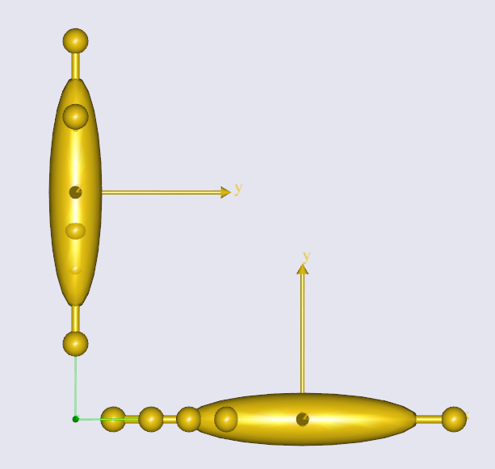
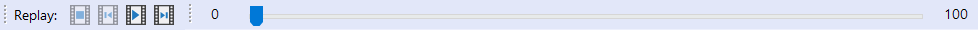
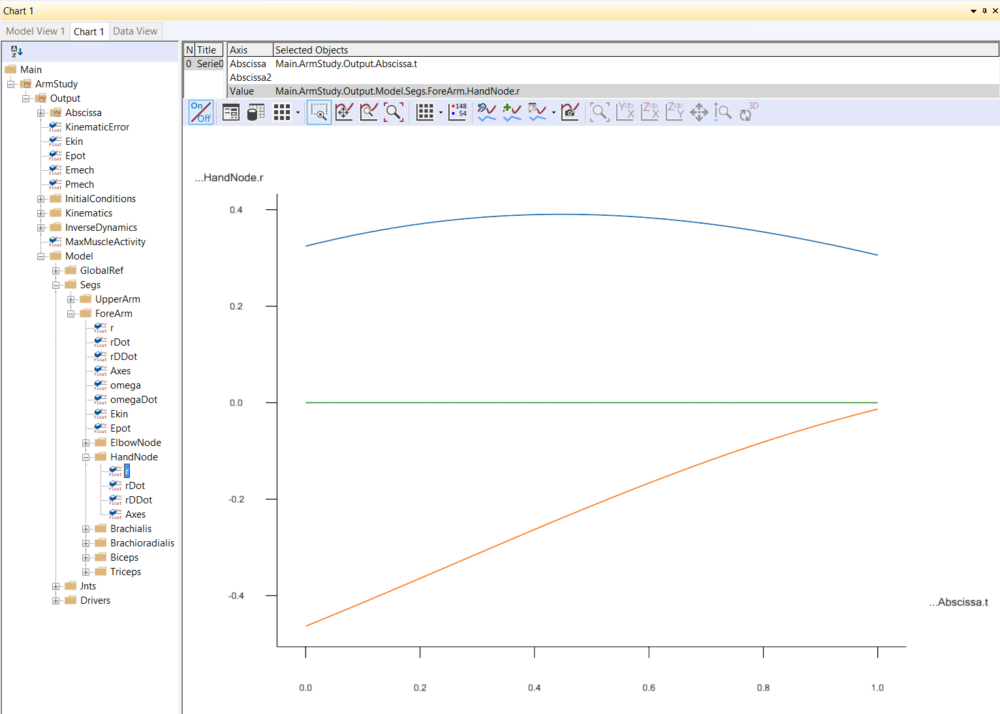

# Lesson 4: Imparting movement with Drivers

:::{note}
Here's an AnyScript file to start on if you have not completed the
previous lesson: {download}`demo.lesson4.any <Downloads/demo.lesson4.any>`.
:::

If you have completed the three previous lessons, you should have a
model with an upper arm grounded at the shoulder joint and connected to
a forearm by the elbow. What we want to do now is to make the arm move.



**Can an arm without muscles move? Well, in reality no, but AnyBody simulations use
the inverse dynamics technique, where we prescribe motion first and then deduce
the values of muscle forces which produce the motion.**

(measures-and-drivers)=

## Measures & drivers

We need to specify the motion for two degrees of freedom (DOF) of our arm mechanism, because it has hinge joints at the
shoulder and at the elbow.

- **Measures** are AnyBody objects which literally measure the value of a user-specified DOF within the model.
- **Drivers** are AnyBody objects which constrain the value of a measure to a constant value or a mathematical function of time. Drivers essentially assemble and impart motion to your mechanisms.

In this model, we therefore need two drivers, to specify motions for the two DOF. We therefore also need two measures,
which we will chose to be measures of the shoulder and elbow joint angle values.

:::{note}
**It is only important that the constrained measures represent independent DOFs of the model. The exact measures themselves are your choice**.

Eg: For this arm model with 2 remaining DOFs, we can either apply motion drivers to the shoulder (1 DOF) and elbow joints (+1 DOF) OR the X (1 DOF) and Y (+1 DOF) coordinates
of the end-point of the ForeArm segment (the wrist).

Creating more than 2 driver constraints will over-constrain the model and lead to errors.
:::

(anykineqsimpledriver)=

## Creating a constant velocity joint motion

Let's create a new folder and define two drivers:

```AnyScriptDoc
}; // Jnts folder

§AnyFolder Drivers = {
  //---------------------------------
  AnyKinEqSimpleDriver ShoulderMotion = {
    AnyRevoluteJoint &Jnt = ..Jnts.Shoulder;
    DriverPos = {-100*pi/180};
    DriverVel = {30*pi/180};
  }; // Shoulder driver
  //---------------------------------
  AnyKinEqSimpleDriver ElbowMotion = {
    AnyRevoluteJoint &Jnt = ..Jnts.Elbow;
    DriverPos = {90*pi/180};
    DriverVel = {45*pi/180};
  }; // Elbow driver
}; // Driver folder§
```

The folder contains two objects named "ShoulderMotion" and "ElbowMotion", belonging to the
`AnyKinEqSimpleDriver` class.

**All AnyBody drivers only work on the measures that are supplied to them. The** `AnyKinEqSimpleDriver` **class used in this case, constrains
the supplied measure's positions to a given value at time = 0 ("DriverPos") and changes this position at constant velocity thereon ("DriverVel").**

Since the measures supplied to the above drivers are rotational joints, the drivers produce joint rotation.
But the same driver class could be used to drive translations, for instance a sliding joint.

The following lines assign the shoulder and elbow joint angle measures to the respective drivers.
Standard AnyBody joints created using classes such as `AnyRevoluteJoint`, `AnySphericalJoint` etc. automatically function as measures.
More customized measures can be created using classes such as `AnyKinLinear`, `AnyKinRotational` etc.
(see {doc}`this lesson <../The_mechanical_elements/lesson4>`).:

```AnyScriptDoc
AnyRevoluteJoint &Jnt = ..Jnts.Shoulder;
```

and

```AnyScriptDoc
AnyRevoluteJoint &Jnt = ..Jnts.Elbow;
```

Since the measures constrained by these drivers are angles, the units
of "DriverPos" and "DriverVel" are radians and radians/sec respectively.

Just like in {ref}`Lesson 3 <reference-objects>`, these lines also
use the reference operator `&` to point the local variable "Jnt" towards the
actual shoulder/elbow joint objects existing in a different folder

Since "Jnt" is a reference, it will automatically update as the joint angles change during motion.

## Running a kinematic simulation

Re-load the model by hitting F7, and you should see the message "Loaded successfully" with NO
warning messages about the lack of kinematic constraints. You're now ready to get this model moving.

:::{note}
The object named "ArmModelStudy" (of `AnyBodyStudy` class) creates simulations to run your model through. "ArmModelStudy"
contains a reference object (created with a `&`) pointing to the "ArmModel" folder.

This allows you to create
multiple `AnyBodyStudy` objects, each of which contains a reference to same mechanical model, and a second reference object pointing to a folder with motion drivers,
that are specific to that study.
:::

**You must now run the "Main.ArmModelStudy.Kinematics" operation. If you need to refer back to how this is done, look at**
{ref}`this prior tutorial <running-analysis>`.

Since we have no muscles so far, a kinematic analysis is really all that
makes sense. With a kinematic analysis, you can investigate positions, velocities, and
accelerations. But force, power, energy or other such things are not computed. These properties are calculated by the
"InverseDynamics" study.

## Replaying a simulation

While the analysis is running, you can see the model move in the Model View window.

When the analysis in finished, you can use the replay panel to replay
the motion as you would in a movie player.



## Viewing simulation outputs

If you look at the "ArmModelStudy" object in the AnyScript window, start/end times and the
number of simulation steps (time frames) are not specified. These are actually optional parameters
when using the `AnyBodyStudy` class, which by default creates an analysis of 100 steps and spanning 1 second.

**To view the output variables of the study that was run, open the "ArmModelStudy" folder in the model tree and expand the "Output" folder.**

Since the "ArmModelStudy" contained a reference object ("Model") pointing to the "ArmModel" folder, the "Output"
folder contains the instantaneous values of all the time varying variables (including variables in sub-folders) within "ArmModel".

In "ArmModelStudy.Output.Model.Segs.ForeArm" in the model tree, you find all the nodes on the segment. Within the "HandNode"
sub-folder, you will find {literal}`r` - the position vector of the node. Clicking on {literal}`r`
shows the hand position vector (w.r.t global) for each time instant in the Information Window.

## Plotting simulation results

:::{note}
The chart view contains a filtered down version of the model tree, which only displays "AnyBodyStudy" objects. This
tree can also be used for plotting purposes.
:::

Let us say, you want to plot the position vector of the hand node over the course of movement.

You need to find and plot the variable ".....ForeArm.HandNode.r" in the chart view. If you need help with the chart view,
refer to {ref}`this prior tutorial on plotting <chart-view>`.

If you're having trouble finding the correct output variable in the chart view's filtered model tree, refer to the figure below.



