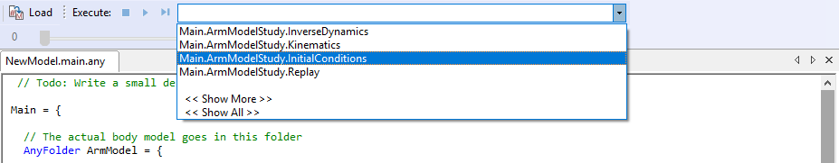
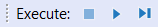

Lesson 4: Imparting movement with Drivers
=========================================

.. note:: Here's an AnyScript file to start on if you have not completed the
    previous lesson: :download:`*demo.lesson4.any* <Downloads/demo.lesson4.any>`.

|ModelView Arm2D initial load|

If you have completed the three previous lessons, you should have a
model with an upper arm grounded at the shoulder joint and connected to
a forearm by the elbow. What we want to do now is to make the arm move.

How can an arm with no muscles move? Well, in reality, it cannot, but in
what we are about to do here, the movement comes first, and the muscle
forces afterward. **This technique is known as inverse dynamics.** We
shall get to the muscles in the next lesson and stick to the movement in
this one.

What are drivers?
-----------------

Our mechanism has two degrees of freedom because it can rotate at the
shoulder and at the elbow. This means that we have to specify two
drivers. The natural way is to drive the shoulder and elbow rotations
directly, and this is in fact what we shall do. But we could also choose
any other two measures as long as they uniquely determine the position
of all the segments in the mechanism. If you were building this model
for some ergonomic investigation, you might want to drive the end point
of the forearm where the wrist should be located in x and y coordinates
to simulate the operation of some handles or controls. And this would be
just as valid a model because the end point position uniquely determines
the elbow and shoulder rotations.

Creating an AnyKinEqSimple driver
---------------------------------

For now, let's make a new folder and define two drivers:

.. code-block:: AnyScriptDoc

         }; // Jnts folder
    
         §AnyFolder Drivers = {
           //---------------------------------
           AnyKinEqSimpleDriver ShoulderMotion = {
             AnyRevoluteJoint &Jnt = ..Jnts.Shoulder;
             DriverPos = {-100\*pi/180};
             DriverVel = {30\*pi/180};
           }; // Shoulder driver
           //---------------------------------
           AnyKinEqSimpleDriver ElbowMotion = {
             AnyRevoluteJoint &Jnt = ..Jnts.Elbow;
             DriverPos = {90\*pi/180};
             DriverVel = {45\*pi/180};
           }; // Elbow driver
         }; // Driver folder§

This is much like what we have seen before. The folder contains two
objects: ShoulderMotion and ElbowMotion. Each of these is of class
AnyKinEqSimpleDriver. A driver is really nothing but a mathematical
function of time. The AnyKinEqSimpleDriver is particularly simple in
that starts at some position at time = 0 and increases or decreases at a
constant velocity from there. These two drivers are attached to joints,
and therefore they drive joint rotations. But the same driver class
could also be used to drive translations, for instance the cartesian
position of a point.

The lines

.. code-block:: AnyScriptDoc

           AnyRevoluteJoint &Jnt = ..Jnts.Shoulder;

and

.. code-block:: AnyScriptDoc

           AnyRevoluteJoint &Jnt = ..Jnts.Elbow;

are the ones that affiliate the two drivers with the shoulder and elbow
joints respectively. They are constructed the same way as the joint
definition in :doc:`*Lesson 3* <lesson3>` in the sense that a local
variable, Jnt, is declared and can be used instead of the longer global
name if we need to reference the joint somewhere else inside the driver.
Notice also the use of the reference operator '&' that causes the local
variable to be a pointer to the global one rather than a copy. It means
that if some property of the globally defined joint changes, then the
local version changes with it.

The specifications of DriverPos and DriverVel are the starting value of
the driver and the constant velocity, respectively. 

.. note:: Since these drivers drive angles, the units are radians and
    radians/sec.

Try loading the model again by hitting F7. If you did not mistype
anything, you should get the message "Loaded successfully" and no
warning messages about lacking kinematic constraints this time.

Running simulations - making things move!
-----------------------------------------

This is good news because you are now actually ready to see the model
move. If you look closer at the model tree window, it has a second tab
labelled “Operations”. This is the place where the AnyBody system places
your studies, and from this window, you can execute them, i.e., start
analyses and calculations.

|Operations ArmStudy|

Try expanding the ArmStudy root. You will get a list of the study types
that the system can perform. "Study" is a common name for operations you
can perform on a model. Try clicking the KinematicAnalysis study. With
the buttons in the Operations window, you can now execute various types
of analysis.

The Execute toolbar above the operations tree contains three buttons
|Model tree toolbar Execute buttons|:

-  **Run operation**: Starts or pauses the chosen operation. Shortcut
   F5.

-  **Step operation**: Advances to next step of operation, typically a
   time step. Shortcut F6. 

-  **Stop operation**: Sets the operation back to its initial position.
   You must reset before you start a new analysis that was previously
   aborted. Shortcut F4 

Replaying a simulation
----------------------

All these functions are also available from the main frame toolbar
|Execute toolbar| and the menu Operation.

Now, try your luck with the **KinematicAnalysis** study and the Run
button. What should happen is that the model starts to move as the
system runs through 101 timesteps of the study.

When the analysis in finished, you can use the replay panel to replay
the model as you do in a movie player.

|Replay toolbar|

Since we have no muscles so far, kinematic analysis is really all that
makes sense. A kinematic analysis is pure motion. The model moves, and
you can subsequently investigate positions, velocities, and
accelerations. But no force, power, energy or other such things are
computed. These properties are calculated by the
**InverseDynamicAnalysis**.

Fetching simulation results
---------------------------

The analysis has 101 time steps corresponding to a division of the total
analysis time into 100 equal pieces. The total time span simulated in
the analysis is 1 sec. These are default values because we did not
specify them when we defined the ArmModelStudy in the AnyScript model.
If you want more or fewer time steps or a longer or shorter analysis
interval, all you have to do is to set the corresponding property in the
ArmModelStudy definition. When you click "Run", all the time steps are
executed in sequence, and the mechanism animates in the graphics window.

So far, the model was merely a two-bar mechanism moving at constant
joint angular velocities. However, the system has actually computed
information that might be interesting to investigate. **All the analysis
results are available in the ArmModelStudy branch of the tree view**.

Directly under the ArmModelStudy branch, you find the **Output branch**
where all computed results are stored. Notice that the Output branch
contains the same folders we defined in the AnyScript model: GlobalRef,
Segs, and so on. In the Segs folder you find ForeArm, and in that a
branch for each of the nodes we defined on the arm. Try expanding the
branch for the HandNode. It contains the field 'r' which is the position
vector of the node. We might want to know the precise position of the
HandNode at each time in the analysis, for instance, if we were doing an
ergonomic study and wanted to know if the hand had collided with
anything on its way.

If you double-click the 'r' node, the instantaneous position vector
(depending on where your replay slider is) of the hand node for each
time step is dumped in the message window at the bottom of the screen.

Plotting simulation results
---------------------------

However, we often prefer to plot our results. With the default layout,
this feature is located in the same window as Model View under the tab
called “Chart 1”. You can also open it from the pull-down menus by
choosing View -> Charts -> ...

This gives you a new window structured just like the editor window with
a tree view to the left, but with an empty field for graphing results.

The tree in this window is much like the tree in the editor window
except that some of the data has been filtered out so that you mainly
see the parts of the tree that are relevant in terms of results or
output. You can expand the tree in the chart window through ArmStudy and
Output until you come to the HandNode. When you pick the property 'r',
you get three curves corresponding to the movement of the three
Cartesian coordinates of this node during the simulated time period. Try
holding the mouse pointer over one of the curves for a moment. A small
label with the global name of the data of the curve appears. All data
computed in AnyBody can be visualized this way.

|Chart view HandNode|

So far, we have only the kinematic data to look at. Before we can start
the real biomechanics, we must add some muscles to the model.

This is the subject of :doc:`*Lesson 5: Definition of muscles and external
forces* <lesson5>`.

.. |ModelView Arm2D initial load| image:: _static/lesson4/image1.png
   :width: 1.90049in
   :height: 1.80128in

.. |Replay toolbar| image:: _static/lesson4/image5.png
   :width: 6.69306in
   :height: 0.20556in
.. |Chart view HandNode| image:: _static/lesson4/image6.png
   :width: 6.10116in
   :height: 4.36667in