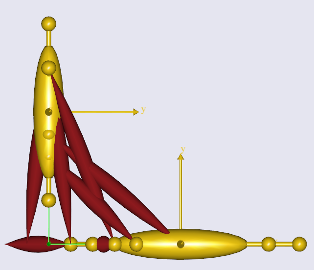
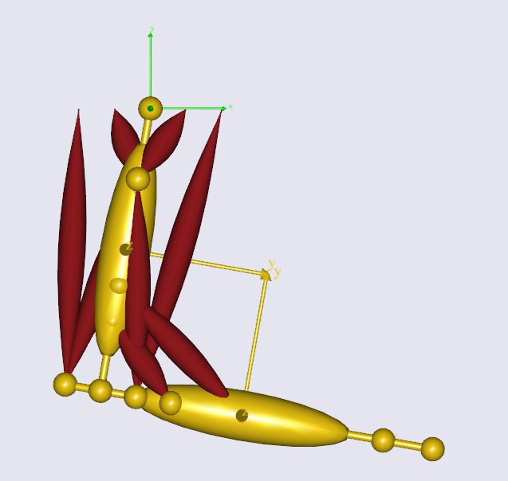
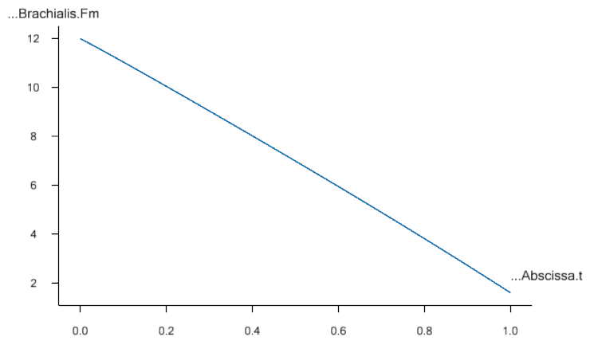
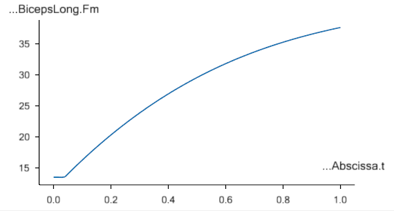
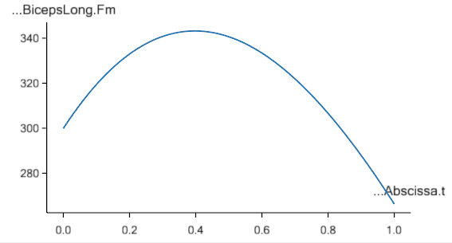

Lesson 5: Definition of Muscles and External Forces
===================================================

.. note:: Here's an AnyScript file to start on if you have not completed the
    previous lesson: :download:`demo.lesson5.any <Downloads/demo.lesson5.any>`.

We have seen that models in AnyBody can move even though they do not
have any muscles. This is because we can ask the system to perform a
simple kinematic analysis that does not consider forces.

Skeletal muscles are very complicated mechanical actuators. They produce
movement by pulling on our bones in complicated patterns determined by
our central nervous system. One of the main features of AnyBody is that
the system is able to predict realistic activation patterns for the
muscles based on movement and external load.

Creating a muscle model
-----------------------

The behavior of real muscles depends on their operating conditions,
tissue composition, oxygen supply, and many other properties, and
scientists are still debating exactly how they work and what properties
are important for their function. In AnyBody, you can use several
different models for the muscles' behavior, and some of them are quite
sophisticated. Introducing all the features of muscle modeling is a
subject fully worthy of :doc:`its own
tutorial <../Muscle_modeling/intro>`. Here, we shall just
define one very simple muscle model and use it indiscriminately for all
the muscles of the arm we are building.

As always, we start by creating a folder for the muscles:

.. code-block:: AnyScriptDoc

          §AnyFolder Muscles = {
           }; // Muscles folder§

The next step is to create a muscle model that the define the general
properties of all the muscles.

.. code-block:: AnyScriptDoc

           AnyFolder Muscles = {
             §// Simple muscle model with constant strength = 300 Newton
             AnyMuscleModel MusMdl = {
               F0 = 300;
             };§
           }; // Muscles folder

Introducing a muscle to the model
---------------------------------

Now we can start adding muscles. Remember that muscles cannot push, so
to allow a joint to move in both directions you have to define one
muscle on each side of the joint in two dimensions. If you work in three
dimensions and you have, say, a spherical joint, then you may need much
more muscles than that. In fact, it can sometimes be difficult to figure
out exactly how many muscles are required to drive a complex body model.

Let's add just one muscle to start with. Including the following lines
in the ArmModel will do the trick:

.. code-block:: AnyScriptDoc

           AnyFolder Muscles = {
             // Simple muscle model with constant strength = 300 Newton
             AnyMuscleModel MusMdl = {
               F0 = 300;
             };
    
             §//---------------------------------
             AnyViaPointMuscle Brachialis = {
               AnyMuscleModel &MusMdl = ..Muscles.MusMdl;
               AnyRefNode &Org = ..Segs.UpperArm.Brachialis;
               AnyRefNode &Ins = ..Segs.ForeArm.Brachialis;
               AnyDrawMuscle DrwMus = {};
            };§
          }; // Muscles folder

This is a definition of the elbow flexor, brachialis. The type of this
muscle is AnyViaPointMuscle. It means that it goes from its origin to
insertion via a number of predefined points. The via-points are the
AnyRefNodes defined in the second and third property lines. If you have
a muscle that goes in a straight line from origin to insertion, then you
can just define two points as we have done here. If you have a more
complicated muscle path, then all you need to do is to add the points in
between the origin and insertion.

The physiological behavior of the muscle is defined by the first
property

.. code-block:: AnyScriptDoc

               AnyMuscleModel &MusMdl = ..Muscles.MusMdl;

You can see that it points right back to the muscle model we started out
by creating. Notice the two leading dots. Finally, the line

.. code-block:: AnyScriptDoc

               AnyDrawMuscle DrwMus = {};

ensures that the muscle is visible in the graphics window. Let's have a
look at it. Make sure you have the Model View window open and hit F7.
You should see a thick, red line connecting the muscle's origin and
insertion points. There are other ways to visualize muscles, but we
shall save that for the :doc:`dedicated muscle
tutorial <../Muscle_modeling/intro>`.

Notice that the muscle's position on the body might be a little strange
because we have not yet positioned the segments relative to each other
by a kinematic analysis.

Adding more muscles
-------------------

All the other muscles are defined in the same way:

.. code-block:: AnyScriptDoc

    
           //---------------------------------
           AnyViaPointMuscle Brachialis = {
             AnyMuscleModel &MusMdl = ..Muscles.MusMdl;
             AnyRefNode &Org = ..Segs.UpperArm.Brachialis;
             AnyRefNode &Ins = ..Segs.ForeArm.Brachialis;
             AnyDrawMuscle DrwMus = {};
           };
    
           §//---------------------------------
           AnyViaPointMuscle DeltodeusA = {
             AnyMuscleModel &MusMdl = ..Muscles.MusMdl;
             AnyRefNode &Org = ..GlobalRef.DeltodeusA;
             AnyRefNode &Ins = ..Segs.UpperArm.DeltodeusA;
             AnyDrawMuscle DrwMus = {};
           };
    
           //---------------------------------
           AnyViaPointMuscle DeltodeusB = {
             AnyMuscleModel &MusMdl = ..Muscles.MusMdl;
             AnyRefNode &Org = ..GlobalRef.DeltodeusB;
             AnyRefNode &Ins = ..Segs.UpperArm.DeltodeusB;
             AnyDrawMuscle DrwMus = {};
           };
    
           //---------------------------------
           AnyViaPointMuscle Brachioradialis = {
             AnyMuscleModel &MusMdl = ..Muscles.MusMdl;
             AnyRefNode &Org = ..Segs.UpperArm.Brachioradialis;
             AnyRefNode &Ins = ..Segs.ForeArm.Brachioradialis;
             AnyDrawMuscle DrwMus = {};
           };
    
           //---------------------------------
           AnyViaPointMuscle BicepsShort = {
             AnyMuscleModel &MusMdl = ..Muscles.MusMdl;
             AnyRefNode &Org = ..Segs.UpperArm.BicepsShort;
             AnyRefNode &Ins = ..Segs.ForeArm.Biceps;
             AnyDrawMuscle DrwMus = {};
           };
    
           //---------------------------------
           AnyViaPointMuscle TricepsShort = {
             AnyMuscleModel &MusMdl = ..Muscles.MusMdl;
             AnyRefNode &Org = ..Segs.UpperArm.TricepsShort;
             AnyRefNode &Ins = ..Segs.ForeArm.Triceps;
             AnyDrawMuscle DrwMus = {};
           };
    
           //---------------------------------
           AnyViaPointMuscle BicepsLong = {
             AnyMuscleModel &MusMdl = ..Muscles.MusMdl;
             AnyRefNode &Org = ..GlobalRef.BicepsLong;
             AnyRefNode &Ins = ..Segs.ForeArm.Biceps;
             AnyDrawMuscle DrwMus = {};
           };
    
           //---------------------------------
           AnyViaPointMuscle TricepsLong = {
             AnyMuscleModel &MusMdl = ..Muscles.MusMdl;
             AnyRefNode &Org = ..GlobalRef.TricepsLong;
             AnyRefNode &Ins = ..Segs.ForeArm.Triceps;
             AnyDrawMuscle DrwMus = {};
           };§

Try adding the data and viewing the result by reloading. You should get
a picture more or less as what you see below:

|image0|

The InitialConditions analysis
------------------------------

The model does not seem to be correctly connected at the elbow. The
ArmStudy actually contains a default operation for getting the elements
ordered with respect to each other. It is the InitialConditions study in
the tree at the upper left corner of the Main Frame. Try clicking it,
then hit the start operation button, and the segments fall into position
as shown below.

|image1|

We now have enough muscles in the model to start computing the muscle
forces that can drive the motion. But there is one more detail to take
care of, and it is both important and slightly intricate. The bottom
line is: There must be something for the muscles to drive - some load to
carry. We have not added any exterior forces to the model yet, but that
is not the problem. You remember, perhaps, from :doc:`Lesson
2 <lesson2>` that each segment has mass. Additionally, the
ArmModelStudy is equipped with a standard gravity of -9.81 units in the
global y direction. This means that gravity actually provides the
external force the analysis needs to make any sense.

Switching off driver forces when muscles do the job (Important!)
----------------------------------------------------------------

What is the problem then? Well, unless you specify otherwise, drivers,
like the ones we added to the elbow and shoulder joints, act like
motors. This means that they provide whatever moment or force might be
necessary to make the motion happen. Although it would be practical, few
of us have motors built into our joints. Instead, we have very efficient
muscles, so we want to leave the task of providing force in the model to
them. The way to do that is to set a property called Reaction.Type for
the driver to zero. This is how it's done for the shoulder:

.. code-block:: AnyScriptDoc

           AnyKinEqSimpleDriver ShoulderMotion = {
             AnyRevoluteJoint &Jnt = ..Jnts.Shoulder;
             DriverPos = {-100*pi/180};
             DriverVel = {30*pi/180};
             §Reaction.Type = {Off};§
           }; // Shoulder driver

This additional line makes sure that the driver provides the motion but
not the moment. Why would anyone ever want to model a joint with a motor
in it? Well, models under development often do not have enough muscles
to move. Such models will not work before the last muscle is added
unless they have motors in the drivers, and it is practical to be able
to run an analysis now and then during development to check that the
model works correctly.

As you can see, the single Off is encapsulated in braces, {Off}. This is
because it is a vector. A driver by default has several components
depending on the number of joints it simultaneously drivers. Therefore
all the data in the driver is in vector quantities. For syntactic
reasons this applies even when the driver only controls one degree of
freedom as it does here.

The InverseDynamicAnalysis and plotting muscle forces
-----------------------------------------------------

Add a similar line to the definition of the elbow driver, and we are
ready to compute muscle forces. Click the **InverseDynamicAnalysis** in
the study tree, then the start operation button, and watch the model
move. It should look exactly like in the kinematic analysis, however,
during this analysis, the AnyBody system computes all muscle, joint
forces and much more.

To see the results, you once again have to open a Chart window found in
the tab next to the Model View tab. In this new window, expand the
ArmStudy -> Output -> Model -> Muscles branch. You should see a list of
all the muscles appearing. Each of them can be expanded to reveal the
data inside. Let us expand the brachialis muscle and investigate its
force variation over the movement. You should see a node named Fm. If
you click it, you should get a curve like the one shown below:

|image2|

Notice that the force in the muscle drops as the movement proceeds. This
is quite as expected because the moment arm of the gravity about the
elbow gets smaller as the elbow flexes, and less muscle force is
therefore needed to carry it. If you look at the muscle force in the
BicepsLong, you see a different pattern:

|image3|

This muscle grows in force during the movement. That is because it is
influenced by the movement of two joints, namely the shoulder and the
elbow. In addition, it collaborates both with DeltoidusA on shoulder
flexion, and with the other elbow flexors, and these muscles all have to
level their work in relation to each other.

Creating external loads
-----------------------

Now that we have the analysis going, we might want to investigate the
model's behavior in different situations. A typical example could be to
see how it carries an external load in addition to gravity. Let us
imagine that the model is performing a dumbbell curl where it carries
some load at the hand. We start by attaching a node to the forearm at
the position of the palm. Add this definition to the ForeArm section:

.. code-block:: AnyScriptDoc

            §AnyRefNode PalmNode = {
               sRel = {0.27,0,0};
             };§

The next step is to add an external force. We make a folder for this
purpose:

.. code-block:: AnyScriptDoc

         §AnyFolder Loads = {
    
           //---------------------------------
           AnyForce3D Dumbbell = {
             AnyRefNode &PalmNode = ..Segs.ForeArm.PalmNode;
             F = {0,-100,0}; // Force in Newton
           };
         };  // Loads folder§

That's all there is to it. Now you can analyze how the model will react
to a downward force of 100 N (approximately 10 kg dumbbell weight). If
you reload, rerun, and investigate the BicepsLong force again, you
should see this:

|image4|

The muscle force is obviously much larger than before, and the
development is also different. It now reaches a maximum during the
movement and drops off again.

.. note:: Applied forces do not have to be constant. They can change with time
    and other properties in the model.  Please refer to the :doc:`tutorial on
    forces <../The_mechanical_elements/intro>` for more
    details.

While the model described here was anatomically simplified, it can be a
comprehensive job to define a realistic body model which is exactly why
most users would probably start out using the body models available in
the `AnyBody Managed Model
Repository <http://www.anybodytech.com/anybody.html?fwd=modelrepository>`__.

.. rst-class:: without-title
.. seealso::
    **Next lesson:** Now, let's continue to :doc:`Lesson 6: Adding real bone geometrics <lesson6>`

