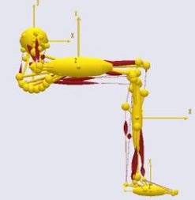
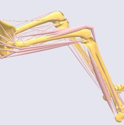
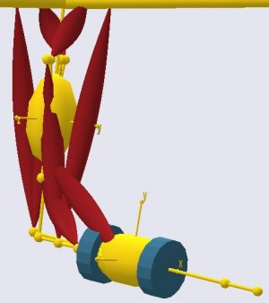
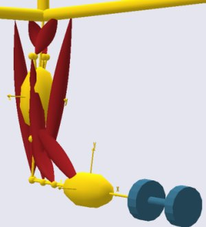
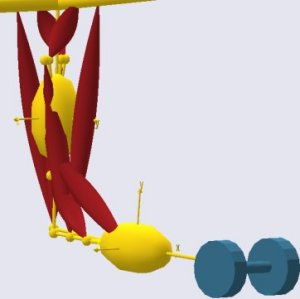

Lesson 6: Adding Real Bone Geometries
=====================================

.. note:: Here's an AnyScript file to start on if you have not completed the
    previous lesson: :download:`*demo.lesson6.any* <Downloads/demo.lesson6.any>`.

So far, the graphics of the model you have developed is what we can call
a stick figure representation. You may be wondering how you can add
bones and other geometries that will be visually more pleasing. Apart
from mere aesthetics, real bone geometries give you instant visual
feedback on where the muscle is located in the organism as illustrated
by the two pictures below.

|oldleg1| |oldleg2|

Visualization object File formats 
----------------------------------

Adding geometric models such as bones is fortunately very simple. All
you need is a file with a 3-D graphical representation of the bone or
another component you may wish to add. The format of the file must be
STL ASCII. STL is a very simple graphical file format that basically
contains triangles. Virtually any CAD system you can think of can save
geometry in STL format, so if you have your geometry described in IGES,
STEP, DXF or any other usual type, just run it through your favorite CAD
system and convert it to STL. STL comes in two varieties: ASCII and
binary. AnyBody needs an ASCII file, so please make sure to choose that
option if you create your own STL files in a CAD system.

Importing a STL file 
---------------------

The bone models you see in the pictures above are a bit elaborate for a
short tutorial, so we shall start with something a little simpler. What
we want to do now is to add a dumbbell geometry to the arm model we have
just created. You can find an STL file to use :download:`here
(dumbell.stl) <Downloads/dumbbell.stl>`.

The dumbbell should be added to the forearm, so the first thing to do it
to add a reference to the STL file we just saved to the definition of
the forearm:

.. code-block:: AnyScriptDoc

             AnyDrawSeg DrwSeg = {};
             §AnyDrawSTL DrwSTL = {
               FileName = "dumbbell.stl";
             };§
           }; // ForeArm

Try reloading the model again. You will probably see nothing
but gray the Model view.  A closer investigation of the problem would
reveal that the entire arm model is actually situated inside the
dumbbell handle. This is because the STL file was created in
millimeters, where the arm model is in meters. Rather than going back to
whatever CAD system was used and scale the dumbbell model down 1000
times, we can add the scale definition to AnyScript in the following
way:

.. code-block:: AnyScriptDoc

             AnyDrawSTL DrwSTL = {
               FileName = "dumbbell.stl";
               §ScaleXYZ = {0.001, 0.001, 0.001};§
             };

When you reload the model, the picture you get should be similar to what
you see below. The dumbbell is visible now and has the right size, but
it is sitting at the center of gravity of the lower arm rather than at
the hand, and it is not oriented correctly.

|ModelView dumbbell1|

Re-orienting your STL object
----------------------------

The fact is that, when you attach something to a segment, it is
positioned at the segment's origin which is usually the same as the
center of mass. However, you can also attach stuff to points, so moving
the dumbbell to the hand is simply a question of moving the reference to
it from the ForeArm segment to the PalmNode that we defined previously.
Block the entire AnyDrawSTL folder with the mouse and cut it out. Then
re-insert it under the PalmNode like this:

.. code-block:: AnyScriptDoc

              AnyRefNode PalmNode = {
                sRel = {0.27,0,0};
                §AnyDrawSTL DrwSTL = {
                  FileName = "dumbbell.stl";
                  ScaleXYZ = {0.001, 0.001, 0.001};
                };§
              };
    
              AnyDrawSeg DrwSeg = {};
            }; // ForeArm

On reload, this produces a new picture with the dumbbell attached at the
right location, but it is still not oriented correctly.

|ModelView dumbbell2|

We want to rotate the dumbbell 90 degrees about the y-axis. We could do
that by going back to the CAD system and modifying the dumbbell STL
file, but an easier option is to rotate it directly inside AnyScript.

A geometrical object that you insert gets the same orientation as the
coordinate system it is attached to. In this case, the dumbbell is
attached to PalmNode. Nodes are actually reference frames with the
ability to be positioned and oriented relatively to other reference
frames, for instance, a segment or another node. We have already
positioned nodes by means of the member vector sRel, and relative
orientation happens similarly with the member matrix ARel, the relative
rotational transformation matrix. We wish to rotate the dumbbell 90
degrees about the local y-axis and hence write:

.. code-block:: AnyScriptDoc

           AnyRefNode PalmNode = {
             sRel = {0.27,0,0};
             §ARel = RotMat(90\*pi/180, y);§
             AnyDrawSTL DrwSTL = {
               FileName = "dumbbell.stl";
               ScaleXYZ = {0.001, 0.001, 0.001};
             };
           };

As a final cosmetic touch, you may want to change the color of the
dumbbell. This can be done by adding the property RGB to the STL file
reference:

.. code-block:: AnyScriptDoc

             AnyDrawSTL DrwSTL = {
               FileName = "dumbbell.stl";
               ScaleXYZ = {0.001, 0.001, 0.001};
               §RGB = {0.2,0.4,0.5};§
            };
    

The RGB property specifies the blend of colors Red, Green, and Blue in
that order for displaying the STL geometry. The combination above
produces a dull blue shade.

|ModelView dumbbell3|

This completes the Getting Started with AnyScript tutorial. The final
result of the efforts is in
*:download:`demo.arm2d.any <Downloads/demo.arm2d.any>`*.

