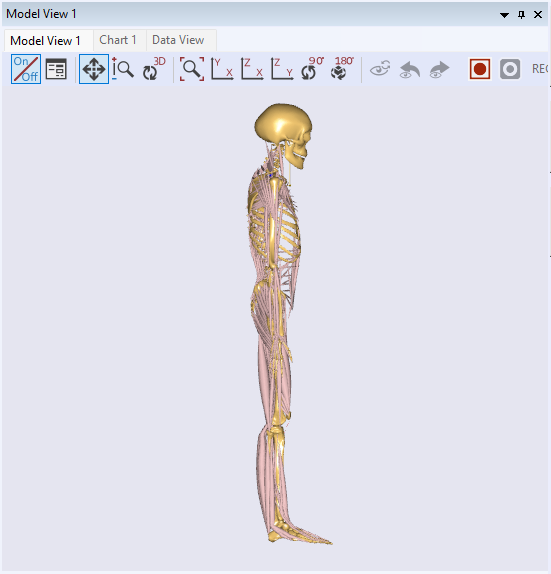

# Lesson 1: Starting with a New Model

In this tutorial, we will create a model of a single leg stepping on a
pedal.

## Creating a model from templates

The toolbar button "Template" will generate a pop-up menu that looks like the image below.
Select the "Human" template, set the "Target Folder" as per your convenience, but you must set the target name as “MyPedal”:


If you press the OK button, it will open an editor window of
“MyPedal.main.any” file that includes the following lines:

```AnyScriptDoc
#include "../libdef.any"

Main = {
  //If you want to use your own draw settings, please outcomment the next line
  //#path BM_DRAWSETTINGS_FILE "Model\DrawSettings.any"

  // Using your own Mannequin.any file in the Model folder of your model
  #path BM_MANNEQUIN_FILE "Model\Mannequin.any"

  // Include default human model
  #include "<ANYBODY_PATH_BODY>\HumanModel.any"

  AnyFolder Model = {
    // A link to the human model
    AnyFolder &BodyModel=.HumanModel.BodyModelWithDefaultDrivers;

    // Environment files are used to include objects surrounding human
    #include "Model\Environment.any"

    AnyFolder ModelEnvironmentConnection = {
      //'JointsAndDrivers.any' file can include all kinematic constraints such as joints and drivers
      #include "Model\JointsAndDrivers.any"
      // Additional reactions which are required to run the inverse dynamics analysis
      #include "Model\Reactions.any"
    };
  };

  AnyBodyStudy Study = {
    AnyFolder &Model = .Model;
    Gravity={0.0, -9.81, 0.0};
    nStep = 11;

    // these settings are needed for adding drivers without removing the default set
    Kinematics.SolverType = KinSolOverDeterminate;
    InitialConditions.SolverType = Kinematics.SolverType ;
  };

  #include "Model\RunAppSequence.any"
}; //Main
```

When you load the model, you should see the following image in your model view:

    ```

Double-clicking the following line:,:

```AnyScriptDoc
...
#include "Model\Environment.any"
...
```

Opens up the “Environment.any” file which is created by the Human template.

```AnyScriptDoc
AnyFolder Environment =
{

};
```

For this model, the only environment objects will be the global reference frame (i.e. ground),
and the pedal which the foot will be stepping on. You can define the global reference frame within the
environment folder as follows:

```AnyScriptDoc
//This is a place holder for the modeling of the environment.
AnyFolder Environment =
{
  §AnyFixedRefFrame GlobalRef =
  {
   AnyDrawRefFrame drw={};
  };§
};
```

Click the "Save" button or Ctrl-S to save what you have typed in this Environment.any file and reload the model.

(model-structure)=

## The model structure

Let us first review the structure of the model in slightly more
detail. This structure creates a clear division between the human body parts
and the applications we hook them up to.


**Just below “Main”, you see the "HumanModel" folder which holds all the body
parts that are imported from the AMMR, such as segments (bones), joints, muscles etc.**

Information for scaling the size of the default human model is also stored here.
In general, you won’t need to modify this information directly.

The "Model" folder comes next this holds information specific to the application you're creating.
In this case, this is the pedal model. The "Model" folder is sub-divided into three sub-folders:

- **HumanModel** - This is a local reference to the "Main.HumanModel", located within the "Model" folder.
  {ref}`This section <reference-objects>` can help you recollect what reference objects are.
- **Environment** - This contains external hardware such as chairs,
  bicycles, tools, or, in the present case, a pedal.
- **ModelEnvironmentConnection** - This holds the measures and drivers that link the body model together to the environment.

## Add pedal segment

The pedal will be hinged at one end, with the foot pushing down at the other.
We will define the pedal segment and the hinge in the "Environment.any" file:

This is achieved by the following lines:

```AnyScriptDoc
AnyFolder Environment =
{
  AnyFixedRefFrame GlobalRef =
  {
   AnyDrawRefFrame drw={};
  };
  §AnySeg Pedal = {
    Mass = 2;
    Jii = {0.05, 0.001, 0.05};
    AnyRefNode Hinge = {
      sRel = {0, -0.15, 0};
    };
    AnyRefNode FootNode = {
      sRel = {0, 0.15, 0};
    };
    AnyDrawSeg drw = {};
  };
  AnyRevoluteJoint HingeJoint = {
    Axis = z;
    AnyFixedRefFrame &Ground = .GlobalRef;
    AnyRefNode &Pedal = .Pedal.Hinge;
  };§
};
```

If you reload the model, you will see the new segment in the model:


**In the next lesson, we shall look at how you can customize the human model to fit the purpose of your
simulation using AnyBody.**

:::{rst-class} without-title
:::

:::{seealso}
**Next lesson:** Next up is {doc}`Lesson 2: Adjusting the human model <lesson2>`.
:::
