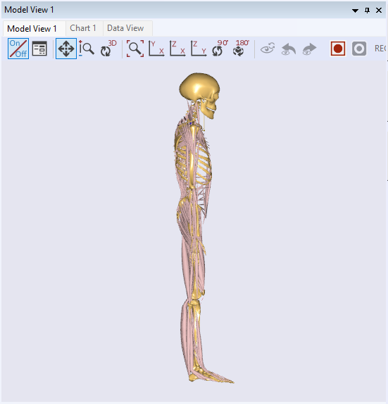

Lesson 1: Starting with a New Model 
====================================

In some cases, it may be difficult to find an existing model that is
sufficiently similar to what you want to obtain. In such a case it can
be reasonable to begin the modeling project from a new model rather than
an existing model. This is what we shall explore in the forthcoming
lessons. We shall design a model of a **single leg stepping on a
pedal**.

Generic model structure
-----------------------

Let us first review the structure of the repository in slightly more
detail. One of the objectives of its structure is to enable a clear
division between the body parts and the applications we hook them up to.
This comes through in the data structure of the model we are going to
construct. Here is a brief overview of the principles behind that
structure.

|ModelTree|

The model is primarily divided into three folders as shown above. In
fact, the structure contains a few more parts that we will get to later,
but the elements shown above are the more important.

At the top below the “Main” folder, you see the "HumanModel". This is
where we keep the body parts that we are importing from the Body part of
the repository. This folder contains objects such as segments (bones),
joints, muscles, and ligaments. We also keep information about the
scaling of the model in this folder. In general, you don’t need to
modify this information directly.

Next, you can see the “Model” folder which contains all the information
of your model. Below this Model folder, you can find another HumanModel
folder, and this is the reference of the actual HumanModel below the
Main folder.

It is just as important to notice what this folder does not contain:
movement drivers, forces, and joints between the model and the
environment. The external hardware parts of the models such as chairs,
bicycles, tools, or, in the present case, a pedal are stored in the
“Environment” folder.

To link the body model together with the environment, we use the
"ModelEnvironmentConnection" folder which is typically containing the
joint between the objects of the two former folders.

Creating model from template
----------------------------

Let us start building the foot pedal model. The toolbar button
"Template" will generate a default template model that looks much like
this (let us set the target name as “MyPedal”):

|New template model button|

|New Template dialog|

If you press the OK button, it will open an editor window of
“MyPedal.main.any” file that includes the following lines:

.. code-block:: AnyScriptDoc

    #include "../libdef.any"
    
    Main = {
      //If you want to use your own draw settings, please outcomment the next line
      //#path BM_DRAWSETTINGS_FILE "Model\DrawSettings.any"
      
      // Using your own Mannequin.any file in the Model folder of your model
      #path BM_MANNEQUIN_FILE "Model\Mannequin.any"
      
      // Include default human model
      #include "<ANYBODY_PATH_BODY>\HumanModel.any"
      
      AnyFolder Model = {  
        // A link to the human model
        AnyFolder &HumanModel=.HumanModel.BodyModelWithDefaultDrivers;
        
        // Environment files are used to include objects surrounding human
        #include "Model\Environment.any"   
        
        AnyFolder ModelEnvironmentConnection = {
          //'JointsAndDrivers.any' file can include all kinematic constraints such as joints and drivers
          #include "Model\JointsAndDrivers.any"
          // Additional reactions which are required to run the inverse dynamics analysis
          #include "Model\Reactions.any"
        };
      };
      
      AnyBodyStudy Study = {
        AnyFolder &Model = .Model;  
        Gravity={0.0, -9.81, 0.0};
        nStep = 11;
        
        // these settings are needed for adding drivers without removing the default set 
        Kinematics.SolverType = KinSolOverDeterminate;
        InitialConditions.SolverType = Kinematics.SolverType ;
      };
      
      #include "Model\RunAppSequence.any"
    }; //Main

Let’s load this default template model and open a Model View; then you
can see the HumanModel on your screen like this:

|Model view Full body|

Using the Human template, you could easily introduce the HumanModel into
your own model framework. This means that you could prepare the
“HumanModel” folder information in your Model Tree.

If you can double-click the following line,

.. code-block:: AnyScriptDoc

    ...
    #include "Model\Environment.any"
    ...

    

This will open the “Environment.any” file which is created by the Human template. 

.. code-block:: AnyScriptDoc
  
    AnyFolder Environment = 
    {

    };    

This folder is for keeping defining the environment. In this case, it is
the global reference frame, i.e. ground, and the pedal that the foot is
going to step on. In fact, let us define the global reference frame in
this folder right away (notice that new AnyScript code is written in red
while existing code has the normal syntax highlighting):

.. code-block:: AnyScriptDoc

    //This is a place holder for the modeling of the environment.
    AnyFolder Environment = 
    {
      §AnyFixedRefFrame GlobalRef = 
      {
       AnyDrawRefFrame drw={};
      };§
    };

Click the "Save" button or Ctrl-S to save what you have typed in this
Environment.any file.

Add pedal segment
-----------------

We now have the framework for adding the pedal to the model. We are
presuming a pedal hinged in one end and the foot pushing in the other.
We will define the segment and the hinge in the Environment.any file:

.. code-block:: AnyScriptDoc

    AnyFolder Environment = 
    {
      AnyFixedRefFrame GlobalRef = 
      {
       AnyDrawRefFrame drw={};
      };
      §AnySeg Pedal = {
        Mass = 2;
        Jii = {0.05, 0.001, 0.05};
        AnyRefNode Hinge = {
          sRel = {0, -0.15, 0};
        };
        AnyRefNode FootNode = {
          sRel = {0, 0.15, 0};
        };
        AnyDrawSeg drw = {};
      };
      AnyRevoluteJoint HingeJoint = {
        Axis = z;
        AnyFixedRefFrame &Ground = .GlobalRef;
        AnyRefNode &Pedal = .Pedal.Hinge;
      };§
    };

    
If you reload the model by pressing the F7 button and open a Model View,
then you will see the new segment:

|Model view new segment|

This pedal is hinged to the origin of the global reference frame, but
there is not much information else yet. In the next lesson, we shall
look at how we can adjust the human model to fit the purpose of your
simulation using AnyBody.

.. rst-class:: without-title
.. seealso::
    **Next lesson:** Next up is :doc:`Lesson 2: Adjusting the human model <lesson2>`.

.. |ModelTree| image:: _static/lesson1/image1.png
   
.. |New template model button| image:: _static/lesson1/image2.png
   
.. |New Template dialog| image:: _static/lesson1/image3.png
   

   
.. |Model view new segment| image:: _static/lesson1/image5.png
   