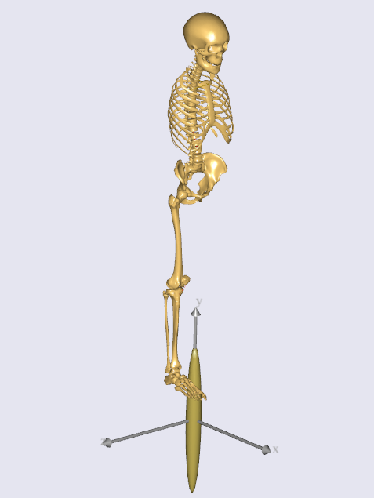

Lesson 2: Adjusting the Human Model
===================================

Having defined the environment in the previous lesson, the next step is
to adjust your human model. The body model is divided into individual
body parts: legs, arms, and trunk.

.. todo:: Add a intersphinx link to AMMMR documentation on BM statments

As we could learn from the chapter ``Getting started: The Model
Repository (AMMR) <../A_Getting_started_AMMR/intro``, you can
now use various kinds of BM (Body Model) statements which can control
the configuration of your human model. All that you should know is to
find the proper 
`parameters <../A_Getting_started_AMMR/BodyModel.defs.parameters.html>`__
and
`constants <../A_Getting_started_AMMR/BodyModel.defs.constants.html>`__
for the BM statements.

For this pedal model, we will adjust the human model such as:

-  There will be no muscle in the trunk segment.

-  Both the left and the right arm segments will be excluded.

-  The left leg segments will be excluded.

-  There will be no muscle in the right leg segments.

Then you should declare the corresponding BM statements just before
including the “HumanModel.any” file.

.. code-block:: AnyScriptDoc

    Main = {
      //#path BM_DRAWSETTINGS_FILE "Model\DrawSettings.any"
      
      #path BM_MANNEQUIN_FILE "Model\Mannequin.any"
      
      //-->BM statements
      // Excluding the muscles in the trunk segments
      §#define BM_TRUNK_MUSCLES CONST_MUSCLES_NONE§
      // Excluding the left arm segments
      §#define BM_ARM_LEFT OFF§
      // Excluding the right arm segments
      §#define BM_ARM_RIGHT OFF§
      // Excluding the left leg segments
      §#define BM_LEG_LEFT CONST_LEG_MODEL_OFF§
      // Using the right leg as 'TLEM' model
      §#define BM_LEG_RIGHT CONST_LEG_MODEL_TLEM§
      // Excluding the muscles in the right leg segments
      §#define BM_LEG_MUSCLES_RIGHT CONST_MUSCLES_NONE§  
      //<--
      
      // Include default human model
      #include "<ANYBODY_PATH_BODY>\HumanModel.any"
    

Try loading the model again. F7 should produce the encouraging message:::

    Model Warning: Study 'Main.Study' contains too few kinematic constraints to be kinematically determinate.
    Evaluating model...
    Loaded successfully.
    Elapsed Time : 0.511000

The model view should show you the following picture:

|ModelView_Human_Adjusted|

The warning message about the model containing too few kinematic
constraints means that it is not ready yet to perform any movement. We
have not made any specifications yet of how everything in the model is
connected. This will be the topic of :doc:`Lesson 3: Making Ends
Meet <lesson3>`.

