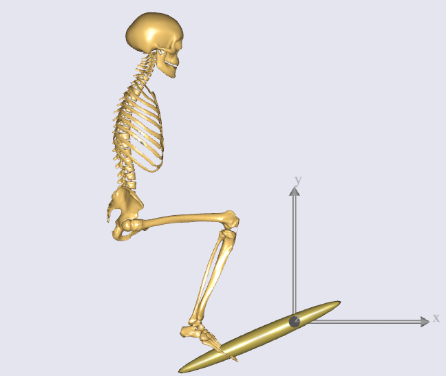

# Lesson 3: Making Ends Meet

Your model still lacks the the full specifications of how the human and
environment (pedal & ground) are connected, and how the model moves.

To ensure that sufficient kinematic information is provided to AnyBody, it is best to start with
an inventory check on the degrees of freedom (DOFs) of the model.

## Degrees of freedom overview

The pedal is simply hinged to the global reference frame, and has the following DOFs:

- 1 DOF of rotation at the hinge.

With no environmental constraints defined so far, the human body has the following DOFs:

- 6 DOF because the body as a whole is currently "floating around in space"
- 3 DOF of the spherical joint between pelvis and thorax rotation
- 3 DOF of the spherical joint at the neck
- 3 DOF of the spherical joint at the hip
- 1 DOF of the revolute joint at the knee
- 2 DOF of rotation (flexion + eversion) at the ankle

```{admonition} Counting DOFs
Total Human + pedal DOFs adds up to 19. In other words, we to need to specify 19 constraints before the model is kinematically determinate.
We will do this using the concepts of "Measures and Drivers" introduced in** {ref}`this previous chapter <measures-and-drivers>`.
```

The following steps specify a total of 19 driver constraints for the model:

- Step 1 - 6 DOF constrained by fixing the pelvis rigidly to a point on ground (like a seat).
- Step 2 - 3 DOF constrained by locking all 3 rotations between pelvis-thorax
- Step 3 - 3 DOF constrained by locking all 3 rotations at neck
- Step 4 - 3 DOF constrained by locking 3 translations between pedal and foot (a spherical joint)
- Step 5 - 2 DOF constrained by fixing the 2 ankle DOFs
- Step 6 - 1 DOF constrained by constraining the global, lateral position of the knee
- Step 7 - 1 DOF constrained as pedal rotation at constant velocity

**Each of these steps is implemented in sequence below.**

(mannequin-drivers)=

## The "Default mannequin drivers"

Do all 19 driver constraints mentioned above need to be added before a kinematic simulation will work? Yes. But there
is one model feature that will make your life easier.

**The human model includes "default drivers" which can constrain the human model's posture
to the joint angles and velocities set in the "Mannequin.any" file.**

The constraint enforced by the default drivers are defined as ‘soft’
constraints - constraints that be overridden by the 19 'hard constraints' which we will define.

**You can therefore sequentially add the 19 hard drivers on top of the soft default drivers, and deactivate the default
drivers at the** {ref}`very end of this lesson <kinematically-determined>` **. The advantage is that you have a model whose
kinematics can be tested at every step along the way.**

## Step 1: Fixing the pelvis to ground

The pedal is currently hinged at the origin of the global reference
frame. A "seat" node to which we fix the pelvis must therefore
be displaced by a suitable distance from the origin.

In the `Environment.any` file, add the following within the `GlobalReferenceFrame` object:

```{code-block} AnyScriptDoc
  AnyFixedRefFrame GlobalRef =
  {
    viewRefFrame.Visible=On;
    viewRefFrame.ScaleXYZ = 0.5*{1,1,1};

    §AnyRefNode Hpoint = {
     sRel = {-0.7, 0.5, 0};
   };§   
  };
```

**Reload the model (F7).**

Hpoint is a term used in the seating industry to characterize
the position of the pelvis in a seat. Here we shall simply attach the
pelvis to this point by means of a rigid connection.

Drivers which connect the human and environment are traditionally placed in a folder called
"ModelEnvironmentConnection" (** {ref}`explained here <model-structure>` **), and for historical reasons, it is placed in
an** `#include` **file called "JointsAndDrivers.any". Let’s open this file by
double-clicking of the following line in the main file:

```AnyScriptDoc
...
#include "Model\JointsAndDrivers.any"
...
```

Then you can see the following structure inside:

```AnyScriptDoc
AnyFolder Joints =
{

};

AnyFolder Drivers =
{

};
```

Here let’s prepare an `AnyStdJoint` object named "SeatPelvis" for the fixation of pelvis:

```AnyScriptDoc
AnyFolder Joints =
{
  §AnyStdJoint SeatPelvis =
  {
    AnyRefFrame& Seat = ;
    AnyRefFrame& Pelvis = ;
  };§
};
```

As you'd realize by now, both "Seat" and "Pelvis" are references to the two nodes that
are being connected by the joint.

```{note}
The "Seat" node must point to the `Hpoint` node attached to `GlobalRef`
frame. `Pelvis` must point to the origin of `PelvisSeg`, which you can find in the model tree at
"HumanModel->BodyModel->Trunk->SegmentsLumbar->PelvisSeg".
``` 

To find and insert the absolute paths for these nodes into AnyScript, quickly refer back
to {ref}`this previous section <absolute-folder-path>`.

You should now have the following:

```AnyScriptDoc
AnyFolder Joints =
{
  AnyStdJoint SeatPelvis =
  {
    AnyRefFrame& Seat = §Main.Model.Environment.GlobalRef.Hpoint§;
    AnyRefFrame& Pelvis = §Main.HumanModel.BodyModel.Trunk.SegmentsLumbar.PelvisSeg§;
  };
};
```

Hit F7 to reload the model. The model still loads in
the same position as before.

The initial positions are controlled by the mannequin file. Open it up
by double-clicking the following line, and make the changes show in red:

```AnyScriptDoc
...
#include "Model\Mannequin.any"
...
```

```AnyScriptDoc
HumanModel.Mannequin = {
  
  Posture = {
    //This controls the position of the pelvi wrt. to the global reference frame
    PelvisPosX=§-0.7§;
    PelvisPosY=§0.5§;
    PelvisPosZ=0;

...
```

You have specified the load-time position of the
pelvis to the coordinates of the `Hpoint` node. It is also a good idea to specify the initial joint angles
in the leg so that the foot is closer to the pedal. This can be done further down
in the Mannequin file:

```AnyScriptDoc
    Right = {
      //Arm 
      SternoClavicularProtraction=-23;   //This value is not used for initial position
      SternoClavicularElevation=11.5;    //This value is not used for initial position
      SternoClavicularAxialRotation=-20; ///< Only used when the clavicular axial rotation rhythm is diabled
      
      GlenohumeralFlexion =-0; 
      GlenohumeralAbduction = 10; 
      GlenohumeralExternalRotation = 0; 
      
      ElbowFlexion = 0.01; 
      ElbowPronation = -20.0;
      
      WristFlexion =0;
      WristAbduction =0;
            
      //Leg
      HipFlexion = §110.0§; 
      HipAbduction = 5.0; 
      HipExternalRotation = 0.0;
      
      KneeFlexion = §100.0§;
      
      AnklePlantarFlexion =0.0; 
      SubTalarEversion =0.0; 

...
```

On reload, you will see that the body now loads in pretty much the
desired position. Notice that this is only to bring the body close to
where it will eventually be. It is not necessary to align the model
exactly with the pedal. The kinematic constraints will take care of this
once they are properly defined.

```{image} _static/lesson3/image1.png
:alt: Posture Adjustment1
:width: 300px
:align: right
```


## Step 2: Locking pelvis-thorax rotation

The only purpose of the trunk in this model is to anchor the psoas muscles which move
the leg. So we will set to zero, the angles and velocities of 3 DOF of pelvis-thorax flexion, lateral bending and axial rotation.

We will place the drivers enforcing these constraints in the "Drivers" folder within "JointsAndDrivers.any" (shown below):

```AnyScriptDoc
AnyFolder Joints =
{
  AnyStdJoint SeatPelvis =
  {
    AnyRefFrame& Seat = Main.Model.Environment.GlobalRef.Hpoint;
    AnyRefFrame& Pelvis = Main.HumanModel.BodyModel.Trunk.SegmentsLumbar.PelvisSeg;
  };
};

AnyFolder Drivers =
{

};
```

Insert a "PelvisThoraxDriver" into the Drivers folder, created using the `AnyKinEqSimpleDriver` class.
You already know how to create model objects from scratch by using the
the "Class Inserter" ({ref}`described here <class-inserter>`). More details on properties
such as DriverPos, DriverVel etc. can be ({ref}`found here <anykineqsimpledriver>`) :

```AnyScriptDoc
AnyFolder Drivers =
{
  §AnyKinEqSimpleDriver PelvisThoraxDriver =
  {
    AnyKinMeasure& ref0 = ....HumanModel.BodyModel.Interface.Trunk.PelvisThoraxExtension;
    AnyKinMeasure& ref1 = ....HumanModel.BodyModel.Interface.Trunk.PelvisThoraxLateralBending;
    AnyKinMeasure& ref2 = ....HumanModel.BodyModel.Interface.Trunk.PelvisThoraxRotation;

    DriverPos = pi/180*{0,0,0};
    DriverVel = pi/180*{0,0,0};
  };§
};
```

## Step 3: Locking neck rotation

The following lines lock all 3 DOFs of rotation between the skull and the thorax (neck). The
drivers are defined in a manner that is very similar to Step 2.

```AnyScriptDoc
AnyFolder Drivers =
{
  AnyKinEqSimpleDriver PelvisThoraxDriver =
  {
    AnyKinMeasure& ref0 = ....HumanModel.BodyModel.Interface.Trunk.PelvisThoraxExtension;
    AnyKinMeasure& ref1 = ....HumanModel.BodyModel.Interface.Trunk.PelvisThoraxLateralBending;
    AnyKinMeasure& ref2 = ....HumanModel.BodyModel.Interface.Trunk.PelvisThoraxRotation;

    DriverPos = pi/180*{0,0,0};
    DriverVel = pi/180*{0,0,0};
  };


  §AnyKinEqSimpleDriver SkullThoraxDriver =
  {
    AnyKinMeasure& ref0 = ....HumanModel.BodyModel.Interface.Trunk.SkullThoraxFlexion;
    AnyKinMeasure& ref1 = ....HumanModel.BodyModel.Interface.Trunk.SkullThoraxLateralBending;
    AnyKinMeasure& ref2 = ....HumanModel.BodyModel.Interface.Trunk.SkullThoraxRotation;

    DriverPos = pi/180*{0,0,0};
    DriverVel = pi/180*{0,0,0};
  };§
};
```

## Step 4: Connecting the foot to the pedal

The foot will be connected to the pedal by a spherical joint. We have assumed
the connection node on the foot to be the "MetatarsalJoint2Node". The driver is
defined inside the "JointsAndDrivers.any" file in the following way:

```AnyScriptDoc
AnyFolder Joints =
{
  AnyStdJoint SeatPelvis =
  {
    AnyRefFrame& Seat = Main.Model.Environment.GlobalRef.Hpoint;
    AnyRefFrame& Pelvis = Main.HumanModel.BodyModel.Trunk.SegmentsLumbar.PelvisSeg;
  };

  §AnySphericalJoint PedalFoot =
  {
    AnyRefFrame& Pedal = Main.Model.Environment.Pedal.FootNode;
    AnyRefFrame& Foot = Main.HumanModel.BodyModel.Right.Leg.Seg.Foot.MetatarsalJoint2Node;
  }; §
};
```

## Step 5: Locking the ankle angles

In ankle has 2 DOFs - AnklePlantarFlexion and SubTarEversion. We will constrain both
DOFs to always equal zero. Just as in Steps 3 & 4, this will be done using `AnyKinEqSimpleDriver`:

```AnyScriptDoc
AnyFolder Drivers =
{
...
  AnyKinEqSimpleDriver SkullThoraxDriver =
  {
    AnyKinMeasure& ref0 = ....HumanModel.BodyModel.Interface.Trunk.SkullThoraxFlexion;
    AnyKinMeasure& ref1 = ....HumanModel.BodyModel.Interface.Trunk.SkullThoraxLateralBending;
    AnyKinMeasure& ref2 = ....HumanModel.BodyModel.Interface.Trunk.SkullThoraxRotation;

    DriverPos = pi/180*{0,0,0};
    DriverVel = pi/180*{0,0,0};
  };

  §AnyKinEqSimpleDriver AnkleDriver =
  {
    AnyKinMeasure& ref0 = ....HumanModel.BodyModel.Interface.Right.AnklePlantarFlexion;
    AnyKinMeasure& ref1 = ....HumanModel.BodyModel.Interface.Right.SubTalarEversion;

    DriverPos = pi/180*{0, 0};
    DriverVel = pi/180*{0, 0};
   };§
};
```

Re-loading the model should show no significant differences.

## Step 6: Fix the lateral position of the knee

Imagine your pelvis on a seat (like in Step 1) and your foot resting at the tip of a sharp spike jutting
out of the ground (a spherical joint connection, like in Step 4). You can still move your knee sideways.
You will now constrain this medio-lateral knee movement in your model.

This is done using an `AnyKinLinear` measure and a `AnyKinEqSimpleDriver` driver acting on that measure
({ref}`read more one measures & drivers here <measures-and-drivers>`):

```AnyScriptDoc
AnyFolder Drivers =
{
...
  AnyKinEqSimpleDriver AnkleDriver =
  {
    AnyKinMeasure& ref0 = ....HumanModel.BodyModel.Interface.Right.AnklePlantarFlexion;
    AnyKinMeasure& ref1 = ....HumanModel.BodyModel.Interface.Right.SubTalarEversion;

    DriverPos = pi/180*{0, 0};
    DriverVel = pi/180*{0, 0};
  };

  §AnyKinEqSimpleDriver KneeDriver =
  {
    AnyKinLinear lin =
    {
      AnyRefFrame& ref0 = Main.Model.Environment.GlobalRef;
      AnyRefFrame& ref1 = Main.HumanModel.BodyModel.Right.Leg.Seg.Thigh.KneeJoint;
      Ref = 0;
    };
    MeasureOrganizer = {2};
    DriverPos = {0};
    DriverVel = {0};
   }; §
};
```

The `AnyKinLinear` object measures the 3D position vector between the two reference
frames `ref0` and `ref1` which it refers to, i.e., in this case, the position of the knee
with respect to the global reference frame.

We however, only wish to constrain the medio-lateral component of this vector, which is the global
"Z" component. We hence specify the** `MeasureOrganizer` **property to specify that only the 3rd component of the measure
which is given by the index 2 (0 being X, 1 being Y component) must be constrained by the driver.

## Step 7: Specify pedal movement

We will specify motion for the pedal's hinge joint again using the `AnyKinEqSimpleDriver`.
This resembles what you did in {ref}`this earlier chapter <anykineqsimpledriver>`.

```AnyScriptDoc
AnyFolder Drivers =
{
...
  AnyKinEqSimpleDriver KneeDriver =
  {
    AnyKinLinear lin =
    {
      AnyRefFrame& ref0 = Main.Model.Environment.GlobalRef;
      AnyRefFrame& ref1 = Main.HumanModel.BodyModel.Right.Leg.Seg.Thigh.KneeJoint;
      Ref = 0;
    };
    MeasureOrganizer = {2};
    DriverPos = {0};
    DriverVel = {0};
  };

  §AnyKinEqSimpleDriver PedalDriver =
  {
    AnyKinMeasure &ref0 = Main.Model.Environment.HingeJoint;
    DriverPos = pi/180*{100};
    DriverVel = pi/180*{45};
  };§
};
```

This puts the pedal in an initial 100-degree angle compared to vertical, from where
this angle increases as a rate of 45 degrees per second.

For now, hit F7 again to reload the model. Notice that the system no
longer complains about the model being kinematically indeterminate.

## Running kinematics

Select and run the `Main.Study.Kinematics` operation from the operations dropdown menu ({ref}`more info here <running-analysis>`).
This will show you the movement of the entire system as the pedal is rotating.



(kinematically-determined)=

## Check if model is kinematically determined?

Finally, you will check the number of DOFs and the number of kinematic
constraints in the simulation from the “Object Description” of your "Study" object.
You can find this here:


Then you see the Object Description dialog will open.


**This indicates that the total number of DOFs(degrees of freedom) in your
model is 132. It makes sense because there are 22 segments in your model
and each segment has 6 DOFs.**

If you scroll down this dialog a little bit more, then you can see the
following section:


The last message in the above screenshot lets us know that there are 150
constraints from the joints and the drivers in the model.

In general, the total number of DOFs in the model should be exactly as
same as the total number of kinematic constraints in the model. But at
the moment, the number of kinematic constraints is larger than that of
DOFs.

```{warning}
In some cases, having more constraints than DOFs (also called a redundant set of constraints) results in a failed kinematic simulation,
because the system is over-constrained.
```

However our AnyBody model seems to work despite this constraint redundancy. Why?

This is because, these 150 - 132 = 18 "extra" constraints were also "soft" constraints enforced by the
“default mannequin drivers” described {ref}`here earlier <mannequin-drivers>`.

The "DefaultMannequinDrivers" can be found in a subfolder of the “HumanModel” folder, as shown in the figure below.
These drivers control the human model's posture based on the values in the "Mannequin.any" file.


Because these default drivers are defined as “Soft” constraints, they were compromised in
favour of the "Hard" constraints specified in Steps 1 to 7 in this document.

This avoided an over-constrained situation and kinematics could therefore be solved.

Since you could define all necessary “Hard” constraints,
the default drivers can now be removed by just adding one more BM statement to the file `Model/BodyModelConfiguration.any`:

```{code-block} AnyScriptDoc
// Excluding the muscles in the trunk segments
#define BM_TRUNK_MUSCLES OFF
// Excluding the left arm segments
#define BM_ARM_LEFT OFF
// Excluding the right arm segments
#define BM_ARM_RIGHT OFF
// Excluding the left leg segments
#define BM_LEG_LEFT OFF
// Excluding the muscles in the right leg segments
#define BM_LEG_MUSCLES_RIGHT OFF
// Excluding the default drivers for the human model
§#define BM_MANNEQUIN_DRIVER_DEFAULT OFF§
```

Save the main file and press F7 button to reload the model. And try to
open the Object Description dialog of “Study” object in the Model Tree.


You see that now the total number of constraints has been changed to 132
and this is exactly as same as the total number of DOFs. Of course, you
can still run the kinematics of your model.

Now that the kinematics is in order let us move on to the kinetic analysis in {doc}`Lesson 4 <lesson4>` and see what the model is good for.