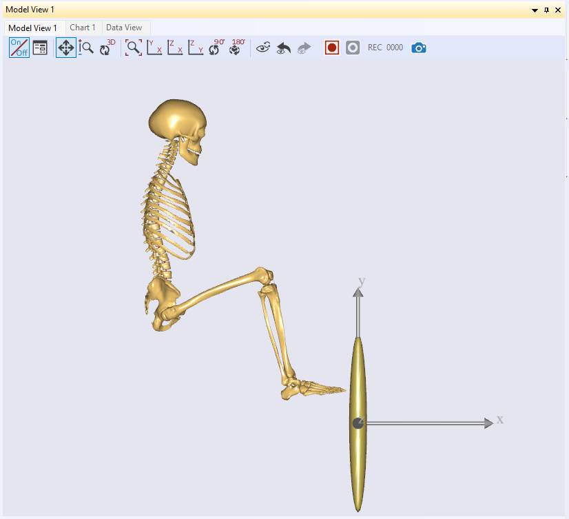
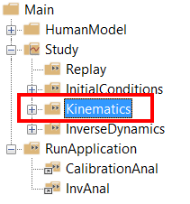
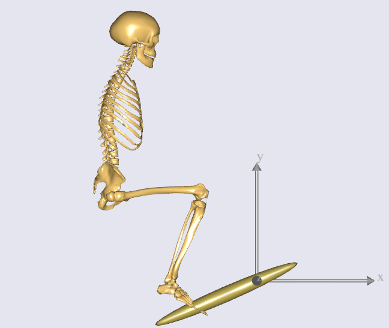
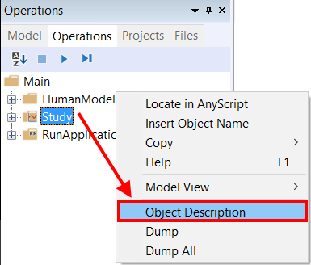
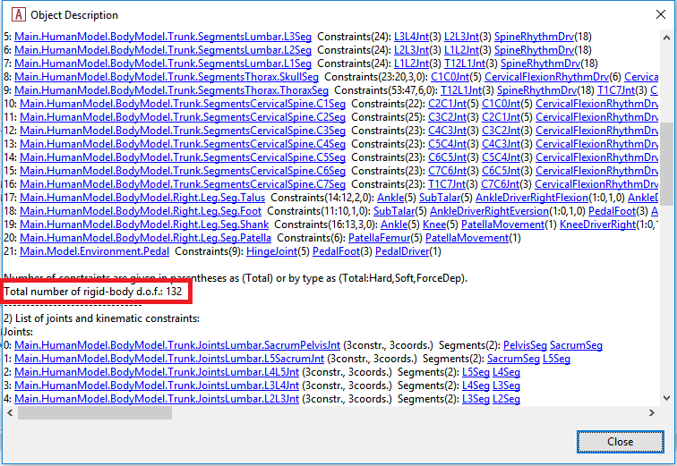
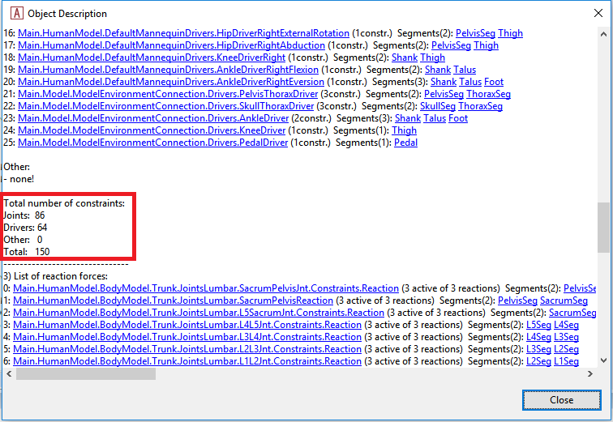
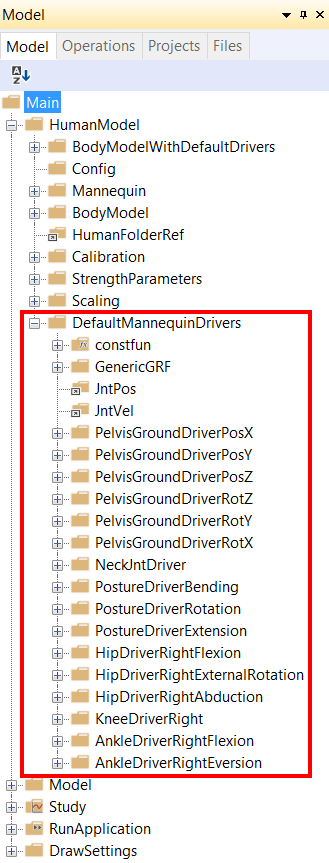
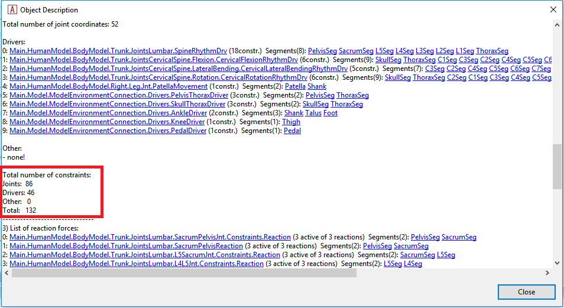

Lesson 3: Making Ends Meet
==========================

So far we have accomplished to define an environment model with a simple
pedal and a human model containing the trunk and the right leg. What the
application is still missing is specifications of how the different
elements are connected and how the model moves. With kinematics, it is
usually a good idea, to begin with, an inventory of degrees of freedom
(DOFs) in the model.

Degrees of freedom overview
---------------------------

The pedal is simple: It is hinged to the global reference frame and
therefore just has just one movement capability, namely a rotation about
the hinge. The human model is more complicated. It is disconnected from
everything and is, therefore, floating around in space. Furthermore, it
has a number of internal degrees of freedom that must be controlled:
Three rotations between the pelvis and the thorax segments, three
rotations in the hip, one rotation in the knee, and two rotations in the
ankle. With the 9 DOFs of the entire body model in space and the single
DOF of the pedal, this adds up to 16 DOFs. In other words, we need 16
constraints before the model is kinematically determinate.

This is what we plan to do:

1. The pelvis will be fixed completely at a point corresponding to the
   contact to a seat. This will do away with 6 DOFs leaving us with 10
   more to specify.

2. The 3 rotations between the trunk and the thorax segments will be
   specified by a driver to a constant position. This leaves us with 7
   more constraints to specify.

3. The foot will be connected to the pedal by a spherical joint having 3
   constraints. This leaves us with 4 more constraints to specify.

4. The ankle angle will be presumed fixed by two constraints. This
   leaves 2 DOFs to be constrained.

5. The lateral position of the knee will be specified by a driver. This
   leaves a single degree of freedom in the system.

6. Finally, we are going to drive the pedal angle. With the
   aforementioned constraints, this will allow us to specify the posture
   of the entire system by this single driver.

At the moment you don’t need to worry about this process of making
constraints too much. From AMMR V1.6, this human model includes
so-called ‘default drivers’ which can control the posture of human model
using the joint angle values and velocities of the Mannequin.any file in
your model. But because these default drivers are defined as ‘soft’
constraints by default, you can just add your own drivers on top of
those drivers. After defining all your own drivers, you can deactivate
the default drivers using a corresponding BM statement.

Fixing the pelvis to the global reference frame
-----------------------------------------------

We previously joined the pedal to the origin of the global reference
frame. This means that the 'seat' to which we shall fix the pelvis must
be displaced a suitable distance from the origin. In the Environment.any
file, add the following to the definition of the GlobalReferenceFrame:

.. code-block:: AnyScriptDoc

      AnyFixedRefFrame GlobalRef = {
        §AnyRefNode Hpoint = {
           sRel = {-0.7, 0.5, 0};
         };§
       }; // Global reference frame

The name Hpoint is a term used in the seating industry to characterize
the position of the pelvis in a seat. Here we shall simply attach the
pelvis to this point by means of a rigid connection.

All such specifications are traditionally put into a folder called
ModelEnvironmentConnection, and for historical reasons, it is placed in
an include file called JointsAndDrivers.any. Let’s open this file by
double-clicking of the following line in the main file:

.. code-block:: AnyScriptDoc

    ...
    #include "Model\JointsAndDrivers.any"
    ...
    

Then you can see the following structure inside:

.. code-block:: AnyScriptDoc

    AnyFolder Joints =
    {
    };
    
    AnyFolder Drivers =
    {
    };
    

Here let’s prepare an AnyStdJoint for the fixation of pelvis:

.. code-block:: AnyScriptDoc

    AnyFolder Joints = 
    {
      §AnyStdJoint SeatPelvis = 
      {
        AnyRefFrame& Seat = ;
        AnyRefFrame& Pelvis = ;
      };§
    };

The local pointer variables &Seat and &Pelvis need something to point
to. The best way of locating the necessary points is to use the object
tree at the left-hand side of the editor window. Place your cursor in
the editor window on the &Seat line just before the final semicolon.
Then expand the three in the left-hand side of the window through Model,
Environment, GlobalRef to find the Hpoint that we defined previously.
Right-click Hpoint and choose 'Insert Object Name'. The full name of
the Hpoint is inserted at the position of the cursor.

We must repeat the procedure for the Pelvis. Place the cursor on the
&Pelvis line just before the semicolon and subsequently expand the
object tree through HumanModel, BodyModel, Trunk, SegmentsLumbar. Inside
the lumbar segments folder, you will find the PelvisSeg. Right-click and
insert the object name. You should now have the following:

.. code-block:: AnyScriptDoc

    AnyFolder Joints = 
    {
      AnyStdJoint SeatPelvis = 
      {
        AnyRefFrame& Seat = §Main.Model.Environment.GlobalRef.Hpoint§;
        AnyRefFrame& Pelvis = §Main.HumanModel.BodyModel.Trunk.SegmentsLumbar.PelvisSeg§;
      };
    };

Save the file and hit F7 to reload the model. The model still loads in
the same position as before.

The initial positions are controlled by the mannequin file. Open it up
by double-clicking the following line:

.. code-block:: AnyScriptDoc

    ...
    #path BM_MANNEQUIN_FILE "Model\Mannequin.any"
    ...
    

.. code-block:: AnyScriptDoc

    AnyFolder Mannequin = {
      
      AnyFolder Posture = {
        //This controls the position of the pelvis wrt. to the global reference frame
        AnyVar PelvisPosX = §-0.7§;
        AnyVar PelvisPosY = §0.5§;
        AnyVar PelvisPosZ = 0;
    ...

What we have done here is to specify the load-time position of the
pelvis to the place where we have the seat. After reload you should be
able to see in the model view that the body model has moved to a new
position. It is also a good idea to specify the initial joint angles so
that the foot comes closer to the pedal. This can be done further down
in the Mannequin file:

.. code-block:: AnyScriptDoc

        AnyFolder Right = {
          //Arm 
          AnyVar SternoClavicularProtraction=-23;   //This value is not used for initial position
          AnyVar SternoClavicularElevation=11.5;    //This value is not used for initial position
          AnyVar SternoClavicularAxialRotation=-20; //This value is not used for initial position
          
          AnyVar GlenohumeralFlexion =-0; 
          AnyVar GlenohumeralAbduction = 10; 
          AnyVar GlenohumeralExternalRotation = 0; 
          
          AnyVar ElbowFlexion = 0.01; 
          AnyVar ElbowPronation = -20.0;
          
          AnyVar WristFlexion =0;
          AnyVar WristAbduction =0;
                
          //Leg
          AnyVar HipFlexion = §110.0§; 
          AnyVar HipAbduction = 5.0; 
          AnyVar HipExternalRotation = 0.0;
          
          AnyVar KneeFlexion = §100.0§;
          
          AnyVar AnklePlantarFlexion =0.0; 
          AnyVar SubTalarEversion =0.0;
    ...

On reload, you will see that the body now loads in pretty much the
desired position. Notice that this is only to bring the body close to
where it will eventually be. It is not necessary to align the model
exactly with the pedal. The kinematic constraints will take care of this
once they are properly defined.

|Posture Adjustment1|

Fix the trunk position
----------------------

In this model, the trunk does not play any kinematic role. Its purpose
is only to include the psoas muscles connected to the leg. So we should
simply set it to a fix position. The trunk has three free rotations,
flexion, lateral bending and axial rotation plus the rotation of the
skull that we will fix to zero degrees. This can be done by a so-called
simple driver. In the JointsAndDrivers file we can see the ‘Driver’s
folder below the Joints folder:

.. code-block:: AnyScriptDoc

    AnyFolder Joints = 
    {
      AnyStdJoint SeatPelvis = 
      {
        AnyRefFrame& Seat = Main.Model.Environment.GlobalRef.Hpoint;
        AnyRefFrame& Pelvis = Main.HumanModel.BodyModel.Trunk.SegmentsLumbar.PelvisSeg;
      };
    };
    
    AnyFolder Drivers = 
    {
      
    };

We then insert two simple drivers into the Drivers folder:

.. code-block:: AnyScriptDoc

    AnyFolder Drivers = 
    {
      §AnyKinEqSimpleDriver PelvisThoraxDriver =  
      {
        AnyKinMeasure& ref0 = ...HumanModel.BodyModel.Interface.Trunk.PelvisThoraxExtension;
        AnyKinMeasure& ref1 = ...HumanModel.BodyModel.Interface.Trunk.PelvisThoraxLateralBending;        
        AnyKinMeasure& ref2 = ...HumanModel.BodyModel.Interface.Trunk.PelvisThoraxRotation;   
        
        DriverPos = pi/180*{0,0,0};
        DriverVel = pi/180*{0,0,0};
      };
    
      AnyKinEqSimpleDriver NeckJntDriver = 
      {
        AnyKinMeasure& ref0 = ...HumanModel.BodyModel.Interface.Trunk.NeckJoint;
        DriverPos = pi/180*{0};
        DriverVel = pi/180*{0};
      }; §
    };

Most of this came about the same way as we have done previously: The
definition of the AnyKinEqSimpleDriver (and indeed its complex name)
came from the Object Inserter in the Class Tree at the left-hand side of
the editor window. The complete name of the thorax and neck rotations
was inserted from the object tree. The joints are going to be static,
and in their neutral position, so the DriverVel and DriverPos are simply
zero.

Connecting the foot to the pedal
--------------------------------

The foot will be connected to the pedal by a spherical joint. This is
defined inside the JointsAndDrivers.any file in the following way:

.. code-block:: AnyScriptDoc

    AnyFolder Joints = 
    {
      AnyStdJoint SeatPelvis = 
      {
        AnyRefFrame& Seat = Main.Model.Environment.GlobalRef.Hpoint;
        AnyRefFrame& Pelvis = Main.HumanModel.BodyModel.Trunk.SegmentsLumbar.PelvisSeg;
      };
      
      §AnySphericalJoint PedalFoot = 
      {
        AnyRefFrame& Pedal = Main.Model.Environment.Pedal.FootNode;
        AnyRefFrame& Foot = Main.HumanModel.BodyModel.Right.Leg.Seg.Foot.MetatarsalJoint2Node;
      }; § 
    };

We have cheated just a little. It is possible to define new nodes on the
foot for attachment to a specific place, but we have taken the
cheap-and-dirty solution of picking an existing point close to where we
presume the contact with the pedal will be. The MetatarsalJoint2Node is
a good approximation.

Setting the ankle angle
-----------------------

In the Ankle of this human model, there are 2 degrees of freedom:
AnklePlantarFlexion and SubTarEversoin. We wish to constrain these
degrees of freedom to predefined values as zero. This can be done by the
simple driver. We shall introduce the simple driver into the Drivers
folder:

.. code-block:: AnyScriptDoc

    AnyFolder Drivers = 
    {
    ...
      AnyKinEqSimpleDriver NeckJntDriver = 
      {
        AnyKinMeasure& ref0 = ...HumanModel.BodyModel.Interface.Trunk.NeckJoint;
        
        DriverPos = pi/180*{0};
        DriverVel = pi/180*{0};
       };
      
      §AnyKinEqSimpleDriver AnkleDriver = 
      {
        AnyKinMeasure& ref0 = ...HumanModel.BodyModel.Interface.Right.AnklePlantarFlexion;
        AnyKinMeasure& ref1 = ...HumanModel.BodyModel.Interface.Right.SubTalarEversion;
        
        DriverPos = pi/180*{0, 0};
        DriverVel = pi/180*{0, 0};
       };§  
    };

The model should load again with no significant difference.

Fix the lateral position of the knee
------------------------------------

Imagine your pelvis on a seat and your foot resting on a point like the
model is right now. You can still move your knee sideways either
medially or laterally rotating the leg about an axis through the foot
contact point and the hip joint. We must constrain this movement, and
the easiest way to do it is by fixing the knee laterally.

We shall do this by another simple driver in conjunction with a linear
measure which is so-called as AnyKinLinear class object. Let us add
another driver to the Drivers folder:

.. code-block:: AnyScriptDoc

    AnyFolder Drivers = 
    {
    ...
      AnyKinEqSimpleDriver AnkleDriver = 
      {
        AnyKinMeasure& ref0 = ...HumanModel.BodyModel.Interface.Right.AnklePlantarFlexion;
        AnyKinMeasure& ref1 = ...HumanModel.BodyModel.Interface.Right.SubTalarEversion;
        
        DriverPos = pi/180*{0, 0};
        DriverVel = pi/180*{0, 0};
      };
      
      §AnyKinEqSimpleDriver KneeDriver = 
      {
        AnyKinLinear lin = 
        {
          AnyRefFrame& ref0 = Main.Model.Environment.GlobalRef;
          AnyRefFrame& ref1 = Main.HumanModel.BodyModel.Right.Leg.Seg.Thigh.KneeJoint;
          Ref = 0;
        };
        MeasureOrganizer = {2};
        DriverPos = {0};
        DriverVel = {0};
       }; § 
    };

The AnyKinLinear class is really a 3D vector between the two reference
frames which it refers to, i.e., in this case, the position of the knee
with respect to the global reference frame. However, we only wish to
drive one of the coordinates of this vector, namely the lateral
coordinate. This is the z coordinate, which in an AnyScript model has
the index number as two because numbering index begins from 0. To drive
only this one coordinate, we should specify the MeasureOrganizer inside
the AnyKinEqSimpleDriver object, and this MeasureOrganizer can configure
which components of the related kinematic measures can be controlled by
its kinematic drivers. So in this case, the driver will neglect the x
and y coordinates of the vector returned by the linear measure. You
should be able to load the model again, but there is no visible
difference.

Drive the pedal
---------------

The final step is to drive the movement of the pedal. It is hinged to
the origin of the coordinate system, and we shall add a driver to the
joint angle pretty much like we did with the ankle and the knee.

.. code-block:: AnyScriptDoc

    AnyFolder Drivers = 
    {
    ...
      AnyKinEqSimpleDriver KneeDriver = 
      {
        AnyKinLinear lin = 
        {
          AnyRefFrame& ref0 = Main.Model.Environment.GlobalRef;
          AnyRefFrame& ref1 = Main.HumanModel.BodyModel.Right.Leg.Seg.Thigh.KneeJoint;
          Ref = 0;
        };
        MeasureOrganizer = {2};
        DriverPos = {0};
        DriverVel = {0};
        //Reaction.Type = {Off};
      };
      
      §AnyKinEqSimpleDriver PedalDriver = 
      {
        AnyKinMeasure &ref0 = Main.Model.Environment.HingeJoint;
        DriverPos = pi/180*{100};
        DriverVel = pi/180*{45};
        Reaction.Type = {Off};
      };§  
    };

This puts the pedal in an initial 100-degree angle compared to vertical.
It also specifies a movement with an angular velocity of 45 degrees per
second, but let’s postpone the investigation of that for later.

For now, hit F7 again to reload the model. Notice that the system no
longer complains about the model being kinematically indeterminate.

Running kinematics
------------------

Select the ‘Main.Study.Kinematics’ and run this operation to see how
your model works kinematically.

|Operations tree Kinematics|

Doing so will show you the movement of the entire system as the pedal is
rotating.

|Operation Result Kinematics|

Check if model is kinematic determined?
---------------------------------------

Finally, you will check the number of DOFs and the number of kinematic
constraints from the “Object Description” of the AnyBodyStudy object.
You can find the “Object Description” of your AnyBodyStudy class object
in the Model Tree of your model like this:

|Operations tree object description|

Then you see the Object Description dialog will open.

|ObjectDescription DOFs|

This indicates that the total number of DOFs(degrees of freedom) in your
model is 90. It makes sense because there are 15 segments in your model
and each segment has 6 DOFs.

If you scroll down this dialog a little bit more, then you can see the
following section:

|ObjectDescription Constraints1|

The last message in the above screenshot lets us know that there are 106
constraints from the joints and the drivers in the model.

In general, the total number of DOFs in the model should be exactly as
same as the total number of kinematic constraints in the model. But at
the moment, the number of kinematic constraints is larger than that of
DOFs. In this kind of situation, the kinematics of the model may not be
determined uniquely because there are more equations to be solved than
the number of unknowns in the system. This may frequently happen if the
user may not consider this concept of the DOFs and the constraints.

But you should know why there are more constraints than you have defined
and how AnyBody could solve the kinematics of the model even in this
situation. In the “HumanModel” folder there is a subfolder of which name
is ‘DefaultMannequinDrivers’. In that folder, there are some default
drivers which can control the posture of the human model based on the
values in the Mannequin.any file.

|Model tree Default manequin drivers|

The reason why these default drivers exist is that sometimes the user
may have some difficulties in finding which human joints should be
driven or what kinds of constraints should be defined for the human
model. In order to provide a more convenient way of modeling, these
default drivers of human model can help users even if they may miss some
necessary drivers to run the kinematics perfectly. And because these
default drivers are defined as “Soft” constraints, the kinematics of the
model can be solved with the other normal “Hard” type constraints.
“Soft” constraint means that it can be compromised with other Soft and
Hard Constraints.

Because you could define all necessary “Hard” constraints to run the
kinematics, let us find the way how to remove these default drivers from
your model. You can just add one more BM statement in the main file to
control the default drivers of the human model like this:

.. code-block:: AnyScriptDoc

    //-->BM statements
      // Excluding the muscles in the trunk segments
      #define BM_TRUNK_MUSCLES _MUSCLES_NONE_
      // Excluding the left arm segments
      #define BM_ARM_LEFT OFF
      // Excluding the right arm segments
      #define BM_ARM_RIGHT OFF
      // Excluding the left leg segments
      #define BM_LEG_LEFT OFF
      // Using the right leg as 'TLEM' model
      #define BM_LEG_RIGHT _LEG_MODEL_TLEM1_
      // Excluding the muscles in the right leg segments
      #define BM_LEG_MUSCLES_RIGHT _MUSCLES_NONE_  
      // Excluding the default drivers for the human model
      §#define BM_MANNEQUIN_DRIVER_DEFAULT OFF§
      //<--
    

Save the main file and press F7 button to reload the model. And try to
open the Object Description dialog of “Study” object in the Model Tree.

|ObjectDescription Constraints2|

You see that now the total number of constraints has been changed to 90
and this is exactly as same as the total number of DOFs. Of course, you
can still run the kinematics of your model.

.. rst-class:: without-title
.. seealso::
    **Next lesson:** Now that the kinematics is in order let us move on to the :doc:`kinetic
    analysis in Lesson 4 and see what the model is good
    for. <lesson4>`

   

   

   

   

   

   

   

   