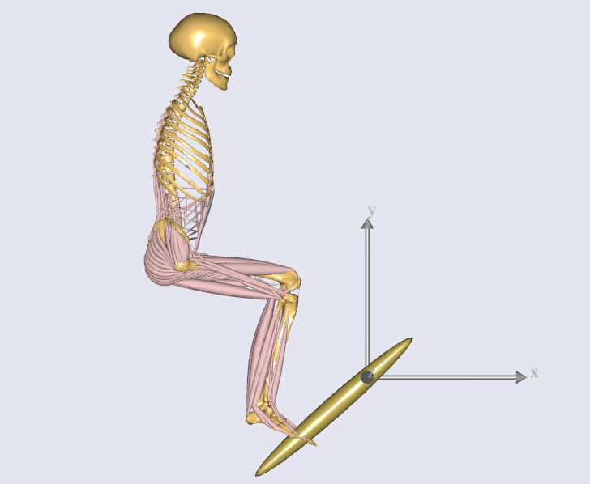
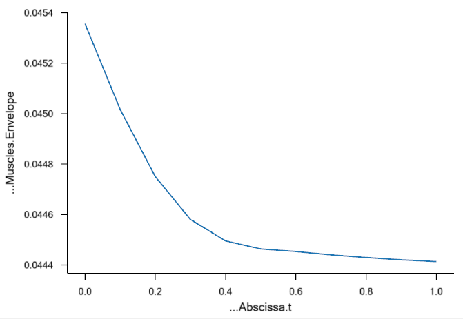

# Lesson 4: Kinetics - Computing Forces

In this lesson, you will compute forces and investigate the ergonomics of the pedal arrangement.

We will presume that the pedal is loaded by a spring, the force of which the leg
must overcome when stepping on the pedal. In this lesson, we will step
by step define the spring force and look at its effect on the leg.

## Generalized forces

**When you say "a support torque applied to a joint", in AnyBody terms, you are saying -
"A generalized force applied to a kinematic measure of the joint angle".**

Similarly "a force applied to a segment along Y axis" becomes - "A generalized force
applied to the Y component of a measure of the segment's position".

**Since AnyBody speaks the language of generalized forces, we will simply call them "forces" henceforth. Physically speaking,
this generalized force will manifest as a rotational torque or a linear force, depending on the type of measure it is applied to.**

You must create an `AnyForce` object in order to apply a generalized force to a measure.

## Include pedal spring force

We will therefore create an `AnyForce` object, for applying the spring force.
Since this is not a part of the human body, it is logical to place it in the Environment.any file. Here's what
to add:

```AnyScriptDoc
...
AnyRevoluteJoint HingeJoint = {
  Axis = z;
  AnyFixedRefFrame &Ground = .GlobalRef;
  AnyRefNode &Pedal = .Pedal.Hinge;
};

§AnyForce Spring = {
  AnyRevoluteJoint &Hinge = .HingeJoint;
  F = -0.0*.HingeJoint.Pos;
};§
```

The `AnyForce` object named "Spring" contains a reference to the "HingeJoint". Since HingeJoint
is a rotational measure, the force is actually a torque applied to the hinge.

`F` is the actual generalized force vector, with each vector component corresponding to a
component of the kinematic measure. `F` is proportional to "HingeJoint.Pos",
which is the hinge angle. Stiffness is initially set to 0.0 (Nm/rad), to investigate the effect of having
no spring. The minus sign in the expression means that the spring will always oppose motions away from the neutral angle.

## Turn off default reaction forces

As mentioned in this {ref}`previous section <driver-reactions>`,
the "Reaction.Type" property for all kinematic drivers that act on muscle-actuated joints must be set to "Off".

```AnyScriptDoc
AnyFolder Drivers =
{
  AnyKinEqSimpleDriver PelvisThoraxDriver =
  {
    AnyKinMeasure& ref0 = ...HumanModel.BodyModel.Interface.Trunk.PelvisThoraxExtension;
    AnyKinMeasure& ref1 = ...HumanModel.BodyModel.Interface.Trunk.PelvisThoraxLateralBending;
    AnyKinMeasure& ref2 = ...HumanModel.BodyModel.Interface.Trunk.PelvisThoraxRotation;

    DriverPos = pi/180*{0,0,0};
    DriverVel = pi/180*{0,0,0};
    §Reaction.Type = {Off, Off, Off};§
  };

  AnyKinEqSimpleDriver SkullThoraxDriver =
  {
    AnyKinMeasure& ref0 = ...HumanModel.BodyModel.Interface.Trunk.SkullThoraxFlexion;
    AnyKinMeasure& ref1 = ...HumanModel.BodyModel.Interface.Trunk.SkullThoraxLateralBending;
    AnyKinMeasure& ref2 = ...HumanModel.BodyModel.Interface.Trunk.SkullThoraxRotation;

    DriverPos = pi/180*{0,0,0};
    DriverVel = pi/180*{0,0,0};
    §Reaction.Type = {Off, Off, Off};§
  };


  AnyKinEqSimpleDriver AnkleDriver =
  {
    AnyKinMeasure& ref0 = ...HumanModel.BodyModel.Interface.Right.AnklePlantarFlexion;
    AnyKinMeasure& ref1 = ...HumanModel.BodyModel.Interface.Right.SubTalarEversion;

    DriverPos = pi/180*{0, 0};
    DriverVel = pi/180*{0, 0};
    §Reaction.Type = {Off, Off};§
  };

  AnyKinEqSimpleDriver KneeDriver =
  {
    AnyKinLinear lin =
    {
      AnyRefFrame& ref0 = Main.Model.Environment.GlobalRef;
      AnyRefFrame& ref1 = Main.HumanModel.BodyModel.Right.Leg.Seg.Thigh.KneeJoint;
      Ref = 0;
    };
    MeasureOrganizer = {2};
    DriverPos = {0};
    DriverVel = {0};
    §Reaction.Type = {Off};§
  };

  AnyKinEqSimpleDriver PedalDriver =
  {
    AnyKinMeasure &ref0 = Main.Model.Environment.HingeJoint;
    DriverPos = pi/180*{100};
    DriverVel = pi/180*{45};
    §Reaction.Type = {Off};§
  };
};
```

You should also remove the additional reactions on the pelvis which are
created by the model template. The purpose of these additional reactions
on the pelvis is to provide the necessary supports on the human pelvis
to run the inverse dynamics if users may not define enough support
forces on either both feet or pelvis.

Since your model has a joined named "SeatPelvis" between ground and pelvis (which will apply the default reaction forces),
you can comment out “Model\\Reactions.any” in the main file:

```AnyScriptDoc
...
AnyFolder Model = {
    AnyFolder &BodyModel=.HumanModel.BodyModelWithDefaultDrivers;

    #include "Model\Environment.any"

    AnyFolder ModelEnvironmentConnection = {
    #include "Model\JointsAndDrivers.any"
    §//#include "Model\Reactions.any"§
    };
};
...
```

## Adding muscles

There is one more thing we have to do: The human model has no muscles at
the moment. This can be corrected by a simple change of BM statements in
the main file:

```AnyScriptDoc
//-->BM statements
// Excluding the muscles in the trunk segments
#define BM_TRUNK_MUSCLES §_MUSCLES_SIMPLE_§
// Excluding the left arm segments
#define BM_ARM_LEFT OFF
// Excluding the right arm segments
#define BM_ARM_RIGHT OFF
// Excluding the left leg segments
#define BM_LEG_LEFT OFF
// Using the right leg as 'TLEM' model
#define BM_LEG_RIGHT _LEG_MODEL_TLEM1_
// Excluding the muscles in the right leg segments
#define BM_LEG_MUSCLES_RIGHT §_MUSCLES_SIMPLE_§
// Excluding the default drivers for the human model
#define BM_MANNEQUIN_DRIVER_DEFAULT OFF
//<--
```

## Investigating results

Now, reload the model and run the "RunApplication" operation from the operations drop-down menu:



Plot “Main.Study.Output.Model.BodyModel.SelectedOutput.Right.Leg.Muscles.Envelope” (see {ref}`this for help <chart-view>`).
It expresses the maximum muscle activation level seen across all the muscles
in the right leg at a given instant:


Obviously holding the leg out in the air like that without the support
of a pedal spring and holding up the weight of the pedal as well
requires about 6% to 9% of the leg’s strength.

Now, let us study the effect of spring stiffness. In "Environment.any", we change the spring stiffness:

```AnyScriptDoc
F = §-10§*.HingeJoint.Pos;
```

This produces the following envelope curve:



Obviously, the level is lower now. The envelope is at around 2%, so the
spring really seems to help. This can make it easier for the operator to
control the pedal and thereby enhance the operability.

The completed model is available here:
{download}`PedalModel.zip <Downloads/PedalModel.zip>`.

The AnyBody Modeling System is all about making this type of
investigation easy. The mechanical model we have put together in four
simple lessons has a complexity worthy of a Ph.D. project if you develop
it bottom up. In AnyBody, this is a matter of a few hours of work when
using the predefined models of the repository.
