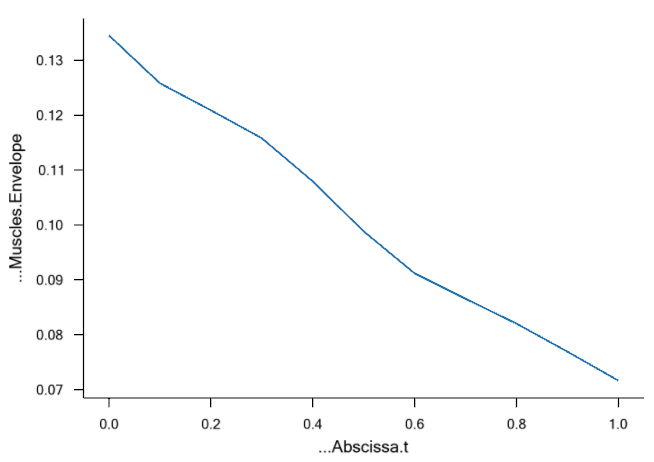

Lesson 4: Kinetics - Computing Forces
=====================================

With the kinematic analysis in place, we are ready to compute forces and
investigate ergonomic properties of the pedal arrangement. We shall
presume that the pedal is loaded by a spring, the force of which the leg
must overcome when stepping on the pedal. In this lesson, we will step
by step define the spring force and look at its effect on the leg.

A force can be added to any kinematic measure using the AnyForce class.
If the kinematic measure is a length (linear), then an AnyForce is a
force, and if it is an angle (rotational), the AnyForce automatically
becomes a moment. In the present case, we shall add the AnyForce to the
kinematic measure of the pedal's hinge (rotational). Let us initially
study the measure. Run the “Kinematics” analysis again, open an
AnyChart View, and browse your way through the tree to
Main.Study.Output.Model.Environment.HingeJoint.Pos. You should see the
following graph:

|Chart view HingeJoint.Pos|

The analysis runs in time from zero to one second, and the pedal angle
develops in this time from 100 degrees (1.74 rad) to 145 degrees (2.53
rad). Let us presume that the pedal is loaded by a linear spring that is
slack at 0 degrees and increases its moment linearly with the rotation
of the hinge. We might be wondering: What would be a comfortable spring
stiffness for a pedal like that? Not having much experience with pedal
design it might be difficult to imagine just how stiff the spring should
be, and we could find ourselves developing a series of hardware
prototypes with different springs and perhaps conducting subjective
investigations with test subjects.

Include pedal spring force
--------------------------

Let us do it with AnyBody instead. We shall start out by declaring an
AnyForce to play the role of the spring. Since this is not a part of the
body, it is logical to place it in the Environment.any file. Here's what
to add:

.. code-block:: AnyScriptDoc

     §AnyRevoluteJoint HingeJoint = {
       Axis = z;
       AnyFixedRefFrame &Ground = .GlobalRef;
       AnyRefNode &Pedal = .Pedal.Hinge;
     };
    
      AnyForce Spring = {
       AnyRevoluteJoint &Hinge = .HingeJoint;
       F = -0.0\*.HingeJoint.Pos;
     };§
    

The AnyForce contains a reference to the HingeJoint. Since the degree of
freedom in the HingeJoint is rotational, the force is as described above
turned into a moment and applied to the hinge. The specification of F is
the actual size of the load. We have made it proportional to the
HingeJoint.Pos, which is the hinge angle, and we have initially set the
spring stiffness to 0.0 (Nm/degree), to investigate the effect of having
no spring before we start adding a spring force. Notice, by the way, the
minus sign in front of spring constant. It has no importance now, but
when we start adding non-zero stiffness, it will signify that the spring
force goes against the angle, i.e. pushes back onto the foot.

Turn off default reaction forces
--------------------------------

There are just a couple of things we need to do before we can do the
InverseDynamicAnalysis operation and compute the forces: All the drivers
we added in the previous lesson have motors built into them. This means
that whatever force or moment is necessary to perform the movement will
be provided by the drivers, and there will be nothing for the muscles to
do. Motors in drivers are technically reaction forces, and they can be
turned off inside the driver. Let us open the “JointsAndDrivers.any”
file and do the following modifications:

.. code-block:: AnyScriptDoc

    AnyFolder Drivers = 
    {
      AnyKinEqSimpleDriver PelvisThoraxDriver =  
      {
        AnyKinMeasure& ref0 = ...HumanModel.BodyModel.Interface.Trunk.PelvisThoraxExtension;
        AnyKinMeasure& ref1 = ...HumanModel.BodyModel.Interface.Trunk.PelvisThoraxLateralBending;        
        AnyKinMeasure& ref2 = ...HumanModel.BodyModel.Interface.Trunk.PelvisThoraxRotation;   
        
        DriverPos = pi/180*{0,0,0};
        DriverVel = pi/180*{0,0,0};
        §Reaction.Type = {Off, Off, Off};§
      };
    
      AnyKinEqSimpleDriver NeckJntDriver = 
      {
        AnyKinMeasure& ref0 = ...HumanModel.BodyModel.Interface.Trunk.NeckJoint;
        
        DriverPos = pi/180*{0};
        DriverVel = pi/180*{0};
        §Reaction.Type = {Off};§
      };
      
      AnyKinEqSimpleDriver AnkleDriver = 
      {
        AnyKinMeasure& ref0 = ...HumanModel.BodyModel.Interface.Right.AnklePlantarFlexion;
        AnyKinMeasure& ref1 = ...HumanModel.BodyModel.Interface.Right.SubTalarEversion;
        
        DriverPos = pi/180*{0, 0};
        DriverVel = pi/180*{0, 0};
        §Reaction.Type = {Off, Off};§
      };
      
      AnyKinEqSimpleDriver KneeDriver = 
      {
        AnyKinLinear lin = 
        {
          AnyRefFrame& ref0 = Main.Model.Environment.GlobalRef;
          AnyRefFrame& ref1 = Main.HumanModel.BodyModel.Right.Leg.Seg.Thigh.KneeJoint;
          Ref = 0;
        };
        MeasureOrganizer = {2};
        DriverPos = {0};
        DriverVel = {0};
        §Reaction.Type = {Off};§
      };
      
      AnyKinEqSimpleDriver PedalDriver = 
      {
        AnyKinMeasure &ref0 = Main.Model.Environment.HingeJoint;
        DriverPos = pi/180*{100};
        DriverVel = pi/180*{45};
        §Reaction.Type = {Off};§
      };  
    };

And you should remove the additional reactions on the pelvis which are
created by the Human template. The purpose of these additional reactions
on the pelvis is to provide the necessary supports on the human pelvis
to run the inverse dynamics if users may not define enough support
forces on either both feet or pelvis. But because now this model has an
AnyStdJoint which is defined between the
Main.Model.Environment.GlobalRef.Hpoint and the pelvis segment, you
don’t need to use these additional reactions on the pelvis anymore. You
can remove them by commenting out the “Model\\Reactions.any” in the main
file like this:

.. code-block:: AnyScriptDoc

    ...
    AnyFolder Model = {  
        AnyFolder &HumanModel=.HumanModel.BodyModelWithDefaultDrivers;
        
        #include "Model\Environment.any"   
        
        AnyFolder ModelEnvironmentConnection = {
        #include "Model\JointsAndDrivers.any"
        §//#include "Model\Reactions.any"§
        };
    };
    ...

    

Adding muscles
--------------

There is one more thing we have to do: The human model has no muscles at
the moment. This can be corrected by a simple change of BM statements in
the main file:

.. code-block:: AnyScriptDoc

    //-->BM statements
    // Excluding the muscles in the trunk segments
    #define BM_TRUNK_MUSCLES §CONST_MUSCLES_SIMPLE§
    // Excluding the left arm segments
    #define BM_ARM_LEFT OFF
    // Excluding the right arm segments
    #define BM_ARM_RIGHT OFF
    // Excluding the left leg segments
    #define BM_LEG_LEFT CONST_LEG_MODEL_OFF
    // Using the right leg as 'TLEM' model
    #define BM_LEG_RIGHT CONST_LEG_MODEL_TLEM
    // Excluding the muscles in the right leg segments
    #define BM_LEG_MUSCLES_RIGHT §CONST_MUSCLES_SIMPLE§  
    // Excluding the default drivers for the human model
    #define BM_MANNEQUIN_DRIVER_DEFAULT OFF
    //<--

Investigating results
---------------------

Now, reload the model and run the RunApplication operation in the Model
Tree. The model should look like this:

|InverseDynamics_End|

Notice that the muscle forces are illustrated by the bulging of the
muscles. In the AnyChart view near the top of the tree, you can find the
“Main.Study.Output.Model.HumanModel.BodyModel.SelectedOutput.Right.Leg.Muscles.Envelope”.
It expresses the maximum muscle activation level among all the muscles
in the right leg. Plotting this property in the AnyChart View gives you
the following result:

|Chart view Muscles.Envelope|

Obviously holding the leg out in the air like that without the support
of a pedal spring and holding up the weight of the pedal as well
requires about slightly less than from about 9% to 6% of the leg’s
strength.

Now, let us study the effect of spring stiffness. We initially try:

.. code-block:: AnyScriptDoc

      F = §-10§*.HingeJoint.Pos;
    

This produces the following envelope curve:

|Chart view Muscles.Envelope 2|

Obviously, the level is lower now. The envelope is at around 2%, so the
spring really seems to help. This can make it easier for the operator to
control the pedal and thereby enhance the operability.

The completed model is available here:
:download:`PedalModel.zip <Downloads/PedalModel.zip>`.

The AnyBody Modeling System is all about making this type of
investigation easy. The mechanical model we have put together in four
simple lessons has a complexity worthy of a Ph.D. project if you develop
it bottom up. In AnyBody, this is a matter of a few hours of work when
using the predefined models of the repository.

.. |Chart view HingeJoint.Pos| image:: _static/lesson4/image1.png
   :width: 6.48125in
   :height: 3.89653in

.. |Chart view Muscles.Envelope 2| image:: _static/lesson4/image4.png
   :width: 4.81111in
   :height: 2.92431in