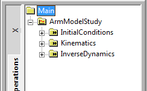

# Introduction: A Study of Studies

Studies and operations are AnyBody's mechanisms for specifying "things
to do to the model". The study is the “collector“, in the sense that a
study collects a model definition with the operations that executes the
model and the results to investigate afterwards. Operations are the
things you can do to the model; they can be executed from the AnyBody
interface and while they run output is generated and stored in the study
according to the function of the specific operation.

Why does AnyBody have studies? You might expect that you could just load
a model and then operations would simply be available in the AnyBody
interface. But why are studies then defined as special classes? Why do
you need to declare then manually in the model?

The reason to have studies as a special class is basically that you can
have multiple studies in the same model. Since studies become objects in
the model, there can be as many as you need (or your computer can manage
which is depending on the model size) and they do not need to comprise
(operate on) the same model definition even though they share elements.

A simple example of the usage of multiple studies is to perform to
different operations on the same model, or to perform the same operation
on almost equivalent models, and subsequently comparing the results.
With two studies, this can be done in a single AnyBody model.

Studies are derived from the base class called AnyStudy and the
operations you find inside the studies are also defined as class; all
derived from the base class AnyOperation.

AnyBody's family of study classes looks like this:

- AnyStudy (Base class for all studies)

  - AnyTimeStudy (Base class for time variation studies)

    - AnyMechStudyBase

    - AnyKinStudy

      - AnyMechStudy
      - AnyBodyStudy
      - AnyBodyCalibrationStudy

  - AnyDesStudy (design variable studies, see *a separate tutorial*)

In this tutorial, we shall focus on time varying studies and in
particular mechanical studies that deal with the analysis of mechanical
system. The other major branch of studies are design studies that deal
with variations of design parameters for instance as parameter studies
and even optimization. A special tutorial is however devoted to this
topic typically design studies will build on top of the analyses
performed by other studies, such as mechanical studies.

The mechanical studies (derived from AnyMechStudyBase) are all very
similar, except that they contain different sets of available
operations. The base class is empty; AnyKinStudy extents this with
functionality for kinematic analysis. AnyMechStudy further extents this
with kinetic (dynamic) analysis of basic mechanical systems.

AnyBodyStudy is the must frequently used study by AnyBody users, since
this study extents the kinematic analysis functions with operations for
kinetic (dynamic) analysis of musculoskeletal systems, i.e., the core
functionality of the AnyBody Modeling System. AnyBodyCalibrationStudy
contains assisting functionality in this regard.

AnyMechStudy1 and AnyBodyStudy1 are deprecated versions of AnyMechStudy
and AnyBodyStudy, respectively, and we shall not consider these any
further in this tutorial.

In this tutorial, we shall use AnyBodyStudy as starting point because of
its very central role in the system and for most users, and because it
contains almost collective set of the operations that are also found in
the other mechanical studies. Notice however that a special tutorial,
Inverse Dynamics of Muscle Systems, is devoted to topic of
musculoskeletal simulation, so we shall not go into details with this
here.

## The AnyBodyStudy and Studies in general

A study is really just a folder. It is a pair of braces between which
you can place some specifications. Whatever you put between the braces
becomes part of the study. As every object, a study has some predefined
properties that you either can set, must set, or cannot touch.

When you create a new model by means of the menus `File` -> `New from Template...`, the
system automatically inserts an AnyBodyStudy for you (please do it and
save the file under some relevant name). It looks like this:

```AnyScriptDoc
// The study: Operations to be performed on the model
AnyBodyStudy MyStudy = {
   AnyFolder &Model = .MyModel;
   Gravity = {0.0, -9.81, 0.0};
};
```

It contains all the things you formally need. Let's start with the last
line

```AnyScriptDoc
Gravity = {0.0, -9.81, 0.0};
```

The line assigns a value to the variable ‘Gravity’, which is a
specification of the vector of gravitational acceleration affecting the
model. The variable has no type definitions in front of it since it is a
predefined property of the AnyBodyStudy object. The system assumes that
you want to work with the y axis being vertical in space. If you prefer
otherwise, simply change the direction of Gravity to reflect your
choice. Please go ahead and load the model if you have not already done
it by pressing F7 or the  icon.

An AnyBodyStudy has many more predefined properties that you can play
with. You can get an overview of these using the Model Tree View, which
is attached to the left of the Main Frame. Double-clicking any object in the Model Tree
will show you properties of the objects in the Object Description dialog
box.

Most of the properties deal with solution methods, tolerances, and other
stuff that is necessary or handy for advanced users. For a description
of each property, please refer to the AnyScript Reference manual. A few
of the properties, however, are necessary to know even for casual users
and they are common for all mechanical studies:

| tStart | This is the time at which the study begins. In almost every case, this would be zero. Using a non-zero value of tStart is sometimes used to restrict the study to a subset of the time is was originally developed for or if the model is driven by measured data which does not begin at t = 0.                                                                                                                                                                                                                                                                                                         |
| ------ | -------------------------------------------------------------------------------------------------------------------------------------------------------------------------------------------------------------------------------------------------------------------------------------------------------------------------------------------------------------------------------------------------------------------------------------------------------------------------------------------------------------------------------------------------------------------------------------------------------- |
| tEnd   | Ah, you guessed it already. This is the time at which the study ends. Contrary to tStart, this often has to be set by the user. The standard value is tEnd = 1.0, and if you want your study to span any more or less time, you have to set tEnd manually. A very common modeling mistake is to define data-based drivers such as the AnyKinEqInterPolDriver with a time span exceeding the interval from 0 to 1 and then wondering why only a small part of the movement interval gets simulated. In this case, the user must manually specify tEnd to correspond with the end of the driver time span. |
| nStep  | AnyBody analyzes movement in discrete time steps, and nStep specifies how many steps the system should use to come from tStart to tEnd. The steps are equidistant, and since tStart is always the first analysis time, and tEnd the last, the interval gets divided into nStep-1 equal intervals. The default value is nStep=100, which for most purposes is a very fine resolution. If you have a large and time-consuming model, it might be a good idea to manually set nStep to a smaller number.                                                                                                    |

The first line of the study reads

```AnyScriptDoc
AnyFolder &Model = .MyModel;
```

Notice that the first word of that line is a type definition:
"AnyFolder". The predefined properties we have just discussed need no
type definition because the study already knows them. They are already
defined and merely get new values by the assignments we may specify. So
the type definition at the beginning of this line indicates that this
property is an addition to the study; something that was not known
already. This is an important point to understand about studies: You can
add almost anything to a study and the study does not need to know its
type in advance.

The significance of adding something to a study is that whatever you add
becomes a part of what the study executes. This particular line defines
a variable called "Model" and sets it equal to .MyModel. If you look at
the beginning of the AnyScript file, you will see that MyModel is really
the folder containing the entire model the system has generated for you
(we refer to it as .MyModel with a leading dot because it is one brace
up compared to where it is referenced from). This means that the entire
model comes under influence of the study. Instead of this line, we could
simply have pasted the entire contents of the braces defining the
MyModel in at this place, and in some sense, this is precisely what we
have done. The ampersand '&' in front of "Model" means that Model does
not get replicated inside the study. Instead, the '&' means that the
study merely contains a pointer to MyModel. The concept of pointers
should be very familiar to you if you have any experience in C, C++, or
Java programming. If not, simply think of a pointer as a handle to
something that's defined elsewhere. Whenever you access it, you are
actually handling what it is pointing to.

Instead of including the entire model, we could have chosen to point to
some of the sub folders of MyModel. This would mean that the study would
work on just a subset of the model, and it can be very relevant in some
cases. For instance, as mentioned earlier, you may want to compare to
almost identical models; in this case you can collect all common parts
in one folder and the distinctive parts in each separate folder and two
studies can easily be made with references to the common part and their
respective distinctive part. Special studies that are used to initialize
properties in the model, is also a case where it is indeed useful to be
able to point to parts of the model. Muscle property calibration is such
a case, which we shall look at in a special lesson of the {doc}`InverseDynamics of Muscle Systems tutorial </MuscleRecruitment/index>`.

## The elements of a study

When you define an AnyBodyStudy, regardless of what you include between
the braces of the study, the result is three standard operations that
appear in the study tree. They each represent something you can do to
the model elements the study is pointing at:

- Operation **InitialConditions** reads the values of whatever drivers
  you have included in the study and puts the model in the position of
  these drivers at time tStart. This is done in a multi-step process:
  The model is initialized into the initial positions from load time,
  and the kinematics is subsequently solved in a few steps. This is
  particularly useful for inspection of the specified initial positions
  when having problems with the initial configuration of the mechanism.
- Operation **Kinematics**. A kinematic analysis is a simulation of the
  movement of the model without calculation of any sort of forces. This
  means that you can run Kinematics as soon as you have the movement
  defined uniquely. You don't need any muscles in the model for this
  one.
- Operations **InverseDynamics**. This is a simulation of the forces
  involved in the given movement or posture and whatever can be derived
  from them. The InverseDynamics operation uses the Kinematics
  operation as a subroutine, so this requires a correctly defined
  movement or posture as well as the muscles or motors necessary to
  drive the model.

Each of these operations, when executed, assembles the output they
generate in the Output section under the study's tree.

## Running operations

You execute operations through the wide, narrow control pane that's
usually located at the bottom of the screen. This is usually referred to
as the Operation Window.



The lower portion of this pane is just the message window where the
system writes various messages and dumps object properties when you
double-click them as we did before with the entire study. The left of
the upper fields is a filtered version of the tree you can find on the
left side of just about any window in the AnyBody Modeling System.
Rather than presenting all the objects of the model, this tree only
comprises the studies. If you expand a study, you will find its
operations, which typically are: InitialConditions, Kinematics, and
InverseDynamics.

You pick an operation by clicking it once. This highlights its name, and
you can now execute it with the Run or Step buttons in the right hand
field. The "Run" button starts the study and it will run until it comes
to its end or encounters an error. Once you press the run button, it
changes its name to "Break", and pressing it in that state breaks the
current analysis process.

The "Step" button takes one step at a time. What a step is exactly
depends a little on the type of operation. For Kinematics and
InverseDynamics a step is one time step of the movement. For
InitialConditions, a step is one of the several distinct operations
necessary to put the model into its initial state. We shall return to
that subject in the next lesson.

The "Reset" button returns the model to its initial state after it has
gone through a sequence of time steps. You must press "Reset" before you
can rerun the model.

In the following lessons we shall look in more detail at the different
functionality in an AnyBodyStudy.

- {doc}`Lesson 1: Mechanical System Information <lesson1>`
- {doc}`Lesson 2: Initial Conditions <lesson2>`
- {doc}`Lesson 3: Kinematics <lesson3>`
- {doc}`Lesson 4: Inverse Dynamics <lesson4>`

We need a model with a bit more substance than the template we created
above. If you do not already have our trusted arm model stored
somewhere, {download}`please download it here <Downloads/arm2d.any>`, save it to your disk, and load it
into AnyBody.

:::{rst-class} without-title
:::

:::{seealso}
**Next lesson:** We are then ready to proceed to {doc}`Lesson1: Mechanical System Information <lesson1>`.
:::
