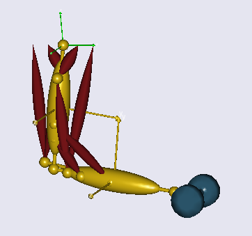
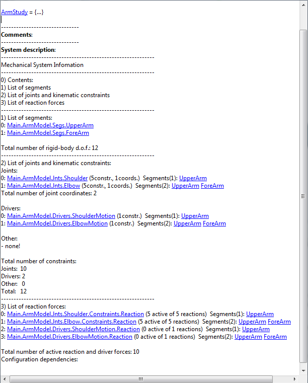
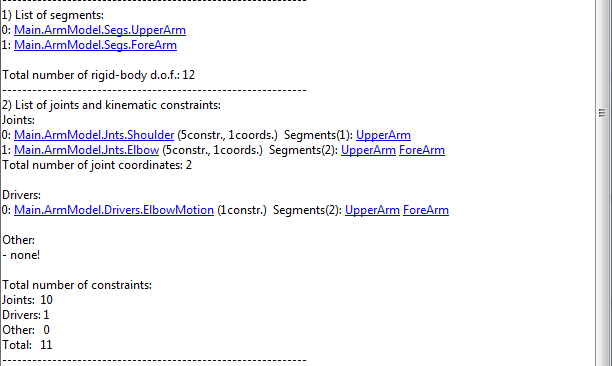
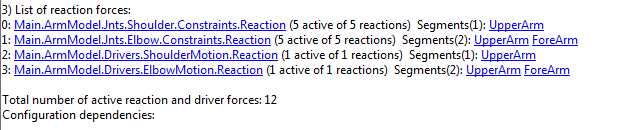

Lesson1: Mechanical System Information
======================================

In this lesson we are presuming that you have the arm2d.any file loaded
into AnyBody. If you do not have the model on file, please download and
save a copy from this link: *arm2d.any*. It should look like this when
you have loaded the model, run InitialConditions operation, and opened a
Model View:

|Dumbbel|

The mechanics of this model is fairly simple in the sense that it only
has two segments and two revolute joints. However, in more realistic
models with dozens of segments connected by many joints of different
types it can be very difficult to maintain the overview of the model.
Making a model move requires a balance between the number of kinematic
degrees of freedom and the number of constraints, and it can be
difficult to get it completely right.

This is where the systematic model information becomes important.
Mechanical studies are equipped with a mechanical system description.
This is included in the study’s Objects Description, which is found by
double-clicking the objects in any Model Tree View. Double-click the
ArmModel study folder in the loaded model and you will find a System
description like this:

|Study object description|

The Mechanical System Information is comprised of four sections: 0)
Contents, 1) List of segments, 2) List of joints and kinematic
constraints, and 3) List of reaction forces.

In a simple model like arm2d where all the segments are defined next to
each other, it might seem a little unnecessary to list all the segments,
but larger models typically have the segment definitions divided over
many different folders and files, and it can be helpful to see a
compiled list of all of them.

AnyBody models are always defined in three dimensions and a rigid
segment in three dimensional space has six degrees of freedom, i.e.,
three spatial movements and three rotations. Thus, the Mechanical System
Information multiplies the number of segments by 6 and reports the total
number of rigid-body degrees of freedom, in this case 2 x 6 = 12. To
enable the system to figure out where everything is in space we must
provide 12 constraints. This is what section 2) in the Mechanical System
Information is useful for. This section counts the kinematic
constraints. The sum of constraints must add up to the number of degrees
of freedom in the model, i.e., 12. You can see in the last line of the
section that this indeed the case. Further up we can see how the 12
constraints come about. 2 x 5 = 10 of them come from the two revolute
joints in the model for the shoulder and elbow. A revolute joint leaves
only one degree of freedom between the two reference frames it connects,
so it has five constraints. With two of these we have two degrees of
freedom left in the model because 12 - 2 x 5 = 2. These remaining
degrees of freedom after the joints have been added are also called the
joint coordinates. The remaining part of the section must specify this
number of additional constraints.

The usual way of providing constraints for the joint degrees of freedom
is by means of drivers. In our case we have simply added two drivers
directly to the two joints as the list shows. However, it does not have
to be like that. We have to provide as many constraints as we have joint
coordinates but the constraints need no address the joint coordinates
directly. For instance, we could also have driven the x and y
coordinates of a point on the forearm.

There is also a section called "Other". This is for constraints that are
neither any of the predefined joint types nor driver functions. Such
constraints are very frequent in more complex models because the
AnyScript language allows for user-defined joints and other constraints
to mimic complex behaviors movement patterns between different
joints. This, however, is an advanced topic that we shall postpone for
now.

The final section 3) lists the reaction forces. The fact that
the reaction and driver forces add up to the same number as the joints
and kinemaic constraints is no coincidence. In a straightforward model
like this one, joints usually provide the same number of reactions as
kinematic constraints. This is also how it is in real life in most
cases, because the mechanical joints we have in our surroundings enforce
their kinematic constraints by reaction forces. But it is not always
like that in the body. A knee, for instance, can roughly be approximated
as a hinge joint (many physiologists will disagree here) but the
internal load-carrying mechanisms in the knee are not like they are in a
mechanical hinge. Instead knee reactions are provided by a complicated
interplay between unilateral joint surfaces, ligaments, and muscles. So
AnyBody allows for the definition of joints that only provide kinematic
constraints but not the associated reaction forces. In fact, the system
also allows the opposite: Reaction forces without kinematic constraints.
For an in-depth discussion of some of these issues, please refer to the
:doc:`*tutorial on mechanical
elements* <../The_mechanical_elements/intro>`. For now, the
bottom line is that counting reactions can sometimes be tricky, and the
Mechanical System Information in Object Description is helpful in this
respect.

A few special cases are:

1. The number of reaction and driver forces is less than the number of
   rigid body degrees of freedom in the model as it is the case here.
   This leaves some reactions to be provided by other elements, and
   these elements are usually the muscles in the model.

2. If the number of reaction and driver forces is equal to the number of
   rigid body degrees of freedom, then the model is (usually) capable of
   balancing itself, and there is no use for muscles. In fact, if you
   add muscles to such a mechanism, the muscles will end up doing
   nothing.

3. If the model has more reaction and driver forces than rigid body
   degrees of freedom then it is statically indeterminate. This usually
   means that there is something wrong with the model. Mechanically it
   is equivalent to the model having multiple different ways of
   balancing itself and having no way of determining which the correct
   one is. Even though AnyBody is capable of computing the forces in
   such a model you will often find the solutions oscillating between
   the infinitely many possibilities between time steps. Models like
   these should in general be avoided.

Let us investigate what happens if we make some changes in the model.
Let us initially remove one of the drivers in the model leaving it
kinematically indeterminate:

.. code-block:: AnyScriptDoc

    AnyFolder Drivers = {
    
        //---------------------------------
        §//      AnyKinEqSimpleDriver ShoulderMotion = {
        //        AnyRevoluteJoint &Jnt = ..Jnts.Shoulder;
        //        DriverPos = {-100*pi/180};
        //        DriverVel = {30*pi/180};
        //        Reaction.Type = {Off};
        //      }; // Shoulder driver§
         
        //---------------------------------
        AnyKinEqSimpleDriver ElbowMotion = {
            AnyRevoluteJoint &Jnt = ..Jnts.Elbow;
            DriverPos = {90*pi/180};
            DriverVel = {45*pi/180};
            Reaction.Type = {Off};
        }; // Elbow driver
    }; // Driver folder

When you load the model again you will see the message:

Model Warning: Study 'Main.ArmStudy' contains too few kinematic
constraints to be kinematically determinate.

When you load the model, the system automatically discovers that there
seems to be less kinematic constraints than required. In this situation
it might not be possible to assemble the mechanism and it is almost
certainly not possible to run a kinematic analysis. Opening the Object
Description window, by double-clicking the ArmStudy folder, produces
this output:

|Object description, number of constraints|

The Mechanical System Information allows you to investigate in detail
how many constraints are missing and which ones they may be. Let us
shift the missing driver back in:

.. code-block:: AnyScriptDoc

    §//---------------------------------
    AnyKinEqSimpleDriver ShoulderMotion = {
      AnyRevoluteJoint &Jnt = ..Jnts.Shoulder;
      DriverPos = {-100*pi/180};
      DriverVel = {30*pi/180};
      Reaction.Type = {Off};
    }; // Shoulder driver§

    //---------------------------------
    AnyKinEqSimpleDriver ElbowMotion = {
      AnyRevoluteJoint &Jnt = ..Jnts.Elbow;
      DriverPos = {90*pi/180};
      DriverVel = {45*pi/180};
      Reaction.Type = {Off};
    }; // Elbow driver

... and try something else:

.. code-block:: AnyScriptDoc

    //---------------------------------
    AnyKinEqSimpleDriver ShoulderMotion = {
      AnyRevoluteJoint &Jnt = ..Jnts.Shoulder;
      DriverPos = {-100*pi/180};
      DriverVel = {30*pi/180};
      Reaction.Type = {§On§};
    }; // Shoulder driver

    //---------------------------------
    AnyKinEqSimpleDriver ElbowMotion = {
      AnyRevoluteJoint &Jnt = ..Jnts.Elbow;
      DriverPos = {90*pi/180};
      DriverVel = {45*pi/180};
      Reaction.Type = {§On§};
    }; // Elbow driver

What we have done here is to switch the reaction forces in the two joint
drivers on. This is equivalent to imbedding motors into the joints, and
it means that the system will obtain enough reaction forces to carry the
loads without help from any muscles, corresponding to the statically
determinate situation 2 listed above. Loading the model does not bring
about any warnings, but if you run the InverseDynamics operation you
will get the following message for each time-step

.. code-block:: none

    'ArmStudy':  The muscles in the model are not loaded due to kinetically over-constrained mechanical system.

And the Object Description window will give the following feedback:

|Object description, list of reaction forces|

indicating that the model is precisely statically determinate with 12 reactions
corresponding to the 12 rigid body degrees of freedom.

Having familiarized ourselves with the Mechanical System Information in
the Object Description of the study, let us proceed to Initial
Conditions in the :doc:`next lesson <lesson2>`.

.. rst-class:: without-title
.. seealso::
    **Next lesson:** :doc:`lesson2`.

