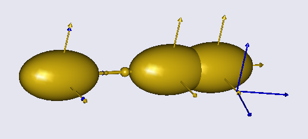
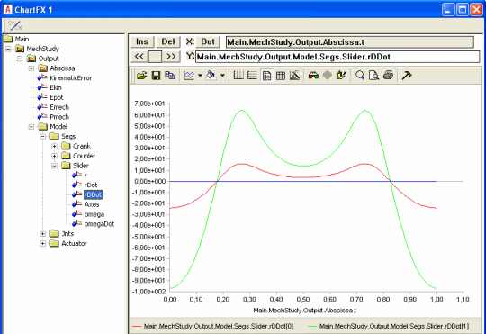
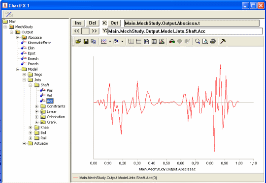
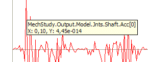

# Lesson 3: Kinematic Analysis

The Kinematics operation has a short and a very long explanation. The
short explanation is that it makes the model perform whichever movement
you have imposed on it by the drivers you have defined in the model. And
it only does the movement. There is no calculation of forces involved,
and the system does not even have to be properly balanced to be
subjected to the Kinematics operation. However, it does have to be
kinematically determinate, but that concept is definitely a part of the
longer explanation.

So, brace yourself, and let's venture on to...

:::{rst-class} html-toggle
:::

## The long explanation

An AnyBody model is really a collection of rigid segments. You can think
of them as a bunch of potatoes floating around in space. Technically,
each potato is called a "rigid body", but the term "body" can be
misinterpreted in the context of a body modeling system like AnyBody, so
we call them "segments".

When a segment flows around in space, it can move in six different
directions. We call them degrees of freedom and usually think of them as
movement along the three coordinate axes and rotation about the same
axes. We call these movement directions "degrees of freedom" and an
unconstrained segment in space has six degrees of freedom. If we have n
segments in the model, the model will have a total of 6n degrees of
freedom unless some of them are constrained somehow. The purpose of the
kinematic analysis is to determine the position of all the segments at
all times, and this requires 6n pieces of information about the
positions to resolve the 6n degrees of freedom. The pieces of
information are mathematically speaking equations. So kinematic analysis
is about solving 6n equations with 6n unknowns.

A usual way of constraining degrees of freedom (or adding equations to
the system) is to add joints to the model. When you join two segments
they lose some of their freedom to move independently. They become
constrained to each other. Consider two segments joined at their ends by
a ball-and-socket joint. They are now under the constraints that the x,
y and z coordinates of the joined points must be the same. In other
words, a ball-and-socket joint adds three constraints or three equations
to the system.

If you add enough joints to the system to provide all 6n constraints,
then it might be mathematically possible to solve the equations and find
the position of all the segments. But the result would not be very
exciting because the system would not be able to move. Usually a body
model will have enough joints to keep the segments together but few
enough to let the model move. After all, movement is what most higher
organisms do. So where do the remaining constraints or equations come
from? They are the drivers. When the joints have eaten up their part of
the degrees-of-freedom, enough drivers must be added to resolve the
remaining unknowns in the system up to the required number of 6n. When
the AnyBody Modeling System performs the Kinematics operation, these
drivers are taken through their sequences of values, and the positions
of all the segments are resolved for each time step by solving the 6n
equations.

When the model is set up in such a way that it has 6n equations and
these equations can be solved, then it is said to be kinematically
determinate. Usually this is necessary to perform the kinematic
analysis. We say "usually" because there are a few exceptions where the
system can be solved even when the number of equations is different from
6n. There are also some cases where the system cannot be solved even
though there are 6n equations available. Both cases are connected with
redundant constraints.

If you define two or more constraints that in some way constrain exactly
the same degrees of freedom in the same way, then they are redundant.
For instance, you might by mistake repeat the definition of a joint. You
will then have two joints that work exactly the same, and the equations
provided by those two joints will be redundant. You will see them when
you count constraints, but they will not have much effect.

The AnyBody Modeling System can sometimes cope with models that have too
many constraints as long as those constraints are not conflicting, i.e.,
some of them are redundant. But it is a good rule to make sure that you
have the same number of degrees-of-freedom and constraints.

If you have too many constraints and they are incompatible, then the
system is kinematically over-determinate. If you have too few
constraints, or some of the constraints are redundant, then the system
may be kinematically indeterminate. Both cases are likely to prevent the
Kinematics operation to complete.

Actually, even when you have a kinematically indeterminate system, the
Kinematics operation can fail. This is actually very easy to picture.
Sometimes the segments of the model may be configured such that they
cannot reach each other, or in such a way that they interlock. The real
world is full of that sort of mechanisms: Car doors that get stuck or
refuse to close, locks that will not unlock, or stacked glasses that
wedge inseparably into each other. Computer systems that model the real
world will have them too, and just like the real world it can sometimes
be difficult to find out what the problem is.

## Running kinematic analysis

Now that you know the basics of kinematic analysis, let us look at how
it is performed. We need an example to work on, and this one will serve
the purpose:
{download}`demo.SliderCrank3D.any <Downloads/Demo.SliderCrank3D.any>`

When you load it and open a {doc}`Model
View <../Interface_features/lesson3>` you will see that
this is a very simple mechanism comprising only three segments. They are
not yet connected correctly at their joints, but they will be if you run
the Kinematics operation. Go to the Study tree, pick Kinematics and
click the run button. You will see the model assemble and start moving.

The Kinematics operation is precisely an analysis. It assembles data
when it runs, and you can subsequently investigate those results in the
{doc}`Chart view <../Interface_features/lesson3>`. The kind of results you can get from
the Kinematics study is everything that has to do with positions,
velocities, and accelerations. You may expand the tree until you reach
the Slider segment, and you can chart its acceleration by choosing the
rDDot property.

Notice the naming of the positional properties: r is position, rDot is
velocity, and rDDot is acceleration. "Dot" or "DDot" are reflections of
the mathematical custom of designating differentiation with respect to
time by a dot over the symbol. So velocity would be 'r' with a dot over,
and acceleration would be 'r' with two dots. Try browsing around the
tree and look up the various available data.

You may encounter some strange looking results like this one:

Why would anything in a smoothly running model behave like this? The
answer lies in the ordinate axis. You will notice that it has no values
on it, and if you hold the mouse over a point on the curve a small
window will pop up and show you the value:

You can see that the value is 4.45e-14. For all practical purposes this
is zero, and this is also why there are no values on the ordinate axis.
What you see here is really zero augmented by numerical round-off
errors.

## Final remarks

Notice that kinematic analysis determines velocities and accelerations
in addition to positions. The position analysis is by far the more
challenging because the equations are nonlinear, whereas solution for
velocity and acceleration involves linear equations once the positions
have been determined. Please notice also that due to the very general
approach used by the AnyBody Modeling System, it handles closed
kinematic chains. This is crucial in biomechanics where closed chains
occur very frequently, for instance in bicycling, gait, and whenever the
model grabs something with both hands.

Although the kinematic analysis is useful in its own right for lots of
purposes, it is also the first step of the InverseDynamics operation,
the subject of {doc}`the next lesson <lesson4>`.

:::{rst-class} without-title
:::

:::{seealso}
**Next lesson:** {doc}`lesson4`.
:::
