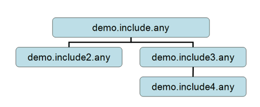

Lesson 2: Using Include Files
=============================

If you have any sort of experience with C or C++ programming, then the
concept of include files will be very familiar to you. The idea behind
include files is very simple: You divide one long file into several
smaller ones. This is primarily useful, if the division into smaller
files is based on some logical principle. Simple as it may be, it
enables some pretty neat model structures that can really help your
work.

Usually, the structure of files in a model is such that one file is the
main file (containing the Main folder), and the main file contains
statements to include other files. An include file can include other
files and so on.

Consider, for instance, the case of one very large AnyScript model. If
you have the model in a single .any file, then it may be difficult to
locate a particular muscle or another element that you are looking for.
Instead, you could choose to put all the muscle definitions into a
separate file. At the position in the main file where you removed the
muscle information, you simply add a statement to include the new muscle
file called muscles.any. The statement could look like this:

.. code-block:: AnyScriptDoc

    #include "muscles.any"
    

Notice the leading # symbol. It signifies that this is a macro
statement, and it is the only type of statement in AnyScript that does
not require a semicolon in the end. This is because the statement is not
formally a part of the AnyScript language. It is something that is
processed before the actual model is parsed.

When the system loads the model and reaches the include statement, it
simply reads the include file, and subsequently continues reading the
main file. It is a very simple principle, but it does have some
interesting implications:

-  You can divide large models into smaller and more manageable chunks

-  You can create blocks of data that are easy to re-use in your model.
   Simply put the data in a file and include that same file several
   times at different positions in your the main file. For instance, if
   you have modeled two arms, you might want to use the same set of
   muscles for both of them. In that case, create one file containing
   the muscles and include it twice.

-  You can create libraries of files containing elements you often use
   in your modeling tasks, and when you build a new model much of the
   work is accomplished simply by including the files you have made
   previously. It is much like constructing models from larger building
   blocks.

The principle of include files in demonstrated in the following four
interconnected files:

-  :download:`*demo.include.any* <Downloads/demo.include.any>` (the main file)

-  :download:`*demo.include2.any* <Downloads/demo.include2.any>`

-  :download:`*demo.include3.any* <Downloads/demo.include3.any>`

-  :download:`*demo.include4.any* <Downloads/demo.include4.any>`

|Include tree|

Right-click the files and save them in a directory of your choice. Then
start AnyBody and load the main file, demo.include.any.

.. rst-class:: without-title
.. seealso::
    **Next lesson:** :doc:`lesson3`.

