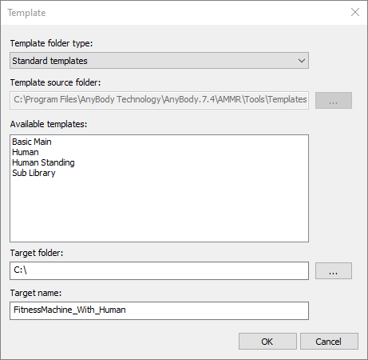
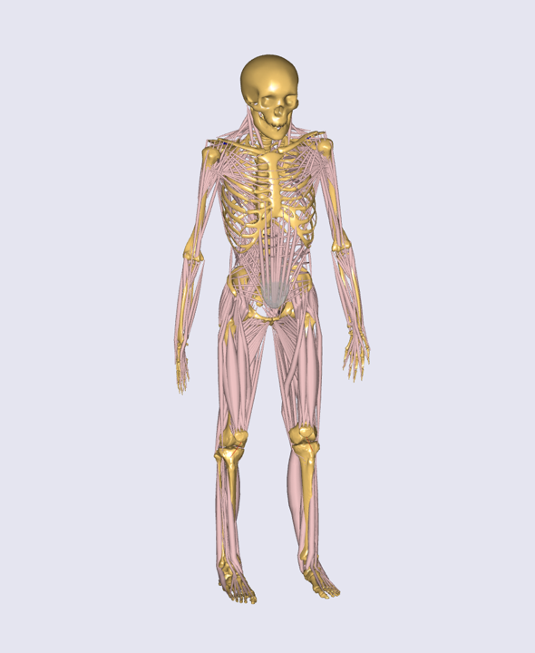
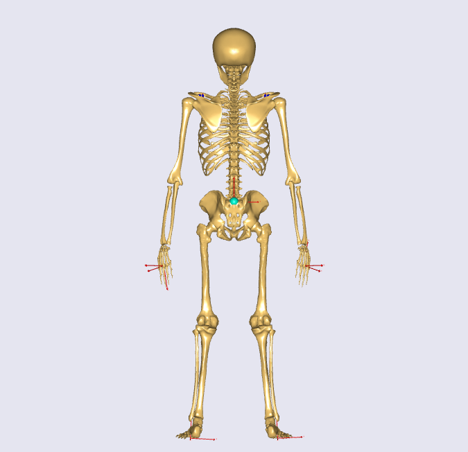
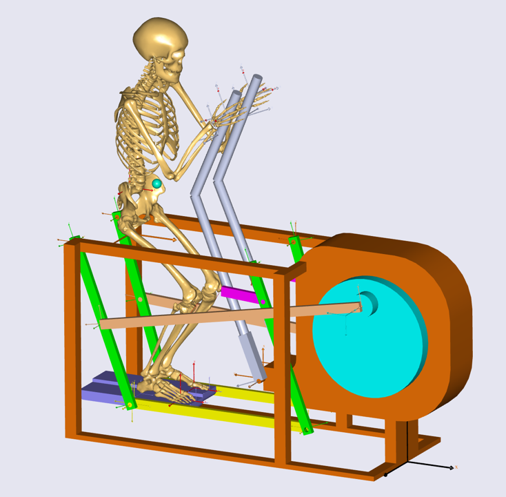
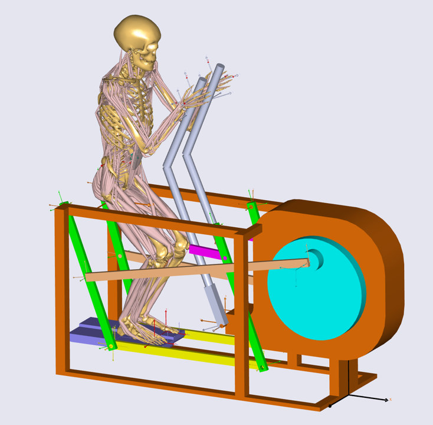

# Creating human-machine integrated analysis model

If you did not finish the previous lesson, please download the
{download}`FitnessMachine\_Mate\_Config3.zip <Downloads/FitnessMachine_Mate_Config3.zip>` file in order to get the correct set of files for starting this lesson.

In this lesson, we will create a model with a human body using a
template; we will add the fitness machine created in the previous lesson
and then connect the human body to the fitness machine.

## Create a human model from a main file template

First, let us start a new human model from a template which we will call
‘FitnessMachine_With_Human’ using the main file template menu from the
AnyBody GUI.



After we create the model, we should make sure that the definitions in
the libdef.any files are set to use the right body model as explained in
the tutorial ‘Getting Started with AMMR’. When we load this model, we
can see that we have a standing full human body model.



To keep things simple, start by switching off the muscles by setting the
BM statement for the muscle definitions of arms, legs and trunk in our
new created file ‘FitnessMachine_With_Human.main.any’ to
`_MUSCLES_NONE_`:

```AnyScriptDoc
#include "../libdef.any"

Main = 
{  

  // Body Model configuration:
  #include "Model/BodyModelConfiguration.any"

  // Using your own Mannequin.any file in the Model folder of your model
  #include "Model\Mannequin.any"

  // Switch off all muscles of the body model
  §#define BM_LEG_MUSCLES_BOTH _MUSCLES_NONE_
  #define BM_TRUNK_MUSCLES _MUSCLES_NONE_
  #define BM_ARM_MUSCLES_BOTH _MUSCLES_NONE_§

  // Include default human model
  #include "<ANYBODY_PATH_BODY>\HumanModel.any"
  ...
```

Next, we will equip the model with a center of mass (CoM) of the human model.
For this we must add an extra virtual segment that follows the CoM. We will make
the virtual segment massless, since it is not a real segment. We use the CoM
measure (AnyKinCoM) to drive this dummy segment. The code for doing this is
prepared in {download}`CoM\_View.any <Downloads/CoM_View.any>`. This kind of CoM
segment can be used not only for visualization, but also for kinematic
constraints of the human model.

Furthermore, we will extend the human model with reference frames
attached to the human segments for interfacing with the machine. This
will of course be done at the hands and feet, but also at the pelvis,
which we may want to control. We add nodes (AnyRefNode) at the palms of
the hands, the toes of the feet and at the center of the pelvis. Please
see {download}`HumanRefNodes.any <Downloads/HumanRefNodes.any>`.

Please save these files in the Model subfolder and let us edit the main file 
in order to include these additional AnyScript files like this:

```AnyScriptDoc
 AnyFolder Model = 
  {
    // A link to the human model
    AnyFolder &BodyModel = .HumanModel.BodyModel;
    AnyFolder &DefaultMannequinDrivers = .HumanModel.DefaultMannequinDrivers;

    // Definition for CoM(Center of Mass) of Human Model
    §#include "Model\CoM_View.any"§

    // Definition of additional AnyRefNode object in the human model
    §#include "Model\HumanRefNodes.any"§
  ...
  };
```

If you reload the model, then you will see the dummy CoM segment and
some AnyRefNode objects like this:



## Insert the fitness machine into the model

We are now ready to include the fitness machine. The first step is to
copy the fitness machine we created in the previous lesson to the Input
subfolder of our model. Next, we will add the fitness machine to the
model by including the ‘FitnessMachine.any’ file again. You should put
all the files (including FitnessMachine.any file) from the previous
lesson into the Input subfolder of your model which is created by the
template. In addition, we will modify the predefined AnyBodyStudy object
like we did in Lesson 2 to prepare for an actual dynamic analysis.

```AnyScriptDoc
  AnyFolder Model = 
  {
    // A link to the human model
    AnyFolder &BodyModel = .HumanModel.BodyModel;
    AnyFolder &DefaultMannequinDrivers = .HumanModel.DefaultMannequinDrivers;

    // Definition for CoM(Center of Mass) of Human Model
     #include "Model\CoM_View.any"

    // Definition of additional AnyRefNode object in the human model
    #include "Model\HumanRefNodes.any"

    // AnyScript file for the fitness machine from SolidWorks
    §#include "Input\FitnessMachine.any"§

    // Environment files are used to include objects surrounding human
    #include "Model\Environment.any"

    AnyFolder ModelEnvironmentConnection = 
    {
      //'JointsAndDrivers.any' file can include all kinematic constraints such as joints and drivers
      #include "Model\JointsAndDrivers.any"
      // Additional reactions which are required to run the inverse dynamics analysis
      #include "Model\Reactions.any"
    };
  };

  AnyBodyStudy Study =
  {
    AnyFolder& Model = .Model;

    Gravity = {0, -9.81, 0};
    §tStart = 0;
    tEnd = 1; §
    nStep = §61;§
    // Overdeterminate solver is needed while using the 
    // soft default mannequin drivers.
    Kinematics.SolverType = KinSolOverDeterminate;
    InitialConditions.SolverType = Kinematics.SolverType ;
  };
```

Similar to the previous lesson, we will add a driver for the fitness machine to
make the model kinematically determinate. To do this, we can use the
{download}`MachineOperation.any <Downloads/MachineOperation.any>` file which
defines the drivers we created in Lesson 2.

```AnyScriptDoc
AnyFolder MachineOperation =
{
    AnyVar T_period = 1.0;
    AnyVar angular_vel = 360.0 / T_period;
    AnyVar phase_offset = 0;

    AnyKinEqSimpleDriver Rotation_Drv =
    {
        AnyRevoluteJoint& jnt = Main.Model.FitnessMachine.Mates.Hinge_MainCylinder;
        DriverPos = {.phase_offset};
        DriverVel = pi/180*{-.angular_vel};
        Reaction.Type = {Off};
    };

    AnyForce ResistanceTorque =
    {
        AnyVar coeff_term = 85;
        AnyVar const_term = coeff_term;
        AnyRevoluteJoint& jnt = Main.Model.FitnessMachine.Mates.Hinge_MainCylinder;
        F = {coeff_term * sin(jnt.Pos[0]*2+pi/2) + const_term};
    };
};
```

We will copy this file to the Model subfolder of our model and include it
into our model.

```AnyScriptDoc
AnyFolder Model = 
  {
    // A link to the human model
    AnyFolder &BodyModel = .HumanModel.BodyModel;
    AnyFolder &DefaultMannequinDrivers = .HumanModel.DefaultMannequinDrivers;
    
    // Definition for CoM(Center of Mass) of Human Model
    #include "Model\CoM_View.any"

    // Definition of additional AnyRefNode object in the human model
    #include "Model\HumanRefNodes.any"
    
    // AnyScript file for the fitness machine from SolidWorks
    #include "Input\FitnessMachine.any"
 
    // Environment files are used to include objects surrounding human
    #include "Model\Environment.any"   
 
    AnyFolder ModelEnvironmentConnection = 
    {
      //'JointsAndDrivers.any' file can include all kinematic constraints such as joints and drivers
      #include "Model\JointsAndDrivers.any"
      // Additional reactions which are required to run the inverse dynamics analysis
      #include "Model\Reactions.any"
      // Include drivers of the fitness machine
      §#include "Model\MachineOperation.any"§
    };
  };
```

Notice that the drivers have been placed in a separate folder called '
ModelEnvironmentConnection'. This is a typical setup used in most
models.

When we now load the model, we will see that our human is positioned forward of the
machine. We need to change his position so it is relative to the fitness machine. 
We do this by changing the mannequin of the model. Since we do not want to
spend too much time positioning the human model in this tutorial, we
will use the file {download}`Mannequin.any <Downloads/Mannequin.any>`. Copy the file to the Model subfolder
to overwrite it.

When we now load the model and run the Kinematics, we will see that out
human is located on the fitness machine and the machine is moving. Now,
the only thing missing is to connect our body model to the machine.

## Connecting human model and fitness machine

The first thing we have to do to connect our human with the machine is
to undefine the default drivers of the human model. We do this by
setting a BM statement in the Main folder:

```AnyScriptDoc
#include "../libdef.any"

Main = 
{  

  // Body Model configuration:
  #include "Model/BodyModelConfiguration.any"

  // Using your own Mannequin.any file in the Model folder of your model
  #include "Model\Mannequin.any"
  
  // Switch off all muscles of the body model
  #define BM_LEG_MUSCLES_BOTH _MUSCLES_NONE_
  #define BM_TRUNK_MUSCLES _MUSCLES_NONE_
  #define BM_ARM_MUSCLES_BOTH _MUSCLES_NONE_
  // Switch of the default drivers
  §#define BM_MANNEQUIN_DRIVER_DEFAULT OFF§

  // Include default human model
  #include "<ANYBODY_PATH_BODY>\HumanModel.any"
   ...
```

When you load this model, you will see the following warning message:

```none
Model Warning: Study 'Main.Study' contains too few kinematic constraints to be kinematically determinate.
```

If you look at the Object Description of your AnyBodyStudy object, you
can find the information about the number of DOFs and constraints of the
model.

```none
Total number of rigid-body d.o.f.: 414
Total number of constraints:
Joints: 264
Drivers: 98
Other: 10
Total: 372
```

This means that we are missing 42 constraints. These were the degrees
of freedom released when we removed the default drivers.
This implies that the AnyBody human model contains 42
degrees of freedom. So we have to define 42 other constraints for the human
model.

The AnyExp4SOLIDWORKS translator searches for user-defined reference
entities with a certain prefix. You select the prefix in the options
dialog for the translator. We will use some of these reference systems
for interfacing. In this model you can find this information in the
‘FitnessMachine.any’ file or simply in the Model Tree of the loaded
model.

```AnyScriptDoc
AnyFolder FitnessMachine =
{
  AnyKinEqType _ANY_CTYPE_ = Hard;

  AnyFolder _ANY_INTERFACE_ =
  {
    //LIST OF USER-DEFINED REFERENCE COORDINATE SYSTEMS
   § AnyRefFrame& Pedal___1____ANY_TOE1 = .Pedal___1.ANY_TOE1;
    AnyRefFrame& Pedal___1____ANY_CENTER = .Pedal___1.ANY_CENTER;
    AnyRefFrame& Pedal___1____ANY_TOE2 = .Pedal___1.ANY_TOE2;
    AnyRefFrame& Pedal___2____ANY_TOE1 = .Pedal___2.ANY_TOE1;
    AnyRefFrame& Pedal___2____ANY_CENTER = .Pedal___2.ANY_CENTER;
    AnyRefFrame& Pedal___2____ANY_TOE2 = .Pedal___2.ANY_TOE2;
    AnyRefFrame& ANY_LEFT_HAND1 = .Handle___1.ANY_LEFT_HAND1;
    AnyRefFrame& ANY_LEFT_HAND2 = .Handle___1.ANY_LEFT_HAND2;
    AnyRefFrame& ANY_RIGHT_HAND1 = .Handle___2.ANY_RIGHT_HAND1;
    AnyRefFrame& ANY_RIGHT_HAND2 = .Handle___2.ANY_RIGHT_HAND2;
    AnyRefFrame& ANY_PELVIS = .MainBase___1.ANY_PELVIS; §
    //LIST OF USER-DEFINED REFERENCE COORDINATE SYSTEMS
  };
```

Now we will create the missing 42 constraints to govern the motion.

We shall prepare this as a separate AnyScript file, which we will name
‘JointsAndDrivers.any’. You can download this file here:
{download}`JointsAndDrivers.any <Downloads/JointsAndDrivers.any>`. And put it into
the Model subfolder of your model folder to overwrite. Starting from the bottom
of the human (the top of the file) the constraints applied are as follows:

- Feet are fixed to the pedals, though with a unilateral force normal to the pedal, since the feet are not “glued” to the pedal.
- Hip abduction is fixed at its initial condition value.
- Pelvis is constrained to the fitness machine with a cylindrical joint along the vertical axis.
- Pelvis thorax angles are driven to their initial condition values.
- Neck rotation angles are driven to their initial condition values.
- The sterno-clavicular joint angles are fixed at their initial condition values (however, if the shoulder rhythm is used, this driver is excluded).
- Glenohumeral abduction is fixed at its initial condition value.
- Hands are fixed to the handles.

In this JointAndDrivers.any file, you will see that only the connections
at the hands and feet have reaction types set to ‘On’. The other
constraints are just for kinematics, i.e. the voluntary motion, which is
not associated with any reaction forces; this motion is kinetically
produced by the muscles of the human.

Finally, we should remove the supporting reaction forces and moments at
the hip segments because this model now has enough supporting forces
and moments at hands and feet. You can simply just comment out the
“Reactions.any” file as follows:

```AnyScriptDoc
...
    AnyFolder ModelEnvironmentConnection = 
    {
      //'JointsAndDrivers.any' file can include all kinematic constraints such as joints and drivers
      #include "Model\JointsAndDrivers.any"
      // Additional reactions which are required to run the inverse dynamics analysis
     § //#include "Model\Reactions.any"§
      // Include drivers of the fitness machine
      #include "Model\MachineOperation.any"
    };
...
```

Now you can load the model, and if you run the “InitialConditions” or
the “Kinematics” operation of the AnyBodyStudy object, you will see that
all drivers and constraints are ready for analysis and that the motion
appears reasonable.



The final task is to switch on the muscles of the human body again by
commenting out the body model statements that we introduced in the
beginning of this lesson.

```AnyScriptDoc
#include "../libdef.any"

Main = 
{  

  // Body Model configuration:
  #include "Model/BodyModelConfiguration.any"

  // Using your own Mannequin.any file in the Model folder of your model
  #include "Model\Mannequin.any"

  // Switch off all muscles of the body model
  §//#define BM_LEG_MUSCLES_BOTH _MUSCLES_NONE_
  //#define BM_TRUNK_MUSCLES _MUSCLES_NONE_
  //#define BM_ARM_MUSCLES_BOTH _MUSCLES_NONE_§
  // Switch of the default drivers
  #define BM_MANNEQUIN_DRIVER_DEFAULT OFF

  // Include default human model
  #include "<ANYBODY_PATH_BODY>\HumanModel.any"
...
```

Now you are ready to run the “InverseDynamics” operation, which should
now run successfully.



The final version of this model file can be downloaded here:
{download}`‘FitnessMachine\_With\_Human.zip’ <Downloads/FitnessMachine_With_Human.zip>`.
