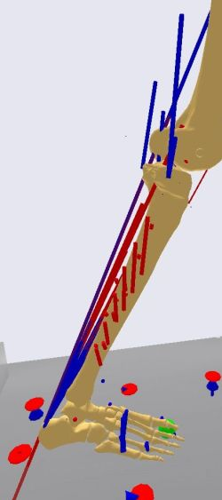
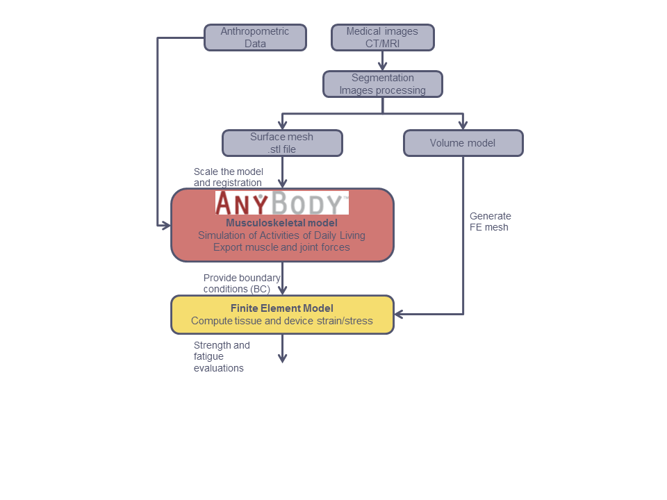

Finite Element Analysis Interfacing
===================================

.. toctree::
   :hidden:

    Lesson 1 <lesson1>
    Lesson 2 <lesson2>
    Lesson 3 <lesson3>

Applications in orthopedic and trauma biomechanics often require
information on the internal forces in the body parts. Therefore,
frequently Finite Element Analysis (FEA) is utilized to compute stresses
and strains in the tissues.

Essential to get reliable, meaningful results out of this are realistic
boundary conditions (BC). Force-wise these BCs are composed from
external loadings, dynamic forces and the corresponding muscle
activations for the given situation. As the AnyBody Modeling System
(AMS) is capable of providing these forces (an image visualizing this is
shown to the below) it seems to be straight forward to use this data as
input to a FEA.

|FEAtutorialTibiaForceMomentVisual|

A typical workflow of such FEA with loads estimated by AnyBody is
summarized in the figure below. Typically, a surface and a volume model
is created based on medical images (CT or MRI scans) using image
processing and segmentation methods available in various software
packages. Based on the volume model, a FE model can be generated. In
this tutorial, we shall assume that you are familiar with methods for
segmentation and FE mesh-generation and we shall focus on how to
transfer computed forces from the AMS to the FE code.

|FE flow chart|

Based on the segmented bone surface, also used to generate the FE mesh,
one can derive parameters used to scale the generic AnyBody model for a
suitable fit the actual scanned subject. It is also beyond the scope of
this tutorial to consider these details, but let us just notice that
this can be done at many different levels of accuracy depending on the
resources and data available. An STL file from the segmentation of the
bone can be useful in this process and scaling can be done, for
instance, based on bony landmarks of the bone. The STL file can also be
imported into AnyBody model for visualization, but this alone will not
change the musculoskeletal system if you don’t change the model
definition). Please refer to the tutorial on
:doc:`Scaling <../Scaling/intro>` for details on this matter.

A registration of the coordinate system used in the FE mesh, i.e., the
scanned configuration, to the coordinate system of the bone in AnyBody
is naturally needed for transferring the load data properly. We shall
just touch briefly upon this issue, showing how you can deal with
different coordinate systems. However, the examples, you find in the
lessons of this tutorial, are typically using FE meshes based on
geometries from the generic AnyBody models in AMMR; thus, scaling and
registration is not a relevant issue.

The boundary conditions consist of the applied loads (exported from
AnyBody) and fixation conditions. The loads exported from AnyBody should
include all loads on the bones, including reactions to applied external
and muscle loads, i.e. the joint loads and this should in principle be
sufficient for loading the FE model. The exported loads do provide a
situation of equilibrium between all forces in the AnyBody model;
however, this includes all inertia forces as well and these is not
easily to apply to a FE model of a bone. The bone is just a part of a
segment in the rigid-body concept in AnyBody models, where the segment
inertia also includes the soft tissues surrounding the bone. Neglecting
parts of the inertia in FE bone model and maybe all accelerations, we
will not have a situation of equilibrium. Therefore, we need to apply
proper fixation BCs to accommodate for this. This will also remove
issues of singular stiffness matrix, in standard static analyses.

In the following tutorial, it is shown how AnyBody can be used to
analyze the stress state of bones. In the first lesson, the built-in
facilities of AnyBody to generate output for a FEA are explained in
general. A simple example is included, which shows all the steps from
the AnyBody application to the nice colored Finite Element stress
plots. We will briefly go through the following steps:

- Generate a force output file from AnyBody

- Export the bone surface from AnyBody

- Mesh the bone

- Apply material description and boundary conditions

- Solve the Finite Element Model

In the first showcase freely available software is used to generate
the mesh and solve the problem. Therefore, also users without access
to a commercial FEA software package can step through it. But
obviously there are plenty of possibilities on the market to do FEA
and this example should just illustrate the flow of the task, without
claiming to do high-end FEA.

The following lessons consider interfaces to selected commercial FE
packages, Ansys and Abaqus. In these cases, small interface tools are
applied to automatically convert the standard load output file from
AnyBody to formats directly readable by the FE packages.

Now it's time for :doc:`Lesson 1: Export of data for FEA. <lesson1>`

