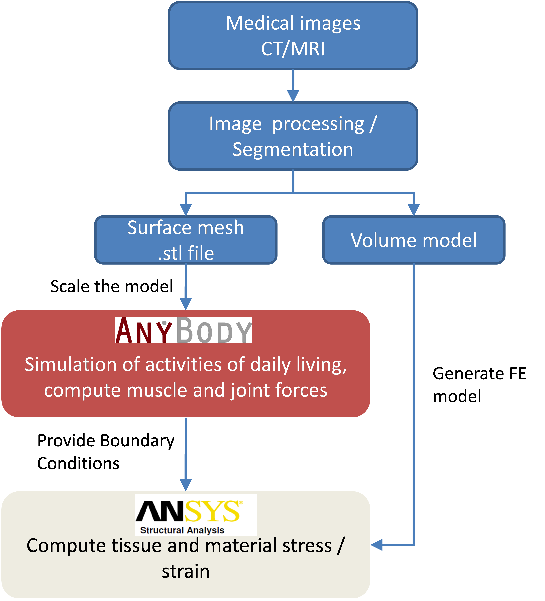
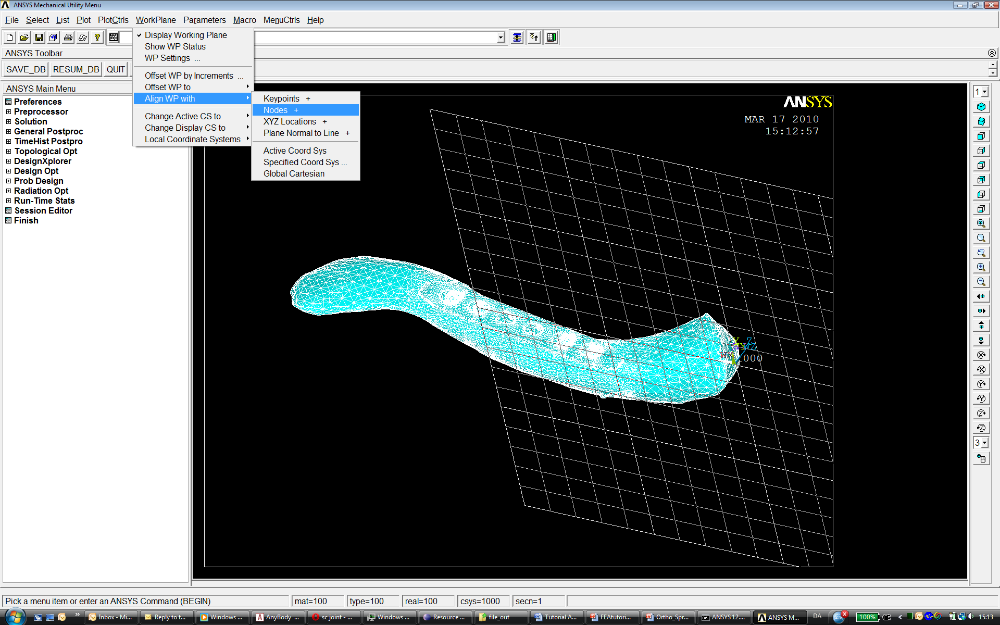
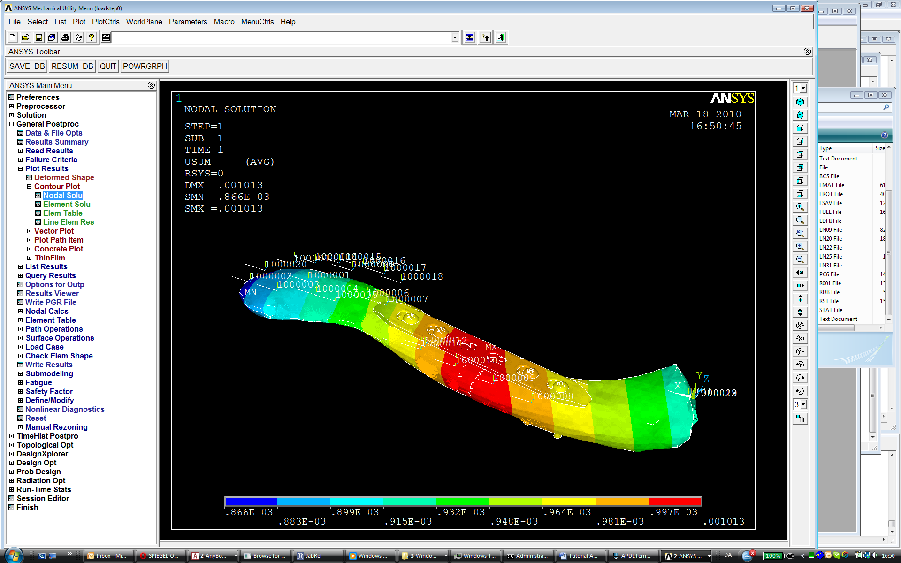

% Disable inline anyscript highlighting.

```{highlight} none
```

# Lesson 2: ANSYS Interface

This chapter shows how to use AnyBody features to apply boundary
conditions to a Finite Element Model generated in ANSYS. This is current
work in progress; we assume the workflow will be even smoother in the
future. You need an additional add-on to the AnyBody Modeling System to
run this tutorial. This is needed to convert the AnyBody output to ANSYS
APDL code. Please get it from the 
[AnyBody Technology webpage](https://www.anybodytech.com/resources/customer-downloads#fe-interface-tools).

The model we will have a look at is a clavicle midshaft fracture. We
will analyze the muscle forces acting on the clavicle during lifting his
arm and analyze the stress in the implant. The standard Standing model
taken from the AMMRV1.1 will be used. The basic general workflow is
shown the figure below.



Here we will focus on the link between AnyBody and ANSYS. So we assume
we have a “ready to go” Finite Element model which basically only lacks
its boundary conditions. *(This model could be e.g. generated from
medical image data. The AnyBody model has to be scaled to fit to the
actual case (it can be beneficial to import the .stl file of the bone in
question into the AMS to scale the model accordingly. Please note, the
bone will not actually change the musculoskeletal system if you don’t
change the model definition). Please refer to scaling tutorial for
details on this matter.)*

In this tutorial we will use a bone derived from a standard scaled
AnyBody model, so no scaling has to be applied here.

Let’s start with the AnyBody part. We have to make sure the two models
in the two systems are aligned. The idea is to include local reference
frames in both systems which will be used for all further data transfer.
Open the Standing model from the AMMRV1.1, or better make a copy of the
whole model folder and use this one. For convenience we will reduce the
model detail by excluding the left arm and switching off the muscles in
all body parts, except the right arm. This is done in the
BodyPartsSetup.any file. Next we define the local ref frame on the
clavicle. All forces will be later exported with respect to this
coordinate system. You can either use a pre-defined reference system in
the AMS or create a new one. The following lines create a new node
located in the Sternoclavicular joint:

```AnyScriptDoc
AnySeg &RiArm = Main.HumanModel.BodyModel.Right.ShoulderArm.Seg.Clavicula;
RiArm ={
    AnyRefNode localrefframe={
    sRel = {0,0,0};
    // ARel = RotMat(0.5*pi,x);
    AnyDrawRefFrame drws = {ScaleXYZ = {1,1,1}*0.3;RGB={0,0,1};};
};
```

Include them e.g. in the Environment file. After reload of the model the
reference frame is shown


Next, we have to define the same local coordinate system in the ANSYS
model. Download the prepared ANSYS file
{download}`here <Downloads/clavicular_base.zip>` and save it in your working
directory. In the Mechanical APDL (ANSYS) environment (ANSYS Classic), a
simple way to do so is to modify the location of the work plane. Once
the work plane is in place create a local coordinate system at the
workplane origin and give it the number 1000. (In fact you can give it
any number, but we have to refer to the coordinate system later, so we
have to know its name). Load the `clavicular_base.db` in the Mechanical
APDL (ANSYS) environment and have a look.



This shows the clavicle model, which contains a midshaft fracture,
modeled with a reduced stiffness and treated with a plate fixation.

Next we want to analyze the forces in the AMS. Change the Mannequin file
to create the desired motion. We want to analyze a simple lifting case,
so all we specify is flexion in the shoulder joint. Open the Mannequin
file and look for the PostureVel folder. Change the Glenohumeral flexion
value to 150/Main.Study.tEnd, this determines the joint velocity
necessary to reach 150 degree flexion taking into account the simulation
time.

```AnyScriptDoc
AnyFolder Right = {
    //Arm

    AnyVar SternoClavicularProtraction=0; //This value is not used for initial position
    AnyVar SternoClavicularElevation=0; //This value is not used for initial position
    AnyVar SternoClavicularAxialRotation=0; //This value is not used for initial position
    AnyVar GlenohumeralFlexion =150/Main.Study.tEnd;
```

We also want to alter the initial starting position for the motion,
enter the Posture position folder and make the changes indicated below.

```AnyScriptDoc
AnyFolder Right = {
    //Arm
    AnyVar SternoClavicularProtraction=-23; //This value is not used for initial position
    AnyVar SternoClavicularElevation=11.5; //This value is not used for initial position
    AnyVar SternoClavicularAxialRotation=-20; //This value is not used for initial position
    AnyVar GlenohumeralFlexion =0;
    AnyVar GlenohumeralAbduction = 7;
    AnyVar GlenohumeralExternalRotation = 0;
    AnyVar ElbowFlexion = 5.0;
    AnyVar ElbowPronation = -60.0;
```

We want this motion to be done in 10 seconds and analyze 5 time steps.
This can be set in the main file. Search the Study folder and change the
end time of the study to 10 seconds and the number of time steps to 5.

```AnyScriptDoc
AnyBodyStudy Study = {
    AnyFolder &Model = .Model;
    tEnd = 10.0;
    Gravity = {0.0, -9.81, 0.0};
    nStep = 5;
```

Now we have to specify which forces we want to export to the FE model.
For this we make use of the Class inserter. Place you cursor in the
Study folder in the main file, below the code shown above and select the
Classes tab on the left side of the main file window. Search for the
class named AnyMechOutputFileForceExport right click on it and choose
*Insert class template.* This will insert the class necessary for force
export.

```AnyScriptDoc
AnyMechOutputFileForceExport <ObjectName> =
{
    FileName = "";
    /*NumberFormat =
    {
        Digits = 15;
        Width = 22;
        Style = ScientificNumber;
        FormatStr = "";
    };*/
    //UseRefFrameOnOff = Off;
    //AllSegmentsInStudyOnOff = Off;
    //XMLformatOnOff = Off;
    //AnyRefFrame &<Insert name0> = <Insert object reference (or full object definition)>; You can make any number of these objects!
    //AnySeg &<Insert name0> = <Insert object reference (or full object definition)>; You can make any number of these objects!
};
```

Create a folder in your Standing model folder named `files_in` and one
called `files_out`. This will be used to store the FE files. Change the
class as shown below. These definitions specify that all forces acting
on the segment Clavicula will be written in the xml file clavload. The
UseRefFrameOnOff option allows giving a reference frame in which all
forces are reported. Switch the option on and name the ref frame (the
one we created before). You can find the path to the ref frame by
browsing the model tree on the left side of the main file window to the
right clavicle and right click *Insert object name.*

```AnyScriptDoc
AnyMechOutputFileForceExport FE_out =
{
    FileName = "files_in/clavload.xml";
    UseRefFrameOnOff = On;
    AnyRefFrame &ref1 =
    Main.HumanModel.BodyModel.Right.ShoulderArm.Seg.Clavicula.localrefframe;
    AllSegmentsInStudyOnOff = Off;
    XMLformatOnOff = On;
    //AllSegmentsInStudyOnOff = Off;
    AnySeg &clav = Main.HumanModel.BodyModel.Right.ShoulderArm.Seg.Clavicula;
};
```

This class will write all the muscle and joint forces for all time steps
in one xml file. Please create a folder names `files_in` in your
Application folder. We need one more step to convert the xml file to
ANSYS APDL language. An additional add-on to the AnyBody Modeling System
is necessary to do so. This tool is available at the 
[AnyBody Technology webpage](https://www.anybodytech.com/resources/customer-downloads#fe-interface-tools).
Save the files in your model folder. In these files, an executable is included
that will translate the xml code to APDL and a template for the APDL
specification. You can call this code either by a shell prompt or from
inside AnyBody. You can use the class AnyOperationShellExec for this.
The names for the executable, its working directory and the options for
the call of the exe file have to be given. The options specify the input
file (`-i`) and the output file folder (`-o`). The `–t` option gives a
template for the APDL conversion. Please adjust the path corresponding
to your setup and insert this code below the study folder:

```AnyScriptDoc
AnyOperationShellExec ConvertToAPDL={
    Show=On;
    FileName = "AnyFE2APDL.exe";
    Arguments = "-i ..\files_in\clavload.xml -o ..\files_out -t ..\APDLTemplate.txt";
    WorkDir="C:\Users\sd.ANYBODY\TEMP\AMMRV1.2\AMMRV1.2\Application\Examples\StandingModel\Converter";
};
```

The basic procedure of the conversion is:

- Create local coordinate systems for each muscle insertion and joint
  point
- Apply forces to the points
- Create beam connections between the force application points and the
  bone surface

Let’s have a closer look at the APDL template. Open the APDLTemplate.txt
file in a text editor. It is structured in three sections, a head
string, a tail string and a final string. The first string contains
basic definitions, the second applies the forces and creates the beam
connections for each force point, the third gives some solution options
and a solve command. The file is created in a way that it assumes the
local coordinate name in which all forces are given is named 1000, and
the material numbers of implant and fracture are between 50 and 60. The
template can be altered to fit to your actual problem. One thing you
have to change right now is the path to your FE model.

```console
RESUME,'clav_base','db','C:\Users\sd.ANYBODY\TEMP\Clavicle_paper\FE\',0,0
```

Please include the path to your model.

Now we are ready to run the analysis and convert the data. Reload the
model in the AMS. Select RunApplication in the Operations tree. This
will automatically run the Calibration and InverseDynamics studies. Next
select ConvertToAPDL and run it. This will create 5 files in the
`files_out` folder written in APDL language.

Open ANSYS Mechanical Utility and read the input of each individual file
with File-Read input from. This will load the model, apply the boundary
conditions and start to solve. Once finished post-process the results.



Alternatively you can run all models in one go by reading in the
outputfileList file. Each loadstep will be written in a new result file.
You can look at the results by loading them one on one in the
post-processor.
