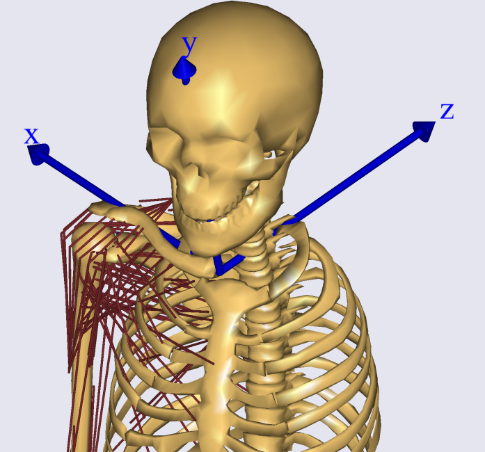
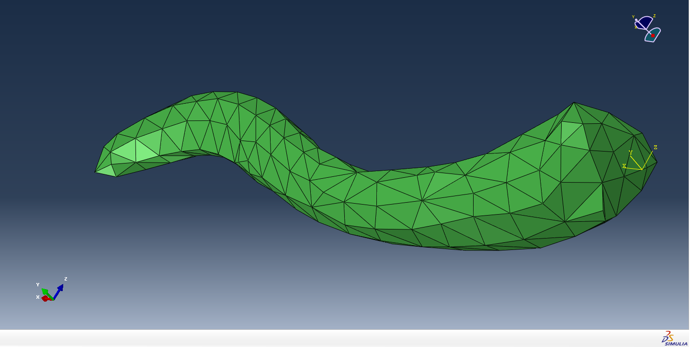
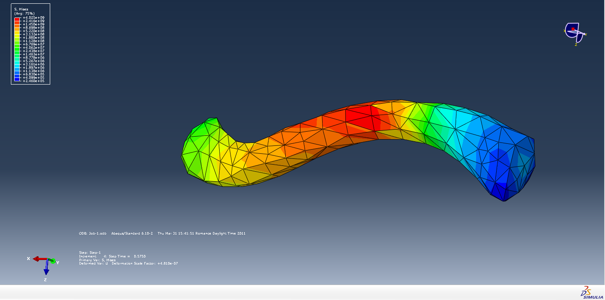
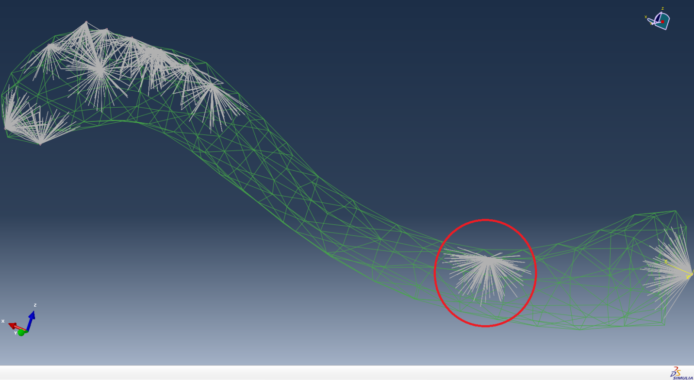
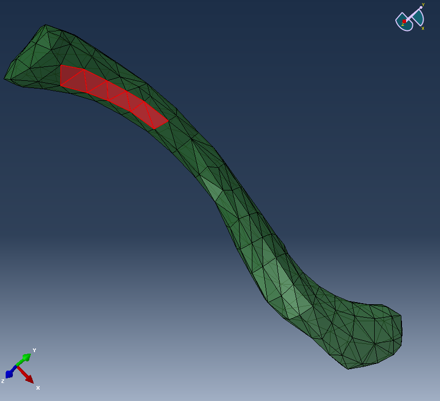
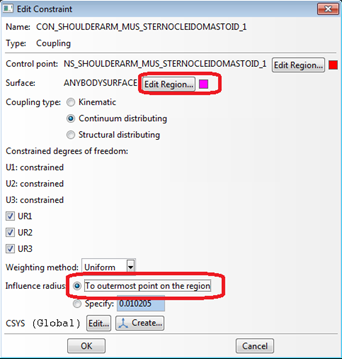
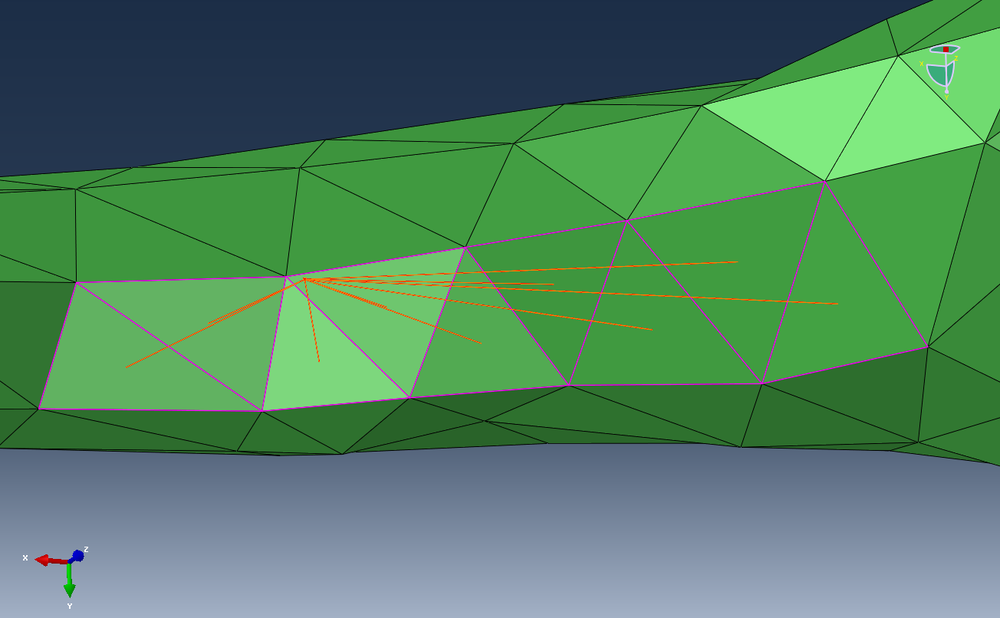

Lesson 3: Abaqus Interface
==========================

This chapter shows how forces calculated in AnyBody can be applied as
boundary conditions to a FE Models generated for Abaqus.

Below you see the flowchart from the introduction of this tutorial
extended with a converter step that converts the AnyFE output file to a
format readable by Abaqus. This step is carried out by a small tool,
called AnyFE2Abaqus.exe, which is available at
http://www.anybodytech.com/download.html?did=FEtools.overview.

The model we will have a look at is a model of the claviclebone. We will
analyze the muscle forces acting on the clavicle during lifting an arm
and compute the stresses in the bone. The standard Standing model taken
from the AMMR will be used (Notice, this tutorial was authored with
AMMRV1.3.1. It should run equally well with newer versions of the AMMR,
but the results may vary due to updates of the models).

We shall focus on the interfacing between AnyBody and Abaqus and
therefore we will use a bone mesh derived from the standard scaled
(=un-scaled) AnyBody model. Thereby, we can skip the step to do any
scaling according to the subject data and in particular the bone
geometry. This would have been needed if the bone model was derived from
scanned data coming from another, significantly different, person than
generic AnyBody model.

Let’s start with the AnyBody model. We have to make sure the FE and
AnyBody models are aligned. The idea is to include local reference
frames in both systems which will be used for all further data transfer.
Open the Standing model from the AMMR, or better make a copy of the
whole model folder and use this one. For convenience we will reduce the
model detail by excluding the left arm and switching off the muscles in
all body parts, except the right arm. This is done in the
BodyPartsSetup.any file.

Next we define the local ref frame on the clavicle. All forces will be
later exported with respect to this coordinate system. You can either
use a pre-defined reference system in the AMS or create a new one. The
following lines create a new node located in the Sternoclavicular joint:

.. code-block:: AnyScriptDoc
    
    AnySeg &RiArm = Main.HumanModel.BodyModel.Right.ShoulderArm.Seg.Clavicula;
    RiArm = {
        AnyRefNode localrefframe= {
            sRel = {0,0,0};
            // ARel = RotMat(0.5*pi,x);
            AnyDrawRefFrame drws = {ScaleXYZ = {1,1,1}*0.3;RGB={0,0,1};};
        };
    };

Include them e.g. in the Environment file. After reload of the model the
reference frame is shown

|clavicula ref frame|

Download the prepared Abaqus file :download:`here <Downloads/clavicula.inp>` and
save it in your working directory. Please note that this FE model of
clavicle was created in the same reference frame as the clavicle model
in the AnyBody model, since we have actually used the STL exported from
AMMR for this bone. Therefore, 'localrefframe' does not have to be
displaced in order to match with the coordinate system of the FE mesh,
but had the FE mesh been generated based on scanned data, the
registration between AnyBody model's clavicle and the FE mesh can be
entered using ``localrefframe``'s sRel and Arel members.

In a similar manner one could define a local reference frame in Abaqus
by means of the ``*SYSTEM`` keyword; however, this is not advisable because
the AnyFE Converter does not handle the ``*SYSTEM`` keyword in the supplied
mesh file. We shall return to the issue of aligning the coordinate
systems for the AnyBody forces and the mesh later, and so far we
consider ``localrefframe`` to be aligned with the mesh coordinate system.

|Clavicula mesh|

This figure above shows the clavicle bone mesh used for this example.
This bone is modeled with a reduced stiffness, which can be interpreted
as an osteoporotic bone.

Next we want to analyze the behavior of the bone subjected to the forces
computed in the AMS. First, change the Mannequin file to create the
desired physical activity. We want to analyze a simple lifting case, so
all we specify is flexion in the shoulder joint. Open the Mannequin file
and look for the PostureVel folder. Change the Glenohumeral flexion
value to 50/``Main.Study.tEnd``, this determines the joint velocity
necessary to reach 50 degree flexion taking into account the simulation
time.

.. code-block:: AnyScriptDoc

    AnyFolder Right = {
        //Arm
        AnyVar SternoClavicularProtraction=0; //This value is not used for initial position
        AnyVar SternoClavicularElevation=0; //This value is not used for initial position
        AnyVar SternoClavicularAxialRotation=0; //This value is not used for initial position
        AnyVar GlenohumeralFlexion =50/Main.Study.tEnd;
    

We also want to alter the initial starting position for the motion,
enter the Posture position folder and make the changes indicated below.

.. code-block:: AnyScriptDoc
    
    AnyFolder Right = {
        //Arm
        AnyVar SternoClavicularProtraction=-23; //This value is not used for initial position
        AnyVar SternoClavicularElevation=11.5; //This value is not used for initial position
        AnyVar SternoClavicularAxialRotation=-20; //This value is not used for initial position
        AnyVar GlenohumeralFlexion =0;
        AnyVar GlenohumeralAbduction = 7;
        AnyVar GlenohumeralExternalRotation = 0;
        AnyVar ElbowFlexion = 5.0;
        AnyVar ElbowPronation = -20.0;

We want this motion to be done in 10 seconds and analyze 5 time steps.
This is set in the main file. Search the Study folder and change the end
time of the study to 10 seconds and the number of time steps to 5.

.. code-block:: AnyScriptDoc
    
    AnyBodyStudy Study = {
        AnyFolder &Model = .Model;
        tEnd = 10.0;
        Gravity = {0.0, -9.81, 0.0};
        nStep = 5;

Now we have to specify which forces we want to export to the FE model.
For this we make use of the Class inserter. Place you cursor in the
Study folder in the main file, below the code shown above and select the
Classes tab on the left side of the main file window. Search for the
class named AnyMechOutputFileForceExport right click on it and choose
*Insert class template.* This will insert the class necessary for force
export.

.. code-block:: AnyScriptDoc

    AnyMechOutputFileForceExport <ObjectName> =
    {
        FileName = "";
        /*NumberFormat =
        {
            Digits = 15;
            Width = 22;
            Style = ScientificNumber;
            FormatStr = "";
        };*/
        //UseRefFrameOnOff = Off;
        //AllSegmentsInStudyOnOff = Off;
        //XMLformatOnOff = Off;
        //AnyRefFrame &<Insert name0> = <Insert object reference (or full object definition)>; You can make any number of these objects!
        //AnySeg &<Insert name0> = <Insert object reference (or full object definition)>; You can make any number of these objects!
    };

Create a folder in your Standing model folder named ``files_in`` and one
called ``files_out``. This will be used to store the FE files. Change the
``FE_out`` object as shown below. These definitions specify that all forces
acting on the segment Clavicula will be written in the xml file
clavload. It is important to use the xml format, since the AnyFE
converter only reads this format.

The UseRefFrameOnOff option enables specification of a reference frame
in which all forces and positions are reported. Switch this option on
and name the ref frame (the one we created before). You can find the
path to the ref frame by browsing the model tree on the left side of the
main file window to the right clavicle and right click *Insert object
name.*

.. code-block:: AnyScriptDoc

    AnyMechOutputFileForceExport FE_out =
    {
        FileName = "files_in/clavload.xml";
        UseRefFrameOnOff = On;
        AnyRefFrame &ref1 =
        Main.HumanModel.BodyModel.Right.ShoulderArm.Seg.Clavicula.localrefframe;
        AllSegmentsInStudyOnOff = Off;
        XMLformatOnOff = On;
        //AllSegmentsInStudyOnOff = Off;
        AnySeg &clav = Main.HumanModel.BodyModel.Right.ShoulderArm.Seg.Clavicula;
    };
    

This object will write all the muscle and joint forces for all time
steps in one xml file.

We are now ready to execute the AnyFE converter and transform the
generic AnyFE XML file to an Abaqus readable INP file. The AneFE
converter tool is available at
http://www.anybodytech.com/download.html?did=FEtools.overview. Unpack
the files in your model folder. These files include the AnyFE converter,
which is an executable called AnyFE2Abq.exe. It can convert the xml code
to Abaqus keyword sequence and combine it with the FE model.

The AnyFE converter is a command line tool with options controlled by
program arguments. Running the program with the ``–h``, i.e.
``AnyFE2Abq.exe –h``. We shall briefly go through the important options
here.

The ``–i`` and ``–o`` options specify the input AnyFE xml file
(``-i``) and the output file (``-o``), respectively. The ``–m``
option is used to specify a FE model without boundary conditions. This
Abaqus INP file, containing the mesh only, will be included in the
converter output INP file by means of an include-statement.

Another significant option is ``–e``, which is the radius of
muscle/ligament attachment area. This radius (default value is 1 cm) is
used for the construction of coupling constraint between a loaded point
and the surface of the bone. Please note that this radius is used on all
loads applied, not only muscles and ligaments, but also joint reactions,
applied loads, etc. This parameter is not a physiological parameter.
Please also note that in case of complex concave geometries these
constraints may select wrong parts of the bone surface and may require
some manual adjustment.

You can call the converter either from a shell prompt or from inside the
AnyBody system. The latter can be done by using the following class:
AnyOperationShellExec. The names for the executable, its working
directory and the options for the call of the exe file have to be given.
Please adjust the path corresponding to your setup and insert this code
below the study folder:

.. code-block:: AnyScriptDoc

    AnyOperationShellExec ConvertToAbq={
        Show=On;
        FileName = "AnyFE2Abq.exe";
        Arguments = "-i ..\files_in\clavload.xml -o ..\files_out\output.inp -m .\clavicula.inp";
        WorkDir=".\ ";
    };
    

This will enter an operation called ' ConvertToAbq' into the model and
running this will execute the AnyFE converter. From the shell prompt you
write the following to get the same result: ::

    AnyFE2Abq.exe -i ..\files_in\clavload.xml -o ..\files_out\output.inp -m .\clavicula.inp

At this point, let us return to the issue of the coordinate systems that
we have used so far and an alternative option. In the example we have
exported all the positions and forces with reference to a given manually
defined system attached to the clavicle, i.e. the 'localrefframe'. The
AnyFE converter will by default will transfer all positions and forces
directly, i.e., in the same coordinate system as exported the AnyFE XML
file. In the above, we have therefore considered 'localrefframe' to be
the coordinate system of the FE model, which is also the CT/MRI scan
system. Notice that in the given case, the segment reference and the
output reference are aligned since the FE mesh was based on the original
bone geometry from the AnyBody model, i.e. ``sRel= {0, 0, 0}``.

As an alternatively, you can export the AnyFE XML file in another
reference frame, even the global system in AnyBody
(UseRefFrameOnOff=Off) for that matter. This implies that the data of
the AnyFE XML file may or may not contain motion of the bone and it will
probably.not be aligned with the FE mesh/CT/MRI scan system. If you
chose this an option, the AnyFE Converter can remove the rigid body
motion by using the ``–r`` option equal to 'segment':::

    AnyFE2Abq.exe -i ..\files_in\clavload.xml -o ..\files_out\output.inp -m .\clavicula.inp –r segment

This makes all AnyFE data from the AnyFE Converter being transformed to
the local frame of the segment, here the clavicle segment, before
applied to the FE model and outputted.

If the reference frame of the segment is not identical to the one of the
FE mesh, one can apply a constant transformation to all data
accommodating for this misalignment. The ``–t`` option allows you to
enter the transformation as a string containing space separated numbers.
The command line will look like:::

    AnyFE2Abq.exe -i ..\files_in\clavload.xml -o ..\files_out\output.inp -m .\clavicula.inp –r segment –t "a11 a12 a13 a21 a22 a23 a31 a32 a33 dx dy dz"

The transformation may contain either 9 or 12 numbers. The first nine,
aij, must be the orthogonal rotational transformation matrix and the
latter optional three, dx, dy, and dz, are the translations.

These options allow you to handle the coordinate systems differences
using the AnyFE Converter, i.e., outside AnyBody. For instance this
implies that you do not have to redo simulations just to apply the same
forces to another FE mesh with another local frame; this can all be done
with adjustment of the parameters for the AnyFE converter.

Now we have looked at how to execute the AnyFE converter properly, so
let us have a look at what it does.

Please notice that the AnyFE Converter is reading Abaqus input file
(INP) and it is only expecting a simple mesh specification. This reader
is not fully compatible with the INP keyword language for Abaqus.
Basically, it only reads in the first block of nodes (``*NODE`` section)
and it does not accept commands that may interfere with the
interpretation of this node section. This implies that many Abaqus
keywords are not allowed in front of the first node section. This also
implies that subsequent node sections are not read and therefore, not
used for application of forces.

The AnyFE Converter performs the following actions:

-  Maps all AnyBody exported forces, i.e., joint reactions, muscle
   forces and applied forces to the provided FE mesh. Mass related
   forces are neglected, i.e., gravitational and acceleration equivalent
   forces.

   -  Defines nodes in the positions from the AnyFE output file, i.e.
      the position of all loads (this includes muscle/ligament
      attachment nodes)

   -  Defines amplitudes for each force/moment component in the AnyFE
      output file

   -  Defines concentrated loads (``*CLOAD``) in each of these nodes

   -  Defines coupling constraints between the created nodes and a part
      of the surface of the bone

-  The mesh in included

-  Adds inertia relief loads (``*INERTIA RELIEF``)

Please note that the inertia relief loads will automatically be added to
the model in order to provide a full set of boundary conditions.
However, these loads require a density value in the material definition
section. Absence of this density value will result in the error during
the FE analysis. In case when additional constraints are present in the
model, e.g. environment support, contact with another bone, etc., the
inertia loads can be suppressed or removed.

Now we are ready to run the analysis and convert the data. Reload the
model in the AMS. Select RunApplication in the Operations tree. This
will automatically run the Calibration and InverseDynamics studies. Next
select ConvertToAbq operation and run it. This will create a new Abaqus
input file in the ``files_out`` folder.

Open Abaqus and import the input file from the output directory. This
will load the clavicle mesh model, apply the boundary conditions. Next
step is to make your custom final adjustments, run the FE solver, and
when finished, post-process the results. The image below shows the
results of running the model without any custom adjustments, however in
the following we shall consider modification of the load application
regions.

|Clavicula stresses|

On the following picture, you can see the muscle attachments nodes and
coupling constraints that are applied to the finite element model.

|Clavicula force application points|

Bear in mind that the muscle attachment area is considered to have a
constant radius, however, in many cases these areas are elongated and
have irregular pattern. Let us assume that the area for the
sternocleidomastoid muscle has to be changed to fit better the user’s
expectations, for example, to be more physiological. That can be done by
defining the desired muscle attachment area as a new surface in the FE
model and changing the relevant coupling constraint to refer to this
surface. In our example, we create a surface on the posteriormedial side
of the clavicle as it shown on the following pictures. Please note that
you will also need to set the influence radius option to ´To outermost
point of the region´ in order to make sure that you now make the
coupling to the whole surface.

|Clavicula contraint region| |Edit constraint dialog|

The following picture shows how the modified constraint looks like; the
sternocleidomastoid muscle attachment patch is now spread on the surface
elements of the clavicle mesh.

|Clavicula closeup constraint region|

We can run the solver again and inspect the results, see the image
below. In the crude model, we have worked with in this case, we do not
see significant changes due to the modification in the overall picture.

