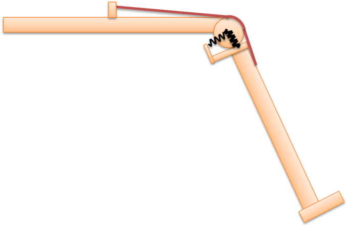

Force-Dependent Kinematics
==========================

.. toctree::
   :hidden:

    Lesson 1 <lesson1>
    Lesson 2 <lesson2>
    Lesson 3 <lesson3>
    Lesson 4 <lesson4>
    Lesson 5 <lesson5>
    FDK appendiks <fdkappendix>

Let us start by looking at the simplest form of Newton’s second law,
when it’s written for a point mass particle:

.. math:: a = \frac{F}{m}

Here **F** is the resultant of all forces acting on the particle, *m* is
its mass, and **a** is the consequent acceleration. If we knew the
values of all the applied forces, the accelerations could be computed
and maybe even integrated over time to predict how the particle would
move. Such a study of the particle’s physics would be termed a Forward
Dynamic Analysis.

Alternatively, the equation could be re-written as:

.. math:: F = ma

This would be more beneficial when the particle’s accelerations could be
observed using say a video camera, but the forces were unknown. This is
called an Inverse Dynamic Analysis.

AnyBody usually performs inverse dynamics since it’s far easier to
observe motion visually or with motion capture systems than to do a
forward dynamic analysis with a priori estimates of the internal body
forces which move to the musculoskeletal system.

AnyBody extends Newton’s second law to a complex multi-body system
consisting of many rigid segments inter-connected through “ideal”
mechanical joints. For example, an ideal spherical joint allows 3
degrees of rotational freedom, but constrains the 3 degrees of
translational freedom whose violation is vehemently countered by 3
corresponding joint reaction forces.

However, many biomechanical joints are not completely ideal and allow
for small motions between the bones. These small motions are both
difficult to measure as well as estimate, since they depend on the
topology of the bony contact and are often finely stabilized by the
muscle and ligament forces. A good example of such a motion is the
anterio-posterior sliding of the femur on the tibia at the knee joint.

This means that we cannot determine these motions before we know the
internal forces and, as we just saw above, standard inverse dynamics
requires the entire system’s motion to be known before we can compute
the forces. So we are faced with a classic catch-22 problem. This is
where Force-Dependent Kinematics or FDK comes in to save the day!

In this tutorial we will construct a very simple model that is easy to
understand, and fast to build and analyse. It however permits small
motions between the two bones which will really help us understand the
detailed functions of real joints. This is what the model will look
like:

|Simple knee|

This model is a knee joint extended by a single quadriceps muscle. The
joint, however, is somewhat different from the idealized “engineering”
revolute joints you often see in musculoskeletal models. It comprises a
circular condyle in contact with a flat tibial plateau. The contact is
frictionless, so the condyle can in principle freely slide back and
forth on the plateau. To stabilize the sliding knee, two perpendicular
springs are acting between the femur and tibia.

The first spring is normal to the tibial plateau, and it represents the
compressive stiffness of the cartilage between the two parts. The second
spring is parallel to the tibial plateau, and it represents the
collective effect of the menisci and the ligaments in providing
anterio-posterior stability.

Please go ahead and download a template of the model here, and then
proceed to:

:doc:`Lesson 1: The baseline model <lesson1>`

