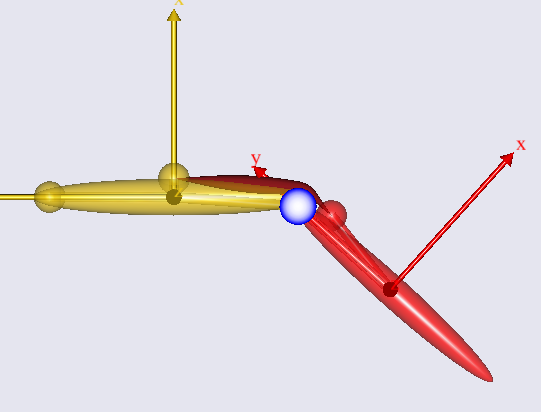

# Lesson 1: The Baseline Model

{{ caution_old_tutorial }}

In this lesson we familiarize ourselves with the simple knee model. If
you have not already downloaded the model, then please do so from this
link: {download}`DemoSimpleKnee.any <Downloads/DemoSimpleKnee.any>`. Save the
model to a working area of your hard disk, for instance in
{file}`Documents\AnyScripts\tutorials`. Then open the model in AnyBody, expand
“Study” in the Operations Tree, select InverseDynamics and click Run.
This is what the model looks like:

The yellow segment is the thigh and the red segment is the shank. The
thigh is fixed to the ground frame at the hip joint and the thigh and
the shank are joint at the knee joint, which in this version of the
model is just an idealized revolute joint symbolized by the blue circle.
This circle is actually the projection of a cylinder representing the
femoral condyles, and over it wraps the single muscle that actuates the
system. We can think of this as the quadriceps muscle. You can see the
muscle bulging in response to the increased load as the knee extends.

So far, this is just an ordinary AnyBody model with no special features.
In the next lesson we shall see how this model can be upgraded with a
more realistic knee joint using the Force dependent kinematics (FDK)
solver of the system:

:::{rst-class} without-title
:::

:::{seealso}
**Next lesson:** {doc}`lesson2`.
:::
