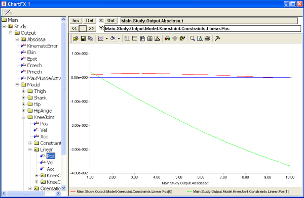
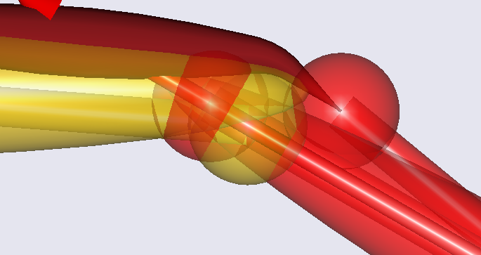
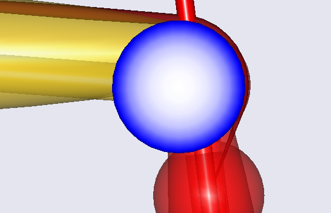
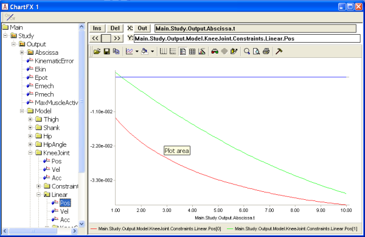
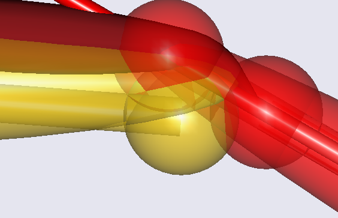
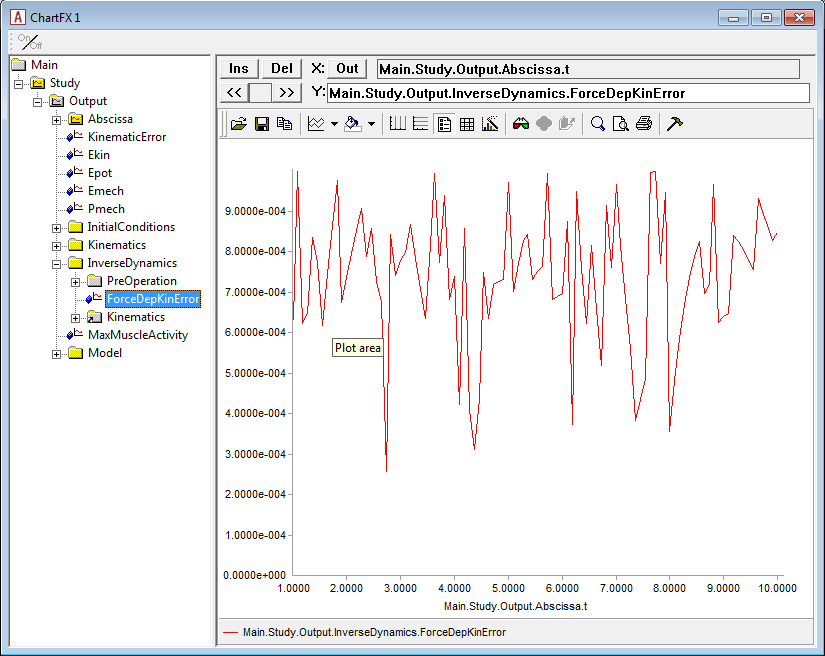

Lesson 3: Results of FDK
========================

In this lesson we play a little around with our new FDK model and see
what kind of results we can obtain from it. If you did not manage to
obtain a working model from the previous lesson, then please download a
new one :download:`here <Downloads/DemoSimpleKnee2.any>`.

After loading the model, open a Model View window, select
InverseDynamics and then click the Run button. You should see the knee
extending and the muscle bulging just like you saw with the baseline
model. However, inside the joint, much more is now going on. We can
investigate this in detail if we open a ChartFX window and browse down
to the linear measure inside the joint:

|Chart view Linear pos|

The red curve is the deformation of the joint in the *x* direction, i.e.
parallel with the tibial plateau. Despite the stiffness being smaller in
this direction, the deformation is rather small. This is of course due
to the muscle force acting rather perpendicularly to the tibial plateau.

The green curve symbolizes the deformation perpendicular to the tibial
plateau. It reaches a value of about 4 cm, which is much more than in a
real knee. This is because we defined very small stiffness values,
precisely to get some large deformations to look at. If you right-click
the blue condyle, select ‘Hide” from the context menu and zoom in on the
joint, you can see the deformation very clearly as a penetration of the
shank part of the joint into the thigh part:

|Model view Knee close up|

Now let us try something that will create a larger shear deformation in
the joint: we relocate the position of the insertion node of the
quadriceps muscle on the tibia:

.. code-block:: AnyScriptDoc

    AnySeg Shank = {
      r0 = {0.8, -0.4, 0.0};
      Mass = 4;
      Jii = {0.4, 0.01, 0.4}*0.4;
      AnyDrawSeg drw ={
        Opacity = 0.5;
        RGB = {1,0,0};
      };
      AnyRefNode KneeCenter = {
        sRel = {0.0, 0.4, 0.0};
      };
        AnyRefNode Quadriceps = {
        sRel={§0.00§, 0.3, 0.0};
      };
    };

This moves the insertion point of the node from the surface of the tibia
to centerline of the tibia as shown below:

|Model view Knee wrapping sureface|

Obviously, this causes the muscle to pull much more anteriorly on the
shank. Please reload and re-run the analysis and investigate the
deformations once again in the ChartFX window.

|Chart view Linear pos 2|

The shear deformation, symbolized by the green curve, is now comparable
with the normal deformation depicted by the red curve, and once again it
is easily visible if we remove the blue condyle from the Model View:

|Model view Knee close up 2|

At this point, we can reflect a bit on what the FDK solver within the
InverseDynamics analysis actually does. Basically, it finds equilibrium
for the degrees of freedom that you have specified as 'ForceDep'. It is
static equilibrium in the sense that the solver assumes accelerations
and velocities of these degrees of freedom to be zero, just like if it
had been an ideal joint without motion. This assumption is fair as long
as the motion of the degrees of freedom is actually small (negligible);
but it is your responsibility to make sure that this is okay for your
model. In the current model, it may be disputable whether it is ok, but
primarily because we have worked with relatively large deformations for
the sake of the example.

We may call the obtained solution a quasi-static equilibrium because it
is indeed static in the direction of the force-dependent degrees of
freedom, i.e. the small motions, but it retains all the motion from that
large motion of the standard kinematical drivers and the thereof
following inertia forces.

The FDK solver solves the equilibrium equations numerically and
therefore it will leave a small residual. You can monitor this residual
in the output data; in the figure below you see the curve for the
error/residual (Main.Study.InverseDynamics.ForceDepKin.ForceError) for
the example at hand

|Chart view ForceDepKin.ForceError|

In this example, the error is completely insignificant and within the
specified error tolerance
(Main.Study.InverseDynamics.ForceDepKin.ForceTol). It can, however,
become harder to reach a solution within a very fine accuracy, when
models become more complicated and in particular when the stiffness is
increased a lot. In other words, the solver will have difficulties when
approaching the case of ideal constraints.

The solver continues with subsequent time steps, even if it does not
converge within the specified tolerance. This implies that we can keep
the tolerance small and subsequently inspect the time steps for which
the solver fails to honor the tolerance.

In principle, this completes the introduction to AnyBody's FDK solver in
this tutorial. The FDK principle is applicable in many different
situations where tissue deformations are involved, and models can of
course be defined in much more realistic detail than we have seen here.
In the fourth lesson of this tutorial, we shall have a look at how to
use the simple surface contact force model also available in AnyBody to
improve on the kinematical behavior in combination with the FDK solver.

.. rst-class:: without-title
.. seealso::
    **Next lesson:** :doc:`lesson4`.

