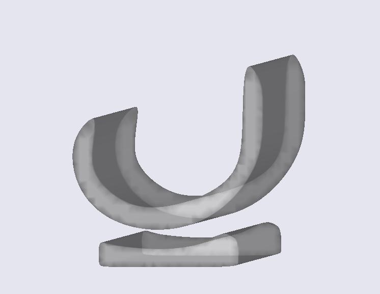
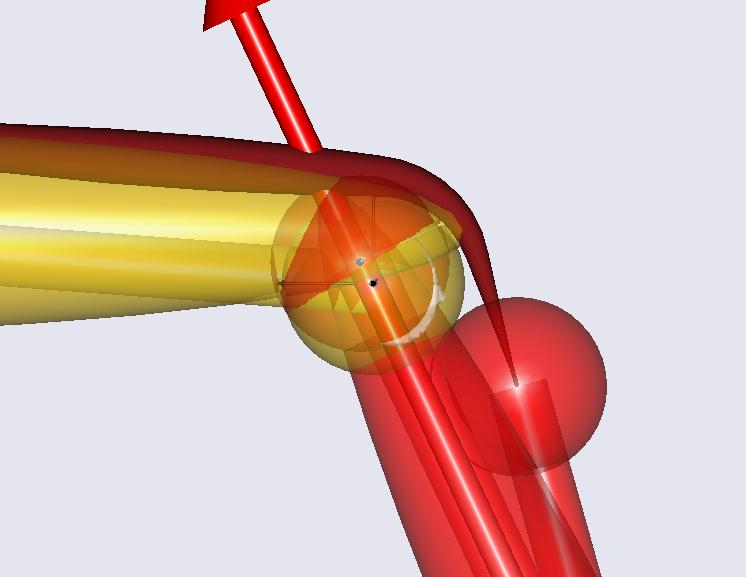
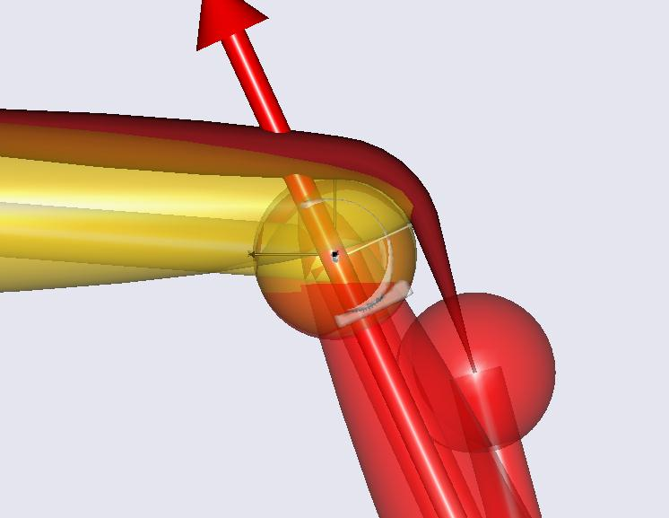

Lesson 4: Using Surfaces to Define the Knee Joint
=================================================

.. include:: /caution_old_tutorial.rst

The knee model developed in the previous lessons is obviously very
simple and does not resemble the geometry of a real anatomical knee very
well. However, AnyBody also contains facilities for development of more
realistic geometries of surfaces such as the femoral condyles, and we
shall explore those in this lesson. We start from the model developed in
the second lesson. If you did not manage to obtain a working model from
the second lesson, then please download a new one
:download:`here <Downloads/DemoSimpleKnee2.any>`.

In this example, we are modeling the knee joint using some simplified
2-D implants (see picture) for the femoral head and the tibial plateau.
To do this, we add some STL surfaces for theses implants to the model
and use them to calculate a contact force, which changes the joint
kinematics by making the implant surfaces slide along each other in the
simulated motion.

.. warning:: 
  Please note that if the surface has thin parts is a good idea to remove the backside of the surface so that it becomes open. This ensures that the forces will continue to grow as the surfaces are compressed into each other.

|Model view Implant surfaces|

Due to the Force Dependent Kinematics (FDK), the joint axis for the knee
moves as a function of external forces and muscle forces. In this lesson
we want to have a closer look at this migration. We start by adding an
AnyDrawRefFrame to the KneeCenter node of the thigh and the shank
segments to show the migration. For the thigh segment we add

.. code-block:: AnyScriptDoc

  AnySeg Thigh = {
      r0 = {0.4, 0, 0};
      Axes0 = RotMat(pi/2,z);
      Mass = 5;
      Jii = {0.3, 0.01, 0.3}*0.7;
      
      AnyRefNode KneeCenter = {
        sRel = {-0.03, -0.4, 0.0};
        §AnyDrawRefFrame drw = {RGB = {0,0,0}; ScaleXYZ = 0.05 * {1,1,1};};§
        
        AnyRefNode SurfCenter = {
          sRel = {0,0,-0.05};
          AnySurfCylinder Condyle = {
            Radius = 0.06;
            Length = 0.1;
            AnyDrawParamSurf drw = {
              RGB = {0, 0, 1};
            };
          };
        };  
      };
      
      AnyRefNode HipCenter = {
        sRel = {0.0, 0.4, 0.0};
      };
      
      AnyRefNode Quadriceps = {
        sRel = {0.06, 0.0, 0.0};
      };      
      AnyDrawSeg drw ={
        Opacity = 0.5;
      };
    };

And we do the same for the shank:

.. code-block:: AnyScriptDoc

    AnySeg Shank = {
          r0 = {0.8, -0.4, 0.0};
          Mass = 4;
          Jii = {0.4, 0.01, 0.4}*0.4;
          AnyDrawSeg drw = {
            Opacity = 0.5;
            RGB = {1,0,0};
          };
          
          AnyRefNode KneeCenter = {
            sRel = {0.0, 0.4, 0.0};
            §AnyDrawRefFrame drw = {RGB = {1,1,1}; ScaleXYZ = 0.05 * {1,1,1};};§
          };
          AnyRefNode Quadriceps = {
            sRel={0.05, 0.3, 0.0};
          };
        };
    

Hiding the blue cylinder and running the model again shows that there is
a rather big distance between the knee center nodes of thigh and shank.

Now we start to add our new knee joint by adding the knee implant parts
to the model. We need the two STL files
:download:`simplefemoral.stl <Downloads/simplefemoral.stl>` and
:download:`simpletibial.stl <Downloads/simpletibial.stl>`. First, we define the
femoral condyles as an AnySurfSTL inside the KneeCenter and add an
AnyDrawSurf object inside to also be able to see the geometry:

.. code-block:: AnyScriptDoc

    AnySeg Thigh = {
          r0 = {0.4, 0, 0};
          Axes0 = RotMat(pi/2,z);
          Mass = 5;
          Jii = {0.3, 0.01, 0.3}*0.7;
          
          AnyRefNode KneeCenter = {
            sRel = {-0.03, -0.4, 0.0};
            AnyDrawRefFrame drw = {RGB = {0,0,0}; ScaleXYZ = 0.05 * {1,1,1};};
            
            AnyRefNode SurfCenter = {
              sRel = {0,0,-0.05};
              AnySurfCylinder Condyle = {
                Radius = 0.06;
                Length = 0.1;
                AnyDrawParamSurf drw = {
                  RGB = {0, 0, 1};
                };
              };
            };  
            
            §AnySurfSTL FemoralHead = 
            {
              FileName = "simplefemoral.stl";
              AnyDrawSurf drw = 
              {
                FileName = .FileName;
                Opacity = 0.5;
              };
            };§
          };
          
          AnyRefNode HipCenter = {
            sRel = {0.0, 0.4, 0.0};
          };
          AnyRefNode Quadriceps = {
            sRel = {0.06, 0.0, 0.0};
          };      
          AnyDrawSeg drw ={
            Opacity = 0.5;
          };
       };
    

The geometry of the tibial plateau would be a little bit misplaced if we
would just add it the same way as the femoral condyles. To adjust it to the
right position, we add a new node SurfSTLCenter centered at the right
position and define the AnySurfSTL inside this node:

.. code-block:: AnyScriptDoc

    AnySeg Shank = {
          r0 = {0.8, -0.4, 0.0};
          Mass = 4;
          Jii = {0.4, 0.01, 0.4}*0.4;
          AnyDrawSeg drw = {
            Opacity = 0.5;
            RGB = {1,0,0};
          };
          
          AnyRefNode KneeCenter = {
            sRel = {0.0, 0.4, 0.0};
            AnyDrawRefFrame drw = {RGB = {1,1,1}; ScaleXYZ = 0.05 * {1,1,1};};
            
            §AnyRefNode SurfSTLCenter = {
              sRel = {0.01,-0.04,0}; 
              AnySurfSTL TibialPlateau = {
                FileName = "simpletibial.stl";
                AnyDrawSurf drw = {
                  FileName = .FileName;
                  Opacity = 0.5;
                };
              };
            };§
          };
          AnyRefNode Quadriceps = {
            sRel={0.05, 0.3, 0.0};
          };
        };

When we now run the simulation and hide the blue cylinder in the knee
center, we can see that the surfaces penetrate each other quite a lot,
so just putting in the geometries into the model does not change
anything except that the locations of the two implants are now visible.

|Model view knee closeup|

Now, we want to make the surfaces slide along each other. Therefore, we
define a contact force that pushes the surfaces apart as soon as they
are in contact. We define an AnyForceSurfaceContact and place it just
below the definition of the Shank. For the definition an
AnyForceSurfaceContact, we have to specify the two contacting STL
surfaces (the first one is called master, the second is the slave
surface) and a pressure module. This pressure module is a constant
defining a linear law between penetration volume and force. In this
example we use a more or less arbitrary value for this module. Our
AnyForceSurfaceContact object looks like this:

.. code-block:: AnyScriptDoc

    AnyForceSurfaceContact ContactForce = {  
      AnySurface &surfMaster = .Thigh.KneeCenter.FemoralHead;
      AnySurface &surfSlave = .Shank.KneeCenter.SurfSTLCenter.TibialPlateau;
      PressureModule = 5e7;
    };

The AnyForceSurfaceContact creates a 3-D force vector located in the
center of pressure whenever the volumes defined by the STL files
penetrate each other. If the volumes are not penetrating, these forces
just become zero.

Running the simulation now shows that the tibial plateau slides along
the femoral condyle and the reference frames defined in the knee centers
stay close to each other.

|Model view knee closeup 2|

While running the analysis, we can see that in many steps the system
cannot be solved with the requested error tolerance. The reason for this
problem is that small changes in the position can result in big changes
in the contact force. Possibilities to improve this behavior are to
exchange the surface geometries and use finer meshes or to use a softer
contact by reducing the PressureModule.

We are now done with this lesson. You can now play around with this
model by changing e.g. the pressure module to change the penetration of
the implants or the positions of the tibial part to change the motion.
If you couldn’t make your model run up to this point, you can find the
complete model :download:`here <Downloads/DemoSimpleKnee3.any>`.

In :doc:`Lesson5 <lesson5>` we can see how this kind of joint can be
included into an existing model based on an AMMR body model.

.. rst-class:: without-title
.. seealso::
    **Next lesson:** :doc:`lesson5`.

