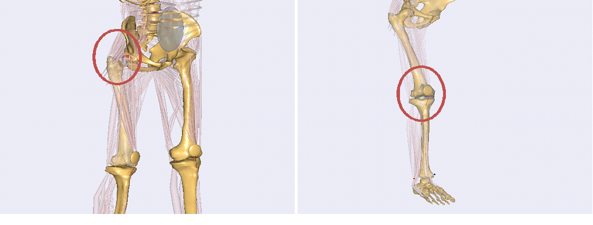

Lesson 5: Using Contact Forces to Replace a Joint in a Human Model
==================================================================

.. include:: /caution_old_tutorial.rst

In Lesson4, we have seen how a joint could be constructed by using
geometry data of a real bone or implant. Now in this lesson, we shall
have a brief look at how such a joint can be used in a complete human
body model. Fortunately, this is already done in two examples of the
AMMR (version 1.5). Thus, please make sure that you have AMMR 1.5
installed on your computer. You can find the models mentioned under
``Application/Examples/THA-KneeBendDemo`` and
``Application/Beta/TKA-KneeBendDemo``.

|Model view Hip and knee|

The first example is a model of a total hip replacement using a contact
between geometries of hip implants, the second one is a model of a total
knee replacement where the knee joint is replaced by the contact of knee
implant geometries for a femoral and a tibia part. Both examples are
models of a knee bend motion. For the sake of simplicity, we concentrate
on how the new joint model is inserted in the first, the hip implant
model. The knee replacement model works with a similar concept, but it
is more complicated and more sensible to make changes in this model,
because of delicate balance between joint positioning and ligament
tension. It should be noticed that the model contains no easy way to
position the knee joint parts, only trial and error, and this is also
why the model still resides in the Beta section of the Application
models.

Loading the file THA-KneeBendDemo.Main.any in AnyBody and opening a
Model View, you can see that the model is a human model, which includes
two parts of a hip implant, a cup in the pelvis and a femoral component.

In general, the replacement of a standard joint in the body model by a
contact joint can be split into three steps. The first step is to define
and position the implants in the model. Looking in the main file, in the
bottom, we find the lines

.. code-block:: AnyScriptDoc

    #include "Implants.any"

The file Implants.any includes the definitions these two implants into
the different segments, i.e., the pelvis and the right thigh.

.. code-block:: AnyScriptDoc

    Main.HumanModel.BodyModel.Right.Leg.Seg.Thigh.HipJointISBCoordinateSystem = {
      AnyRefNode FemImplantNode = 
      {
        ARel = {{-0.7390397, 0.5761477, -0.3491089}, 
                {-0.626916, -0.7778804, 0.04337248}, 
                {-0.2465756, 0.2509154, 0.9360795}};
        AnySurfSTL FemoralImplant = 
        {
          FileName = "stl files/FemImplant";
          ScaleXYZ = 0.7*1.0*{1.0, 1.0, 1.0};
          AnyDrawSurf DrwSurfFem = {
            FileName = .FileName;
            ScaleXYZ = .ScaleXYZ;
            Opacity = 0.3;
          };
        };
      };
    ...
    };
    
    Main.HumanModel.BodyModel.Trunk.SegmentsLumbar.PelvisSeg.Right.HipJoint = {
      
      AnyRefNode PelvisImplantNode = {
        ARel = {{0.9793473, -0.2007827, -0.02375309}, 
                {0.1867485, 0.8533001, 0.4868296}, 
                {-0.0774785, -0.4812113, 0.8731734}};
    
        AnySurfSTL PelvisImplant = {
          FileName = "stl files/HipCup";
          ScaleXYZ = 1.0*0.1450*{1.0, 1.0, 1.0};
          
          AnyDrawSurf DrwSurfFem = {
            FileName = .FileName;
            ScaleXYZ = .ScaleXYZ;
            RGB = {1,0,0};
            Opacity = 0.3;
         };
        };
      };
    ...
    };
    

Additional to that, we can find the file BoneExchange.any included in
the main file. This file exchanges the standard femur bone against a cut
version. The only reason to do this is for visualization to see the
implant better. It has no impact on the mechanics.

The second step is, similar to the simple-knee model in the lessons
before, the definition of the contact forces. This, we can find under

.. code-block:: AnyScriptDoc

    #include "ContactForces.any"

Here, the contact force between the two implant components is defined.
Further down we see an artificial force is defined. This is basically a
force that should not produce big forces, but which is sometimes needed
by the FDK solver to find a solution in cases where the implants are not
in contact and ligaments and muscles are slack and do not produce
forces.

.. code-block:: AnyScriptDoc

    AnyForceSurfaceContact FSurf = 
    { 
      AnySurface &sMaster = Main.HumanModel.BodyModel.Right.Leg.Seg.Thigh.HipJointISBCoordinateSystem.FemImplantNode.FemoralImplant;
      AnySurface &sSlave = Main.HumanModel.BodyModel.Trunk.SegmentsLumbar.PelvisSeg.Right.HipJoint.PelvisImplantNode.PelvisImplant;
      
      PressureModule = 3e9;
      
      ForceViewOnOff = On;
      MeshRefinementMaster = 0;
      MeshRefinementSlave = 0;
      SingleSidedOnOff= On;
      
    };
    
    AnyForce ArtificialStiffness = 
    {
      AnyFloat Stiffness = 5e4; // N/m
      AnyKinLinear lin = 
      {
        AnyRefFrame &r1= Main.HumanModel.BodyModel.Trunk.SegmentsLumbar.PelvisSeg.Right.HipJoint.PelvisImplantNode;
        AnyRefFrame &r2 = Main.HumanModel.BodyModel.Right.Leg.Seg.Thigh.HipJointISBCoordinateSystem.FemImplantNode;  
      };
      F = - Stiffness * lin.Pos;
    };

After we defined all the forces we need in our contact joint, the last
step is to replace the standard joint in the body model by our new
contact joint. Basically, this is the same as in the model of Lesson 4
except that now we have to remove the standard joint, which comes with
the corresponding body part from the AMMR. All this, the exclusion of
the standard joint and the definition of the new joint, we can find in
the file HipExchange.any which is included inside the AnyBodyStudy.

The first part of this file removes the standard joints and drivers for
the hip joint from the model. Therefore, all objects which have to do
with the definition of this joint are collected using ObjSearch
functions which return lists of the mechanical objects. These lists are
gathered into a single list of object pointers (AnyObjectPtr). Finally,
this list is excluded from the Study using the MechObjectExclude member
of the AnyBodyStudy.

.. code-block:: AnyScriptDoc

      MechObjectExclude = arrcat(
        ObjSearch("Main.HumanModel.BodyModel.Right.Leg.Seg.Thigh.HipJoint","AnyMechObject"),
        ObjSearchRecursive("Main.HumanModel.BodyModel.Right.Leg.Jnt.Hip","*","AnyMechObject"),
        ObjSearchRecursive("Main.Model.ModelEnvironmentConnection.JointsAndDrivers.JntDriverRightLegTD","Hip*","AnyMechObject")
      );

The definition of force dependent drivers works similar to the
definition in Lesson 2. The only difference is now, that now we have a
full 3D model and so we have to think about which degrees of freedom we
want to include as force-dependent. If we look at the drivers of this
model, we can see that for this particular model we have 3
force-dependent degrees of freedom in the hip, i.e. all linear
constraints of a spherical joint.

These are all changes that have to be done to this model to implement a
contact joint. To see the differences between the standard joint and the
contact joint, we can use the define statement USE\_FDK that switches
between the two joint definitions by excluding and including the two
last of the three mentioned steps, i.e. the definition of the new joint
and the definition of the contact forces.

As mentioned before, the model TKA-KneeBendDemo uses the same concept to
exchange the joints of the knee. The biggest difference is the
complexity of the knee joint compared to the hip joint. This makes the
model more complicated in the sense that we have to define additional
ligaments which constrain the movement in a knee (e.g. PCL, medial and
lateral collateral ligaments). These have to be calibrated carefully
which makes the model more sensitive to changes.

To conclude this tutorial, we want to mention some difficulties which
might show up while using a contact joint in a model. For modeling
contact forces, the used geometries, here the implant STL files, have to
be adequately detailed and smooth. That means that the quality of the
surfaces is significant for the results of the contact modeling. A few
remarks on how to assure a good quality of the surfaces can be found in
this :doc:`appendix <fdkappendix>`.

.. seealso::

    A few remarks on how to assure a good quality of the surfaces can be found in
    this :doc:`appendix <fdkappendix>`.

