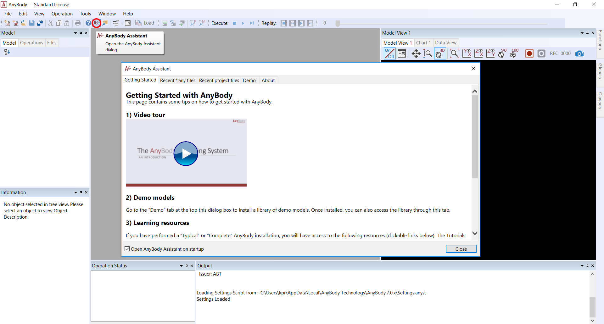
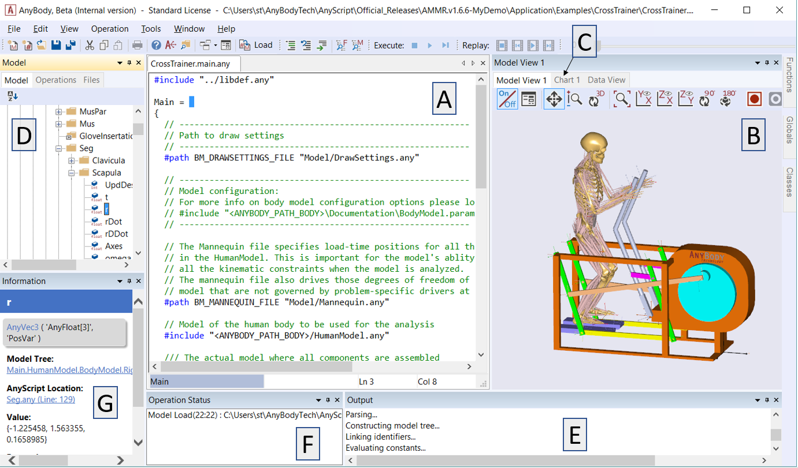

User interface features
=======================

.. toctree::
   :hidden:

    Lesson 1 <lesson1>
    Lesson 2 <lesson2>
    Lesson 3 <lesson3>
    Lesson 4 <lesson4>
    Lesson 5 <lesson5>
    Lesson 6 <lesson6>
    Lesson 7 <lesson7>

This tutorial deals with the user interface features of the AnyBody
Modeling System. Please complete the “\ :doc:`*Getting Started: AnyScript
Programming” tutorial* <../A_Getting_started_anyscript/intro>`
before proceeding.

**We also strongly recommend watching the introductory video found in
Help -> AnyBody Assistant, which visually demonstrates several important
GUI features.**

|Intro video|

Please go to the CrossTrainer example from the AnyBody Managed Model
Repository and open the CrossTrainer.main.any file. **Load the model
into AnyBody by pressing F7 or using the “Load” button in the toolbar.**

|GUI elements|

This GUI contains the following windows:

A. **AnyScript Editor:** Text editor for modifying the model

B. **Model View:** Displays the model in 3D

C. **Chart View:** Displays graphs (click the tab to open it).

D. **Model Tree View:** The model tree represents the organizational
   structure of model

E. **Log Window:** Errors, warnings, and other status messages are
   written here

F. **Progress Window:** Displays the progress of the running operation

G. **Information Window:** Displays properties of objects selected in
   Model Tree

The individual windows will be explained in greater detail in the
following lessons:

-  :doc:`*Lesson 1: Editor Window Facilities* <lesson1>`

-  :doc:`*Lesson 2: The Model View Window* <lesson2>`

-  :doc:`*Lesson 3: The Chart View* <lesson3>`

-  :doc:`*Lesson 4: Browsing the Model via Model Tree and Object
   Description* <lesson4>`

-  :doc:`*Lesson 5: The Command Line Application* <lesson5>`

-  :doc:`*Lesson 6: Modifying the Loaded Model* <lesson6>`

-  :doc:`*Lesson 7: Wrapping the Model with AnyBody
   Project* <lesson7>`

