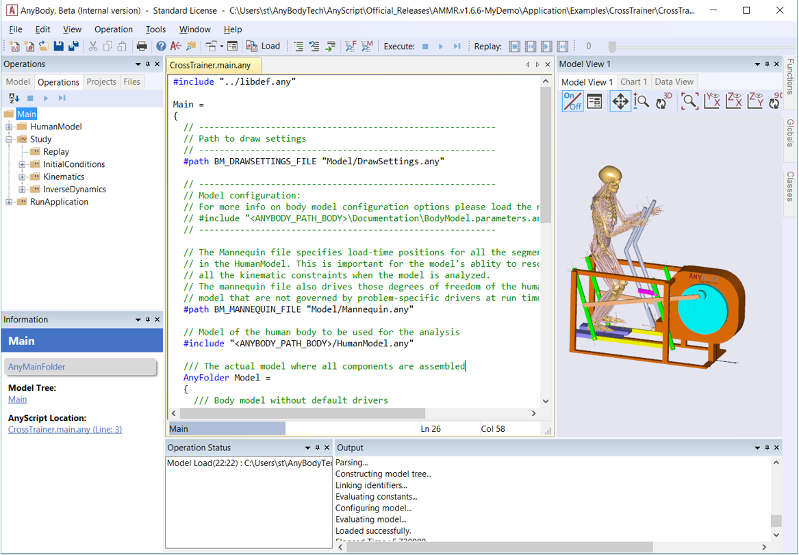
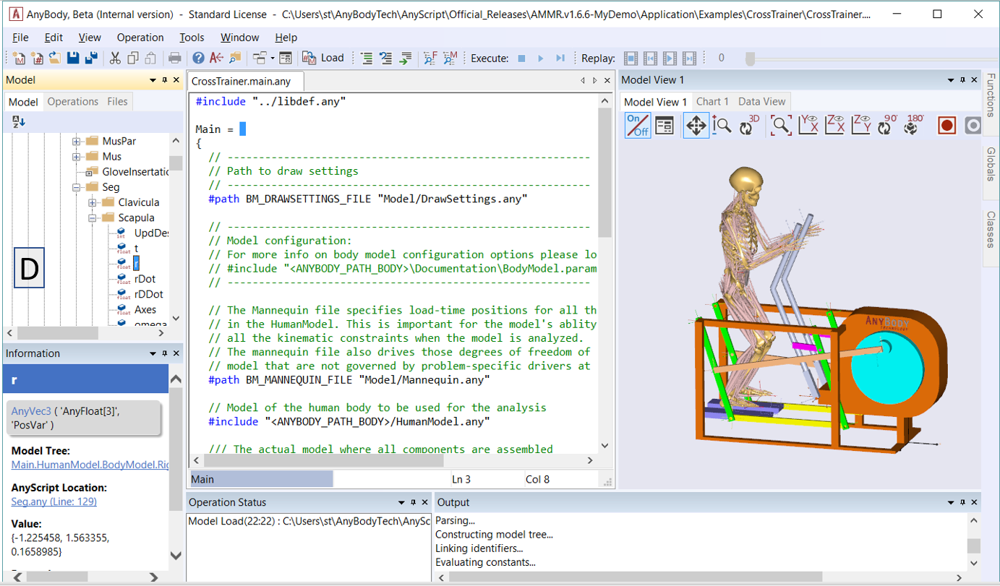
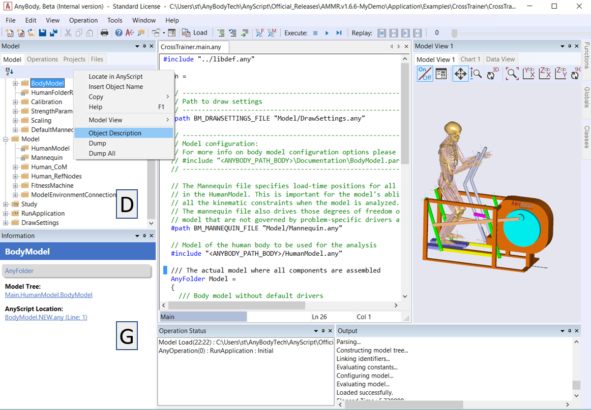
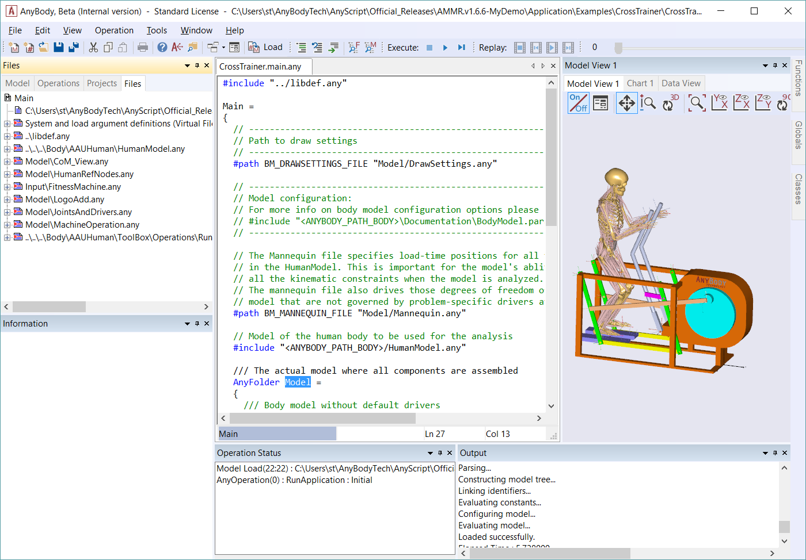
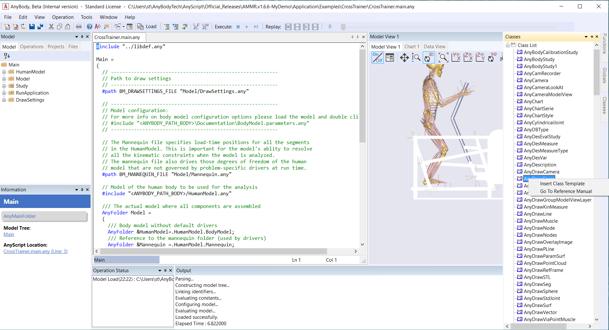
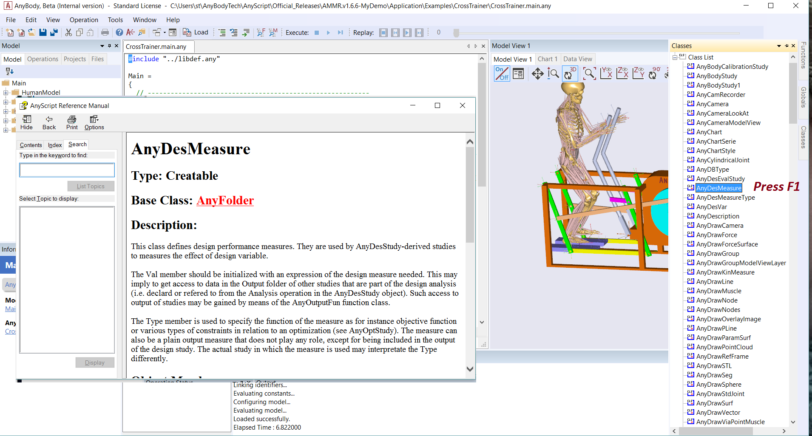

# Lesson 1: The Editor Window

Let us have a closer look at the Editor Window.



## Syntax Highlighting

Upon finishing the final character in a class name (e.g., AnySeg), the
font will turn blue. This is a good way to check for spelling errors.
For example,

```AnyScriptDoc
AnySeg
```

The editor similarly recognizes comments. If you precede the AnySeg
class name with a double-slash, the entire line turns green, and AnyBody
will ignore the line when loading the model:

```AnyScriptDoc
// AnySeg
```

You can turn entire blocks of code into a comment by encapsulating it in
a pair of `/* */` delimiters. You can also comment and un-comment
several lines by highlighting the block of lines and using the two
buttons  in 
the toolbar. This automatically places or removes double slashes in front of 
each line in the block.

Please also notice the so-called Documentation Comments. These are
comments using the following syntactical forms:  `/// ...` ,
`/** ... */` , `///< ...` , and `/**< ... */`.
The Documentation Comments are related to
a given object in the model, and these comments are treated specially so
the information can be accessed more conveniently after loading the
model. Documentation comments appear in the object descriptions of the
model; it makes it easier to understand a model just by browsing the
Model Tree.

## Auto-indent

Consistent indentation of the text in your scripts makes your code easy
to read. In AnyScript it also makes it simpler to maintain an overview
of start and end braces for a section.

You can auto-indent a block of code in one simple step by highlighting
the block and pressing Alt+F8. This can also be done through the
pull-down menu Edit->Format Indentation or by the 
button in the toolbar.

If you are ever in a situation where the model will not load, and you
suspect that you have forgotten a brace somewhere, simply highlight the
entire file and apply Auto format to it. You should be able to spot the
error soon.

## Tree Views

The structure of an AnyScript model is hierarchical, which allows
AnyBody to represent the loaded model as a tree.



What you see here is the Model Tree (D), which shows all objects in the
loaded model, in the same organizational structure that is defined by
the AnyScript code.

Right-clicking on an object in the Model Tree gives you access to many
functions, the most important of which are:

- Inserting Object Name at cursor location in the AnyScript text
  editor.
- Locating all references to an object in AnyScript
- Class Operations (example: Saving an STL file)
- Control object display in the Model View
- Getting an object description

The Object Description contains useful links which for instance, take
you the object’s creation point in AnyScript with a single click. You
can also open the Object Description by double-clicking any node in the
tree.

The information window (G) provides a condensed version of the Object
Description. Please refer to the introductory video found here for more
Model Tree navigation features.



The Files tab (in the same window as the Model Tree) gives an overview
of the ‘.any’ files used to define the current model. Double-click on
file names to navigate to the #include AnyScript statements that link
them to the parent file. Below you see the File Tree from the
CrossTrainer model:



One the right side of AnyBody there are three tabs, Functions, Globals
and Classes. These tools speed up your AnyScript experience. For
example, Classes gives you access to a list of the predefined classes in
the system - which are essentially templates for defining model objects
having specific functions.

If you are unsure on how to write the code for an object of a certain
class, first position your cursor appropriately in the AnyScript Window.
Then right click on a class name from the list and select “Insert Class
Template” (see image below). Remember to replace any placeholder text in
the inserted template as required. Read more from {doc}`Getting Started:AnyScript Programming tutorial <../A_Getting_started_anyscript/intro>`.



Similarly, the Functions tab gives you a list of inbuilt functions and
the arguments that they accept. You can learn more about each class or
function by clicking on its name in the list and pressing the F1 key,
which takes you to the AnyScript reference manual (see image below).

:::{note}
Scrolling to the bottom of the object description in the
reference manual you will typical find small example models which show
the usage of that class or function.
:::



## Find and Replace

Find and Replace functions are available in the Edit menu.
Alternatively, you can use:

> Ctrl+F for find.
> Ctrl+H for find and replace.

F3 repeats the previous find operation.

## Support for External Editors

Some users have strong preferences when it comes to editors. The AnyBody
Modeling System allows you to use any text editor like Notepad++ to
author your models, as long as it saves the files in an ASCII text
format. Please refer to the Wiki at
[anyscript.org](http://www.anyscript.org) for more details.

