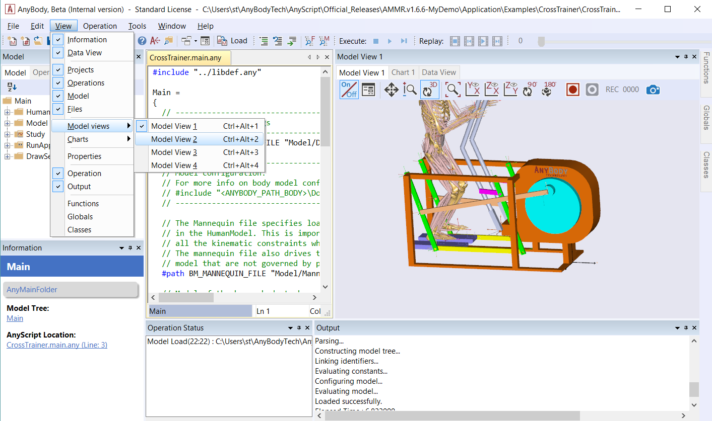
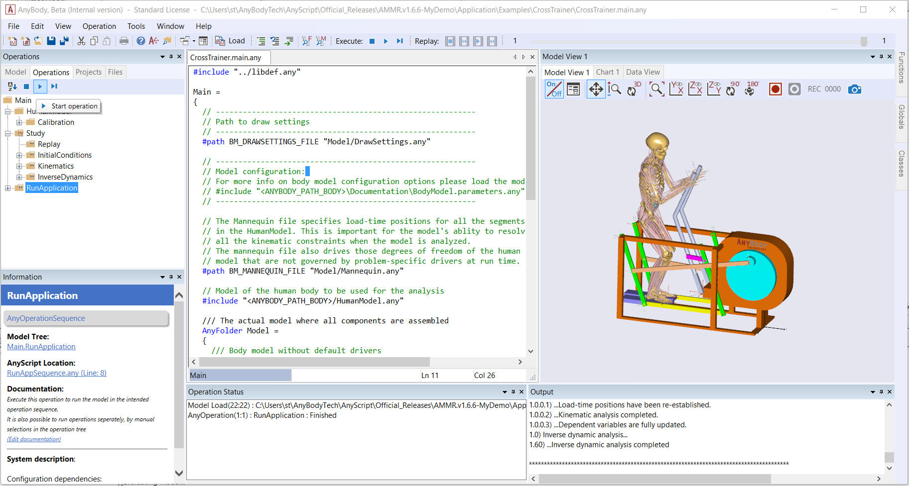
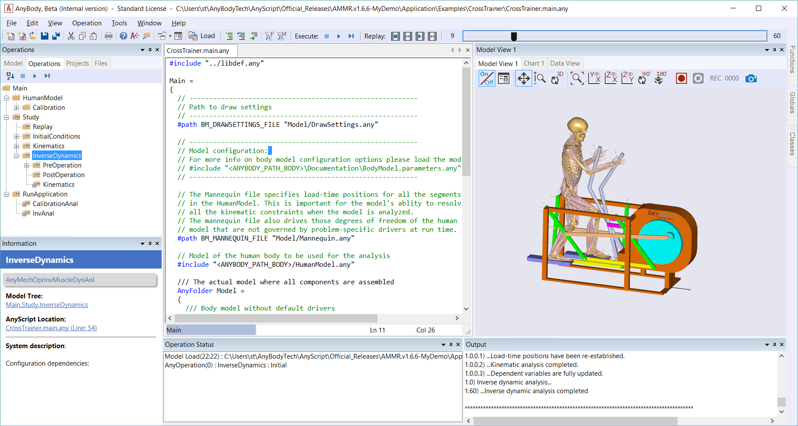
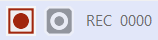
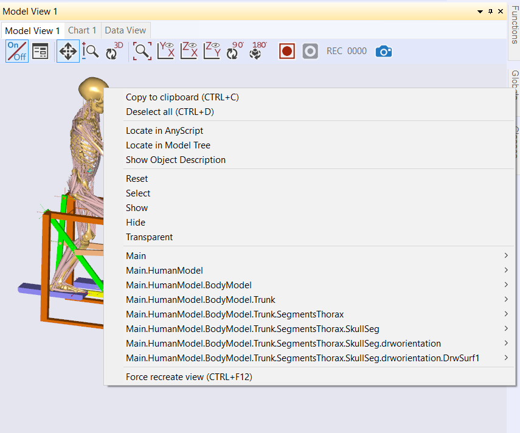
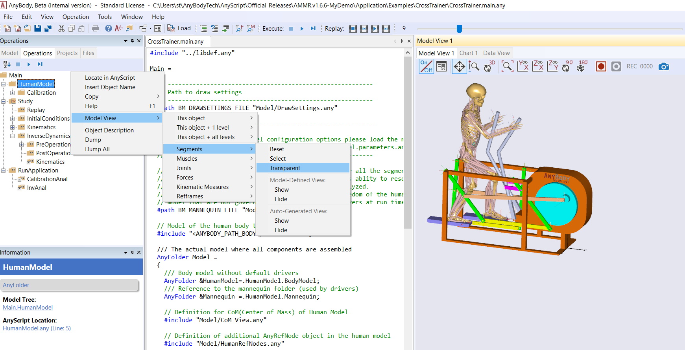
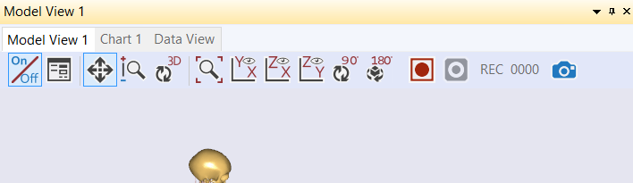

Lesson 2: The Model View Window
===============================

The Model View is a graphical representation of your AnyBody model. You
can open up to four Model Views open at the time, and you can enable
these additional windows from View->Model Views.

|Open model view windows|

The Model View only displays a particular type of model elements called
"Draw Objects" which are inserted into AnyScript definitions of
segments, muscles, nodes, surfaces, etc. For example, see the AnyDrawSeg
object used to visualize a segment in this tutorial\ **.**

Introduction to Model View
--------------------------

The Model View displays and updates the model as the simulation
operation proceeds. These updates can involve movements, shapes or
colors, etc. that reflect changes such as muscle force fluctuations.

Once the operation has been completed, the **replay slider bar** at the
top lets you freely navigate to any time instant, where both the Model
View and values in the Model Tree will be instantly updated.

The Model View allows you to save individual image frames which can
subsequently be used to make a video animation playing a speed of your
choice.

Running a Simulation
--------------------

1. Switch to the Operations tab. Select the RunApplication in the tree
   click the **Start operation icon**.

   |Model tree toolbar, start operation|

2. Once completed, merely click on InverseDynamics in the Operations
   tree. You will notice that the replay toolbar slider shifts from gray
   to blue.

3. Now try to drag the slider forwards and backward and notice how the
   Model View changes\ |Replay slider toolbarb|

If you have run several operations, you can replay them individually by
changing the selected operation in the tree.

The Toolbar
~~~~~~~~~~~

The Model View has its own toolbar with the following buttons:

|Model view toolbar|

-  **On/Off:** When switched off, the other buttons are disabled, and
   the model is no longer updated. However switching it off may speed up
   your simulations.

-  **Properties** **:** Opens the properties window.

-  **Pan tool:** Dragging the cursor with the left mouse button down
   moves the model image.

-  **Zoom tool:** Hold the left mouse button down, and drag up/down for
   zooming in/out.

-  **Spin tool:** 3D rotation of the model when left mouse button is
   held down.

-  **Zoom all:** Refits the view to show all drawing elements.

-  **Default views:** Predefined views on planes: xy plane (standard),
   yz or xz plane.

-  **Rotate 90:** Rotates the view 90 degrees

-  **Rotate 180:** Rotates the view 180 degrees

-  **Record start/stop:** Starts/stops the video frame capturing.
   Explained in more detail below.

-  **Frame count:** Displays the number of captured frames during a
   recording.

-  **Snapshot:** Takes a single snapshot of the model.

Model View Properties
~~~~~~~~~~~~~~~~~~~~~

The Model View properties contain four groups and should be displayed as
a tree in a separate tab. To learn, click on any of the properties with
the |Folder icon| symbol and hit the F1 key. This should open the
AnyScript Reference Manual where sub-properties are defined.

Recording video
~~~~~~~~~~~~~~~

The allows you to save individual image frames of a motion for
subsequent processing into a video animation.

The function works much like a video tape recorder, in the sense that
you can |Record buttons|\ push the red record button any time you like,
and what happens in the window is subsequently saved for further
processing.

Let us see how it works.

1. Try clicking the record button.

2. A file manager will pop up and request you to select a location and
   file. We recommend the Jpeg file format due to the lesser memory
   demand.

3. The frame counter will light up, the "Rec" letters flashes and the
   stop button becomes active indicating that you can push it. Any
   activity that takes place in the window will now be recorded.

4. Try manually spinning the model **a little** with the mouse and
   notice how the frame counter adds up. The system only grabs frames
   when the picture actually changes, for example when you replay your
   simulation results.

5. Push "Stop recording" when you have saved 100 frames. The system will
   ask you if you want to save the images, say yes. The saved images
   should look like this: {image\_000.jpeg, image\_001.jpeg, …,
   image\_099.jpeg]

The AnyBody Modeling System does not provide a video editing facility to
process these files into an AVI, MPEG or similar video file format, but
many third-party utilities are available for this purpose. For more
details, please see
https://anyscript.org/tips-n-tricks/creating-videos-from-your-simulations/

Working with the Model View contents
~~~~~~~~~~~~~~~~~~~~~~~~~~~~~~~~~~~~

We have already mentioned that Model View shows draw objects in the
model and that there are two types of these objects:

-  Auto-generated draw objects

-  Model-defined draw objects

Auto-generated objects are crude representations that are useful during
the development, while model-defined objects serve to make the most
pleasing views that suit your presentation needs.

All draw objects can appear in the following states:

-  Visible or invisible

-  Transparent

-  Selected

These states you can control while the model is loaded, either directly
from Model View or from the Model Tree. We shall return to this in a
moment.

Model View State Actions
~~~~~~~~~~~~~~~~~~~~~~~~

Let us take a look at how you can interact with the states of Model View
draw objects. Right-clicking an object in Model View will bring up its
context menu.

|Model view right click|

From here you can show, hide, make transparent, etc. Reset means to
bring the object back to its original state (at loading time), which can
be either visible or invisible depending on the object. The more
“complex looking” options at the bottom of the menu help you navigate to
the relevant portions of the Model Tree. Try them out, they are quite
intuitive to understand and may help you further on!

Selections in the Model View 
~~~~~~~~~~~~~~~~~~~~~~~~~~~~~

Graphical objects in the Model View can be selected by single-clicking
them with the left mouse button. Doing so will visually mark the object
as selected by turning it into a reddish color. Multiple objects can be
selected by left-clicking the objects sequentially. Left-clicking a
selected object again will remove it from the current selection. The
currently selected objects can be deselected by either left-clicking
somewhere in the background, or by using the “Deselect all” option in
the right-click context menu.

Setting the Model View from the Model Tree 
~~~~~~~~~~~~~~~~~~~~~~~~~~~~~~~~~~~~~~~~~~~

The context menu options for setting Model View state action for draw
objects is also available from the Model Tree. The context menu in the
Model Tree has a Model View item, which includes exactly the same
sub-menu we looked at above, please see the image below.

|Model tree right click menu|

Draw groups 
~~~~~~~~~~~~

You can change the state of a group of drawing objects simultaneously by
using “draw groups” that can be created by the class AnyDrawGroup.
Please refer to :doc:`Lesson 7 <lesson7>` for an example of their
usage.

.. rst-class:: without-title
.. seealso::
    **Next lesson:** :doc:`lesson3`.

.. photos

.. icons

