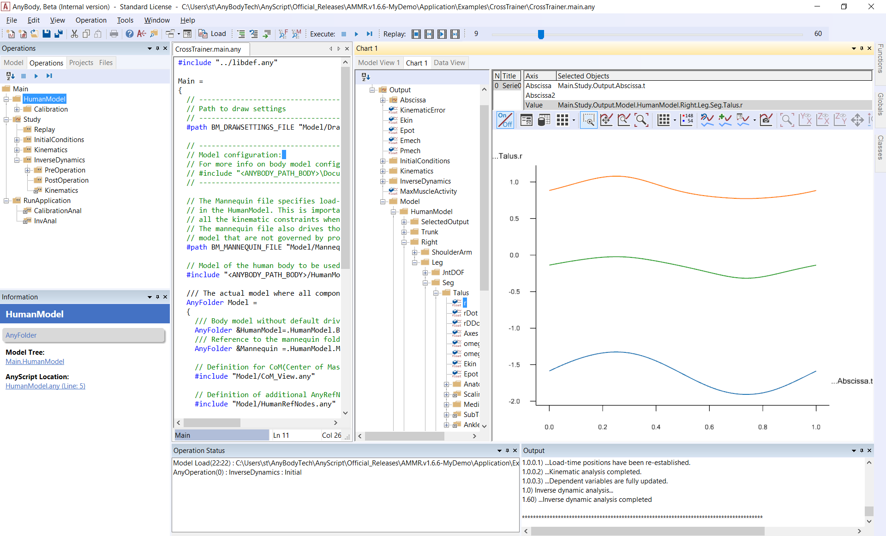
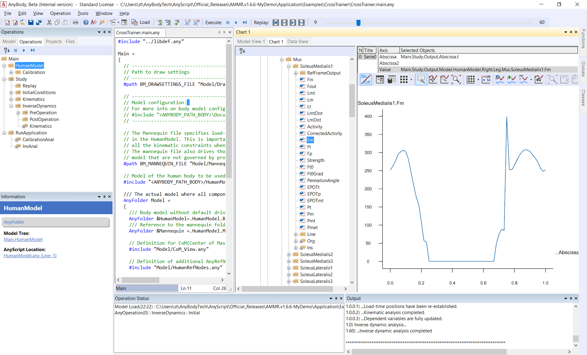
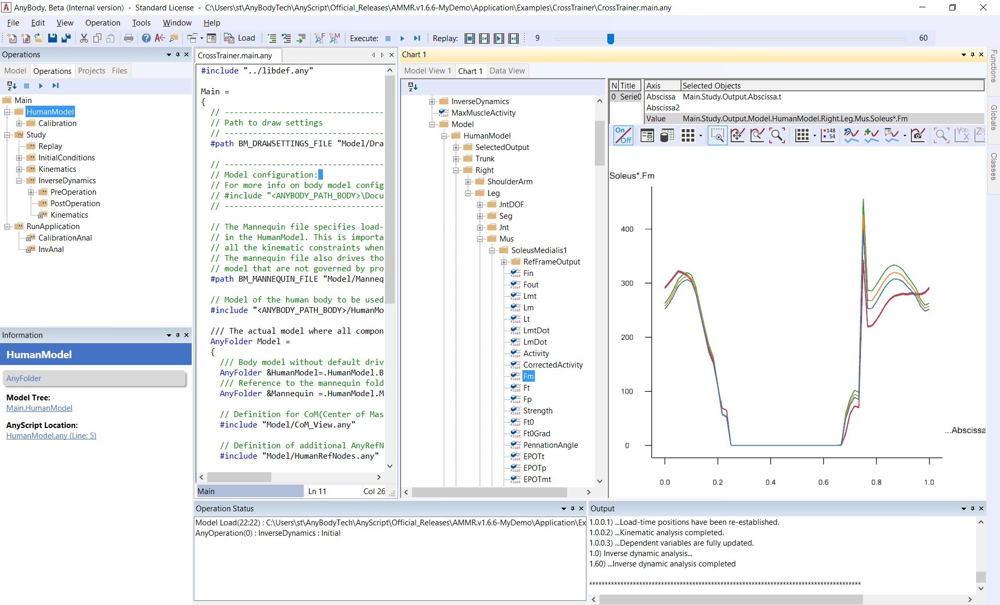
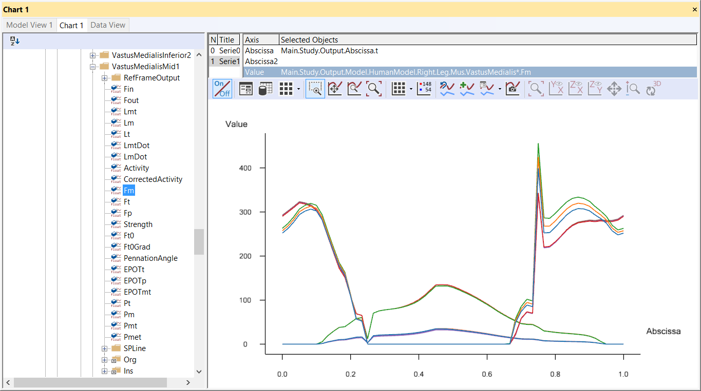
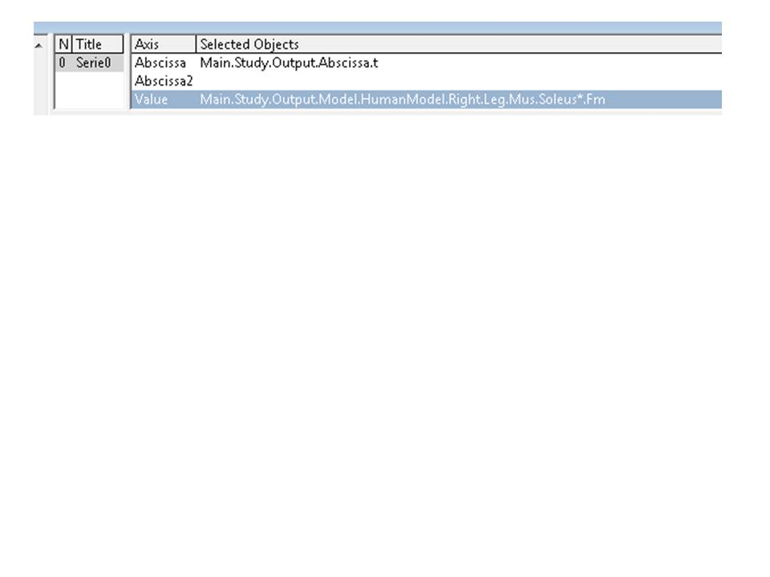

Lesson 3: The Chart View
========================

The AnyBody Modeling System has the Chart View for displaying results:

The Chart View gives you the opportunity to make two-dimensional line
plots and three-dimensional surface plots. You can make identical charts
in the Chart View and inside the model scene, i.e., in Model View.

|Chart view window|

We will use the CrossTrainer model from the previous tutorial and
investigate the results (see details on how to load and run the model in
the previous tutorial)

1. Once the operation is complete, open the Chart View by clicking the
   Chart tab in the Model View.

2. Notice that the window is divided into a tree pane on the left and
   the actual data area to the right.

3. The tree in the Chart View has been filtered so that you only see the
   output data. This particular category of data only becomes available
   when an operation is started. To reach the output data, expand the
   tree through Main.Study.Output.

Global output data
------------------

Directly below the tree’s Output node, you will find data pertaining to
the "global" properties of the model:

-  Ekin - the total kinetic energy of the system

-  Epot - the total potential energy of the system

-  Emech - the total mechanical energy of the system, i.e. the sum of
   potential and kinetic energies

-  Pmech - the mechanical power of the system

To plot some different data e.g. by clicking Ekin, Epot, and Emech in
turn.

Time-dependent data
-------------------

The usual way of looking at data is as a function of time or rather time
steps. If you expand the Model branch down to the
HumanModelHumanModel.Right.Leg.Seg section, you can investigate the
movement of e.g. a foot segment. Expand the tree until you get to the
Talus object as shown to the left. Then click the r property. This
displays three curves on the screen corresponding to the x, y, and z
coordinates of the talus’ reference frame. The color codes of the chart
view are red, green and blue in that order, so red is for x, green is
for y, and blue is for z.

|Chart view with plots|

Let us look at more complex data, let us find the muscles in the tree by
expanding to Main.Study.Output.Model.HumanModel.Right.Mus. Take the
first muscle, SoleusMedialis1SoleusMedialis1, and click the Fm property.

|Chart view, single plot|

**An asterisk (``*``) serves as a placeholder in the Chart; if you click in
the Value field and type an asterisk instead of “Medialis1”, you will
see all Soleus muscles (muscles whose names start with Soleus).**

|Chart view multiple plots with asterix|

If you choose SelectedOutput in the model tree, you will find some
pre-chosen quantities that are useful from a biomechanical point of
view, for example, joint reaction forces, moments and muscle envelopes.

Detailed data investigation
---------------------------

If you hold the mouse pointer still above the curve for a moment, a
small box will pop up and give you the name of the data series and the
value at the current cursor position (interpolated if between data
points).

Working with several Series
---------------------------

You can plot several data series in the same Chart View. If we, for
example, want to compare the muscle force of the Soleus muscles to the
VastusMedialis muscles, we press the button ‘Add series’, select the FM
property of a VastusMedialis muscle from the tree and use the asterisk
to show all the muscles the same way as we did it before.

|Chart view, series|

Exporting data
--------------

Basically, there are two options for exporting your data. You can export
the graph as an image or as a data matrix. You can also save the graph
as a separate file using or copy it to the clipboard and insert it into
an existing file.

Copy to clipboard :

-  As a bitmap picture

-  As text: copies the graph data to the clipboard in text format. You
   can paste them into a spreadsheet or a text editor.

-  As a hi-res bitmap picture

-  To Python Matplotlib chart: This function is currently in testing

Save as image file using the icon |image5|, file name, location and type
can be selected:

-  Bitmap, jpg, gif, png or tiff picture:

-  Text or CSV data file: Saves plot data in CSV format in column
   formatted text file.

-  Python file: Exports as python script creating a plot using the
   library Matplotlib.

A word of caution regarding the text option: Different countries have
different conventions for decimal numbers. Some use a point as decimal
separator, and some use a comma. The numbers copied to the clipboard
from the Chart View follow the nationality settings for the decimal
point or comma.

User-defined abscissa and 3D graphs
-----------------------------------

The default abscissa in the chart view is time. However, you can in
principle plot data against any scalar property the system has computed.
For this, replace the Main.Study.Output.Abscissa.t specification in the
Abscissa specification line.

|Chart view userdefined abscissa|

Alternatively, you can add a second abscissa to create a 3D graph. More
icons will be activated when a second abscissa is identified. Typically
these 3D graphs are used in parameter studies and optimizations. More
detailed information is available in the “Parameter studies and
optimization“ tutorial.

Continue to :doc:`Lesson 4: Browsing the Model via Model Tree and Object
Description <lesson4>`

.. |Chart view window| image:: _static/lesson3/image1.png
   :width: 6.68542in
   :height: 4.03681in

