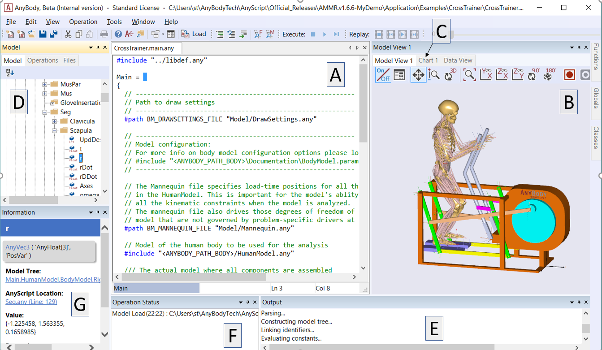
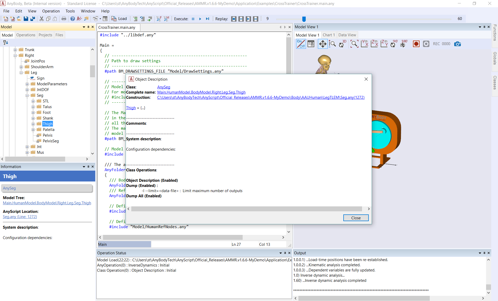
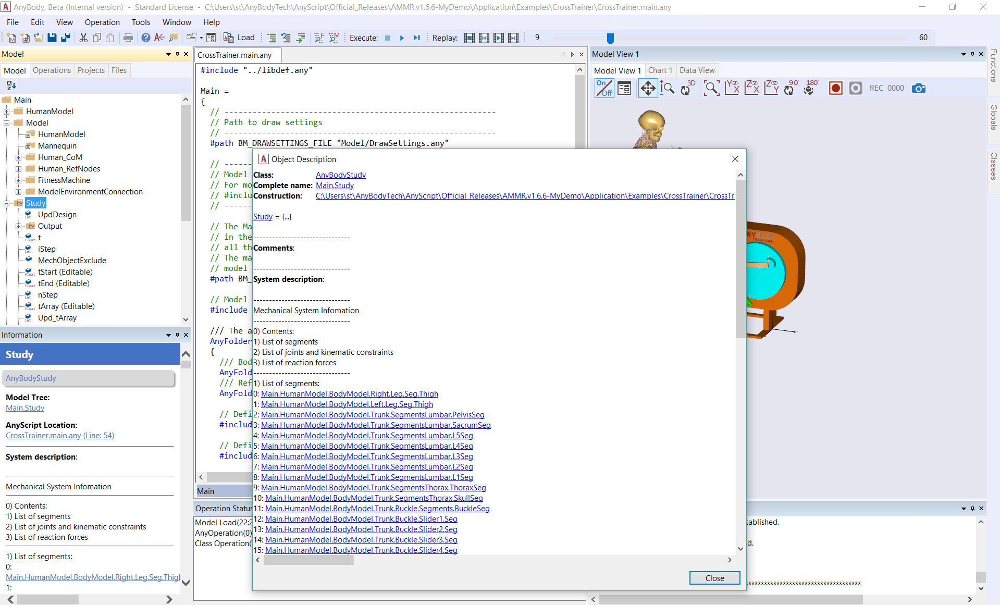

# Lesson 4: The Model Tree and Object Description

The Model Tree, on left side of the AnyBody screen, provides a quick
overview of your model.

## ‘Locate in AnyScript’ and ‘Locate in Model Tree’

These functions make it easier to navigate between the three different
modes in which the model is represented in AnyBody - the Model View,
AnyScript, and the Model Tree.

Watch the video mentioned in the {doc}`User Interface Introduction
tutorial <intro>` to learn more.

## The Object Description

The Object Description can be opened from the context menu that appears
upon right-clicking an object in the Model Tree, or alternatively by
double-clicking that object. The information window (G in the figure
below)also displays the object description in a more condensed format.

The Object Description primarily contains hyperlinks to the Model Tree
and AnyScript file where the object was constructed. In the case, you
see an empty value for this object (Thigh = {…}) since it is a folder
object which only serves as a container for sub-folders.

Mechanical objects, operation objects, study objects, etc., provide
additional information in the Object Description. Below is a picture of
the Object Description of a musculoskeletal study (class AnyBodyStudy)
containing mechanical system information of the model to be simulated:

The Comments section contains the so-called Documentation Comments,
which are made in the AnyScript source; please refer to the AnyScript
Reference Manual for more details on Documentation Comments and how to
make them.

The Object description for the study is an excellent way to get an
overview of what is contained in a model and which joints and drivers
are being applied.

**Important Notes:**

- There isn’t always a one-to-one correspondence between an AnyScript
  object and the Model Tree. Eg: When you use #include to call the same
  AnyScript file twice, from different parts of the main model file
- Reference objects (appear with a  in the Model
  Tree) are actually just local gateways to another object that may be
  created in a different part of your AnyScript code. For programming
  ease, you can use a locally created reference object as a substitute
  for your original.

This concludes this lesson on browsing the model.

:::{rst-class} without-title
:::

:::{seealso}
**Next lesson:** {doc}`lesson5`.
:::

% photos

% icons
