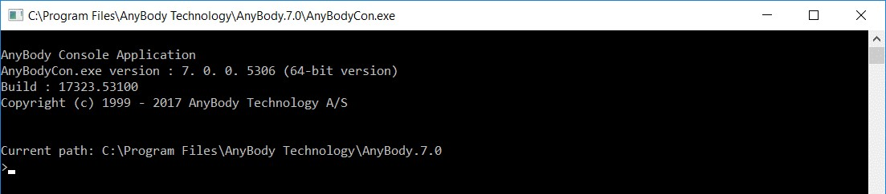

Lesson 5: The Command Line Application
======================================

The AnyBody Modeling System comes with a command line application named
AnyBodyCon.exe; sometimes referred to as the AnyBody Console
Application. You will find this .exe file in the AnyBody installation
directory.

While lacking a graphical interface, it has the full functionality of
the GUI version and is helpful for batch processing of models from
Matlab, Python, Java and JavaScript or C++.

|AnyBodyCon window|

It is not possible to build models using the console application but
gives faster performance running operations on existing model. The
console application can be used manually, or it can take input from a
macro file containing commands. 

Interactive mode
----------------

We need a model to work on, so please download and save
*Demo.outputfile.any* in a working directory.

**Important:** To start the console application:

1. Launch the command prompt, change directory to where you have saved
   Demo.outputfile.any

2. Run the .exe file using its full path, e.g. **"C:\\Program
   Files\\AnyBody Technology\\AnyBody.7.0\\AnyBodyCon.exe"**.

Console commands
----------------

It only understands eight different commands. You can always get help by
using the 'help' command or by calling AnyBodyCon with an /? argument.
The table below contains a description of the commands accepted by the
AnyBody console.

+-----------------------+----------------------------------------------------------------------------------------------+
| **Command name **     | **Functionality**                                                                            |
+=======================+==============================================================================================+
| load "filename.any"   | Example: load "demo.outputfile.any"                                                          |
|                       |                                                                                              |
|                       | Loads an AnyScript model into the system and compiles it.                                    |
+-----------------------+----------------------------------------------------------------------------------------------+
| operation <op.name>   | Example: operation Main.ArmStudy.InverseDynamics                                             |
|                       |                                                                                              |
|                       | This command sets the active operation. This must be the first thing you do after loading.   |
+-----------------------+----------------------------------------------------------------------------------------------+
| Run                   | Example: run                                                                                 |
|                       |                                                                                              |
|                       | Runs the active operation.                                                                   |
+-----------------------+----------------------------------------------------------------------------------------------+
| Runmacro              | Example runmacro “filename.anymcr”                                                           |
|                       |                                                                                              |
|                       | This command loads and executes an anymcr file.                                              |
+-----------------------+----------------------------------------------------------------------------------------------+
| Step                  | Example: step                                                                                |
|                       |                                                                                              |
|                       | Solves a single time step of the active operation.                                           |
+-----------------------+----------------------------------------------------------------------------------------------+
| Reset                 | Example: reset                                                                               |
|                       |                                                                                              |
|                       | Resets the active operation.                                                                 |
+-----------------------+----------------------------------------------------------------------------------------------+
| print <object>        | Example: print Main.ArmModel.Jnts.Shoulder.Pos                                               |
|                       |                                                                                              |
|                       | Prints the value of a single object.                                                         |
+-----------------------+----------------------------------------------------------------------------------------------+
| printdown <object>    | Example: printdown Main.ArmModel.Jnts                                                        |
|                       |                                                                                              |
|                       | Recursively prints the values of all elements in an object folder.                           |
+-----------------------+----------------------------------------------------------------------------------------------+
| exit                  | Example: Exit                                                                                |
|                       |                                                                                              |
|                       | Exits and returns to the command prompt.                                                     |
+-----------------------+----------------------------------------------------------------------------------------------+

Using the console application
-----------------------------

Start AnyBodyCon.exe from the command prompt and issue the command
sequence::

    load "demo.outputfile.any"
    operation Main.ArmStudy.InverseDynamics
    run
    exit

When the operation has finished, we are left with no idea of what the
simulation results are! But wait, the model has been programmed to write
some output files.

For understanding how open demo.outputfile.any model in the GUI Windows
version of AnyBody Modeling System. You will notice two
**AnyOutputFile** objects inside the ArmStudy.

.. code-block:: AnyScriptDoc

       // The study: Operations to be performed on the model
       AnyBodyStudy ArmStudy = {
         AnyFolder &Model = .ArmModel;
         InverseDynamics.Criterion.Type = MR_MinMaxStrict;
         Gravity = {0.0, -9.81, 0.0};
        
         AnyOutputFile OutFile1 = {
           FileName = "out1.csv";
          
           AnyVar MaxAct = .MaxMuscleActivity;
          
           AnyFloat TestTensorConst = {
             {1, 2, 3},
             {1, 2, 3}
           };
          
           AnyFloat TestTensor = {
            {
              {1, 2, 3},
              {1, 2, 3}*2,
              {1, 2, 3}*3,
              {1, 2, 3}*MaxAct
            },     
            {
              {1, 2, 3},
              {1, 2, 3}*2,
              {1, 2, 3}*3,
              {1, 2, 3}*MaxAct
            }
           };     
         };
        
         AnyOutputFile OutFile2 = {
           FileName = "out2.csv";
           Search = {"ArmModel.Muscles.*.Act*", "ArmModel.Muscles.*.Ft"};
           SepSign = ";";
         };
       };


If you open a file manager and look at the directory where you are
running the model, you will notice that two new comma-separated value
files have been generated: out1.csv and out2.csv. The semicolon
separator between numbers was defined in the AnyOutputFile above.

You can open these files in Microsoft Excel, where each column of data
corresponds to the variables defined in the AnyOutputFile command.

You can also save the output when using the GUI version by
right-clicking on the Output subfolder of the Study folder in the Model
Tree and choosing “Save Data”. We can replicate this in the console as
follows::

    load "demo.outputfile.any"
    operation Main.ArmStudy.InverseDynamics
    run
    classoperation Main.ArmStudy.Output "Save data" --file="myoutput.anydata.h5" --type=Deep
    exit

The full model output (as opposed to select variables shown in the
AnyOutputFile) will be saved in h5 format in the working directory.
These results can either be read into MATLAB or Python or be re-loaded
into AnyBody GUI (Right click the output sub-folder of the study, and
select “Load Data”) for review.

Using define and path statements for loading a model
~~~~~~~~~~~~~~~~~~~~~~~~~~~~~~~~~~~~~~~~~~~~~~~~~~~~

If you are firstly unfamiliar with these statements, you can find an
introduction in the tutorial Getting started: AnyScript Programming.
They give us some limited control over modifying the model from the
command line application. As a simple example, let us use a #define to
change the number of time steps in our operation.

.. code-block:: AnyScriptDoc
    
    §#ifndef NOSTEPS
    #define NOSTEPS 100
    #endif§
    
    // The study: Operations to be performed on the model
    
    AnyBodyStudy ArmModelStudy = {
    
        AnyFolder &Model = .ArmModel;
        
        InverseDynamics.Criterion.Type = MR_MinMaxStrict;
        
        Gravity = {0.0, -9.81, 0.0};
        
        §nStep = NOSTEPS;§
    
    };
    


If we now exchange::

    load "demo.outputfile.any"

from our operation sequence with::

    load "demo.outputfile.any" –def NOSTEPS=50

we will see that our model will only to 50 timesteps now.

Non-interactive Mode
--------------------

One of the main strengths of the console application is that it can be
executed by other software such as Matlab, Visual Basic or Python. You
can store the commands for such executions of the console in a macro
file having the extension ".anymcr".

As with the interactive mode, we can use #define- and #path statements
for purposes like changing the output file name, which may need to be
different each time the console application is called. For this, we
first need to modify the AnyScript file with an OUTPUTFILE argument:

.. code-block:: AnyScriptDoc
    
    #ifndef NOSTEPS
    
    #define NOSTEPS 100
    
    #endif
    
    §#ifndef OUTPUTFILE
    
    #define OUTPUTFILE "armoutput.anydata.h5"
    
    #endif
    
    AnyOperationSequence RunApplication = {
    
    // This operation is the inverse dynamic analysis
    
    AnyOperation &InvAnal=Main.ArmModelStudy.InverseDynamics;
    
    // This operation saves the output of the study to an h5 file in the
    Output folder
    
    AnyOperationMacro save = {
    
    MacroStr={ "classoperation Main.ArmModelStudy.Output " + strquote("Save data") + " --file=" + strquote(OUTPUTFILE) + " --type=Deep"};
    
    };
    
    };§
    
    // The study: Operations to be performed on the model
    
    AnyBodyStudy ArmModelStudy = {
    
    AnyFolder &Model = .ArmModel;
    
    InverseDynamics.Criterion.Type = MR_MinMaxStrict;
    
    Gravity = {0.0, -9.81, 0.0};
    
    nStep = NOSTEPS;
    
    };
    


Further we create an .anymcr file which we can call ‘runarm.anymcr’. It
contains the following operations::

    load "demo.outputfile.any"
    operation RunApplication
    run
    exit

We can now execute the macro file by calling

.. code-block:: bat

    C:\\Program Files\\AnyBody Technology\\AnyBody.7.0AnyBodyCon.exe" /m “runarm.anymcr”

from the folder where we saved our model and the macro
file. It will create an output file called ‘armoutput.anydata.h5’ which
we specified in the .any file.

To change the name of the output file, we can call the macro again with
a #define statement for the file name

.. code-block:: bat

    C:\\Program Files\\AnyBody Technology\\AnyBody.7.0\\AnyBodyCon.exe" /m runarm.anymcr /def OUTPUTFILE=---"\\"myoutput.anydata.h5\\""
    
What the construction ``—“\\” … \\””`` is doing, in this case,
is that it will define a quoted string for the #define statement similar
to the definition in the .any file. As a result we see that the output
is written to the file ‘myoutput.anydata.h5’.

You are now ready to let the command line application be part of a
system for biomechanical data processing of your own design.

Path specification
------------------

As mentioned earlier, you can add the path of AnyBodyCon.exe to the PATH
environmental variable for your command prompt to ease the call to
AnyBodyCon.exe from anywhere. This you can do from the command prompt
with a statement such as:

.. code-block:: bat

    path %path%;C:\\Program Files\\AnyBody Technology\\AnyBody.7.0;

It will add AnyBodyCon.exe's path to the existing path
definition. Notice that there cannot be any space between ``;``` and the
following path ``c:\\...`` and that you can see the resulting path by
simply calling the internal path command again without arguments.

These statements will only take effect until the current command prompt
is closed, but you can also add the path of AnyBodyCon.exe permanently
to the path for all command prompts. In Windows XP for instance, you do
this from Control Panel -> System under the Advanced tab. You should,
however, be aware that multiple versions of AnyBody may be installed on
the computer at the same time, and therefore, multiple versions of
``AnyBodyCon.exe`` may exist in different locations. Thus, your path
specification not only makes it easy to call ``AnyBodyCon.exe``; it will
also specify which version that will be used. This can make it unclear
which version you are actually using if you need several of them.

To be in full control of multiple AnyBody installations, you can define
aliases by the following procedure:

1. Make a directory with .bat files or shortcuts to the AnyBodyCon.exe
   version you will need. Name the bat-files so you can recognize the
   different versions, e.g. AnyBodyCon61.bat and AnyBodyCon70.bat. The
   bat files contain a single statement, the call of AnyBodyCon.exe with
   its full path.

2. Add this directory to the permanent path of the command prompt.

3. You can now call the different versions of AnyBodyCon via the bat
   files, so the bat file names are working as aliases for the real .exe
   files.

.. rst-class:: without-title
.. seealso::
    **Next lesson:** :doc:`lesson6`.


