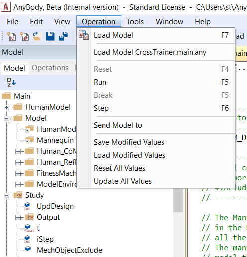

Lesson 6: Modifying the Loaded Model
====================================

In this lesson, we shall take a look at the facilities that allows
modifying the model after it had been loaded (without changing the
AnyScript)

Setting values
--------------

If you right click on an object in the Model Tree with the
**(Editable)** written in next to it, the context menu provides an
option called “Set Value”. Selecting this displays a dialog box where
you can edit the object’s value.

However, there may be other model parameters that depend on this object
value, and these aren’t automatically updated. Objects having such
dependents are marked with an **(Editable*)**. The procedure for
re-computing these dependencies is described in the next section.

“Set Value” is a Class Operation, which means that it can be summoned
from the console application if needed, as defined in the :doc:`previous
chapter <lesson5>`.

Resetting values
----------------

To reset all values to those described in AnyScript, right-click on the
“Main” object in the Model Tree and select “Reset Values”, which will
reset all values in the model. This action is also available from the
menu Operations > Reset All Values.

“Reset values” is a Class Operation, which means that it can be summoned
from the console application if needed, as defined in the :doc:`previous
chapter <lesson5>`.

|Operations menu|

Updating dependent values
-------------------------

As explained in the “Setting values” section above, all dependencies of
the updated object are not automatically updated. right-click on the
“Main” object in the Model Tree and select “Update Values”, which will
update all dependent values in the model.

Moreover, it is also available from the menu Operations->Update All
Values (see also the image above). “Update values” is a Class Operation,
which means that it can be summoned from the console application if
needed, as defined in the previous chapter.

Storing Modified Values – Saving and Loading Values
---------------------------------------------------

Modified values are not saved back into the AnyScript source code, and
in the general case, this is not possible. However, the Main folder is
equipped with two Class Operations, one for saving (“Save Values”) and
one for loading values (“Load Values”). These functions are also
available from the menu Operations->Save Modified Values and
Operations->Load Modified Values, respectively. The saving operation
saves all values that are marked as modified to a file. It is a simple
text-based file that can be opened and modified in a text/AnyScript
editor. Also, it can be included in the model source, at least if the
values are not initialized in the original code (or this initialization
is removed).

The file can later be read into the same model (or a similar model)
using the loading operation. This operation will load all the values in
the same objects (by using the complete name), and it will mark all
these value objects as modified. It will basically be as if you apply
“Set Value” manually to all the value-objects in question. This means
that no automatic updating is carried out by the loading operation.

Continue to Lesson 7: Wrapping the Model with AnyBody Project.

