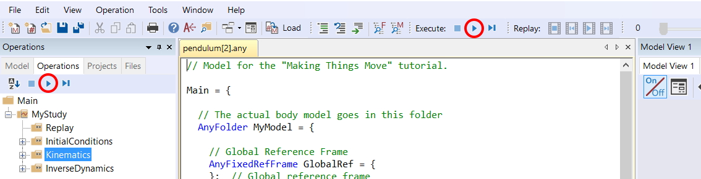

# Making things move

Most biomechanical investigations involve some sort of movement, so
getting the model to move in the desired way is at the core of
musculoskeletal modeling. The AnyBody Modeling System offers many and
rather advanced methods to make this happen. This tutorial explains the
basics and some of the more common approaches.

:::{figure} _static/intro/cutting.jpg
:align: center
:width: 50%
:::

The figure above is a sequence of superimposed images
illustrating a cutting movement. In the AnyBody Model View window, this will of
course be an animation. The point of the figure, however, is that the
movement is derived from a combination of joint articulations, and this
introduces the concept of degrees-of-freedom, which we shall abbreviate
in the following as DoF.

The number of DoFs in a model can be thought of as the number of
different articulations the model has. The knee, for instance, is a
hinge joint and can only flex or extend with respect to its predefined
rotation axis, so this joint provides one DoF to the model. The hip
joint, on the other hand, is a spherical joint, so it has three
different rotations and therefore provides three DoFs to the model.
Anatomically, these three DoFs might be called flexion/extension,
abduction/adduction and internal/external rotation, but this is just one
possible choice of terminology related to a selected coordinate system.
We could choose infinitely many other angle definitions and sequences in
the hip. Regardless of the choice there would always only be three
independent possibilities, so the concept of DoF is rather general, and
we shall explore it in a little more detail in the following on a very
simple model.

Please download and save the file
{download}`pendulum.any <Downloads/pendulum.any>` in a working directory. Load
the model into AnyBody and open a new model view. You should see a
vertical segment with a point at each end. It is, in fact, a pendulum
model linked to the global reference frame by a revolute joint at its
upper end point. We use this example because it is very simple and has a
remote similarity with a human limb.

A hinged pendulum, like a forearm hinged at the elbow, will have just
one DoF. If you unfold the list of operations under MyStudy in the
Operation window on the left side of the screen, you can select
Kinematics and click the run-button as shown below:



Instead of a moving pendulum you are rewarded with an error message:

```none
Model is kinematically indeterminate : Position analysis failed : 6 independent constraints and 7 unknowns
```

The message means that there is one equation missing in the system to
define the position of the pendulum. This comes down to the fact that
the pendulum has one DoF, i.e. one movement opportunity, and the model
does not specify how to move that one DoF. The system has no way of
determining which movement to perform before we have specified it.

In the following lessons we will look at simple and more advanced ways
to drive a model. For simplicity, we’ll stick with the simple pendulum,
but exactly the same principles apply to much more complex models.

:::{rst-class} without-title
:::

:::{seealso}
**Next lesson:** {doc}`Let’s initially review simple drivers in Lesson 1 <lesson1>`.
:::
