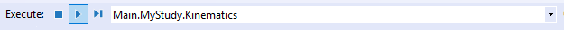

# Lesson1: Simple drivers

As mentioned above, we often have preconceived ideas about a system’s
natural DoFs, such as abduction of the shoulder or flexion of the knee.
In the case of the pendulum, we might get the idea that the natural DoF
is its rotational angle away from its resting vertical position. And we
can very easily drive the pendulum using this DoF.

The simplest mechanism of motion drivers in AnyBody is called
`AnyKinMotion`. With Pendulum.any open in an editor and the model loaded,
please place the cursor in the editor window just below then ending
brace of the `AnySeg Pendulum` definition. Then click the Classes tab on
the right-hand side of the editor window. Unfold the class list and
scroll down to find `AnyKinMotion` . Right-click and insert an instance at
the cursor position:

```AnyScriptDoc
AnySeg Pendulum = {
    Mass = 1;
    Jii = {1, 0.01, 1}/10;
    AnyRefNode Origin = {
        sRel = {0, 0.5, 0};
    };
    AnyRefNode P1 = {
        sRel = {0, -0.5, 0};
    };
    AnyDrawSeg drw = {};
};
§AnyKinMotion <ObjectName> =
{
  //RefFrames = ;
  //Surfaces = ;
  //KinMeasureArr = ;
  //KinMeasureIndexArr = ;
  //MeasureOrganizer = ;
  //CType = ;
  //WeightFun = ;
  //DriverPos0 = ;
  //DriverVel0 = ;
  //DriverAcc0 = ;
  //AnyKinMeasure &<Insert name0> = <Insert object reference (or full object definition)>; You can make any number of these objects!
  //AnyParamFun &<Insert name0> = <Insert object reference (or full object definition)>; You can make any number of these objects!
};§
```

The prototype of the `AnyKinMotion` class is set up to allow several
different options. But the simplest of these is to directly specify
something to drive and a function to drive it with. So we start out by
giving the object a name and removing all of its content.

```AnyScriptDoc
AnyKinMotion §JointDriver§ =
{
};
```

Then we specify what to drive by making reference to the pendulum joint:

```AnyScriptDoc
AnyKinMotion JointDriver =
{
    §AnyRevoluteJoint &Jnt = .Joint;§
};
```

Now we have specified what to drive, so all that’s left is to create a
function to drive it with. AnyBody contains a number of predefined
function types that you can find in the Classes Tree, for instance
AnyFunPolynomial. As the name indicates, this is a polynomial function
and it can have any number of coefficients. A common use is to drive
motion either in a very standardized way, for instance with constant
velocity or constant acceleration, or to drive a motion by data to which
a polynomial has been fitted.

Try inserting the red part of the code below:

```AnyScriptDoc
AnyKinMotion JointDriver =
{
    AnyRevoluteJoint &Jnt = .Joint;
    §AnyFunPolynomial DriverFun = {
        PolyCoef = {{0, 5, -0.4}};
    };§
};
```

In the matrix `PolyCoef`, each row contains the coefficients for a time
function driving one degree of freedom. The revolute joint we are
driving only has one degree of freedom, so the matrix only has one row,
but it still has to be defined as a matrix rather than a vector, i.e.
with double braces at each end. The polynomial coefficients then come in
increasing order and define the following driver function:

$$
\textrm{Joint angle} = 0 + 5t - 0.4t^2 \textrm{[rad]}
$$

To get higher polynomial orders, simply add more terms to the vector.

Now try loading the model. If you have followed the instructions, you
should no longer get the warning that that model is kinematically
indeterminate. It now has the same number of drivers as degrees of
freedom.

Next, run the model. Select `Main.MyStudy.Kinematics` from the Operations
dropdown menu in the toolbar, and click the "Run" button:



If you have a model view open, you should see the pendulum starting to
move and accelerate as it rotates a little more than one round before
the end of the analysis at *t* = 1 second.

The use of `AnyKinMotion` objects to drive a model is in principle always
like this, but you can select any Kinematic Measure to drive, i.e. not
just a simple joint angle, and you can use any function derived from the
abstract AnyParamFun class to drive it with.

In {doc}`lesson 2 <lesson2>` we shall see how this same mechanism
allows you to drive the pendulum by motion capture data.

:::{rst-class} without-title
:::

:::{seealso}
**Next lesson:** {doc}`lesson2`.
:::
