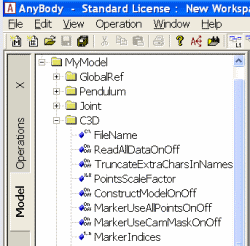
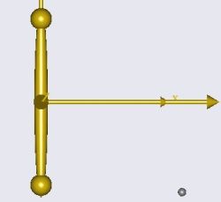
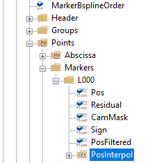
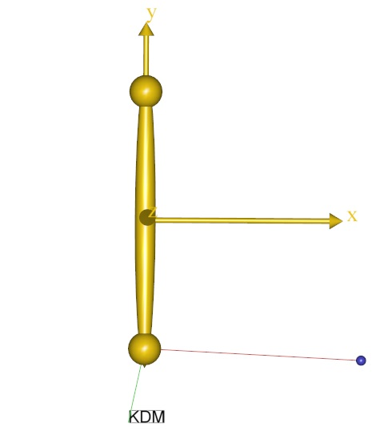
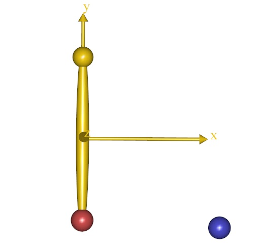

Lesson 2: Using motion capture data
-----------------------------------

In biomechanics, we often want to make our models move as we have
measured in the laboratory and the measurement technique would often be
tracking of optical markers in space by means of synchronized cameras.
There are many such systems available commercially, but a common feature
of most of the systems is that they are capable of saving data on a
standard format called a C3D file. Such a file contains data of the
spatial trajectory of optical markers fixed to the object whose motion
we want to record. The C3D file can also contain analog data such as
force platform measurements or EMG. To make things easy, AnyBody can
read the data from a C3D file directly. Please download and save the
file :download:`pendulum.c3d <Downloads/pendulum.c3d>` in the directory where
you saved the Pendulum.any file.

Then place the cursor in the editor window just before the AnyKinMotion
object, click the Classes tab, unfold the class list, and locate the
AnyInputC3D class. Right-click the class and choose “Insert Class
Template”.

.. code-block:: AnyScriptDoc

    AnyInputC3D <ObjectName> = 
    {
      FileName = "";
      //ReadAllDataOnOff = On;
      //TruncateExtraCharsInNamesOnOff = On;
      //PointsScaleFactor = 1;
      //ConstructModelOnOff = On;
      //MarkerUseAllPointsOnOff = Off;
      //MarkerUseCamMaskOnOff = On;
      //MarkerIndices = ;
      //MarkerLabels = ;
      //MarkerFilterIndex = 0;
      //ProcessedDataFilterIndex = 0;
      //AnalogFilterIndex = -1;
      /*Filter = 
      {
      z0 = ;
      AutomaticInitialConditionOnOff = On;
      FilterForwardBackwardOnOff = On;
      N = 2;
      W = ;
      Fs = 0;
      Fc = {10};
      Type = LowPass;
      };*/
      //WriteMarkerDataToFilesOnOff = Off;
      //MarkerScaleXYZ = {0.025, 0.025, 0.025};
      //MarkerRGB = {0.65, 0.65, 0.65};
      //MarkerDrawOnOff = On;
      //MarkerInterPolType = Bspline;
      //MarkerBsplineOrder = 8;
    };

As you can see, the class has a lot of settings, but for now we shall
only use two of them, namely FileName and ConstructChartOnOff. We also
give a name to the object:

.. code-block:: AnyScriptDoc

    AnyInputC3D §C3D§ = {
      FileName = "§pendulum.c3d§";
      //TruncateExtraCharsInNamesOnOff = On;
      //MakeNameUniqueStr = "_";
      //PointsScaleFactor = 1;
      //ConstructModelOnOff = On;
      §ConstructChartOnOff = Off;§

``ConstructChartOnOff`` instructs the C3D object to not draw 3D
trajectories.

Now, try loading the model again. You may get the following error
message:

.. code-block:: none

    Time, 't', has an invalid value for this interpolation

C3D files contain marker trajectories covering a certain time span and
what goes on outside that interval is undefined. Furthermore, the very
beginning and very end of that time span may not be useful for the
motion interpolation due to initial transients. If you have a C3D file
of unknown duration, then you somehow have to figure out its start and
end times to enable AnyBody to analyze it. A simple way to do this is to
allow AnyBody to load the file by temporarily disabling the study
section of your model. This will eliminate the study’s conflicting start
and end times. Just block-select the study section and click the
“Comment out” tool button over the editor window:

.. code-block:: AnyScriptDoc

    // The study: Operations to be performed on the model
    §//  AnyBodyStudy MyStudy = {
    //    AnyFolder &Model = .MyModel;
    //    Gravity = {0.0, -9.81, 0.0};
    //  };§

Now the model should load with no problems, and you can go to the tree
view in the left hand side of the screen, click the Model tab and unfold
the MyModel tree down to the C3D object as shown below.

|Model tree|

A bit down in this object you find the Header section. When you unfold
it you get access to a number of basic properties of the C3D file. Each
time you double-click a property, a window will pop up and give you its
value. The important properties in question are these:

.. code-block:: AnyScriptDoc

    FirstFrameNo = 1
    LastFrameNo = 1000
    VideoFrameRate = 100

This shows that the file has a total of 1000 frames at 100 frames/sec,
i.e. the simulation time spans ten seconds. We can now go to the editor
window and remove the temporary double slashes in front of each line in
the study section.

.. code-block:: AnyScriptDoc

    // The study: Operations to be performed on the model
    §AnyBodyStudy MyStudy = {
        AnyFolder &Model = .MyModel;
        Gravity = {0.0, -9.81, 0.0};
    };§

…and insert specifications of simulation time:

.. code-block:: AnyScriptDoc

    AnyBodyStudy MyStudy = {
        AnyFolder &Model = .MyModel;
        Gravity = {0.0, -9.81, 0.0};
    §tStart = 0.05;
        tEnd = 9.95;§
    };

There is also an automated way to handle the problem. The frame rate
variables we have just processed manually can also be referred to
directly in the study section, such that the tStart and tEnd parameters
automatically adapt to the C3D file. Try this instead:

.. code-block:: AnyScriptDoc

    AnyBodyStudy MyStudy = {
      AnyFolder &Model = .MyModel;
      Gravity = {0.0, -9.81, 0.0};
      §AnyIntVar FirstFrame = Main.MyModel.C3D.Header.FirstFrameNo; 
      AnyIntVar LastFrame = Main.MyModel.C3D.Header.LastFrameNo;
      tStart = FirstFrame/Main.MyModel.C3D.Header.VideoFrameRate+2*Kinematics.ApproxVelAccPerturb;
      tEnd = LastFrame/Main.MyModel.C3D.Header.VideoFrameRate-2*Kinematics.ApproxVelAccPerturb;§
    };

Notice that we start the simulation ``2*Kinematics.ApproxVelAccPerturb``
after the beginning of the recorded motion and we end it similarly
before the end of the recording. The variable
Kinematics.ApproxVelAccPerturb contains information about the
algorithm’s necessary elbow room on each side of the analyzed interval.
This eliminates possible numerical trouble with end points.

Now the model should load and the Model View window (open a new one if
you do not have it) will display a small, grey dot to the right of the
pendulum end.

|small dot|

The small dot is in fact the single marker contained in Pendulum.c3d. A
typical file from a real motion capture experiment can contain dozens of
markers, but in the interest of simplicity we have just included a
single one here. The AnyInputC3D object automatically creates the small
dots and the drivers necessary to move them around as they were
recorded. If you run the Kinematics operation (Click the Operation tab
in the tree view on the left hand side of the screen, select Kinematics
and click run), you will see the pendulum move as before, while the
marker performs an oscillating motion back and forth (Tip: if the motion
is too fast to see properly, increase the number of time steps, nStep,
in the study).

So how do we get the marker to drive the pendulum? This can be done
quite easily with the AnyKinDriverMarker object. The steps are:

1. Remove the existing driver that makes the pendulum rotate.

2. Drive the marker point, P1, on the pendulum to follow the data
   recorded in the C3D file.

Start by selecting the existing AnyKinMotion driver and comment it out
of the model. That takes care of step 1.

Then click the Classes tab on the left hand side of the editor window,
insert a new AnyKinDriverMarker template, and give it a name:

.. code-block:: AnyScriptDoc

    §AnyKinDriverMarker C3Dmotion = 
      {
        //MeasureOrganizer = {};
        //CType = ;
        //WeightFun = {};
        //DriverPos0 = {};
        //DriverVel0 = {};
        //DriverAcc0 = {};
        AnyRefFrame &<Insert name0> = <Insert object reference (or full object definition)>;
        //AnyRefFrame &<Insert name1> = <Insert object reference (or full object definition)>;
        //AnyParamFun &<Insert name0> = <Insert object reference (or full object definition)>;
      };§

Just as before, the AnyKinDriverMarker object needs to know what to
drive and what to drive it with. The “what to drive” part is the
position of P1 on the pendulum. This is specified with the first
reference frame in the object:

.. code-block:: AnyScriptDoc

    AnyKinDriverMarker C3Dmotion = 
    {
        //MeasureOrganizer = {};
        //CType = ;
        //WeightFun = {};
        //DriverPos0 = {};
        //DriverVel0 = {};
        //DriverAcc0 = {};
        §AnyRefFrame &Marker = .Pendulum.P1;§
        //AnyRefFrame &<Insert name1> = <Insert object reference (or full object definition)>;
        //AnyParamFun &<Insert name0> = <Insert object reference (or full object definition)>;
    };

The marker coordinates in the C3D file are recorded in the laboratory
coordinate system, which we chall assume is our global reference frame.
Driving from GlobalRef is default in linear measures, so we need not
mention GlobalRef explicitly in the AnyKinDriverMarker object.

We are going to drive the point directly by means of the interpolation
function specifying the marker trajectory in the C3D object. First, give
a reasonable name to the AnyParamFun and remove the stuff after the
equality sign:

.. code-block:: AnyScriptDoc

    AnyKinDriverMarker C3Dmotion = 
    {
      //MeasureOrganizer = {};
      //CType = ;
      //WeightFun = {};
      //DriverPos0 = {};
      //DriverVel0 = {};
      //DriverAcc0 = {};
      AnyRefFrame &Marker = .Pendulum.P1;
      //AnyRefFrame &<Insert name1> = <Insert object reference (or full object definition)>;
      AnyParamFun §&Trajectory = ;§
    };

Then click the Model tab in the tree view on the left hand side of the
editor window, unfold the MyModel branch and subsequently the C3D
object, Points, Markers, L000 and arrive at PosInterpol as shown below.

|Model tree 2|

This is the actual interpolation function of the marker in question.
Place the cursor after the equality sign of the AnyParamFun line,
right-click the PosInterpol object, and choose “Insert object name”. You
should get this:

.. code-block:: AnyScriptDoc

   AnyKinDriverMarker C3Dmotion = 
    {
      //MeasureOrganizer = {};
      //CType = ;
      //WeightFun = {};
      //DriverPos0 = {};
      //DriverVel0 = {};
      //DriverAcc0 = {};
      AnyRefFrame &Marker = .Pendulum.P1;
      //AnyRefFrame &<Insert name1> = <Insert object reference (or full object definition)>;
      AnyParamFun &Trajectory = 
      Main.MyModel.C3D.Points.Markers.L000.PosInterpol;
    };

Now load the model and run the kinematic analysis. You will get the
following error message:

.. code-block:: none

    Model is kinematically over-constrained : Position analysis failed : 2 unsolvable constraint(s) found

It is time to think back to the concept of degrees-of-freedom, DoF. In
the beginning of the tutorial, we established that the free pendulum has
one DoF. But the marker trajectory has three coordinates and therefore
wants to drive P1 of the pendulum in x, y and z, i.e. two DoFs more than
we have available. There are two possible solutions to this problem.
Either we pick only one of the directions given by the marker and let
the revolute joint decide the rest, or we have to accept that the
pendulum cannot follow the marker completely in all three DoFs, i.e.
something has to give.

Driving just one direction would be fairly simple in this case, but in a
more complicated model with many markers, the selection of a subset of
directions to drive can be a very tedious process. Another aspect to
consider is that marker data are measured and therefore always infested
with various types of errors and noise. One of the serious errors in
motion capture technology is the so-called soft tissue artifact or skin
artifact. It comes from the fact that markers are placed on the skin at
some distance from the bone whose motion they are supposed to record.
Between the marker and the bone are layers of skin, fat and muscle, so
the marker never moves exactly with the bone. It is therefore natural in
the model to presume that the connection between the marker and the bone
is not a rigid one, and when that is the case, AnyBody will accept
drivers on more DoFs than the model actually has.

Resolving the kinematics in the presence of moving markers is somewhat
more complicated numerically, so we have to ask for a specific
kinematics solver that can handle it. This is done in the study section:

.. code-block:: AnyScriptDoc

  AnyBodyStudy MyStudy = {
    AnyFolder &Model = .MyModel;
    Gravity = {0.0, -9.81, 0.0};
   AnyIntVar FirstFrame = Main.MyModel.C3D.Header.FirstFrameNo; 
    AnyIntVar LastFrame = Main.MyModel.C3D.Header.LastFrameNo;
    tStart = FirstFrame/Main.MyModel.C3D.Header.VideoFrameRate+2*Kinematics.ApproxVelAccPerturb;
    tEnd = LastFrame/Main.MyModel.C3D.Header.VideoFrameRate-2*Kinematics.ApproxVelAccPerturb;
    §InitialConditions.SolverType = KinSolOverDeterminate;
    Kinematics.SolverType = KinSolOverDeterminate;§
  };

The two additional lines select a kinematic solver for the
InitialConditions and Kinematics operations that will accept more
kinematic constraints than the system has DoFs. Now you can reload and
run the kinematic analysis and you should see the pendulum following the
marker movement. You cannot see the marker during the movement because
it is hidden inside the pendulum. In fact, the marker is not strictly
necessary for the analysis and we can get rid of it altogether by an
additional specification in the C3D object:

.. code-block:: AnyScriptDoc

    AnyInputC3D C3D = {
      FileName = "pendulum.c3d";
      //ReadAllDataOnOff = On;
      //TruncateExtraCharsInNamesOnOff = On;
      //PointsScaleFactor = 1;
      §ConstructModelOnOff = Off;§
      ConstructChartOnOff = Off;
      //MarkerUseAllPointsOnOff = Off;
      //MarkerUseCamMaskOnOff = On;
      //MarkerIndices = ;
      //MarkerLabels = ;
      //MarkerFilterIndex = 0;
      //ProcessedDataFilterIndex = 0;
      //AnalogFilterIndex = -1;
      /*Filter = 
      {
      z0 = ;
      AutomaticInitialConditionOnOff = On;
      FilterForwardBackwardOnOff = On;
      N = 2;
      W = ;
      Fs = 0;
      Fc = {10};
      Type = LowPass;
      };*/
      //WriteMarkerDataToFilesOnOff = Off;
      //MarkerScaleXYZ = {0.025, 0.025, 0.025};
      //MarkerRGB = {0.65, 0.65, 0.65};
      //MarkerDrawOnOff = On;
      //MarkerInterPolType = Bspline;
      //MarkerBsplineOrder = 8;

With the unnecessary marker gone from the model, the kinematic analysis
runs much faster than before. Each marker adds DoFs and constraints to
the model, and they require solution time. It is therefore more
efficient to leave the markers out unless you really need them.

Now that there is driver between pendulum and the marker, it is possible
to simultaneously draw both the point on the pendulum and the marker
from the C3D file. To do this, start by placing the cursor inside the
AnyKinDriverMarker object.

Then click the Classes tab on the left hand side of the editor window,
insert a new AnyDrawKinMeasure template, and give it a name:

.. code-block:: AnyScriptDoc

    AnyKinDriverMarker C3Dmotion = 
    {
      //MeasureOrganizer = {};
      //CType = ;
      //WeightFun = {};
      //DriverPos0 = {};
      //DriverVel0 = {};
      //DriverAcc0 = {};
      AnyRefFrame &Marker = .Pendulum.P1;
      //AnyRefFrame &<Insert name1> = <Insert object reference (or full object definition)>;
      AnyParamFun &Trajectory = 
      Main.MyModel.C3D.Points.Markers.L000.PosInterpol;
      
      §AnyDrawKinMeasure drw = 
      {
        //Visible = On;
        //Opacity = 1;
        //RGB1 = {0.8, 0.3, 0.3};
        //RGB2 = {0.3, 0.8, 0.3};
        //RGB3 = {0.3, 0.3, 0.8};
        //RGB4 = {0.8, 0.5, 0.2};
        //Label = On;
        //Size = 0.02;
        //Line = On;
        //Text = "";
        //TextSize = 30;
      };§      
    };

If you reload the model, you should see something like this:

|Model view AnyKinDriver marker|

The blue dot illustrates the marker from the c3d file and the red line
is drawn to illustrate the difference between the point on the segment
and the measured point. Please notice that there is a small ball hidden
inside yellow sphere from the drawing of the segment. The plot also
shows a label “KDM”, which indicates that it is an AnyKinDriverMarker
that is drawn.

The line between the two points and the label can be removed by changing
the Label and Line settings to Off. Let us also change the size of the
dots such that we can see both the point on the segment as well as the
measured point.

.. code-block:: AnyScriptDoc

      AnyDrawKinMeasure drw = 
      {
        //Visible = On;
        //Opacity = 1;
        //RGB1 = {0.8, 0.3, 0.3};
        //RGB2 = {0.3, 0.8, 0.3};
        //RGB3 = {0.3, 0.3, 0.8};
        //RGB4 = {0.8, 0.5, 0.2};
        §Label = Off;
        Size = 0.07;
        Line = Off; §
        //Text = "";
        //TextSize = 30;
      };      

Reloading the model should show you something like this:

|Model view DrawKinMeasure|

Let us briefly investigate the kinematic constraints of our model. Click
the Model tab in the tree view on the left hand side of the screen and
unfold the Joint branch. Inside you find Constraints, and after
unfolding that branch you find the property CType. If you double-click
it, the popup window shows the following:

.. code-block:: AnyScriptDoc

    CType = {Hard, Hard, Hard, Hard, Hard}

CType appears to be a vector with five components, owing to the fact
that a revolute joint has five constraints, and CType specifies that all
of these are Hard. This means that the kinematic solver is not allowed
to violate any of them.

If you similarly locate and unfold the C3DMotion object you again find a
CType, and double-clicking it reveals

.. code-block:: AnyScriptDoc

    CType = {Soft, Soft, Soft}

We have implicitly specified that the joint is a hard constraint while
the marker is a soft constraint. Joints automatically have their
constraint types set to Hard and AnyKinDriverMarker objects
automatically have soft constraints, but these rules can be overridden
by the user by explicit specification of CType in the respective
objects.

In :doc:`Lesson 3 <lesson3>` we investigate how to filter noise out of
the measured data.

.. rst-class:: without-title
.. seealso::
    **Next lesson:** :doc:`lesson3`.

