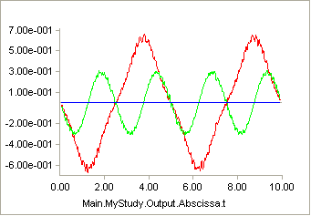
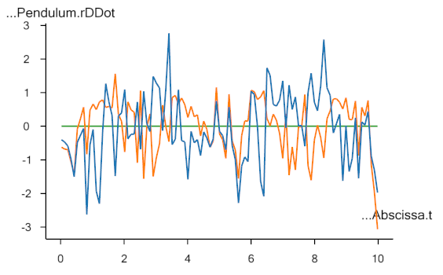
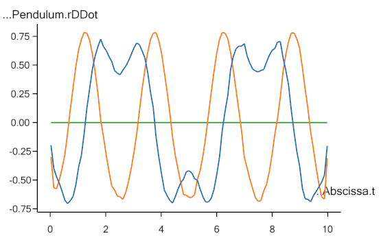

Lesson3: Noise and filters
--------------------------

Let us run the Kinematics operation and investigate the results. After
the operation has completed, please open the Chart View tab and
plot the position vector of the pendulum as shown below:

|pendulum.r|

The blue, orange and green curves designate x, y and z locations
respectively of the center of mass of the pendulum. We see the expected
sinusoidal curves for x and y and a z location that is constantly zero.
It all looks fine and dandy, but closer investigation will reveal that
it is not.

If we plot the velocity, ``rDot``, rather than the position, we begin to see
the problem:

|pendulum.rdot|

It is obvious that the motion is not as smooth as we would expect from
the first set of graphs, and it gets even worse if we plot the
accelerations, ``rDDot``:

|pendulum.rddot|

Since forces in a mechanical system stem from accelerations, an analysis
of the force in this system would lead to a completely different result
than we would expect. The problem is due to noise in the measurements,
and noise is always present in several different forms. Although it can
be minimized by careful experimental procedures and good equipment, it
can never be completely removed. Therefore, it is always necessary to
filter motion capture data before use.

The ``AnyInputC3D`` class has a default filter built in. It is a special
case of a more general filter class in AnyBody, and the special case is
a second-order, zero-phase Butterworth filter with a cutoff frequency of
10 Hz. If you do not specify anything else, then this is what you are
going to get. In this case, it is obviously not sufficient, so let’s
play a bit with the settings and see whether we can get better results.

The filter section of the ``AnyInputC3D`` section is currently inactive.
Please remove the ``/* */`` surrounding the object, and you will have the
following:

.. code-block:: AnyScriptDoc

      Filter =
      {
      z0 = ;
      AutomaticInitialConditionOnOff = On;
      FilterForwardBackwardOnOff = On;
      N = 2;
      W = ;
      Fs = 0.0;
      Fc = {10.0};
      Type = LowPass;
      };

The first two lines pertain to the filter’s initial condition, and ``z0``
cannot be set when ``AutomaticInitialConditionOnOff`` is set to ``On``, meaning
that the initial condition of the filter gets computed automatically.

The automatic computation is an attempt to minimize initial transients
in the signal, but it may not always be good enough, and in this case it
can be relevant to set the initial conditions. For now, let us keep the
automatic setting and therefore remove the incomplete line with ``z0``:

.. code-block:: AnyScriptDoc

    Filter = {
        §// z0 = ;§
        AutomaticInitialConditionOnOff = On;
        FilterForwardBackwardOnOff = On;
        N = 2;
        W = ;
        Fs = 0;
        Fc = {10};
        Type = LowPass;
    };

The third line, ``FilterForwardBackwardOnOff``, is mostly included for the
sake of completeness. When it is set to ``On``, zero phase shift in the
filter is obtained by filtering twice, i.e. first forward and then
backward in the signal, which is the standard approach. Please leave it
as it is unless you really know what you are doing.

The property ``N`` is simply the order of the filter. The default value is 2
and higher values lead to sharper cuts at the specified cutoff
frequency.

``W`` is the normalized cutoff frequency. Allowed values are between zero
and one with one corresponding to half of the sampling frequency.
However, it is not allowed to specify ``W`` when filtering data from a C3D
file because the file already contains information about the sampling
frequency, so you can safely delete this line.

``Fs`` is the sampling frequency, and like ``W``, we cannot specify it when
reading from a C3D file, so please remove this line.

``Fc`` is the cutoff frequency and is set to 10 Hz by default. The dilemma
with filters is always that they can reduce noise and other undesirable
elements of the signal, but in the process they also may remove
desirable parts of the signal or even introduce artifacts. 10 Hz is a
relatively safe value for experiments with human motion, but it would
obviously not be a safe choice if we were modeling insect motion or
other phenomena with higher frequency content.

Finally, the last line specifies the type of the filter as low pass,
which is the relevant value for a signal like this, where the noise is
high frequency, but the filters in AnyBody also allow for other types.
Please refer to the reference manual for a complete description.

In the graph of ``Pendulum.r`` above, the red curve seems to have a
frequency of about 0.2 Hz and the green curve about 0.4 Hz. This is
safely below our present 10 Hz cutoff frequency, so there seems to be
room to eliminate more noise by using a lower value of ``Fc``. If we change

.. code-block:: AnyScriptDoc

    Filter = {
        // z0 = ;
        AutomaticInitialConditionOnOff = On;
        FilterForwardBackwardOnOff = On;
        N = 2;
        Fc = {§2§};
        Type = LowPass;
    };

…we can get the following accelerations:

|pendulumfilt|

They look much more reasonable, but notice that each end of the curve is
influenced by the initial conditions of the filter. Filters remove noise
but they are also sources of artifacts in the model and nothing is ever
completely perfect.

In this and the previous lesson we used the system’s ability to handle
over-constrained models to drive the pendulum with a marker that
supplies three constraints even though the pendulum only has one degree
of freedom. The additional information in the redundant constraints can
be used to our advantage for other purposes too, as we shall see in
:doc:`Lesson 4 <lesson4>`.

.. rst-class:: without-title
.. seealso::
    **Next lesson:** :doc:`lesson4`.

.. |pendulum.r| image:: _static/lesson3/image1.png

