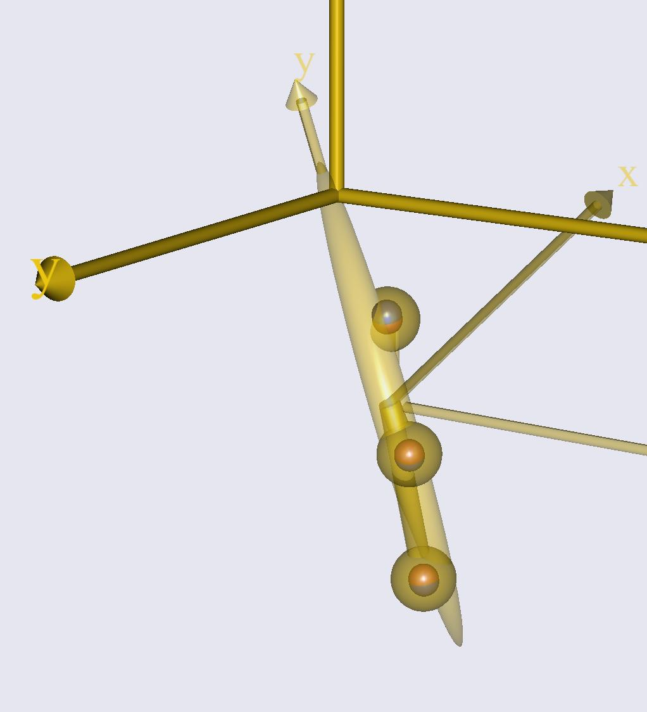
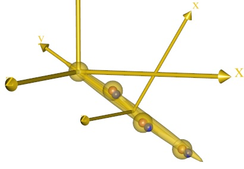
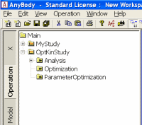
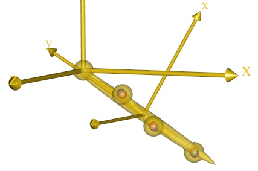
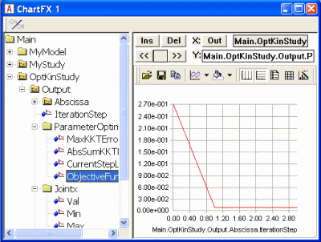
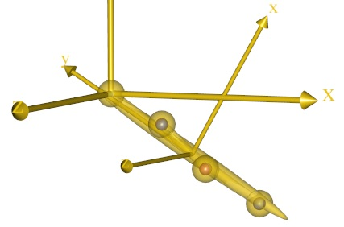

# Lesson 4: Parameter identification

In this lesson we shall consider a source of uncertainty on motion
capture experiments and musculoskeletal modeling in general that is
completely different from the noise of the preceding section.

The issue is that a musculoskeletal model contains assumptions
about the model dimensions that we really cannot know in advance. A femur, for
instance, is attached to the hip joint located rather deeply inside the lower
abdomen and we cannot palpate it or measure its location without advanced
imaging techniques.

For a musculoskeletal model of a given individual, properties as basic as the
length of the femur and the location of the hip joint center are always somewhat
uncertain. In this section, we are going to see how the data in a C3D file can
help us automatically determine these parameters with good accuracy.

Please download and save the file
{download}`multiple.c3d <Downloads/multiple.c3d>`.

Then close all open windows in AnyBody and create a new Main file by
clicking the ‘M’ tool button in the upper left hand corner of the main
frame. This give you a dialog to create an empty model into which you can insert an
`AnyInputC3D` object, refer to the {file}`multiple.c3d` file and specify the
filter as we did before:

```AnyScriptDoc
Main = {

  // The actual body model goes in this folder
  AnyFolder MyModel = {
    // Global Reference Frame
    AnyFixedRefFrame GlobalRef = {
    // Todo: Add points for grounding of the model here
    };  // Global reference frame

    AnyInputC3D §C3D§ =
    {
      FileName = §"multiple.c3d"§;
      //ReadAllDataOnOff = On;
      //TruncateExtraCharsInNamesOnOff = On;
      //MakeNameUniqueStr = "_";
      //PointsScaleFactor = 1.0;
      //ConstructModelOnOff = On;
      §ConstructChartOnOff = Off;§
      //ConstructWeightFunUsingResidualOnOff = Off;
      //GapFillUsingResidualsOnOff = Off;
      //MarkerUseAllPointsOnOff = Off;
      //MarkerUseCamMaskOnOff = On;
      //MarkerIndices = ;
      //MarkerLabels = ;
      //MarkerFilterIndex = 0;
      //ProcessedDataFilterIndex = 0;
      //AnalogFilterIndex = -1;
      §Filter =
      {
        AutomaticInitialConditionOnOff = On;
        FilterForwardBackwardOnOff = On;
        N = 2;
        Fc = {3};
        Type = LowPass;
      };§
      //WeightThreshold = 0.0;
      //WeightOutput = {{0.0, 1.0}, {0.0, 1.0}, {0.0, 1.0}};
      //WeightTransitionTime = 0.1;
      //SearchAndReplace = ;
      //WriteMarkerDataToFilesOnOff = Off;
      //MarkerScaleXYZ = {0.025, 0.025, 0.025};
      §MarkerRGB = {0, 0, 1};§
      //MarkerDrawOnOff = On;
      //MarkerInterPolType = Bspline;
      //MarkerBsplineOrder = 4;
    };
```

Notice that we have also colored the markers blue with the `MarkerRGB`
property and disabled the plot of the 3D trajectories with the
`ConstructChartOnOff` property. We also set the duration of the movement
to automatically fit the C3D file as we have done before:

```AnyScriptDoc
// The study: Operations to be performed on the model
AnyBodyStudy MyStudy = {
  AnyFolder &Model = .MyModel;
  Gravity = {0.0, -9.81, 0.0};
  §AnyIntVar FirstFrame = Main.MyModel.C3D.Header.FirstFrameNo;
  AnyIntVar LastFrame = Main.MyModel.C3D.Header.LastFrameNo;
  tStart = FirstFrame/Main.MyModel.C3D.Header.VideoFrameRate+2*Kinematics.ApproxVelAccPerturb;
  tEnd = LastFrame/Main.MyModel.C3D.Header.VideoFrameRate-2*Kinematics.ApproxVelAccPerturb;§
};
```

Now you should be able to load and run the model and see three blue
markers travel through space in a motion that bears some resemblance to
a football kick. The three markers are located on the same segment, and
we happen to know that this segment is hinged in its upper end just like
the pendulum in the previous lesson, but we do not know exactly where.

Three markers per segment are typical for many motion capture marker
protocols. A segment with no other constraints, i.e. floating freely in
space, has six degrees of freedom.

Although each marker provides three constraints, two markers are not enough to
determine the location of the segment uniquely. The subtle explanation is that
the markers are not independent because they are located on the same segment and
therefore have their mutual distance given. In short, three non-collinear
markers is the minimal set necessary to determine the location in space of an
otherwise unconstrained segment.

Three markers then provide a total of nine constraints where the segment
only has six DoFs, and the additional information from these markers can
be used to determine other unknown factors in the model.

Let us initially define a segment and some guesses of where the three
markers may be located on it:

```AnyScriptDoc
Main = {

  // The actual body model goes in this folder
  AnyFolder MyModel = {
    // Global Reference Frame
    AnyFixedRefFrame GlobalRef = {
      // Todo: Add points for grounding of the model here
    };  // Global reference frame

    §AnySeg Leg = {
      Mass = 1;
      Jii = {1, 0.01, 1}/15;
      AnyRefNode R1 = {
        sRel = {0.038, 0.18, 0.022};
      };
      AnyRefNode R2 = {
        sRel = {-0.015, -0.104, 0.028};
      };
      AnyRefNode R3 = {
        sRel = {-0.022, -0.403, -0.023};
      };
      AnyDrawSeg drw = {};
    };§

    AnyInputC3D C3D =
    {
      FileName = "multiple.c3d";
```

Now we just need to use AnyKinDriverMarker objects to tie the marker
trajectories to the three points we have defined on the segment and
select the solvers for over-determinate problems exactly as we did in
the previous lesson (don’t forget to also select the over-determinate
kinematics solver in the study section):

```AnyScriptDoc
  §AnyKinDriverMarker C3Dmotion1 = {
    AnyRefFrame &Marker = .Leg.R1;
    AnyParamFun &Trajectory=
    Main.MyModel.C3D.Points.Markers.L000.PosInterpol;
    AnyDrawKinMeasure drw = {
      Label = Off;Size = 0.03;Line = Off;
    };
  };
  AnyKinDriverMarker C3Dmotion2 = {
    AnyRefFrame &Marker = .Leg.R2;
    AnyParamFun &Trajectory =
    Main.MyModel.C3D.Points.Markers.L001.PosInterpol;
    AnyDrawKinMeasure drw = {
      Label = Off;Size = 0.03;Line = Off;
    };
  };
  AnyKinDriverMarker C3Dmotion3 = {
    AnyRefFrame &Marker = .Leg.R3;
    AnyParamFun &Trajectory =
    Main.MyModel.C3D.Points.Markers.L002.PosInterpol;
    AnyDrawKinMeasure drw = {
      Label = Off;Size = 0.03;Line = Off;
    };
  };§
}; // MyModel

// The study: Operations to be performed on the model
  AnyBodyStudy MyStudy = {
    AnyFolder &Model = .MyModel;
    Gravity = {0.0, -9.81, 0.0};
    AnyIntVar FirstFrame = Main.MyModel.C3D.Header.FirstFrameNo;
    AnyIntVar LastFrame = Main.MyModel.C3D.Header.LastFrameNo;
    tStart = FirstFrame/Main.MyModel.C3D.Header.VideoFrameRate+2*Kinematics.ApproxVelAccPerturb;
    tEnd = LastFrame/Main.MyModel.C3D.Header.VideoFrameRate-2*Kinematics.ApproxVelAccPerturb;
    §InitialConditions.SolverType = KinSolOverDeterminate;
    Kinematics.SolverType = KinSolOverDeterminate;§
  };
```

Now that we have created the AnyDrawKinMeasure objects, it is no longer
necessary to have the points drawn in the C3D object. So let us get rid
of them:

```AnyScriptDoc
AnyInputC3D C3D =
{
  FileName = "multiple.c3d";
  //ReadAllDataOnOff = On;
  //TruncateExtraCharsInNamesOnOff = On;
  //MakeNameUniqueStr = "_";
  //PointsScaleFactor = 1.0;
  §ConstructModelOnOff = Off;§
  ConstructChartOnOff = Off;
  //ConstructWeightFunUsingResidualOnOff = Off;
  //GapFillUsingResidualsOnOff = Off;
  //MarkerUseAllPointsOnOff = Off;
```

It is now possible to run the Kinematics operation and see the leg
segment move with the markers. The actual markers are not visible
because they disappear inside the segment, but if we make the segment
semi-transparent, they become visible:

```AnyScriptDoc
AnySeg Leg = {
  Mass = 1;
  Jii = {1, 0.01, 1}/15;
  AnyRefNode R1 = {
    sRel = {0.038, 0.18, 0.022};
  };
  AnyRefNode R2 = {
    sRel = {-0.015, -0.104, 0.028};
  };
  AnyRefNode R3 = {
    sRel = {-0.022, -0.403, -0.023};
  };
  AnyDrawSeg drw = {
    §Opacity = 0.5;§
  };
};
```

We will also add a a drawing for the global reference frame, to better visualize the movement.

```AnyScriptDoc
AnyFixedRefFrame GlobalRef = {
   §AnyDrawRefFrame drw = {};§
};
```



The animation reveals that the leg seems to rotate about the origin of
the global reference frame, although we have not explicitly defined any
joint. The point must obviously correspond to some point on the leg
segment, but we do not know exactly where that is.

Let us define a joint point at an approximate location on the leg:

```AnyScriptDoc
AnySeg Leg = {
  Mass = 1;
  Jii = {1, 0.01, 1}/15;
  §AnyRefNode Joint = {
    sRel = {0, 0.45, 0};
  };§
  AnyRefNode R1 = {
    sRel = {0.038, 0.18, 0.022};
  };
  AnyRefNode R2 = {
    sRel = {-0.015, -0.104, 0.028};
  };
  AnyRefNode R3 = {
    sRel = {-0.022, -0.403, -0.023};
  };
  AnyDrawSeg drw = {Opacity = 0.5;};
};
```

If you reload and re-run the model, you will see that the new point is
approximately but not exactly the point the leg appears to rotate about.
We could probably improve the location manually, but let us accept the
location for now.

The next step is to create a revolute joint between the new point and
the origin of the global reference frame:

```AnyScriptDoc
§AnyRevoluteJoint Joint = {
  AnyRefFrame &Ground = .GlobalRef;
  AnyRefFrame &Pendulum = .Leg.Joint;
};§

AnyInputC3D C3D =
{
  FileName = "multiple.c3d";
```

A reload and re-run will reveal that the point is now forced to coincide
exactly with the origin of the coordinate system. This is because, as
opposed to `AnyKinDriverMarker` objects, joints by default contain hard
constraints that must be exactly fulfilled. The consequence is that the
blue marker dots inside the leg segment points now seem to deviate a bit
further from the center of the points.



There seems to be some unknown location of the joint center on the leg
and possibly also of the marker points on the segment that we could
either find by experimenting manually with the local coordinates of the
points on the leg segment or, alternatively, ask AnyBody to find for us.

We are going to do the latter, and we shall employ a special study that
AnyBody has implemented for the purpose. Please click on the Classes tab
in the Tree View on the right side of the screen, expand the
Class List, and scroll down to find the `AnyOptKinStudy`. Place the cursor
after the end brace of the existing AnyBody Study, right-click the
`AnyOptKinStudy` in the Class Tree, and insert a template of the class:

```AnyScriptDoc
// The study: Operations to be performed on the model
  AnyBodyStudy MyStudy = {
    AnyFolder &Model = .MyModel;
    Gravity = {0.0, -9.81, 0.0};
    AnyIntVar FirstFrame = Main.MyModel.C3D.Header.FirstFrameNo;
    AnyIntVar LastFrame = Main.MyModel.C3D.Header.LastFrameNo;
    tStart = FirstFrame/Main.MyModel.C3D.Header.VideoFrameRate+2*Kinematics.ApproxVelAccPerturb;
    tEnd = LastFrame/Main.MyModel.C3D.Header.VideoFrameRate-2*Kinematics.ApproxVelAccPerturb;
    InitialConditions.SolverType = KinSolOverDeterminate;
    Kinematics.SolverType = KinSolOverDeterminate;
  };
  §AnyOptKinStudy <ObjectName> =
  {
    //LogFile = "";
    /*Analysis =
    {
    Settings =
    {
    Echo = On;
    ModelSceneUpdate = On;
    };
    //AnyOperation &<Insert name0> = <Insert object reference (or full object definition)>; You can make any number of these objects!
    };*/
    //MaxIterationStep = 100;
    AnyDesMeasure &<Insert name0> = <Insert object reference (or full object definition)>;
    //AnyDesMeasure &<Insert name1> = <Insert object reference (or full object definition)>; You can make any number of these objects!
    //AnyDesVar &<Insert name0> = <Insert object reference (or full object definition)>; You can make any number of these objects!
  };§
```

The `AnyOptKinStudy`’s structure is very similar to the general optimization
class `AnyOptStudy`, but it contains an algorithm specially made for kinematic
parameter optimization and several of the necessary definitions are implicit, so
the study is simple to use. All we have to do is to specify the unknown
parameters in the model and the location of the kinematic analysis necessary to
evaluate them.

We begin with the latter and make the following changes:

```AnyScriptDoc
AnyOptKinStudy §OptKinStudy§ =
{
  §Analysis = {
     AnyOperation &Operation= ..MyStudy.Kinematics;
  };§
  //MaxIterationStep = 100;
  AnyDesMeasure &<Insert name0> = <Insert object reference (or full object definition)>;
};
```

Now we have specified that we want to optimize parameters to fit the
experimental data used in the Kinematics analysis of the original study,
i.e. the C3D data.

The next step is to specify which parameters to
optimize. In this case, we are uncertain about the precise location of
the revolute joint in the upper end of the segment. Its location is
defined by the local coordinates to the `AnyRefNode` ‘Joint’ on the leg
segment:

```AnyScriptDoc
AnyOptKinStudy OptKinStudy =
{
  Analysis = {
     AnyOperation &Operation= ..MyStudy.Kinematics;
  };
  //MaxIterationStep = 100;
  §AnyDesVar Jointx = {
    Val = Main.MyModel.Leg.Joint.sRel[0];
  };§
};
```

This specifies that the zero’th coordinate, i.e. the local x coordinate
of the Joint node on the Leg segment is a variable in the problem.

Similarly, we can add the y and z coordinates:

```AnyScriptDoc
AnyOptKinStudy OptKinStudy =
{
  Analysis = {
     AnyOperation &Operation= ..MyStudy.Kinematics;
  };
  //MaxIterationStep = 100;
  AnyDesVar Jointx = {
    Val = Main.MyModel.Leg.Joint.sRel[0];
  };
  §AnyDesVar Jointy = {
    Val = Main.MyModel.Leg.Joint.sRel[1];
  };
  AnyDesVar Jointz = {
    Val = Main.MyModel.Leg.Joint.sRel[2];
  };§
};
```

Now we can reload the model and a new set of operations will have
appeared:



Pick the `ParameterOptimization` and click the *Run* button.

If you have a Model View open, you will see the pendulum starting to move and
messages about the convergence of the process will appear in the Report View at
the bottom of the screen.

Pay close attention to the location of the small blue markers inside the larger
yellow dots on the segment. The blue dots should move considerably closer to the
centers of the yellow balls as a consequence of the optimization as shown below,
where the left picture is the location of the markers before the joint location
optimization, and the right picture shows the situation after optimization.

 

This notion is confirmed by opening opening the chart view and plotting the
development of the objective function of the problem:



The graph shows that the norm of the difference between the measured
marker positions and the corresponding nodes on the segment over the
entire motion was reduced from about 0.27 to about 0.01.

Now that we have identified a better location of the joint node on the
segment, we might want to save it for later use.

This is done by right-clicking the `OptKinStudy` in the operations tree on the
left hand side of the mainframe and selecting “Save design” from the context
menu. This opens a file manager dialogue. Please navigate to the directory where
you keep the model and specify a name for the new file, for instance
{file}`Opt1.txt`.

If you open the new file you can see the saved values:

```none
Jointx 1.574794116583949e-002
Jointy 4.907819352974447e-001
Jointz 6.507036792142549e-004
```

You can easily load these values into your model from the same context
menu every time you have reloaded the model.

Of course, to have the
coordinates of the Joint node permanently updated, you can also simply
copy and paste them into the sRel value directly in the Leg segment
definition in your AnyScript file. Don’t do it yet, though. We are going
to play a little more with the possibilities.

The optimization we have just completed has presumed that we know well
where the markers are located on the segment but are in doubt about the
location of the joint, such as would often be the case in a gait
analysis involving a hip joint.

However, even if we use a marker
protocol that places most markers on well-defined bony landmarks in the
model, there may still be doubt about the precise locations of some or
all the markers, and the result of the joint location optimization also
shows that especially the first marker location deviates somewhat from
its corresponding AnyRefNode. This indicates that there are other
sources of error in the model, than the joint location, and indeed the
recent relocation of the joint may be influenced by errors that are not
associated with the joint location.

This is the reason why it was
advised to not permanently update the joint location. When the
optimization is redefined to also comprise the marker positions. It is
better to simultaneously optimize the joint position and marker
locations.

The marker node position is included in the optimization in the same way
as the Joint node:

```AnyScriptDoc
AnyOptKinStudy OptKinStudy =
{
  Analysis = {
     AnyOperation &Operation= ..MyStudy.Kinematics;
  };
  //MaxIterationStep = 100;
  AnyDesVar Jointx = {
    Val = Main.MyModel.Leg.Joint.sRel[0];
  };
  AnyDesVar Jointy = {
    Val = Main.MyModel.Leg.Joint.sRel[1];
  };
  AnyDesVar Jointz = {
    Val = Main.MyModel.Leg.Joint.sRel[2];
  };
  §AnyDesVar R1x = {
    Val = Main.MyModel.Leg.R1.sRel[0];
  };
  AnyDesVar R1y = {
    Val = Main.MyModel.Leg.R1.sRel[1];
  };
  AnyDesVar R1z = {
    Val = Main.MyModel.Leg.R1.sRel[2];
  };§
```

Please reload and re-run the `Main.OptKinStudy.ParameterOptimization`.

:::{note}
To speed up the optimization study, try to disable Model View by clicking the "On/Off" button in the Model view toolbar.
:::

The convergence should be quite fast in such a small model, and you arrive at the following solution:



The solution appears to be bull’s eye in terms of placing the markers in
the center of the yellow nodes. This is confirmed by the optimized value
of the objective function: the residual of the distance between markers
and nodes is now less than 0.001.

It appears that we have obtained an almost perfect solution, but why not
include all the marker nodes in the optimization? Well, we can try
adding another one:

```AnyScriptDoc
AnyOptKinStudy OptKinStudy =
{
  Analysis = {
     AnyOperation &Operation= ..MyStudy.Kinematics;
  };
  //MaxIterationStep = 100;
  AnyDesVar Jointx = {
    Val = Main.MyModel.Leg.Joint.sRel[0];
  };
  AnyDesVar Jointy = {
    Val = Main.MyModel.Leg.Joint.sRel[1];
  };
  AnyDesVar Jointz = {
    Val = Main.MyModel.Leg.Joint.sRel[2];
  };
  AnyDesVar R1x = {
    Val = Main.MyModel.Leg.R1.sRel[0];
  };
  AnyDesVar R1y = {
    Val = Main.MyModel.Leg.R1.sRel[1];
  };
  AnyDesVar R1z = {
    Val = Main.MyModel.Leg.R1.sRel[2];
  };
  §AnyDesVar R2x = {
    Val = Main.MyModel.Leg.R2.sRel[0];
  };
  AnyDesVar R2y = {
    Val = Main.MyModel.Leg.R2.sRel[1];
  };
  AnyDesVar R2z = {
    Val = Main.MyModel.Leg.R2.sRel[2];
  };§
```

When you reload the model and re-run the ParameterOptimization, you will
find that the optimization takes much more time, the convergence is much
less stable, the segment moves far away from the marker nodes in the
process, and eventually the algorithm gives up with the error message:

```none
Optimization failed : Failed to solve position analysis
```

You can understand the reason for this behavior if you look at the
figure of the previous result above and imagine that we make all four
visible points variable, i.e. in a sense cut them loose from the segment
in the optimization problem. Then the segment can float freely in space
while the nodes are free to fall exactly on top of their respective
markers and the joint at the origin of the global reference frame.

In other words, such a problem has infinitely many perfect solutions and the
location of the segment cannot be determined from the optimization problem. In
other words, for a problem like this to be well-posed, some points have to be
fixed.

When we add the second marker position to the optimization problem, we
leave the model with only two fixed nodes, namely the third marker node and the
joint node. This leaves the segment the opportunity to rotate freely about an
axis through the two fixed points, and the optimization problem is ill-posed
because it does not determine the rotation of the segment.

Obviously, in a practical case you would select as the invariable marker
nodes those that are physiologically well-determined, for instance from
easily accessible bony landmarks.

Hopefully, this simple, bottom-up example has demonstrated how the
technology works.

% seealso: `Andersen et al. 2009 <http://www.tandfonline.com/doi/abs/10.1080/10255840903067080>`_
% for details on how the parameter identification algorithm works, and the math behind.

Now, let us change our focus to a top-down approach
and see what the technology can do with real motion capture data. That
will be the subject of {doc}`Lesson 5 <lesson5>`.

:::{rst-class} without-title
:::

:::{seealso}
**Next lesson:** {doc}`lesson5`.
:::
