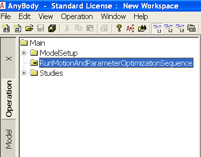

Lesson 5: Using real data
-------------------------

Without further ado, let us import a C3D file and drive a model. The
AnyBody Modeling System offers you virtually unlimited ways of doing
things, and probably more than the average user can comprehend, so we
are going to start with a simple and top-down procedure: Version 1.2 of
the AnyScript Managed Model Repository, on which this tutorial is built,
which comes with the installation of AnyBody, contains two pre-cooked
models that are very easy to drive with your own data and which contain
some really neat features for data processing.

1. Go to the :file:`Application\Examples` folder to find a folder called
   MoCapModel.

2. Take a copy of the entire folder and call it something else, for
   instance MyMoCapModel. You may even want to place it in a new
   directory parallel to :file:`Application\Examples`, for instance
   :file:`Application\MyModels`, to avoid polluting the original examples.
   Please note that you have to put a copy of the libdef.any file into
   the new directory in that case.

3. Browse into the MyMoCapModel folder.

4. Open the file :file:`MoCap_LowerBody.main.any` in the AnyBody Modeling
   System.

As the name indicates, this is a gait model comprising only the lower
extremities and the necessary part of the upper body for attachment of
muscles. The motion imposed on the original model is gait over three
force platforms, but you can easily modify this to any other movement,
simply by importing a different C3D file to drive the model with.

In the top of the file you find a brief description of the procedure.
Don’t worry about that for now, but browse a little further down to find
this:

.. code-block:: AnyScriptDoc

    //***************************
    //Set this to one if you want to run the motion and Parameter Optimization identification
    #define MotionAndParameterOptimizationModel 0
    //Set this to one if you want to run the inverse dynamic analysis
    #define InverseDynamicModel 1
    //Usually only have one of the two switches active
    //***************************

These lines define the two model executions that you normally have to
perform to process a new data set. When
MotionAndParameterOptimizationModel=1, the system performs an
optimization of the model to fit the C3D data you have recorded. This is
much more than simply making the model follow the marker trajectories;
it also optimizes the model parameters such as segment lengths and
marker placements, based on the recorded data.

If InverseDynamicModel=1, then the system performs an actual dynamic
analysis based on the parameters identified in the
MotionAndParameterOptimization step.

Please make sure you have set the following:

.. code-block:: AnyScriptDoc

    //**************************************************
    //Set this to one if you want to run the motion and Parameter
    Optimization identification
    #define MotionAndParameterOptimizationModel §1§
    //Set this to one if you want to run the inverse dynamic analysis
    #define InverseDynamicModel §0§
    //Usually only have one of the two switches active
    /**************************************************

Now please load the model and open up a new Model View. You should see
the following skeleton without arms:

|Model view initial load|

If you look closely, you can see that the skeleton is equipped with
markers and if you zoom in a little, you can also see that the markers
carry small coordinate systems with red and green arrows.

|Model view leg closeup|

These are the marker points defined on the human body, and the red and
green arrows designate directions in which the marker position is fixed
versus free to be optimized. A free marker position is one that is not
well-known by the clinician.

So why would we be in doubt about the position of a marker that we have
placed? Well, clinicians place markers on the skin at an unknown
distance from the bone, and even when a marker is placed on a bony
landmark just below the skin, we are never quite sure which point that
corresponds to in the bone’s local coordinate system. If we get those
points wrong, the resulting motion of the model will also be inaccurate.

So the green arrows designate directions in which we have the greatest
uncertainty about whether the marker is placed in the model as it was in
the experiment. The good news is that we can optimize those marker
placements exactly as we did in :doc:`lesson 4 <lesson4>`. The model
is set up to do this automatically, and if you are happy with the choice
that has been made, you need not do anymore. Of course, if you use a
different marker protocol there will be additional setting up to do, but
only once until you have determined the parameterization that fits your
protocol. In the interest of simplicity, we shall postpone the
discussion of marker protocol setup.

In addition to the marker coordinates, the model considers the segment
lengths to be variable, so the computation we are about to do will also
automatically figure out how long the segments are, and thereby where
the joints are placed. Pretty much any parameter in a model can be made
variable but not all parameters will be determined well by the marker
trajectory data and not all parameters can be determined at the same
time because the mocap data only contains limited information and
because some parameters can create mutual indeterminacies. For instance,
if the model has no movement of a specific joint, then it is not
possible to get information about the location of that joint or about
the lengths of adjacent segments from the marker data.

Without further ado, let us perform the optimization:

In the Operation Tree you find the
MotionAndParameterOptimizationSequence. Select it and click the “Run”
button.

|Operation. MotionAndParameterOptimizationSequence|

You will see the model walking repeatedly over the force platforms,
sometimes slowly and sometimes a bit faster depending on the speed of
your computer and the progress of the computation. The optimization will
take a few minutes to complete and it is speeded up significantly if you
switch the Model View update off during the process. The final message
you get is: 

.. code-block:: none

    #### Macro command > classoperation Main.Studies.ParameterIdentification "Save design" --file="GaitNormal0003-processed-OptimizedParametersTest.txt"
    Main.Studies.ParameterIdentification : Saving design...

It means that things have gone fine, the optimization has converged, and
the optimized values of the variable parameters have been saved on a
text file for later use.

Before we continue, let us ponder for a moment when it is necessary to
perform this optimization. The results of the optimization in summary
are the following:

1. Updated anthropometrical parameters.

2. Updated marker locations.

3. The movement.

Within a brief time we can safely presume that the first is constant for
a particular test subject. This means that if we have once and for all
determined and saved the anthropometrical parameters of this subject,
then we probably need not include them in the optimization again.

We can usually presume that the marker locations on the body are
constant within a given trial or series of trials performed with the
same subject with the same markers attached. However, if the markers
have been detached or relocated, then obviously the optimization of
marker positions must be done again.

Finally, the movement is different for each trial, so this part of the
optimization we have to do again for each new recording. However, for
most cases, the computational effort of performing the optimization with
all the parameters is modest, to the casual user may elect to simply
redo the full optimization for each trial as we shall do later in this
tutorial.

Let us now run the actual inverse dynamics analysis. We must first
change the settings in the main file:

.. code-block:: AnyScriptDoc

    //************************************************
    //Set this to one if you want to run the motion and Parameter Optimization identification
    #define MotionAndParameterOptimizationModel §0§
    //Set this to one if you want to run the inverse dynamic analysis
    #define InverseDynamicModel §1§
    //Usually only have one of the two switches active
    //************************************************

After reload, a new model including muscles and a new operation are
available:

|Operation, InverseDynamicAnalysisSequence|

This operation contains everything that is necessary to run the
analysis: It loads the optimized model parameters that were saved
previously; if necessary, it performs calibration movements to adjust
the tendon lengths to the lengths of the bones; and finally executes a
dynamic analysis to determine forces in the system. Click the
InverseDynamicAnalysisSequence and then click the “Run” button.

The model starts walking across the force platforms. It walks slowly due
to the very high amount of detail of the model, requiring the computer
to continuously calculate forces in more than 300 muscles. When the
analysis is finished, you can open up a Chart view and investigate the
results, for instance the hip joint reaction forces:

|Chartivew hip reactions|

Importing new motion data
~~~~~~~~~~~~~~~~~~~~~~~~~

So we have seen the model optimize its parameters and we have seen it
perform a dynamic analysis on existing data that somebody else has
defined. But here comes the real point of the application:

**Processing a different motion is exactly the same**!

All we have to do is to replace the C3D file containing the motion data.
The MoCapModel folder already contains a few C3D files located in the
subfolder Input that we can try. All we have to do is to make the model
point at a different file. A few lines into the Main file, you find
this:

.. code-block:: AnyScriptDoc

    #include "TrialSpecificData.any"

This file contains the settings you typically want to change when

Double-click the TrialSpecificData.any file name, and the file opens up
in a new window. Then, just a few lines down, refer to the new filename
into the model:

.. code-block:: AnyScriptDoc

    //Name of the C3D file to be analysed
    AnyString NameOfFile ="§GaitFast0001-processed§"; //Write the name of the file here

Since this is a new C3D file from a new trial, we also need to run the
kinematic optimization again, so we change the setting in the main file
back to the MotionAndParameterOptimization option:

.. code-block:: AnyScriptDoc

    //Set this to 1 if you want to run the motion and Parameter Optimization identification
    //************************************************
    #define MotionAndParameterOptimizationModel 1
    //Set this to 1 if you want to run the inverse dynamic analysis
    #define InverseDynamicModel 0

This is all there is to it. We can now reload the model. To see the
model moving (without doing the parameter optimization just now), locate
and run the Kinematics operation in the Operation tree:

|Operations, kinematics|

The movement seems to work fine and you will notice that this gait
pattern is a little different from before. The steps are longer and the
posture indicates that this is a person in a hurry.

|Model view, marker tracking|

Now is the time to run the MotionAndParameterOptimizationSequence. It
takes a bit of time, and again you can speed up the process by switching
off the update of the Model View window. Eventually, the process comes
to an end and you get the message:

.. code-block:: none

    Optimization converged
    ********************************************************************
    #### Macro command > runmacro "SaveMacroOperation-Save.anymcr"
    #### Macro command > classoperation Main.ModelSetup.SaveMacroOperation "Save AnyString to file" --file="RunMacroOperation-Save.anymcr"
    #### Macro command > runmacro "RunMacroOperation-Save.anymcr"
    #### Macro command > classoperation Main.Studies.ParameterIdentification "Save design" --file="GaitFast0001-processed-OptimizedParameters.txt"
    Main.Studies.ParameterIdentification : Saving design...
    #### Macro command > operation  Main.Studies.MotionOptimization.Kinematics
    #### Macro command > run

So we can change the model setting in the Main file again, reload and
run the actual analysis, i.e. the InverseDynamicAnalysisSequence
operation:

.. code-block:: AnyScriptDoc

    //************************************************
    //Set this to one if you want to run the motion and Parameter Optimization identification
    #define MotionAndParameterOptimizationModel §0§
    //Set this to one if you want to run the inverse dynamic analysis
    #define InverseDynamicModel §1§
    //Usually only have one of the two swicthes active
    //************************************************

Which, after the analysis can provide a new hip joint force profile
documenting that faster gait leadt to higher hip joint forces.

|Chart view higher hip forces|

Using full-body models
~~~~~~~~~~~~~~~~~~~~~~

Many motion experiments deal with the entire body as opposed to just the
lower extremities. The AnyScript Model Repository contains another
pre-cooked model for this purpose, and it will reveal that there is more
data in the C3D file we just imported than we saw in the
MoCap\_LowerBody model.

Therefore, we can use the MoCap\_FullBody model from the directory we
copied before. In MoCap\_FullBody.main.any, make sure the
MotionAndParameterOptimizationModel is the active operation:

.. code-block:: AnyScriptDoc

    //Set this to 1 if you want to run the motion and Parameter Optimization identification
    //************************************************
    #define MotionAndParameterOptimizationModel §1§
    //Set this to 1 if you want to run the inverse dynamic analysis
    #define InverseDynamicModel §0§
    //Usually only have one of the two swicthes active so set the inactive analysis to 0
    //************************************************

In TrialSpecificData.any, refer to the new c3d file:

.. code-block:: AnyScriptDoc

    <AnyFolder TrialSpecificData={
    //Name of the C3D file to be analysed
    AnyString NameOfFile ="§GaitFast0001-processed§"; //Write the name of the file here

Please load the model and open a Model View if you do not already have
one. You will see the model as before, but now with the arms included.

|Model view Fullbody initial load|

Select and run the RunMotionAndParameterOptimizationSequence in the
Operations tree:

|Opertions RunModtionAndParameterOpt|

The model starts walking repeatedly over the force platforms including
the arm motions while it tries to optimize segment lengths and marker
positions. It takes three iterations and a little more time than before
to optimize the model because this is a much larger problem, but as
before you can speed up the process if you switch off the update of the
Model View Window. It is possible to monitor the convergence of the
optimization problem from a Chart window like this:

|Chart view, Kin objective|

Eventually, the optimization process terminates and you can switch to
the InverseDynamicAnalysis:

.. code-block:: AnyScriptDoc

    //Set this to 1 if you want to run the motion and Parameter Optimization identification
    //************************************************
    #define MotionAndParameterOptimizationModel §0§
    //Set this to 1 if you want to run the inverse dynamic analysis
    #define InverseDynamicModel §1§
    //Usually only have one of the two switches active so set the inactive analysis to 0
    //************************************************

… and perform the analysis of the entire body including the muscle
forces. This full-body model with almost 1000 muscles included takes
considerable time to analyze but will reward you with very detailed
information about the function of the muscle system in gait as
illustrated below.

|Model view, full body inverse dynamics|

In the next lesson we shall learn how to use weight functions to deal
with markers dropping out of the measurements. This happens frequently
in motion capture experiments and you can read all about in :doc:`Lesson
6 <lesson6>`.

.. rst-class:: without-title
.. seealso::
    **Next lesson:** :doc:`lesson6`.

.. |Model view initial load| image:: _static/lesson5/image1.png
   :width: 6.00000in
   :height: 4.85417in
.. |Model view leg closeup| image:: _static/lesson5/image2.png
   :width: 6.00000in
   :height: 4.85417in
.. |Operation. MotionAndParameterOptimizationSequence| image:: _static/lesson5/image3.png
   :width: 4.03125in
   :height: 3.98958in
.. |Operation, InverseDynamicAnalysisSequence| image:: _static/lesson5/image4.png
   :width: 3.75000in
   :height: 2.50000in
.. |Chartivew hip reactions| image:: _static/lesson5/image5.png
   :width: 6.25000in
   :height: 4.43750in
.. |Operations, kinematics| image:: _static/lesson5/image6.png
   :width: 3.46875in
   :height: 3.38542in
.. |Model view, marker tracking| image:: _static/lesson5/image7.png
   :width: 6.00000in
   :height: 4.85417in
.. |Chart view higher hip forces| image:: _static/lesson5/image8.emf
   :width: 5.20833in
   :height: 4.76042in
.. |Model view Fullbody initial load| image:: _static/lesson5/image9.png
   :width: 5.04167in
   :height: 4.27083in

.. |Chart view, Kin objective| image:: _static/lesson5/image11.png
   :width: 6.25000in
   :height: 4.31250in
.. |Model view, full body inverse dynamics| image:: _static/lesson5/image12.png
   :width: 4.79167in
   :height: 4.26042in