.. _making_things_move_move_real_mocap: 

Lesson 5: Using real data
#########################

Without further ado, let us import a real C3D file and drive a complete model. 

The AnyBody Modeling System offers you virtually unlimited ways of doing
things, and probably more than the average user can comprehend, so we
are going to start with a simple and top-down procedure. 

The AnyBody Model Repository (> 2.0), contains some pre-cooked examples which
are easy to drive with your own data and which contain some really neat features
for data processing.

.. note:: Make sure you have installed your own copy of the AnyBody Model repository (AMMR). 
     See the :ammr:ref:`AMMR documentation <installing_ammr>`.

1. Go to the folder :file:`Application/MocapExamples/Plug-in-gait_Simple`.

2. Open :file:`LowerExtremity.main.any` in the AnyBody Modeling System

This is a gait model comprising only the lower extremities and the necessary
part of the upper body for attachment of muscles. The model is based on a C3D
file with "Plug in Gait" marker protocol, and three force platforms. You can
easily modify this to any other movement, simply by importing a different C3D
file to drive the model with.

.. code-block:: AnyScriptDoc
    :caption: ``LowerExtremity.main.any``
    :linenos:

    #include "../libdef.any"

    // Enter and edit Trial Specific Data in this file:
    #path MOCAP_TRIAL_SPECIFIC_DATA "Setup/TrialSpecificData_LowerExtremity.any"

    // Enter and edit Subject-Spcific Data in this file:
    #path MOCAP_SUBJECT_SPECIFIC_DATA "Setup/SubjectSpecificData.any"

    // Enter and edit Lab-Specific Data in this file:
    #path MOCAP_LAB_SPECIFIC_DATA "Setup/LabSpecificData.any"

    // Include the AnyMoCap Framwork
    #include "<ANYMOCAP_MODEL>"

The model defines three section/files which must be customized.

* :file:`LabSpecificData.any`
* :file:`SubjectSpecificData.any`
* :file:`TrialSpecificData.any`. 

Following this structure is not strictly necessary, but good practice. Finally,
on line 13 we include the *AnyMocap* framework or base model. 

Now please load the model and open up a new Model View. You should see
the following model:

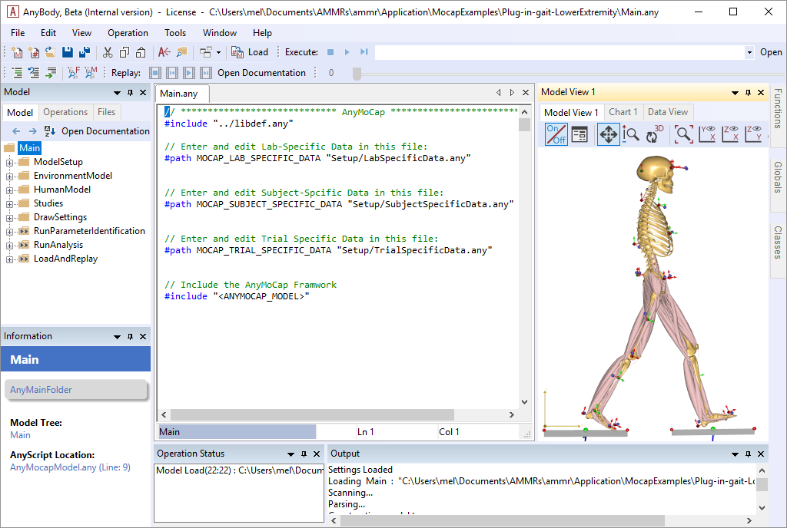

The model consist of number of operations which must be executed in the correct
order. The flow of the model is illustrated in the following figure. 

.. _model_flow_chart:
.. figure:: _static/lesson5/flow.png

    Illustration of the three processes for the Mocap models. Parameter
    identification, Marker tracking, and Inverse Dynamic analysis. See
    `Lund et al. 2015 <http://www.tandfonline.com/doi/full/10.1080/23335432.2014.993706>`_
    for a detailed dicussion on different approches to MoCap analysis.

Parameter identification
--------------------------------------

If you look closely at the model view, you can see that the skeleton is equipped with
markers and if you zoom in a little, you can also see that the markers
carry small coordinate systems with red and green arrows.

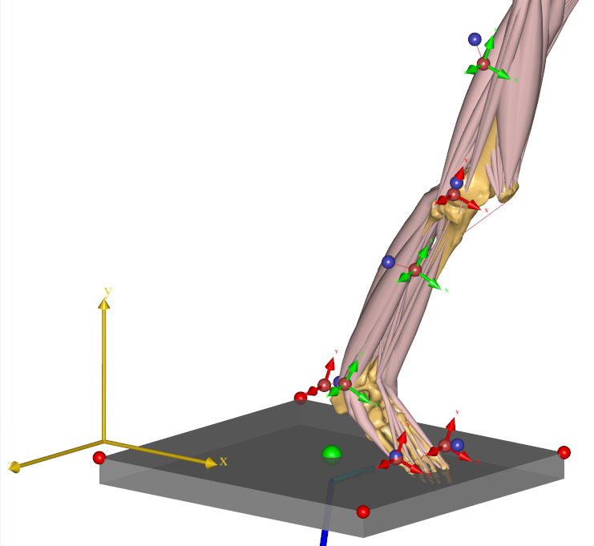
  

.. raw:: html

    

.. role:: red
.. role:: green

These are the marker points defined on the human body, and the :red:`red` and
:green:`green` arrows designate directions in which the marker position is fixed
versus free to be optimized. A free marker position is one that is not
well-known by the clinician.

So why would we be in doubt about the position of a marker that we have
placed? Well, clinicians place markers on the skin at an unknown
distance from the bone, and even when a marker is placed on a bony
landmark just below the skin, we are never quite sure which point that
corresponds to in the bone’s local coordinate system. If we get those
points wrong, the resulting motion of the model will also be inaccurate.

So the green arrows designate directions in which we have the greatest
uncertainty about whether the marker is placed in the model as it was in
the experiment. The good news is that we can optimize those marker
placements exactly as we did in :doc:`lesson 4 <lesson4>`. 

The model is set up to do this automatically, and if you are happy with the
choice that has been made, you need not do anymore. 

.. note:: If you use a different marker protocol, or customize what is optimized you
    will need to modify the marker protocol. In this example, the marker
    protocol is define in the file The :file:`Setup/MarkerProtocol.any`. In the
    interest of simplicity, we shall postpone the discussion of the marker
    protocol setup.

In addition to the marker coordinates, the model considers the segment
lengths to be variable, so the computation we are about to do will also
automatically figure out how long the segments are, and thereby where
the joints are placed.

Pretty much any parameter in a model can be made
variable in the optimization study. But some parameters will be determined well by the marker
trajectory data and not all parameters can be determined at the same
time because the mocap data only contains limited information. 

For instance, if the model has no movement about a specific joint, then it is not
possible to get information about the location of that joint or about the
lengths of adjacent segments from the marker data.

Running Parameter identification
^^^^^^^^^^^^^^^^^^^^^^^^^^^^^^^^

Without further ado, let us perform the optimization:

Find the ``Main.RunParameterIdentification`` in the operations dropdown, and run it.

|Opertions RunModtionAndParameterOpt| 

You will see the model walking repeatedly over the force platforms,
sometimes slowly and sometimes a bit faster depending on the speed of
your computer and the progress of the computation. 

.. note:: The process speeds up significantly if you switch off the Model View. 

When operation is done you will see the line ``Optimization converged`` in the *Output* windows
and final lines will be:

.. code-block:: none

    #### Macro command : SaveToFile(1:1)> classoperation Main"Save Values"--file="Output/Plug-in-gait.anyset"
    Saving modified values to 'Output/Plug-in-gait.anyset'

It means that things have gone fine, the optimization has converged, and
the optimized values of the variable parameters have been saved on a
text file for later use.

Before we continue, let us ponder for a moment when it is necessary to
perform this optimization. The results of the optimization in summary
are the following:

1. Updated anthropometrical parameters.

2. Updated marker locations.

Within a brief time we can safely presume that the first is constant for
a particular test subject. This means that if we have once and for all
determined and saved the anthropometrical parameters of this subject,
then we probably need not include them in the optimization again.

We can usually presume that the marker locations on the body are constant within
a given trial or series of trials performed with the same subject with the same
markers attached. However, if the markers have been detached or relocated, then
obviously the optimization of marker positions must be done again.

However, for most cases, the computational effort of performing the optimization
with all the parameters is modest, to the casual user may elect to simply redo
the full optimization for each trial as we shall do later in this tutorial.

Marker tracking and Inverse dynamics
---------------------------------------

Let us proceed with the kinematic analysis. As we saw in :doc:`lesson2` marker
based models usually require an over-determinate kinematic solver to handle the
excess in information that the optical markers provide. The over-determinate
solver in AMS works great, but it will calculate velocities and accelerations
numerically. That has some performance issues when running inverse dynamics
analysis. To overcome this problem, the MOCAP analysis is split into a two-step
procedure, as illustrated on  figure :numref:`model_flow_chart`, separating
the Marker tracking from the Inverse dynamic analysis.

The overdeterminate kinematic analysis solves the model for positions, and
stores the joint angles as function of time. This step is the "Marker tracking"
step in figure :numref:`model_flow_chart`. These joint angles are then used in the
second step with the determinate kinematic solver in the inverse dynamic
analysis.

In the Model the *Marker tracking* and *Inverse Dynamics* are combined into
single operation called ``Main.RunAnalysis``.

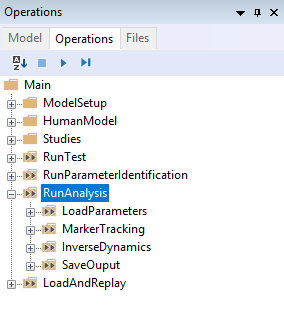

The operation contains everything
that is necessary to run the analysis: It loads the optimized model parameters
that were saved previously; it run the marker tracking, and if necessary
performs calibration movements to adjust the tendon lengths to the lengths of
the bones; and finally executes a dynamic analysis to determine forces in the
system. Run the analysis by selecting it from the Operations dropdown, and click "Run". 

After the kinematic Marker tracking, the muscles are switched on, and the
inverse dynamic analysis starts. This step will usually be the slowest, due to
the very high amount of detail of the model, requiring the computer to
continuously calculate forces in more than 300 muscles. When the analysis is
finished, you can open up a Chart view and investigate the results, for instance
the hip joint reaction forces:

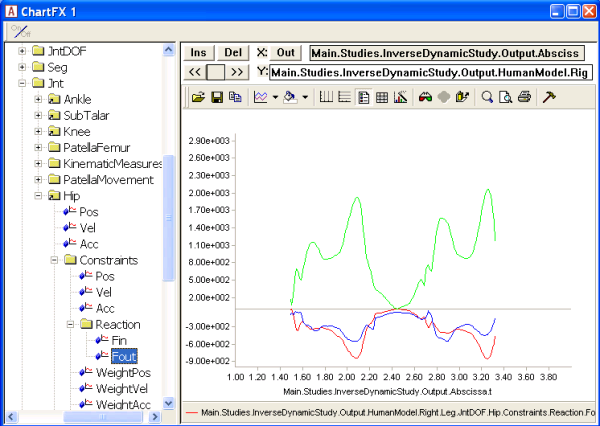

Importing new motion data
---------------------------

So we have seen the model optimize its parameters and we have seen it
perform a dynamic analysis on existing data that somebody else has
defined. But here comes the real point of the application:

**Processing a different motion is exactly the same**!

All we have to do is to replace the C3D file containing the motion data.
The MoCapModel folder already contains a few C3D files located in the
subfolder Input that we can try. All we have to do is to make the model
point at a different file. A few lines into the Main file, you find
this:

.. code-block:: AnyScriptDoc

    #path MOCAP_TRIAL_SPECIFIC_DATA "TrialSpecificData.any"

This file contains the settings you typically want to change when switching trials.

Double-click the ``TrialSpecificData.any`` file name, and the file opens up
in a new tab. Then, just a few lines down, refer to the new filename
into the model:

.. code-block:: AnyScriptDoc

    // This is the name of the trial c3d file without extension
    TrialFileName = §"GaitFast_1"§;

Since this is a new C3D file from a new trial, we also need to run the
kinematic optimization again. 

This is all there is to it. We can now reload the model. To see the
model moving (without doing the parameter optimization just now), locate
and run the Kinematics (Marker tracking) operation in the Operation tree:

|Operations, kinematics|

The movement seems to work fine and you will notice that this gait
pattern is a little different from before. The steps are longer and the
posture indicates that this is a person in a hurry.

|Model view, marker tracking|

Now is the time to run the ``Main.ParameterIdentification``.  It
takes a bit of time, and again you can speed up the process by switching
off the update of the Model View window. Eventually, the process comes
to an end and you get the message:

.. code-block:: none

    Optimization converged
    1.0) Operation Sequence: (Operation: Main.RunParameterIdentification.SaveParameters): 
    1.0.0) Dummy operation: (Operation: Main.RunParameterIdentification.SaveParameters.placeholder_operation): 
    1.1.0) Operation Sequence: (Operation: Main.ModelSetup.Macros.Save_parameters): 
    1.1.50.0) SaveToFile (Operation: Main.ModelSetup.Macros.Save_parameters.SaveToFile): 

    #### Macro command : SaveToFile(1:1)> classoperation Main"Save Values"--file="GUI_Plug-in-gait_fast.anyset"
    Saving modified values to 'Output\GUI_Plug-in-gait_fast.anyset'

Next, we run the combined *Marker tracking* and *Inverse dynamics* (``Main.RunAnalysis``) operation.

Which, after the analysis can provide a new hip joint force profile
documenting that faster gait lead to higher hip joint forces.

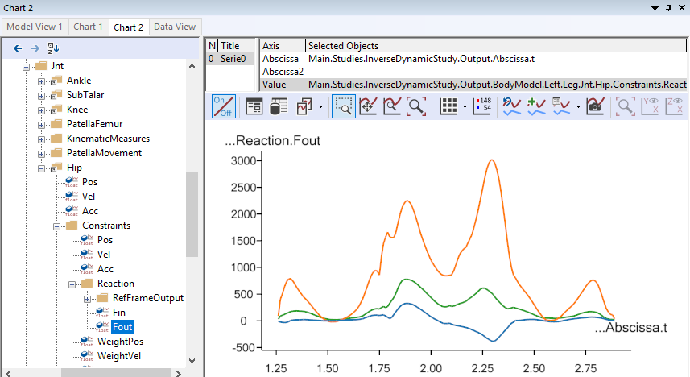

Using full-body models
----------------------

Many motion experiments deal with the entire body as opposed to just the
lower extremities. The Model Repository contains another
pre-cooked model for this purpose, and it will reveal that there is more
data in the C3D file we just imported than we saw in lower extremity model.

Open the full body example model ``Plug-in-gait_Simple/FullBody.main.any``, then run 
``Main.ParameterIdentification``

Please load the model and open a Model View if you do not already have
one. You will see the model as before, but now with the arms included.

|Model view Fullbody initial load|

Select and run the RunMotionAndParameterOptimizationSequence in the
Operations tree:

|Opertions RunModtionAndParameterOpt|

The model starts walking repeatedly over the force platforms including
the arm motions while it tries to optimize segment lengths and marker
positions. It takes 7 iterations and more time than before
to optimize the model because this is a much larger problem, but as
before you can speed up the process if you switch off the update of the
Model View window. It is possible to monitor the convergence of the
optimization problem from a Chart window like this:

|Chart view, Kin objective|

Eventually, the optimization process terminates and you can switch run the
*Marker tracking* and *inverse dynamics* (``Main.RunAnalysis``) and perform the
analysis of the entire body including the muscle forces. 

This full-body model with almost 1000 muscle fascicles takes considerable more
time to analyze but will reward you with very detailed information about the
function of the muscle system in gait as illustrated below.

|Model view, full body inverse dynamics|

The final lesson of this tutorial is about problems that may arise with
C3D files. 

.. rst-class:: without-title
.. seealso::
    **Next lesson:** :doc:`lesson6`.

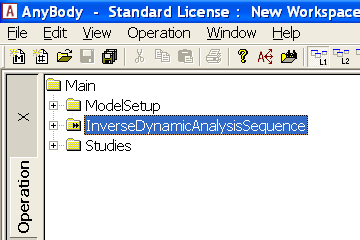
   

   
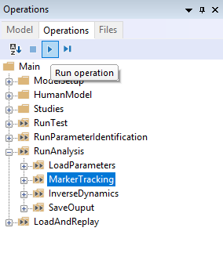
   
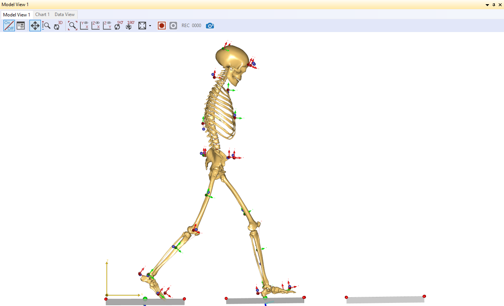
  
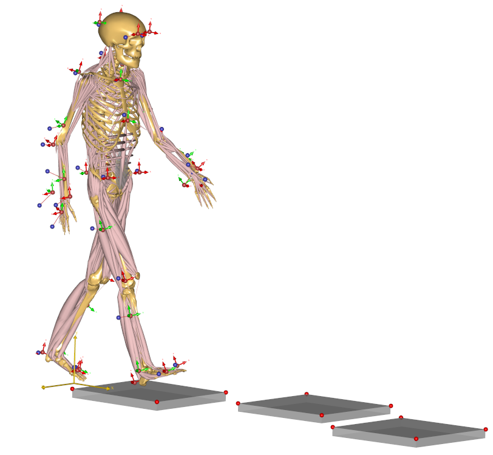

   
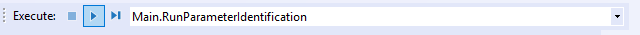
   
.. |Chart view, Kin objective| image:: _static/lesson5/image11.png
   
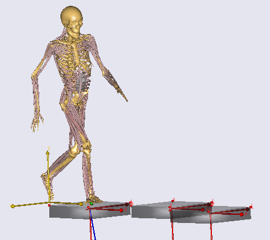
   
