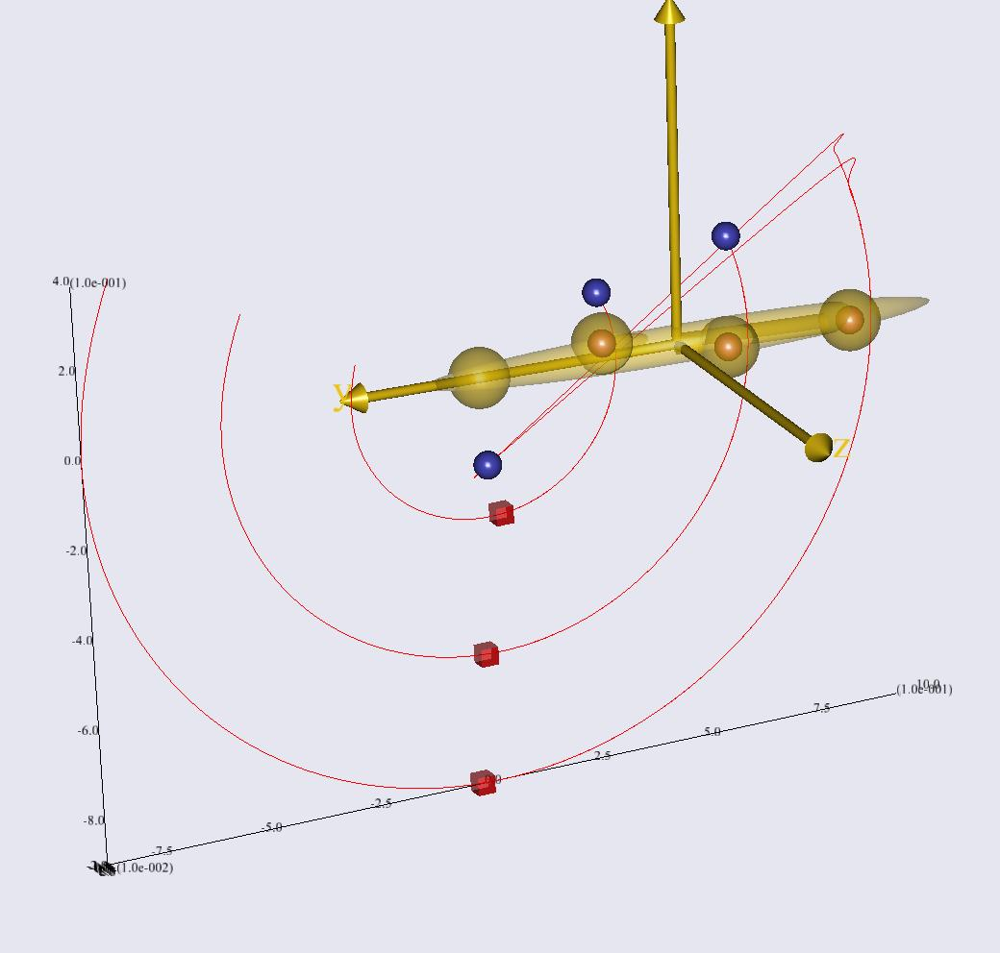

Lesson 6: Weight functions
--------------------------

In this lesson, we shall learn how to use weight functions on kinematic
drivers. This is useful in over-determinate kinematic analysis where we
might want to let some drivers have more significance than others.
Without really discussing it, we used unity weights on all our soft
kinematic constraint equations in the previous lessons, but this is not
always the best choice as we shall see in this lesson.

So what are weight functions and what can they be used for? In general
the weights can be used to put more emphasis on some kinematic
constraint equations than on others. This will force the motion of the
model closer to the constraints with the higher weight. The two most
obvious places where these weight functions can be used are: 1) when you
trust one kinematic constraint more than another, e.g. if some markers
are more reliable than others. 2) If you have a marker temporarily
dropping out of sight of the cameras, then you can temporarily assign it
a weight of zero, which will eliminate it from the model in the interval
where it is invalid. There are of course many other possible uses of
weight functions, but we shall concentrate on markers in the following.

So without further ado, let us look into how to use a weight function to
deal with a marker dropping out. The data we are going to use is the
same pendulum example as used previously but with marker L002 modified
to drop out in the interval from 4.20 s to 4.76 s.

Please download and save the file
:download:`multiple\_with\_dropout.c3d <Downloads/multiple_with_dropout.c3d>`.

Then close all open windows in AnyBody and create a new Main file by
clicking the ‘M’ tool button in the upper left hand corner of the main
frame. This creates an empty model into which you can insert an
AnyInputC3D object, refer to the ``multiple_with_dropout.c3d`` file and
specify the filter as we did before:

.. code-block:: AnyScriptDoc

    Main = {
    // The actual body model goes in this folder
    AnyFolder MyModel = {
        // Global Reference Frame
        AnyFixedRefFrame GlobalRef = {
        // Todo: Add points for grounding of the model here
        }; // Global reference frame
        AnyInputC3D §C3D§ =
        {
        FileName = "§multiple_with_dropout.c3d§";
        //ReadAllDataOnOff = On;
        //TruncateExtraCharsInNamesOnOff = On;
        //MakeNameUniqueStr = "_";
        //PointsScaleFactor = 1;
        //ConstructModelOnOff = On;
        //ConstructChartOnOff = On;
        //ConstructWeightFunUsingResidualOnOff = Off;
        //MarkerUseAllPointsOnOff = Off;
        //MarkerUseCamMaskOnOff = On;
        //MarkerIndices = {};
        //MarkerLabels = {};
        //MarkerFilterIndex = 0;
        //ProcessedDataFilterIndex = 0;
        //AnalogFilterIndex = -1;
        §Filter =
        {
            AutomaticInitialConditionOnOff = On;
            FilterForwardBackwardOnOff = On;
            N = 2;
            Fc = {3};
            Type = LowPass;
        };§
        //WeightThreshold = 0;
        //WeightOutput = {{0, 1}, {0, 1}, {0, 1}};
        //WeightTransitionTime = 0.1;
        //SearchAndReplace = {};
        //WriteMarkerDataToFilesOnOff = Off;
        //MarkerScaleXYZ = {0.025, 0.025, 0.025};
        §MarkerRGB = {0, 0, 1};§
        //MarkerDrawOnOff = On;
        //MarkerInterPolType = Bspline;
        //MarkerBsplineOrder = 8;
    };

Notice that we have also colored the markers blue with the MarkerRGB
property. We also set the duration of the movement to automatically fit
the C3D file as we have done before:

.. code-block:: AnyScriptDoc

    // The study: Operations to be performed on the model
    AnyBodyStudy MyStudy = {
      AnyFolder &Model = .MyModel;
      Gravity = {0.0, -9.81, 0.0};
      §AnyIntVar FirstFrame = Main.MyModel.C3D.Header.FirstFrameNo;
      AnyIntVar LastFrame = Main.MyModel.C3D.Header.LastFrameNo;
      tStart = FirstFrame/Main.MyModel.C3D.Header.VideoFrameRate+2*Kinematics.ApproxVelAccPerturb;
      tEnd = LastFrame/Main.MyModel.C3D.Header.VideoFrameRate-2*Kinematics.ApproxVelAccPerturb;§
    };

Now you should be able to load and run the model and see three blue
markers travel through space in a motion that bears some resemblance to
a football kick as you did previously. However, notice how the L002
marker drops out. Many motion capture systems flag invalid markers in
the C3D file by setting the residual property to -1 for the affected
frames. If you click the Model tab, open MyModel, C3D, Points, Markers,
and L002, you will find the Residual property. If you double-click it
and scroll through it, you will see that there is an interval, where it
has the value -1.

|Marker residuals|

This information we are going to use later to construct a weight
function for this marker.

Let us initially define a segment with the three markers located on it,
ground it with a revolute joint and drive it using the marker data using
the AnyKinDriverMarker object as we did in lesson four:

.. code-block:: AnyScriptDoc

    §AnySeg Leg = {
      Mass = 1;
      Jii = {1, 0.01, 1}/15;
      AnyRefNode R1 = {
        sRel = {0.038, 0.18, 0.022};
      };
      AnyRefNode R2 = {
        sRel = {-0.015, -0.104, 0.028};
      };
      AnyRefNode R3 = {
        sRel = {-0.022, -0.403, -0.023};
      };
      AnyRefNode Joint = {
        sRel = {0, 0.45, 0};
      };
      AnyDrawSeg drw = {Opacity = 0.5;};
    };
    AnyRevoluteJoint Joint = {
      AnyRefFrame &Ground = .GlobalRef;
      AnyRefFrame &Pendulum = .Leg.Joint;
    };
    AnyKinDriverMarker C3Dmotion1 = {
      AnyRefFrame &Marker = .Leg.R1;
      AnyParamFun &Trajectory=
      Main.MyModel.C3D.Points.Markers.L000.PosInterpol;
      AnyDrawKinMeasure drw = {
        Label = Off;Size = 0.03;Line = Off;
      };
    };
    AnyKinDriverMarker C3Dmotion2 = {
      AnyRefFrame &Marker = .Leg.R2;
      AnyParamFun &Trajectory =
      Main.MyModel.C3D.Points.Markers.L001.PosInterpol;
      AnyDrawKinMeasure drw = {
        Label = Off;Size = 0.03;Line = Off;
      };
    };
    AnyKinDriverMarker C3Dmotion3 = {
      AnyRefFrame &Marker = .Leg.R3;
      AnyParamFun &Trajectory =
      Main.MyModel.C3D.Points.Markers.L002.PosInterpol;
      AnyDrawKinMeasure drw = {
        Label = Off;Size = 0.03;Line = Off;
      };
    };§
    }; // MyModel

Now that we want to drive a segment with the markers rather than just
look at the markers themselves, we also need to ask for the soft
kinematics solver in the study section:

.. code-block:: AnyScriptDoc

    // The study: Operations to be performed on the model
    AnyBodyStudy MyStudy = {
      AnyFolder &Model = .MyModel;
      Gravity = {0.0, -9.81, 0.0};
      AnyIntVar FirstFrame = Main.MyModel.C3D.Header.FirstFrameNo;
      AnyIntVar LastFrame = Main.MyModel.C3D.Header.LastFrameNo;
      tStart = FirstFrame/Main.MyModel.C3D.Header.VideoFrameRate+2*Kinematics.ApproxVelAccPerturb;
      tEnd = LastFrame/Main.MyModel.C3D.Header.VideoFrameRate-2*Kinematics.ApproxVelAccPerturb;
      §InitialConditions.SolverType = KinSolOverDeterminate;
      Kinematics.SolverType = KinSolOverDeterminate;§
    };

Please do not forget to change to the over-determinate kinematics
solver.

Now that we have created the AnyDrawKinMeasure objects, it is no longer
necessary to have the points drawn in the C3D object. So let us get rid
of them:

.. code-block:: AnyScriptDoc

    AnyInputC3D C3D =
    {
      FileName = "multiple_with_dropout.c3d";
      //ReadAllDataOnOff = On;
      //TruncateExtraCharsInNamesOnOff = On;
      //MakeNameUniqueStr = "_";
      //PointsScaleFactor = 1;
      §ConstructModelOnOff = Off§;
      //ConstructChartOnOff = On;
      //ConstructWeightFunUsingResidualOnOff = Off;
      //MarkerUseAllPointsOnOff = Off;
      //MarkerUseCamMaskOnOff = On;
      //MarkerIndices = {};
      //MarkerLabels = {};
      //MarkerFilterIndex = 0;
      //ProcessedDataFilterIndex = 0;
      //AnalogFilterIndex = -1;
      Filter =
      {
        AutomaticInitialConditionOnOff = On;
        FilterForwardBackwardOnOff = On;
        N = 2;
        Fc = {3};
        Type = LowPass;
      };
      //WeightThreshold = 0;
      //WeightOutput = {{0, 1}, {0, 1}, {0, 1}};
      //WeightTransitionTime = 0.1;
      //SearchAndReplace = {};
      //WriteMarkerDataToFilesOnOff = Off;
      //MarkerScaleXYZ = {0.025, 0.025, 0.025};
      MarkerRGB = {0, 0, 1};
      //MarkerDrawOnOff = On;
      //MarkerInterPolType = Bspline;
      //MarkerBsplineOrder = 8;
    };

It should now be possible to load the model and run the kinematic
analysis. If you open the Model View, you should see something like
this:

|Model view, Pendulum|

You should see a large change in the otherwise smooth motion of the
pendulum, when marker L002 drops out, which it does by going to position
(0.0,-0.2,0.0). Since this configuration of the three markers is not
compatible with the rigid multi-body model with its imposed revolute
joint constraint, the result is that the pendulum is located somewhere
in between all three markers.

If you plot the acceleration of the segment, by opening a ChartFX and
going to MyStudy, Output, Model and Leg where you can find the rDDot
property.

|Chart view, rDDot|

This shows some large acceleration peaks of the segment when the marker
drops out.

So how can we deal with this problem? We can do this by using built-in
functionality in the C3D object to construct a weight function that is
zero in the interval where the marker is invalid and one otherwise,
except for a transition phase between the two. To do this, we have to
use the ConstructWeightFunUsingResidualOnOff setting in the C3D object.

.. code-block:: AnyScriptDoc

    AnyInputC3D C3D =
    {
      FileName = "multiple_with_dropout.c3d";
      //ReadAllDataOnOff = On;
      //TruncateExtraCharsInNamesOnOff = On;
      //MakeNameUniqueStr = "_";
      //PointsScaleFactor = 1;
      ConstructModelOnOff = Off;
      //ConstructChartOnOff = On;
      §ConstructWeightFunUsingResidualOnOff = On§;
      //MarkerUseAllPointsOnOff = Off;

By default, this creates a weight function for each marker, which
assigns value one when the residual is positive and zero when it is
negative with a transition time between the two states of 0.1 s.

Now, all we have to do is link the weight function to the kinematic
constraint equation, where it should be used. In our model, this means
that we have to make the WeightFun member of the AnyKinDriverMarker
object for L002 point to the weight function for L002 in the C3D file.
The weight function is called Weight located in the same folder as the
PosInterpol.

.. code-block:: AnyScriptDoc

    AnyKinDriverMarker C3Dmotion3 = {
      §WeightFun = {&Main.MyModel.C3D.Points.Markers.L002.Weight};§
      AnyRefFrame &Marker = .Leg.R3;
      AnyParamFun &Trajectory =
      Main.MyModel.C3D.Points.Markers.L002.PosInterpol;
      AnyDrawKinMeasure drw = {
        Label = Off;Size = 0.03;Line = Off;
      };

If we reload and run the kinematic analysis again, we will see a much
more smooth motion, but if the acceleration is plotted again, then it is
clear that it is not perfect:

|Chart view, rDDot 2|

The graph looks similar to before, but the values on the ordinate axis
are much smaller. The remaining problem is related to the transition
time for switching the marker in and out. To investigate this in more
detail, we need graphs of the weight function as well as the trajectory
of the marker. Try including these lines in your model:

.. code-block:: AnyScriptDoc

    §AnyFloat EvalWeight = Main.MyModel.C3D.Points.Markers.L002.Weight(Main.MyStudy.t);
      AnyFloat EvalTrajectory = Main.MyModel.C3D.Points.Markers.L002.PosInterpol(Main.MyStudy.t); §
      AnyInputC3D C3D =

What this code does is that it evaluates the Weight and PosInterpol
parameter functions at all time steps in the analysis. Hereby, we can
plot them both after a kinematic analysis. Try reloading the model,
re-running the kinematic analysis, and then plot each of these two
functions by browsing to them using two separate ChartFX windows. You
should now be able to see something like this:

|Chart view, weight function|\ |Chart view, filtered marker positions|

What has happened is that the filtering and the interpolation of the
marker trajectory have smoothed the drop out transition and even
introduced small peaks before and after the marker data really disappear
as given by the Residual. Therefore, we need to make the period, in
which the marker is assigned low weight, longer. To do this, we simply
extend the transition period a bit using the WeightTransitionTime in the
C3D object:

.. code-block:: AnyScriptDoc

    AnyInputC3D C3D =
    {
      FileName = "multiple_with_dropout.c3d";
      //ReadAllDataOnOff = On;
      //TruncateExtraCharsInNamesOnOff = On;
      //MakeNameUniqueStr = "_";
      //PointsScaleFactor = 1;
      ConstructModelOnOff = Off;
      //ConstructChartOnOff = On;
      ConstructWeightFunUsingResidualOnOff = On;
      //MarkerUseAllPointsOnOff = Off;
      //MarkerUseCamMaskOnOff = On;
      //MarkerIndices = {};
      //MarkerLabels = {};
      //MarkerFilterIndex = 0;
      //ProcessedDataFilterIndex = 0;
      //AnalogFilterIndex = -1;
      Filter =
      {
        AutomaticInitialConditionOnOff = On;
        FilterForwardBackwardOnOff = On;
        N = 2;
        Fc = {3};
        Type = LowPass;
      };
      //WeightThreshold = 0;
      //WeightOutput = {{0, 1}, {0, 1}, {0, 1}};
      §WeightTransitionTime = 0.8;§
      //SearchAndReplace = {};
      //WriteMarkerDataToFilesOnOff = Off;
      //MarkerScaleXYZ = {0.025, 0.025, 0.025};
      MarkerRGB = {0, 0, 1};
      //MarkerDrawOnOff = On;
      //MarkerInterPolType = Bspline;
      //MarkerBsplineOrder = 8;
    };

If we reload and run the kinematic analysis, we should now see the
pendulum moving smoothly and it is almost impossible to detect in the
motion that the marker disappears. If we plot the segment acceleration
again, we see that we no longer have any of the peaks around the drop
out of the marker:

|Chart view rDDot final|

Hopefully, this simple example has demonstrated how the weight functions
works. In fact, the WeightFun members of the AnyKinMarkerDriver class
come from the parent class AnyKinEq such that all kinematic constraint
equations can be assigned a weight; not only markers. Also, WeightFun is
a pointer to a ParamFun, which means that all AnyScript parameter
functions can be used as weights. In other words, you can design your
own weight function using any of the parametric function types in the
system.

The final lesson of this tutorial is about problems that may arise with
C3D files. 

.. rst-class:: without-title
.. seealso::
    **Next lesson:** :doc:`lesson7`.

.. |Marker residuals| image:: _static/lesson6/image1.emf
   :width: 4.10486in
   :height: 3.51181in

.. |Chart view, rDDot| image:: _static/lesson6/image3.emf
   :width: 4.81389in
   :height: 3.76736in
.. |Chart view, rDDot 2| image:: _static/lesson6/image4.emf
   :width: 4.86042in
   :height: 3.75556in
.. |Chart view, weight function| image:: _static/lesson6/image5.emf
   :width: 4.68611in
   :height: 2.41875in
.. |Chart view, filtered marker positions| image:: _static/lesson6/image6.emf
   :width: 4.68611in
   :height: 2.41875in
.. |Chart view rDDot final| image:: _static/lesson6/image7.emf
   :width: 4.91875in
   :height: 3.94167in