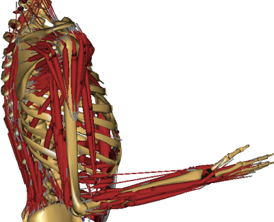

Inverse Dynamics of Muscle Systems
==================================

.. include:: /caution_old_tutorial.rst

The AnyBody Modeling System performs inverse dynamics as one of its
central operations. In biomechanics, inverse dynamics is traditionally
understood at the process of computing from measured ground reaction
forces in a gait analysis to net moments in the anatomical joints.

At least in AnyBody context, inverse dynamics is much more than that. In
brief, inverse dynamics allows you to simulate muscle and joint forces
in the entire body undergoing complex movements, taking dynamic inertia
forces in to account, and not necessarily requiring measured forces in
the interface between the body and the environment. Inverse dynamics had
the advantage that it allows for analysis of very complicated
musculoskeletal systems comprising hundreds of muscles on desktop or
laptop computers in a few seconds.

The figure below illustrates the simple principle behind inverse
dynamics.

|Inverse dynamic simple schematic|

If we know the magnitude of the external force, and we know the length
of the forearm and the insertion point of the biceps muscle on the
forearm, then it is not difficult to compute the muscle force from
simple moment equilibrium about the elbow. Further equilibrium equations
can subsequently give us the reaction forces in the elbow joint.

This is really the principle of inverse dynamics as it takes place in
the AnyBody Modeling System. So why do we need to make these
computations with advanced software? Well, there are several
complications that make realistic cases somewhat more challenging. The
figure below illustrates some of them.

|Inverse dynamic full model|

This figure is a much more anatomically realistic representation of the
mechanics of a human upper extremity. Even if we count only from the
gleno-humeral joint to the wrist, thus disregarding the shoulder girdle
and the hand, the arm will have seven independent degrees of freedom,
i.e. seven different joint articulations, and not just one, as we
implicitly assumed in the simple examples before. Moreover, many more
muscles than the single biceps from the previous figure are involved in
flexing the elbow, and many of these muscles span several joints. It
even turns out that some of the muscles will end up working
antagonistically, i.e. against each other. The multiple degrees of
freedom and multiple muscles directly lead to a much larger system of
equilibrium equations that have to be formulated and solved, and this is
not something that can be done easily by hand.

Another complication is that many muscles are wrapping over bones on
their way from origin to insertion. This complicates the mechanics of
the problem significantly because the muscle path is not easy to predict
and because the muscle provides force to the bone it is wrapping over
and not just at its origin and insertion points.

For obvious graphical reasons, the figure shown here does not move as
living bodies usually do. Movement also complicates the case
significantly by adding inertia forces to the problem and by changing
the equilibrium equations from one time step to the next. The bottom
line is that it is virtually impossible to simulate realistic
musculoskeletal systems “by hand” or even develop them bottom-up by
general mathematical software. The only viable solution is to use a
computer system designed for this particular purpose, so here we are.
With the AnyBody Modeling System you can easily define very complex
musculoskeletal systems and analyze them dynamically as you have
probably already done in the :doc:`Getting
Started <../A_Getting_started/intro>` tutorial. If not, now would
be a good time to do it and familiarize yourself with the mouse clicks
necessary to conduct the InverseDynamics operation and inspect the
results before continuing with the next steps of this tutorial.

There is one more complexity that has not been mentioned yet: The body
has many more muscles than strictly necessary to balance its degrees of
freedom, and this means that there are infinitely many different ways
the body can recruit its muscles to get the job done. The understanding
of this problem and how it is dealt with in the AnyBody Modeling System
is so important that the rest of this tutorial is dedicated to the
problem. We are going to take a deductive approach because it is
necessary for a reasonable understanding of the physiological
assumptions behind the entire field of muscle recruitment. More on this
topic can be found in the recorded previous `webcast on “Features of
muscle recruitment algorithms“ <https://www.anybodytech.com/anybody.html?fwd=webcasts#2009625>`__.

.. rst-class:: without-title
.. seealso::
    **Next lesson:** Let us begin with :doc:`Lesson 1: The basics of muscle recruitment <lesson1>`.

.. |Inverse dynamic simple schematic| image:: _static/Inverse_dynamics/image1.png

