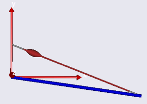
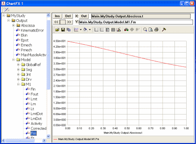
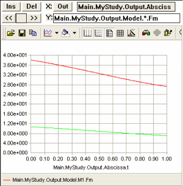

Lesson 1: The Basics of Muscle Recruitment
==========================================

.. include:: /caution_old_tutorial.rst

Muscle recruitment in inverse dynamics is the process of determining
which set of muscle forces will balance a given external load. If we
take the trouble of setting up the system of equilibrium equations for a
musculoskeletal system by hand, then we can organize them on the
following form:

.. math::

    \mathbf{Cf}=\mathbf{r}

where **f** is a vector of muscle and joint forces, **r** is a vector
representing the external forces and inertia forces, and **C** is a
matrix of equation coefficients. In other words, equilibrium always
results in a linear system of equations that should be easy to solve.
Unfortunately, it is not, and this is due to two reasons.

The first reason is that muscles are unilateral element that can only
pull and not push. So the part of **r** that is muscle forces is
restricted in sign, and only solutions with positive or zero muscle
forces are physiologically reasonable.

The second reason is known as muscle redundancy. It is due to the fact
that muscle systems tend to have many more muscles than strictly
necessary to balance the external forces. The mathematical consequence
is that the equilibrium equation above has more unknowns than it has
equations and therefore usually infinitely many solutions.

So, is muscle recruitment in the living human body random in the sense
that it just chooses the first and the best solution that balances the
load? Experiments show that this is not the case. In skilled movements,
muscles tend to be recruited systematically, so there is some criterion
behind the central nervous system’s choice of muscle activations.
Mathematically we can formulate the choice between the infinitely many
solutions as an optimization problem in the following way:

.. math:: 

    \begin{equation*}
    \begin{aligned}
    & {\text{minimize}}
    & & G\left(\mathbf{f^{(M)}}\right) \\
    & \text{subject to}
    & & \mathbf{Cf} = \mathbf{r} \\
    &&& f_i^{(M)} \geq 0, i=1\ldots n^{(M)}
    \end{aligned}
    \end{equation*}

The equilibrium equations are constraints in this problem: whatever
solution we find must balance the external forces. The requirement for
positive muscle forces has also been added as a constraint to the
problem. Only solutions adhering to these two requirements are
acceptable, but out of these many solutions we are going to change the
one that minimizes the function *G*, and are furthermore going to
anticipate that this function depends on the muscle forces. This seems
reasonable because muscle recruitment is probably a result of biological
adaptation and muscle work is costly for the organism and should be
minimized in an environment where resources are limited. Now we just
have to figure out what the function *G* actually is and unfortunately
there is nobody around who knows it for sure.

So in the following we are going to play around with different choices
and see what happens. AnyBody is great for this purpose because the
settings of the InverseDynamics operation offer the user a lot of
freedom to choose the function he or she believes is the right one for a
given purpose.

So let’s get set up with a model that is suitable for experimentation
with different definitions of the muscle recruitment problem. We shall
begin with one that is very, very simple and work our way upwards from
there. Please download right-click this link and save the file in a
working area of your hard disk:
:download:`Recruitment.Main.any <Downloads/Recruitment.any>`.

Open the model in the AnyBody Modeling System, load it into memory, open
a Model View window, select the InverseDynamics operation, and click the
Run button. You should see something like this:

|Model view simple model|

The thick blue rod is an arm hinged at its left end to the origin of the
global reference frame. A muscle is attached at the other end and the
muscle elevates the arm against gravity.

Please click Window->Chart (2D) to open up a new window for inspection
of results. You can expand the tree on the left hand side of that window
and find the muscle force, Fm, somewhere inside the properties of the M1
muscle. When you click it you get a graphical representation of the
muscle force:

|Chart view M1.fm|

Obviously, AnyBody has solved the equilibrium equations and has
determined what the muscle force is at every instant of the simulation
time. But which objective function, :math:`G`, has the system used?

If we review this problem we can see that it has only a single degree of
freedom and only a single muscle to carry the load. This actually means
that the equilibrium equations are determinate (one degree of freedom
and one muscle) and in this case it does no matter what :math:`G` is, so there
is little we can do in the settings to influence the result of the
analysis. The result is given by equilibrium alone and there is no other
muscle force than the one you see in the graph that would be able to
balance the model. It does not get really interesting until we apply
another muscle. A couple of simple additions to the model will
accomplish this. We first add a new origin node on the global reference
frame:

.. code-block:: AnyScriptDoc

    Main = {
      // The actual body model goes in this folder
      AnyFolder MyModel = {
        // Global Reference Frame
        AnyFixedRefFrame GlobalRef = {
          AnyDrawRefFrame drw = {
            ScaleXYZ = {1,1,1}/10;
            RGB = {1,0,0};
          };
          AnyRefNode M1 = {
            sRel = {0, 0.05, 0};
          };
          §AnyRefNode M2 = {
            sRel = {0, 0.03, 0};
          };§
        }; // Global reference frame

Then we define a second muscle by copying the first one and making a few
changes. Notice that the strength of the second muscle is set to half of
the strength of the first one:

.. code-block:: AnyScriptDoc

    AnyViaPointMuscle M1 = {
      AnyMuscleModel Model = {
        F0 = 100;
      };
      AnyRefFrame &Ori = .GlobalRef.M1;
      AnyRefFrame &Ins = .Seg.M;
      AnyDrawMuscle drw = {
        Bulging = 1;
        MaxStress = 1e5;
      };
    };
    §AnyViaPointMuscle M2 = {
      AnyMuscleModel Model = {
        F0 = 50;
      };
      AnyRefFrame &Ori = .GlobalRef.M2;
      AnyRefFrame &Ins = .Seg.M;
      AnyDrawMuscle drw = {
        Bulging = 1;
        MaxStress = 1e5;
      };
    }; §

Now two muscles will have to cooperate on the task of carrying one
degree of freedom. Let us see what AnyBody, in the absence of any
special specifications from the user, chooses to do. If you load and run
the model, plot the muscle force of M1 as you did before, and then
manually place an asterisk in place of the muscle name in the
specification line in the Chart window, you should get something like
this:

|Chart view star.Fm|

We can observe that both muscles are working and that M1, which has the
higher strength and better moment arm, is exerting more force than the
weaker M2. This seems immediately reasonable from a physiological
point-of-view, and this is what you get from AnyBody if you do not make
any special specifications. We shall get back to the precise nature of
AnyBody’s standard criterion a little later. For now, let us proceed and
speculate a bit about what may or may not make physiological sense in

.. rst-class:: without-title
.. seealso::
    **Next lesson:** :doc:`lesson2`.

