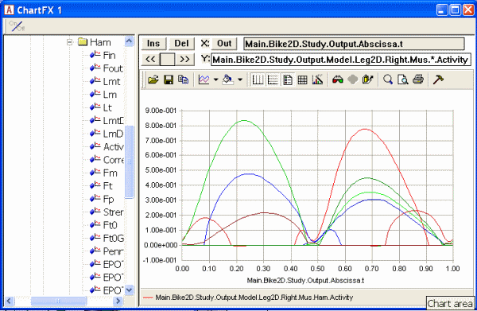
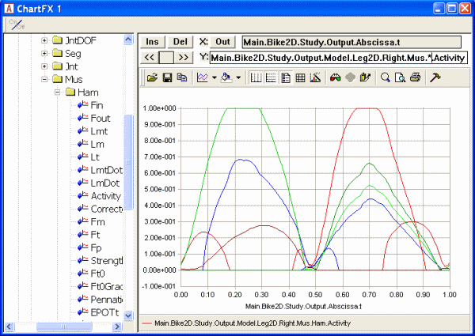

Lesson 4: Polynomial Muscle Recruitment
=======================================

In the previous two lessons, we learned that linear muscle recruitment
leads to no muscle synergy at all, while quadratic muscle recruitment
seems to result in some synergy between the muscles. In general, the
higher the order of the objective function of our recruitment problem,
the more synergy we get between the muscles. This is due to the fact
that higher orders tend to put higher penalization on large values in
the sum and hence tend to distribute the load more evenly between the
muscles.

So, perhaps if we use a higher order sum of muscle activities we may
have less need for the upper bound on the muscle recruitment. AnyBody
has a recruitment algorithm that lets you select your own order of the
problem. Let us investigate it a little.

First, let us change the power output of the bicycle model back to a
manageable but still challenging level:

.. code-block:: AnyScriptDoc

    // Kinematic parameters
    AnyVar Cadence = 60.0; //Cadence in RPM
    AnyVar MechOutput = §500§; //Average Mechanical output over a cycle in Watt

Then we change the study section to the polynomial option:

.. code-block:: AnyScriptDoc

    // The study: Operations to be performed on the model
    AnyBodyStudy Study = {
      AnyFolder &Model = .Model;
      Gravity = {0.0, -9.81, 0.0};
      tEnd = Main.BikeParameters.T;
      nStep = 100;
      InverseDynamics.Criterion = {
        Type = §MR_Polynomial§;
      };
    };

Now we have specified polynomial muscle recruitment, which comes down to
the following objective function:

.. math:: G = \sum_{i}\left( \frac{f_{i}}{N_{i}} \right)^{p}

We have not, however, specified what the power *p* is. In the absence of
a specification, AnyBody assumes *p* = 3, i.e. one higher than the
quadratic criterion from before. When we ran the quadratic criterion
with 500 W mechanical output, two of the muscle activities became
constrained by the upper of 1. If we reload and rerun the model now, we
get the following result:

|Chart view Muscle activity|

The muscle activations are nice and smooth and the upper limit on the
muscle activity is not active. It is hard to say which criterion is the
right one, but it appears that for this load the third order polynomial
criterion is better than the quadratic criterion from before. The third
order criterion is in general a good compromise between different
recruitment criteria, and this is why it is the default in AnyBody when
the user makes no other specifications.

Of course, everything has a limit, and if we raise the power output a
bit more to 650 W:

.. code-block:: AnyScriptDoc

    // Kinematic parameters
    AnyVar Cadence = 60.0; //Cadence in RPM
    AnyVar MechOutput = §650§; //Average Mechanical output over a cycle in
    Watt

…then we once again will have muscles limited by the upper bound on
muscle recruitment:

|Chart view Muscle activity 650 W|

The polynomial criterion allows us to select a higher order if we like.
It can be done like this:

.. code-block:: AnyScriptDoc

    InverseDynamics.Criterion = {
      Type = §MR_Polynomial§;
      §Power = 5;§
    };

which sets the order of the polynomial sum to 5. Reloading and rerunning
the model produces this result:

|Chart view Muscle activity Poly 5|

So it would appear that increasing the power of the criterion get the
muscles to work more and more together and allow the organism to carry
larger loads without overloading any individual muscle. Of course, at
some point of increasing load it will be impossible for a criterion of
any order to carry it without overloading the muscles, and the
polynomial criterion reacts to this situation as the quadratic criterion
did, i.e. to issue a warning and automatically change to another
recruitment criterion that allows overloaded muscles to give you a
visual and quantitative feedback to relate to. Feel free to go ahead and
increase the mechanical power of the pedaling to 800 W as in the
quadratic lesson and see how the algorithm reacts.

But why not just use a very high order criterion? It seems that it would
extract the maximum strength from the collective organism as we expect
the living body to do.

Well, closer inspection of the figure above reveals that the high order
criterion comes at a price: Some of the activations and de-activations
of the muscles now happen very quickly and perhaps faster than living
muscles can manage. Muscle contraction is an electro-chemical process
and it takes some time to develop and release force in a muscle. The
actual time depends somewhat on the circumstances and on the fiber
composition in the muscle, but the time is finite and contraction or
relaxation cannot physiologically happen in an instant.

In fact, the power of 5 is the upper limit of the polynomial criterion
in AnyBody. This is not only because higher powers cause the muscles to
contract and relax very quickly but also because higher order criteria
are potentially less robust and may cause numerical instability in the
simulated recruitment.

If it were in fact possible to increase the polynomial power towards
infinity, then the muscle recruitment criterion would approach a min/max
formulation that, in a biomechanical context, can be interpreted as a
minimum fatigue criterion, and this is not without physiological
relevance, so it is the topic of…

:doc:`Lesson 5: Min/Max recruitment <lesson5>`.

.. |Chart view Muscle activity Poly 5| image:: _static/lesson4/image3.gif
   :width: 6.25000in
   :height: 4.45833in